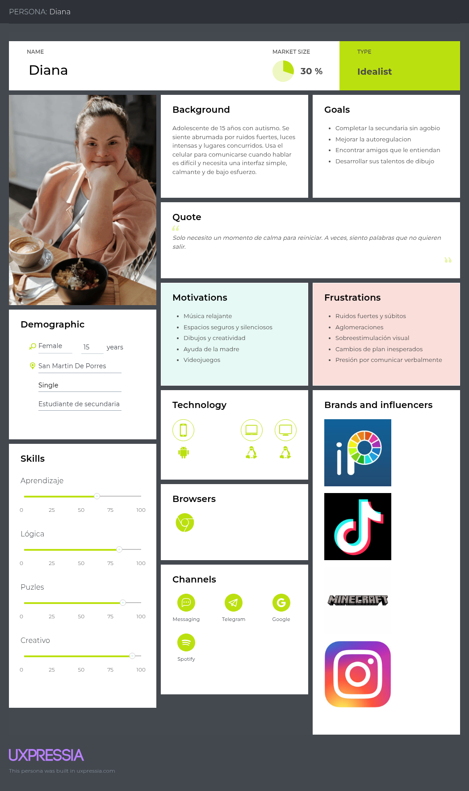
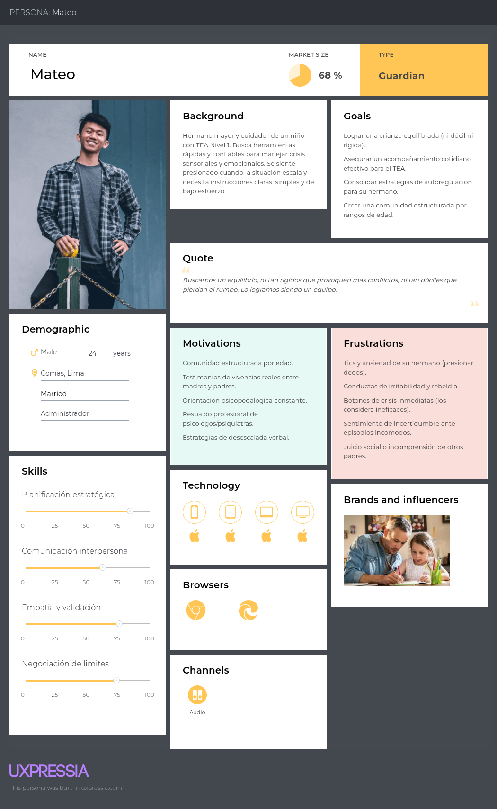
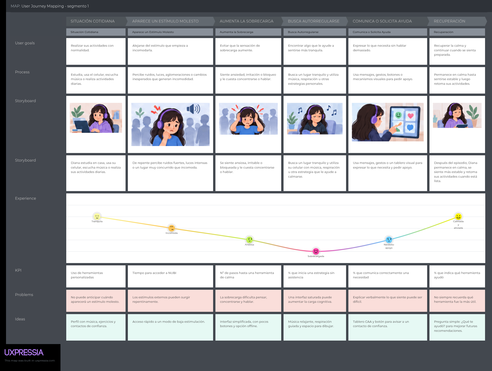
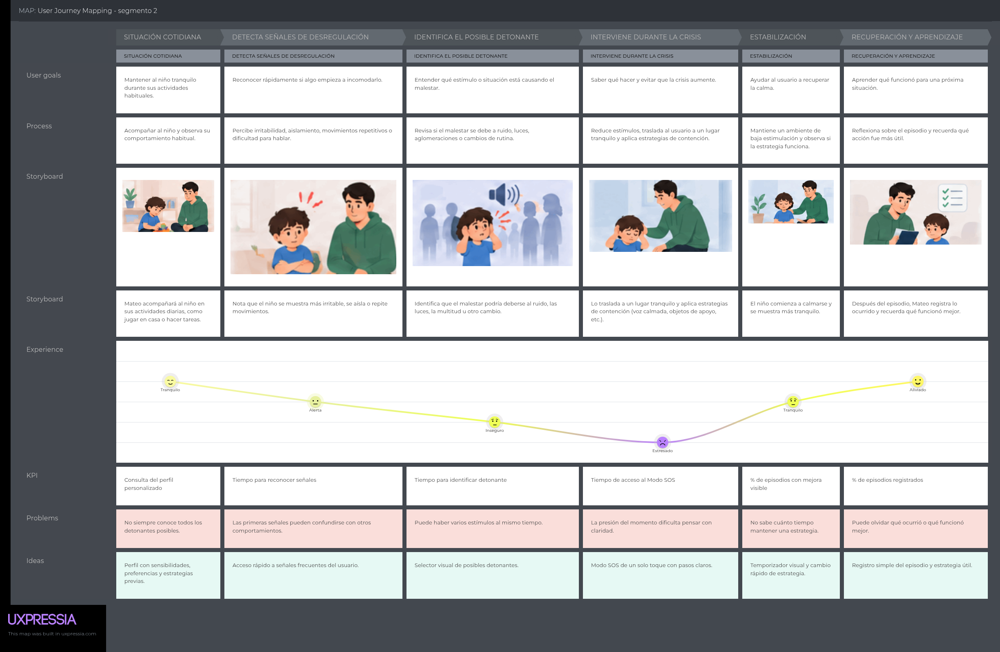

# Capítulo II: Requirements Elicitation & Analysis

## 2.1. Competidores

El mercado de tecnologías de apoyo para personas neurodivergentes y gestión de crisis sensoriales abarca diversas herramientas digitales. Se han identificado tres competidores directos e indirectos clave:

- **Autism 360:** Plataforma integral orientada al seguimiento conductual y apoyo para familias con niños dentro del espectro autista, enfocada principalmente en la gestión de hábitos y progresos a mediano plazo.
- **Tiimo:** Aplicación de planificación visual y estructuración de rutinas diarias diseñada para personas con TDAH y TEA, orientada a la organización de tareas e hitos temporales.
- **Pictalk:** Solución digital de Comunicación Aumentativa y Alternativa (CAA) que ayuda a personas con dificultades para comunicarse verbalmente.

### 2.1.1. Análisis competitivo

A continuación, se presenta la evaluación del **Competitive Analysis Landscape** para contrastar las características de la startup frente a sus principales competidores.

#### Competitive Analysis Landscape

| **¿Por qué llevar a cabo este análisis?** | Escriba en el recuadro la pregunta que busca responder o el objetivo de este análisis.                                                                                         |
|------------------------------------------|--------------------------------------------------------------------------------------------------------------------------------------------------------------------------------|
|                                          | El análisis permite identificar las soluciones existentes ofreciendo herramientas de apoyo para la autorregulcion, comunicación y acompañamiento de personas neurodivergentes. |

---
| **Segmento** | **Categoría** | **NUBI** | **Autism 360** | **Tiimo** | **Pictalk** |
|---|---|---|---|---|---|
|  |  |  |  |  |  |
| **PERFIL** | **Overview** | Solución digital integral para la autorregulación sensorial y guiado de crisis en tiempo real. | Sistema de apoyo y acompañamiento para el desarrollo conductual en el hogar. | Planificador visual y de gestión del tiempo para personas neurodivergentes. | Solución de CAA que utiliza pictogramas para facilitar la comunicación. |
| **PERFIL** | **Ventaja Competitiva / ¿Qué valor ofrece?** | Intervención directa en tiempo real mediante Modo SOS, comunicación CAA e interfaz de autorregulación. | Asesoría y acompañamiento para padres y terapeutas en el desarrollo conductual. | Interfaz accesible para organizar rutinas y gestionar el tiempo de personas neurodivergentes. | Comunicación visual accesible, personalizable y de fácil uso. |
| **MARKETING** | **Mercado Objetivo** | Niños y adolescentes neurodivergentes y sus cuidadores primarios. | Familias con niños autistas en búsqueda de acompañamiento profesional. | Jóvenes y adultos neurodivergentes que buscan estructurar su rutina diaria. | Niños y adultos con dificultades de comunicación, además de cuidadores y profesionales. |
| **MARKETING** | **Estrategias de Marketing** | Alianzas con asociaciones de neurodivergencia, comunidades de padres y modelo Freemium/B2B institucional. | Marketing de contenidos enfocado en terapias, seminarios web y B2C. | Campañas en redes sociales, comunidades de neurodiversidad y App Stores. | Difusión mediante comunidades, organizaciones y profesionales relacionados con la discapacidad. |
| **PRODUCTO** | **Productos y Servicios** | Modo SOS, tablero CAA, interfaz de autorregulación y herramientas personalizables. | App móvil y plataforma web con seguimiento de metas y asesorías. | Aplicación móvil para planificación visual y gestión del tiempo. | Comunicación con pictogramas, síntesis de voz, agendas visuales y rutinas personalizadas. |
| **PRODUCTO** | **Precios y Costos** | Modelo Freemium para familias y suscripción B2B para instituciones educativas. | Suscripción para servicios de acompañamiento y asesoría. | Modelo de suscripción mensual/anual. | Modelo gratuito y basado en donaciones. |
| **PRODUCTO** | **Canales de Distribución** | Sitio web responsive y Web Application. | Plataforma web y tiendas de aplicaciones móviles. | iOS App Store y Google Play Store. | Aplicaciones móviles para Android e iOS y acceso web. |
| **Análisis SWOT** | **Fortalezas** | Guía paso a paso para el cuidador y herramientas de baja carga cognitiva. | Sólido respaldo terapéutico y registro histórico. | Diseño accesible e intuitivo para organizar rutinas. | Herramientas de CAA con pictogramas, interfaz accesible y personalización. |
| **Análisis SWOT** | **Debilidades** | Startup en etapa inicial y requiere posicionamiento de marca en el mercado local. | Curva de aprendizaje elevada y costo accesible limitado. | No ofrece soporte directo en momentos de crisis agudas. | Se enfoca principalmente en comunicación y organización, no específicamente en la gestión de crisis. |
| **Análisis SWOT** | **Oportunidades** | Alta demanda de herramientas de contención sensorial en Perú y LATAM y convenios B2B con colegios. | Expansión a mercados internacionales. | Integración con dispositivos vestibles (*wearables*). | Mayor demanda de herramientas digitales de apoyo para personas neurodivergentes. |
| **Análisis SWOT** | **Amenazas** | Resistencia inicial a la adopción tecnológica en entornos escolares o familiares tradicionales. | Aparición de soluciones digitales gratuitas. | Competencia de apps de productividad convencionales. | Aparición de nuevas aplicaciones de CAA y soluciones digitales similares. |

### 2.1.2. Estrategias y tácticas frente a competidores

Con el propósito de posicionar a **Nubi** frente a la oferta existente y capitalizar las oportunidades del mercado, se establecen las siguientes estrategias y tácticas:

#### Estrategias de Diferenciación y Posicionamiento

**1. Estrategia Enfocada en el Tiempo Real ("Durante la Crisis")**

Mientras competidores como Tiimo o Autism 360 se enfocan en la planificación previa o el análisis posterior, Nubi posicionará su propuesta de valor en la **contención e intervención inmediata** durante el episodio de desregulación sensorial o emocional.

**2. Estrategia de Doble Usuario (Cuidadores y Usuarios Neurodivergentes)**

A diferencia de aplicaciones de función única como Emergency CHAT, Nubi integra un flujo dinámico que ofrece respuestas simultáneas:

- Estímulos de autorregulación de baja carga cognitiva para la persona en crisis.
- **"Modo SOS"** con guías de actuación estandarizadas para el acompañante.

#### Tácticas Competitivas

**1. Aprovechamiento de la Brecha de Mercado**

**Táctica:** Desarrollar e iterar continuamente la interfaz del **Modo SOS**, asegurando que los pasos de contención para cuidadores se presenten con alta claridad visual y auditiva, reduciendo la incertidumbre y el estrés del acompañante en momentos de alta presión.

**2. Modelo de Precios Inclusivo y Gradual**

**Táctica:** Implementar un esquema **Freemium** accesible para las familias peruanas, garantizando el acceso a las funciones básicas de autorregulación y comunicación CAA, superando las barreras económicas de soluciones de alto costo como Autism 360.

**3. Penetración en el Segmento B2B / Instituciones Educativas**

**Táctica:** Ofrecer licencias institucionales a colegios y centros de terapia que incluyan paneles de personalización y perfiles múltiples, diferenciándose de las aplicaciones puramente B2C y asegurando la recurrencia comercial.

**4. Adopción Orgánica en Comunidades de Apoyo**

**Táctica:** Establecer alianzas estratégicas con asociaciones de familias neurodivergentes y profesionales de la salud/educación en Lima y regiones, realizando demostraciones del producto para generar recomendaciones orgánicas y reducir el costo de adquisición de clientes (**CAC**).

## 2.2. Entrevistas

### 2.2.1. Diseño de entrevistas

Con el objetivo de recopilar información cualitativa relevante sobre las necesidades, dolores y comportamientos de nuestro público objetivo, se elaboraron dos guías de entrevistas estructuradas adaptadas para cada segmento.

#### A. Preguntas Generales de Filtrado y Demografía

Estas preguntas se aplican a todos los participantes antes de iniciar la sección específica según su rol.

* ¿Cuál es su nombre completo?
* ¿Qué edad tiene?
* ¿En qué distrito o zona geográfica reside?

---

#### B. Guía de Entrevista — Segmento 1: Padres, Madres y Cuidadores Primarios

1. ¿Cuál es tu ocupación actual?
2. ¿Cuál es tu relación o parentesco con el niño o adolescente que acompañas?
3. ¿Qué edad tiene el niño o adolescente a tu cargo?
4. ¿Qué condición o características de neurodivergencia presenta (TEA, TDAH, TDA, TOC, entre otros)?
5. Cuéntame sobre la última vez que el niño tuvo una crisis o momento de desregulación. ¿Qué sucedió?
6. ¿Qué suele ocurrir o qué factores desencadenan una crisis antes de que comience?
7. ¿Cómo te das cuenta o cuáles son las primeras señales de que está empezando un episodio?
8. ¿Qué acciones ejecutas normalmente para ayudarlo a autorregularse en ese momento?
9. ¿Qué es lo más difícil o frustrante para ti cuando intentas brindarle asistencia en pleno episodio?
10. ¿Qué estrategias o recursos has probado previamente para afrontar estas situaciones? ¿Cuáles te funcionaron y cuáles no?
11. Inmediatamente después de que finaliza la crisis, ¿qué suele ocurrir con el niño y cuál es tu estado emocional?
12. ¿Qué dispositivo tecnológico utilizas habitualmente cuando necesitas buscar ayuda o soluciones rápidas?
13. Cuando buscas información sobre cómo abordar el acompañamiento de tu hijo/a, ¿a qué fuentes recurres (foros, grupos de apoyo, redes sociales, profesionales de la salud, otros)?
14. ¿Has utilizado alguna aplicación móvil, sitio web o herramienta digital específica para intervenir durante una crisis? ¿Cómo fue tu experiencia?
15. Si contaras con una herramienta digital diseñada para asistirte durante una crisis, ¿qué sería lo primero que debería permitirte hacer?
16. ¿Qué datos o instrucciones necesitarías visualizar en pantalla de forma inmediata para saber cómo actuar?
17. ¿Qué características o respaldos debería tener la aplicación para que confíes plenamente en usarla durante un momento de alta tensión?
18. Si pudieras resolver una sola dificultad crítica en el acompañamiento durante una crisis, ¿cuál elegirías?

---

#### C. Guía de Entrevista — Segmento 2: Niños y Adolescentes Neurodivergentes

1. ¿En qué grado escolar estás?
2. ¿Qué actividades te gusta hacer en tu tiempo libre?
3. ¿Qué condición o características especiales sabes que tienes?
4. ¿Qué cosas del entorno (ruidos, luces, personas) te molestan o te hacen sentir incómodo/a?
5. Cuando te sientes muy molesto/a, preocupado/a o abrumado/a, ¿qué sueles hacer?
6. ¿Qué cosas o actividades te ayudan a sentirte tranquilo/a de nuevo?
7. Cuando te cuesta hablar o explicar cómo te sientes, ¿cómo haces para pedirle ayuda a alguien o decirle lo que necesitas?
8. ¿Qué dispositivo usas más seguido: celular, tablet o computadora?
9. ¿Cuáles son tus aplicaciones, juegos o videos favoritos?
10. Si tuvieras una aplicación en el celular o tablet para ayudarte cuando te sientes mal o abrumado/a, ¿qué te gustaría que tuviera o cómo te gustaría que fuera?

### 2.2.2. Registro de entrevistas

**Needfinding Interviews Link:** https://upcedupe-my.sharepoint.com/:v:/g/personal/u20241g022_upc_edu_pe/IQBQ89_GSVmMR79Jb6S9okRvAWlkPvsG8Yi4X79EFp6SbjY?nav=eyJyZWZlcnJhbEluZm8iOnsicmVmZXJyYWxBcHAiOiJPbmVEcml2ZUZvckJ1c2luZXNzIiwicmVmZXJyYWxBcHBQbGF0Zm9ybSI6IldlYiIsInJlZmVycmFsTW9kZSI6InZpZXciLCJyZWZlcnJhbFZpZXciOiJNeUZpbGVzTGlua0NvcHkifX0&e=KbxiTf 

### Segmento 1 -  Niños y Adolescentes Neurodivergentes

| **Entrevista #1** | |
| :--- | :--- |
| **Nombre** | Sebastián |
| **Apellidos** | - |
| **Edad** | 17 años |
| **Distrito** | San Martín de Porres |
| **Evidencia** |  |
| **Link** | https://upcedupe-my.sharepoint.com/:v:/g/personal/u20241g022_upc_edu_pe/IQCYc-5hPz6wQqoSmSnNGpUOAbR00qgtPOH1hP_5Nomsly4?nav=eyJyZWZlcnJhbEluZm8iOnsicmVmZXJyYWxBcHAiOiJPbmVEcml2ZUZvckJ1c2luZXNzIiwicmVmZXJyYWxBcHBQbGF0Zm9ybSI6IldlYiIsInJlZmVycmFsTW9kZSI6InZpZXciLCJyZWZlcnJhbFZpZXciOiJNeUZpbGVzTGlua0NvcHkifX0&e=1x6Bev |
| **Timing donde inicia** | 0:05 |
| **Duración** | 7:25 |
| **Resumen** | Sebastián es un joven de 17 años que vive en San Martín de Porres, cursa el quinto año de secundaria y fue diagnosticado con Trastorno por Deficiencia de Atención sin Hiperactividad (TDA), por lo cual asiste regularmente a terapias psicológicas y de atención sin requerir medicación. Sus dispositivos de uso frecuente son el celular y la computadora, empleando aplicaciones como TikTok, Instagram, Twitter y juegos de celular de lógica o resolución sencilla. A nivel subjetivo, manifiesta incomodidad y sobrecarga cognitiva en entornos con ruidos fuertes, alta densidad de personas, sobreestimulación visual o cambios repentinos de planes, lo cual afecta su concentración durante el estudio y le genera impulsos de evadir la situación. Ante episodios de malestar o irritabilidad en el colegio, implementa estrategias de autorregulación como retirarse momentáneamente al baño o pasear durante el recreo para calmarse en soledad. Debido a su timidez y a la dificultad de que personas no neurodivergentes comprendan sus procesos emocionales, recurre al envío de mensajes de texto cuidadosamente redactados para comunicar sus necesidades sin exponerse a la comunicación verbal directa. Para el desarrollo del arquetipo, demanda una solución digital accesible, intuitiva y libre de saturación visual en pantalla (evitando el agobio por exceso de elementos), que posea mecanismos visuales y rápidos para reportar estados de ánimo sin redactar textos extensos, ejercicios de calma, sonidos relajantes y opciones de notificación a su red de contactos de confianza. |

| **Entrevista #2** | |
| :--- | :--- |
| **Nombre** | Diana |
| **Apellidos** | — |
| **Edad** | 15 años |
| **Distrito** | San Miguel |
| **Evidencia** |  |
| **Link** | https://upcedupe-my.sharepoint.com/:v:/g/personal/u20241g022_upc_edu_pe/IQBVqCxmm_ugTIUR7yYbUV1ZASsP_Eyo1h1ojPvUCbW7l-k?nav=eyJyZWZlcnJhbEluZm8iOnsicmVmZXJyYWxBcHAiOiJPbmVEcml2ZUZvckJ1c2luZXNzIiwicmVmZXJyYWxBcHBQbGF0Zm9ybSI6IldlYiIsInJlZmVycmFsTW9kZSI6InZpZXciLCJyZWZlcnJhbFZpZXciOiJNeUZpbGVzTGlua0NvcHkifX0&e=nLHzqW |
| **Timing donde inicia** | 0:05 |
| **Duración** | 4:30 |
| **Resumen** | Diana es una adolescente de 15 años que cursa el tercer año de secundaria, vive en el distrito de San Miguel y presenta un diagnóstico de autismo. En su vida cotidiana utiliza principalmente el celular y la computadora para realizar tareas escolares y entretenerse en plataformas como YouTube, TikTok, WhatsApp y videojuegos como Roblox, además de disfrutar del dibujo y escuchar música. En el plano subjetivo, reporta un fuerte malestar ante estímulos sensoriales del entorno, específicamente ruidos fuertes, espacios concurridos y luces de gran intensidad. Frente a situaciones de abrumamiento o molestia, recurre al aislamiento en lugares tranquilos o al uso de audífonos con música relajante, aplicando ejercicios de respiración lenta en espacios de soledad. Asimismo, ante la dificultad para verbalizar sus emociones o necesidades, emplea la comunicación no verbal escribiendo mensajes en su teléfono celular para mostrárselos a la persona a su lado o haciendo uso de gestos. En relación con el diseño del arquetipo y de la aplicación, solicita una interfaz limpia que incorpore botones accesibles para la selección rápida de estados de ánimo, guía de ejercicios de respiración, música relajante para aislar el ruido exterior, una función de aviso o alerta a un familiar en casos de ayuda y, de forma indispensable, la capacidad de operar sin conexión a internet (offline) debido a la limitación de datos móviles fuera de su hogar. |

| **Entrevista #3** | |
| :--- | :--- |
| **Nombre** | Owen |
| **Apellidos** | — |
| **Edad** | 17 años |
| **Distrito** | — |
| **Evidencia** |  |
| **Link** | https://upcedupe-my.sharepoint.com/:v:/g/personal/u20241g022_upc_edu_pe/IQCQXZbPNs8iTJwmm9lBrl0fAY9kyHKLHb5-RJW0dUQydkY?nav=eyJyZWZlcnJhbEluZm8iOnsicmVmZXJyYWxBcHAiOiJPbmVEcml2ZUZvckJ1c2luZXNzIiwicmVmZXJyYWxBcHBQbGF0Zm9ybSI6IldlYiIsInJlZmVycmFsTW9kZSI6InZpZXciLCJyZWZlcnJhbFZpZXciOiJNeUZpbGVzTGlua0NvcHkifX0&e=f5Ib91 |
| **Timing donde inicia** | 0:05 |
| **Duración** |4:31  |
| **Resumen** | Owen es un joven de 17 años que cursa sus estudios superiores en un instituto. Diagnosticado con Trastorno por Déficit de Atención e Hiperactividad (TDAH), presenta dificultades en el procesamiento de información o instrucciones veloces en entornos saturados de personas, requiriendo explicaciones reiteradas para asegurar la comprensión. Utiliza el teléfono móvil de forma diaria como dispositivo principal, complementado con la computadora para consumir contenido en YouTube, dibujar, escuchar música y jugar títulos como Minecraft y Free Fire, además de comunicarse por WhatsApp, TikTok e Instagram. Desde una perspectiva subjetiva, señala que los ruidos estruendosos —como los provenientes del transporte público— y el murmullo de aglomeraciones humanas le generan irritación y abrumamiento. Sus hábitos de autorregulación consisten en buscar aislamiento en zonas silenciosas, ponerse audífonos para escuchar música o interactuar con el celular. Cuando experimenta crisis o bloqueos que le impiden expresarse verbalmente con personas de su entorno cercano, envía mensajes de texto a su madre para solicitar asistencia. En función de sus requerimientos para la propuesta de valor del proyecto, plantea una herramienta que incluya botones interactivos de emergencia, un lienzo digital o blog de notas de gran tamaño que le permita canalizar la tensión mediante garabatos o trazos libres, y una funcionalidad combinada de música favorita con imágenes relajantes para restaurar la calma. |

### Segmento 2 - Padres, Madres y Cuidadores Primarios

| **Entrevista #1** | |
| :--- | :--- |
| **Nombre** | Johan |
| **Apellidos** | Contreras |
| **Edad** | 22 años |
| **Distrito** | Pucusana |
| **Evidencia** |  |
| **Link** | https://upcedupe-my.sharepoint.com/:v:/g/personal/u20241g022_upc_edu_pe/IQDrmGrPZHL8SIBH3UYzzr7VAS7g-5aifUF3i0HjsqzAs-k?nav=eyJyZWZlcnJhbEluZm8iOnsicmVmZXJyYWxBcHAiOiJPbmVEcml2ZUZvckJ1c2luZXNzIiwicmVmZXJyYWxBcHBQbGF0Zm9ybSI6IldlYiIsInJlZmVycmFsTW9kZSI6InZpZXciLCJyZWZlcnJhbFZpZXciOiJNeUZpbGVzTGlua0NvcHkifX0&e=XbQEF8 |
| **Timing donde inicia** | 0:05 |
| **Duración** | 9:06 |
| **Resumen** |Johan (22 años, Pucusana), estudiante de Ingeniería de Software, es cuidador de su hermano de 14 años con TEA Nivel 1 e hipersensibilidad auditiva. Enfrenta sobrecarga emocional y culpa por el juicio social y el cierre verbal de su hermano durante crisis gatilladas por ruidos intensos, aglomeraciones o cambios de rutina, las cuales detecta por temblores, caminatas en círculos y bloqueos del habla. Como respuesta, recurre al retiro a zonas silenciosas, audífonos de cancelación de ruido y estimulación visual en el celular. Rechaza las aplicaciones actuales por considerarlas infantiles y complejas. Para la solución digital, exige una interfaz limpia de acceso con un solo toque y funcionamiento offline, que brinde al cuidador guías de acción rápidas en pasos cortos y ofrezca al adolescente un panel visual e intuitivo para comunicar sus necesidades sin hablar, todo respaldado por profesionales en psicología y terapia ocupacional. |

| **Entrevista #2** | |
| :--- | :--- |
| **Nombre** | Mateo |
| **Apellidos** | Poma |
| **Edad** | 20 años |
| **Distrito** | San Miguel |
| **Evidencia** |  |
| **Link** | https://upcedupe-my.sharepoint.com/:v:/g/personal/u20241g022_upc_edu_pe/IQAYOsHO6MY9RLOrydw9YFG9AVGxv7yzT5twHPYYB1UInWI?nav=eyJyZWZlcnJhbEluZm8iOnsicmVmZXJyYWxBcHAiOiJTdHJlYW1XZWJBcHAiLCJyZWZlcnJhbFZpZXciOiJTaGFyZURpYWxvZy1MaW5rIiwicmVmZXJyYWxBcHBQbGF0Zm9ybSI6IldlYiIsInJlZmVycmFsTW9kZSI6InZpZXcifX0%3D&e=IbtaV6 |
| **Timing donde inicia** | 0:05 |
| **Duración** | 6:29 |
| **Resumen** | Mateo (20 años, San Miguel), estudiante de Ingeniería de Software, es cuidador y hermano mayor de un niño de 8 años con TEA Nivel 1 y sobrecarga sensorial. Enfrenta agotamiento emocional, culpa y ansiedad debido a las miradas de terceros durante crisis desencadenadas por ruidos intensos, luces fuertes, aglomeraciones, fatiga acumulada o cambios bruscos en la rutina. Detecta el inicio de los episodios mediante señales como caminatas en círculos, evasión del contacto visual y respuestas verbales ambiguas o confusas, las cuales pueden escalar a llantos, colapsos en el suelo o autolesiones leves (golpearse la cabeza). Sus estrategias de contención incluyen el traslado a zonas de bajo estímulo, hablar en tono bajo con frases cortas, aplicar presión profunda en hombros, emplear pictogramas simples, ruido blanco con audífonos de cancelación y respiración guiada. Reporta que las aplicaciones actuales no son prácticas por requerir demasiados clics para acceder a las funciones clave. Para la solución digital, demanda la activación de un modo de emergencia con un solo toque, operativo en un smartphone Android, con interfaz ultra limpia, sin publicidad y respaldada por profesionales de la salud. Requiere que la app muestre pautas visuales de desescalada en tres pasos (íconos y frases cortas) junto con un temporizador visual, permitiéndole identificar con claridad e intuición la técnica exacta a aplicar según el detonante sin perder la calma. |

| **Entrevista #3** | |
| :--- | :--- |
| **Nombre** | Ingrid |
| **Apellidos** | Torres |
| **Edad** | 32 años |
| **Distrito** | Comas |
| **Evidencia** |  |
| **Link** | https://upcedupe-my.sharepoint.com/:v:/g/personal/u20241g022_upc_edu_pe/IQCGQZlX85-_QZ5WnC08sEpAAWFSdnXf0j7JH3y-6RQDhFg?nav=eyJyZWZlcnJhbEluZm8iOnsicmVmZXJyYWxBcHAiOiJTdHJlYW1XZWJBcHAiLCJyZWZlcnJhbFZpZXciOiJTaGFyZURpYWxvZy1MaW5rIiwicmVmZXJyYWxBcHBQbGF0Zm9ybSI6IldlYiIsInJlZmVycmFsTW9kZSI6InZpZXcifX0%3D&e=SVIM5F |
| **Timing donde inicia** | 0:05 |
| **Duración** | 14:10 |
| **Resumen** | Ingrid (32 años, Comas), administradora en el rubro minero, es madre de una adolescente de 12 años diagnosticada con TDAH. Enfrenta desafíos de autorregulación y límites propios de la etapa adolescente, manifestando conductas de ansiedad (tics como presionar fuertemente un dedo) en situaciones incómodas o inciertas, así como episodios de irritabilidad cuando se le imponen restricciones. A diferencia de casos de colapso agudo, su enfoque se centra en el acompañamiento cotidiano, la búsqueda de explicaciones lógicas ante el aprendizaje autodidacta de su hija y la consolidación de un estilo de crianza equilibrado (ni dócil ni rígido). Ante tensiones, aplica estrategias de desescalada verbal a su nivel y validación afectiva mediante abrazos y afirmaciones de equipo para restablecer la calma mutua. Ingrid no utiliza herramientas digitales en momentos críticos, sino que recurre a foros, grupos de apoyo y blogs de madres y psicólogas para empatizar y compartir experiencias similares. Para una propuesta digital, desestima los botones de crisis inmediata y prioriza una comunidad estructurada por rangos de edad (ej. 12 a 15 años) basada en testimonios de vivencias reales entre madres, orientación psicoterapéutica constante y el respaldo profesional explícito de psicólogos o psiquiatras. |

## 2.2.3. Análisis de entrevistas

Se realizaron 6 entrevistas semiestructuradas distribuidas en dos segmentos objetivos: 3 padres, familiares y cuidadores de personas neurodivergentes (Ingrid, Mateo y Johan), y 3 niños y adolescentes neurodivergentes (Owen, Diana y Sebastián). El propósito fue identificar patrones comunes en los detonantes de crisis, las estrategias de autorregulación y contención, y las expectativas frente a una solución digital de apoyo emocional. A partir de los resúmenes obtenidos, se extrajeron características objetivas y subjetivas de cada perfil, las cuales se presentan con respaldo estadístico expresado en porcentajes sobre el total de entrevistados por segmento.

### Segmento objetivo #1: Niños y Adolescentes Neurodivergentes

**Hallazgos**

- El 100% identificó los estímulos sensoriales del entorno (ruidos fuertes, aglomeraciones, sobreestimulación visual) como los principales detonantes de malestar o crisis.
- El 100% recurre al aislamiento en zonas tranquilas como principal mecanismo de autorregulación.
- El 100% evita la comunicación verbal directa durante episodios de malestar, optando por mensajes de texto o comunicación no verbal para expresar sus necesidades.
- El 67% (Owen, Diana) utiliza audífonos con música como estrategia calmante adicional.
- El 100% utiliza el celular como dispositivo principal, complementado por la computadora, y coincide en el uso de TikTok como red social común.
- El 100% solicitó, como parte de la propuesta digital, algún mecanismo visual y de bajo esfuerzo (botones, paneles o iconografía) para comunicar su estado de ánimo sin necesidad de redactar textos extensos.
- El 100% solicitó una función de aviso o notificación automática hacia un familiar o contacto de confianza.
- El 67% (Diana, Sebastián) solicitó explícitamente ejercicios de respiración guiada como parte de la herramienta.
- El 33% (Diana) señaló el funcionamiento offline como un requisito indispensable, debido a la limitación de datos móviles fuera de casa.

**Diagnóstico reportado**

| Diagnóstico | Casos | Porcentaje |
|---|---|---|
| TDAH / TDA | Owen, Sebastián | 67% |
| Autismo | Diana | 33% |

**Principales detonantes sensoriales**

| Detonante | Casos | Porcentaje |
|---|---|---|
| Ruidos fuertes / estruendosos | Owen, Diana, Sebastián | 100% |
| Aglomeraciones o alta densidad de personas | Owen, Diana, Sebastián | 100% |
| Sobreestimulación visual / luces intensas | Diana, Sebastián | 67% |
| Cambios repentinos de planes o rutina | Sebastián | 33% |

`graf_detonantesJovenes`

Los ruidos fuertes y las aglomeraciones son detonantes universales en este segmento (100% cada uno), lo que confirma que la sobrecarga sensorial en espacios públicos es la principal fuente de malestar, independientemente del diagnóstico específico. La sobreestimulación visual, presente en el 67% de los casos, refuerza la necesidad de interfaces poco saturadas visualmente.

**Estrategias de autorregulación**

| Estrategia | Casos | Porcentaje |
|---|---|---|
| Aislamiento en zonas tranquilas | Owen, Diana, Sebastián | 100% |
| Uso de audífonos con música | Owen, Diana | 67% |
| Ejercicios de respiración | Diana, Sebastián | 67% |
| Interacción con el celular como distractor | Owen, Diana | 67% |

`graf_autorregulacionJovenes`

El aislamiento físico es la estrategia unánime del segmento (100%), lo que indica que, más allá del dispositivo digital, el retiro del estímulo externo continúa siendo el mecanismo base de autorregulación. La música y la respiración guiada, presentes en el 67% de los casos, representan las funcionalidades de calma con mayor validación para ser incorporadas en la solución.

**Canal de comunicación durante crisis**

| Canal | Casos | Porcentaje |
|---|---|---|
| Mensajes de texto o comunicación escrita | Owen, Diana, Sebastián | 100% |
| Gestos o comunicación no verbal complementaria | Diana | 33% |

`graf_comunicacionJovenes`

La totalidad del segmento evita la comunicación verbal directa en momentos de malestar, optando por canales escritos o no verbales. Este hallazgo valida de forma unánime la necesidad de que la solución digital incorpore mecanismos de comunicación rápida sin exigir la redacción de textos extensos.

**Requerimientos funcionales solicitados**

| Requerimiento | Casos | Porcentaje |
|---|---|---|
| Mecanismo visual de bajo esfuerzo para reportar estado de ánimo | Owen, Diana, Sebastián | 100% |
| Notificación o alerta automática a un contacto de confianza | Owen, Diana, Sebastián | 100% |
| Música o sonidos relajantes integrados | Owen, Diana, Sebastián | 100% |
| Ejercicios de respiración guiada | Diana, Sebastián | 67% |
| Interfaz limpia, sin saturación visual | Diana, Sebastián | 67% |
| Funcionamiento offline | Diana | 33% |
| Lienzo o espacio de dibujo/garabateo libre | Owen | 33% |

`graf_requerimientosJovenes`

Tres funcionalidades alcanzan validación unánime en el segmento (100%): un mecanismo visual de bajo esfuerzo para expresar el estado de ánimo, la alerta automática a un contacto de confianza y la inclusión de música o sonidos relajantes. Estos hallazgos posicionan dichas funciones como el núcleo mínimo indispensable de la propuesta digital para este segmento, mientras que la respiración guiada y la interfaz libre de saturación visual (67%) constituyen mejoras altamente valoradas por la mayoría.

**Conclusiones**

Los niños y adolescentes entrevistados comparten un patrón consistente frente a la sobrecarga sensorial: aislamiento físico, evitación de la comunicación verbal y uso del celular como herramienta de autorregulación. La unanimidad en la demanda de mecanismos visuales de expresión rápida, alertas automáticas a contactos de confianza y contenido calmante (música/sonidos) confirma que estas funcionalidades deben constituir el núcleo de la solución digital, mientras que la respiración guiada y una interfaz visualmente simple representan requisitos complementarios ampliamente compartidos por el segmento.

### Segmento objetivo #2: Padres, familiares y cuidadores

**Hallazgos**

- El 100% de los cuidadores reportó recurrir a estrategias de desescalada in situ (verbal, física o sensorial) para contener las crisis de la persona a su cargo.
- El 100% manifestó experimentar una carga emocional propia (ansiedad, culpa, agotamiento o tensión) derivada del acompañamiento cotidiano.
- El 67% (Mateo y Johan) cuida a una persona diagnosticada con TEA Nivel 1, mientras que el 33% (Ingrid) acompaña a una persona con TDAH.
- El 67% (Mateo y Johan) identificó los estímulos sensoriales del entorno (ruidos intensos, luces fuertes, aglomeraciones, cambios de rutina) como los principales detonantes de crisis; el 33% restante (Ingrid) asoció las crisis a la imposición de límites o restricciones propias de la etapa adolescente.
- El 100% rechazó o no confía en las herramientas digitales actuales: el 67% (Mateo y Johan) las calificó como poco prácticas, infantiles o complejas, y el 33% (Ingrid) señaló no utilizar ninguna herramienta digital en momentos críticos.
- El 67% (Mateo y Johan) exigió que la solución digital opere con una interfaz de un solo toque; de ese subgrupo, el 33% (Johan) además requirió funcionamiento offline.
- El 100% condicionó la adopción de la solución digital al respaldo explícito de profesionales de la salud (psicólogos, psiquiatras o terapeutas ocupacionales).
- El 33% (Ingrid) priorizó, en lugar de mecanismos de emergencia inmediata, una comunidad estructurada por rangos de edad basada en testimonios reales entre madres.

**Diagnóstico de la persona a cargo**

| Diagnóstico | Casos | Porcentaje |
|---|---|---|
| TEA Nivel 1 | Mateo, Johan | 67% |
| TDAH | Ingrid | 33% |

**Principales detonantes de crisis identificados**

| Detonante | Casos | Porcentaje |
|---|---|---|
| Estímulos sensoriales (ruidos, luces, aglomeraciones, cambios de rutina) | Mateo, Johan | 67% |
| Imposición de límites o incertidumbre en la etapa adolescente | Ingrid | 33% |

`graf_detonantesCuidadores`

Los estímulos sensoriales concentran la mayoría de los detonantes reportados por los cuidadores (67%), lo que evidencia que las crisis en personas con TEA están fuertemente asociadas al entorno físico e impredecible, mientras que en el caso de TDAH el detonante se vincula más a la dinámica de crianza y autorregulación emocional.

**Estrategias de contención utilizadas por el cuidador**

| Estrategia | Casos | Porcentaje |
|---|---|---|
| Traslado o retiro a zonas de bajo estímulo / silenciosas | Mateo, Johan | 67% |
| Comunicación en tono bajo con frases cortas / pictogramas | Mateo, Johan | 67% |
| Validación afectiva (abrazos, afirmaciones verbales) | Ingrid | 33% |
| Búsqueda de apoyo externo (foros, grupos, blogs) | Ingrid | 33% |

`graf_estrategiasCuidadores`

El retiro a espacios de bajo estímulo y la comunicación simplificada son las estrategias más recurrentes (67% cada una), lo que confirma que el manejo sensorial del entorno es un componente central en el acompañamiento de crisis en TEA. La búsqueda de validación afectiva y de redes de apoyo externas, presente en el 33% del segmento, refleja además una necesidad emocional del propio cuidador que no se limita a la contención del episodio.

**Percepción sobre herramientas digitales actuales**

| Percepción | Casos | Porcentaje |
|---|---|---|
| Rechazo por ser poco prácticas, infantiles o complejas | Mateo, Johan | 67% |
| No utiliza ninguna herramienta digital en momentos críticos | Ingrid | 33% |

`graf_percepcionAppsCuidadores`

La totalidad del segmento (100%) evidenció una relación insatisfactoria o inexistente con las soluciones digitales actuales, lo que indica que no existe una herramienta consolidada en el mercado que los cuidadores perciban como confiable para el manejo de crisis, situación que reduce la resistencia al cambio ante una nueva propuesta.

**Requerimientos para la propuesta digital**

| Requerimiento | Casos | Porcentaje |
|---|---|---|
| Respaldo explícito de profesionales de salud mental | Ingrid, Mateo, Johan | 100% |
| Interfaz de acceso en un solo toque | Mateo, Johan | 67% |
| Guías visuales de desescalada en pasos cortos (pictogramas/temporizador) | Mateo, Johan | 67% |
| Funcionamiento offline | Johan | 33% |
| Comunidad de testimonios entre cuidadores (en lugar de botón de crisis) | Ingrid | 33% |

`graf_requerimientosCuidadores`

El respaldo profesional explícito es una condición unánime (100%) para la aceptación de la propuesta digital, lo que la posiciona como un requisito no negociable del segmento. Las guías visuales rápidas y el acceso en un solo toque, mencionados por el 67% de los cuidadores de personas con TEA, refuerzan la necesidad de una interfaz orientada a la acción inmediata durante episodios de crisis.

**Conclusiones**

Los cuidadores entrevistados enfrentan una carga emocional significativa y sostenida en el tiempo, agravada por la desconfianza hacia las herramientas digitales existentes. El segmento vinculado a TEA prioriza mecanismos de acción rápida frente a detonantes sensoriales, mientras que el vinculado a TDAH prioriza el acompañamiento emocional y la validación entre pares. En ambos casos, el respaldo profesional explícito se confirma como un requisito transversal e indispensable para la adopción de cualquier solución digital.

---

## 2.3. Needfinding

### 2.3.1. User Personas

### Segmento objetivo #1: Niños y Adolescentes Neurodivergentes

  

### Segmento objetivo #2: Padres, familiares y cuidadores

  

### 2.3.2. User Task Matrix

La User Task Matrix permite identificar y priorizar las principales tareas que realizan los usuarios de NUBI antes, durante y después de una situación de desregulación emocional o sensorial. Para este análisis se consideran los dos segmentos principales del proyecto: padres, familiares y cuidadores primarios, y niños y adolescentes neurodivergentes.

La matriz evalúa cada tarea utilizando dos criterios: frecuencia e importancia. La frecuencia representa qué tan recurrentemente el usuario necesita realizar determinada acción, mientras que la importancia indica el impacto que tiene dicha tarea en el manejo adecuado de una situación de desregulación.

**Se utilizan tres niveles de valoración:**

- **High**: tarea recurrente o crítica para el manejo de la situación.
- **Medium**: tarea que ocurre de manera ocasional, pero tiene relevancia dentro de la experiencia.
- **Low**: tarea poco frecuente o secundaria dentro del contexto analizado.

<table border="1" cellpadding="8" cellspacing="0" style="width: 100%; border-collapse: collapse;">
  <tr>
    <th rowspan="2" style="text-align: left;">Tarea</th>
    <th colspan="2">Cuidador Primario</th>
    <th colspan="2">Persona Neurodivergente</th>
  </tr>
  <tr>
    <th>Frecuencia</th>
    <th>Importancia</th>
    <th>Frecuencia</th>
    <th>Importancia</th>
  </tr>

  <tr>
    <td>Reconocer señales de incomodidad o inicio de una desregulación</td>
    <td>High</td>
    <td>High</td>
    <td>High</td>
    <td>High</td>
  </tr>

  <tr>
    <td>Identificar estímulos o situaciones que generan sobrecarga</td>
    <td>High</td>
    <td>High</td>
    <td>High</td>
    <td>High</td>
  </tr>

  <tr>
    <td>Buscar o trasladarse hacia un entorno con menor estimulación</td>
    <td>High</td>
    <td>High</td>
    <td>High</td>
    <td>High</td>
  </tr>

  <tr>
    <td>Comunicar el malestar o una necesidad durante la desregulación</td>
    <td>Medium</td>
    <td>High</td>
    <td>High</td>
    <td>High</td>
  </tr>

  <tr>
    <td>Solicitar o brindar ayuda durante una situación de desregulación</td>
    <td>High</td>
    <td>High</td>
    <td>High</td>
    <td>High</td>
  </tr>

  <tr>
    <td>Aplicar estrategias de calma, regulación o contención</td>
    <td>High</td>
    <td>High</td>
    <td>High</td>
    <td>High</td>
  </tr>

  <tr>
    <td>Consultar instrucciones o estrategias para saber cómo actuar</td>
    <td>High</td>
    <td>High</td>
    <td>Low</td>
    <td>Medium</td>
  </tr>

  <tr>
    <td>Utilizar mecanismos alternativos de comunicación cuando hablar resulta difícil</td>
    <td>Medium</td>
    <td>High</td>
    <td>High</td>
    <td>High</td>
  </tr>

  <tr>
    <td>Contactar o avisar a una persona de confianza cuando se necesita apoyo</td>
    <td>Medium</td>
    <td>High</td>
    <td>High</td>
    <td>High</td>
  </tr>

  <tr>
    <td>Personalizar estrategias de apoyo según preferencias o sensibilidades</td>
    <td>Medium</td>
    <td>High</td>
    <td>Medium</td>
    <td>High</td>
  </tr>

  <tr>
    <td>Revisar después del episodio qué provocó el malestar y qué estrategia funcionó</td>
    <td>Medium</td>
    <td>Medium</td>
    <td>Low</td>
    <td>Medium</td>
  </tr>
</table>

**Análisis del User Task Matrix**

A partir de la matriz se identifica que las tareas de mayor prioridad para ambos segmentos son reconocer el inicio de una situación de desregulación, identificar los estímulos que generan sobrecarga, reducirlos y aplicar estrategias para recuperar la calma. Al realizarse en momentos de tensión, estas acciones requieren una interacción rápida, sencilla y con baja carga cognitiva.

En el caso de padres, familiares y cuidadores, las principales tareas se relacionan con reconocer cambios en el comportamiento, identificar detonantes, adaptar el entorno y aplicar estrategias de acompañamiento. Por ello, funciones como el **Modo SOS**, las guías visuales y las estrategias de contención deben ser accesibles con la menor cantidad de interacciones posible.

Para los niños y adolescentes neurodivergentes, las tareas más importantes son reconocer el malestar, reducir estímulos, autorregularse y comunicar sus necesidades. En este caso, pictogramas, botones rápidos, sonidos relajantes y ejercicios de respiración pueden facilitar la gestión de una situación de desregulación. También resulta importante contar con una opción para solicitar ayuda a un contacto de confianza.

Finalmente, la matriz evidencia que ambos segmentos tienen necesidades diferentes pero complementarias: el cuidador requiere orientación para acompañar y tomar decisiones, mientras que la persona neurodivergente necesita herramientas simples para comunicar su estado y autorregularse. Por ello, NUBI debe ofrecer una experiencia diferenciada que promueva tanto el apoyo como la autonomía.

### 2.3.3. User Journey Mapping

El User Journey Mapping permite representar de manera visual la experiencia que atraviesan los usuarios de NUBI antes, durante y después de una situación de desregulación emocional o sensorial. A través de este recorrido se identifican sus acciones, necesidades, emociones y principales dificultades, permitiendo reconocer oportunidades en las que NUBI puede brindar apoyo de manera rápida, sencilla y accesible.

**Segmento 1 – Niños y adolescentes neurodivergentes (Diana – Adolescente neurodivergente)**

El recorrido representa la experiencia del usuario neurodivergente desde la aparición de un estímulo que genera malestar hasta la autorregulación, la solicitud de ayuda y la posterior recuperación.

  

**Segmento 2 – Padres, familiares y cuidadores (Mateo – Cuidador primario)**

El recorrido representa la experiencia del cuidador desde la identificación de las primeras señales de desregulación hasta la intervención, estabilización y recuperación del niño o adolescente.

  

### 2.3.4. Empathy Mapping

**Segmento objetivo 1: Niños y adolescentes neurodivergentes**

  

**Segmento 2: Madres, padres y cuidadores**

  

## 2.4. Big Picture Event Storming

  

  

  

  

  

## 2.5. Ubiquitous Language

En esta sección se presenta el glosario de términos del dominio de NUBI, construido a partir de las entrevistas, el Big Picture Event Storming y las historias de usuario del Capítulo III. Solo incluye términos del negocio.

### Términos generales del dominio

| Término (EN) | Definición |
| :--- | :--- |
| **Neurodivergence** (Neurodivergencia) | Funcionamiento neurológico distinto al mayoritario, como el TEA, el TDAH/TDA o el TOC. |
| **Neurodivergent User** (Usuario neurodivergente) | Niño o adolescente neurodivergente que usa NUBI para calmarse y comunicar lo que necesita. |
| **Caregiver** (Cuidador) | Madre, padre o familiar que acompaña al usuario en su día a día. |
| **Companion** (Acompañante) | Persona que está junto al usuario durante un episodio, sea cuidador, docente o familiar. |
| **Health Professional** (Profesional de salud) | Psicólogo, psiquiatra o terapeuta que recibe los reportes de episodios del usuario. |
| **Crisis Episode** (Episodio de crisis) | Momento en que el usuario pierde el control por una sobrecarga sensorial o emocional. |
| **Sensory Overload** (Sobrecarga sensorial) | Exceso de estímulos del entorno que el usuario no logra procesar. |
| **Emotional Dysregulation** (Desregulación emocional) | Pérdida temporal de la capacidad de manejar las propias emociones. |
| **Sensory Trigger** (Detonante sensorial) | Estímulo que suele provocar una crisis, como ruidos fuertes, luces intensas, aglomeraciones o cambios de rutina. |
| **Early Warning Sign** (Señal temprana) | Indicio de que un episodio de crisis está por comenzar. |
| **Emotional Intensity Level** (Nivel de intensidad emocional) | Escala de cuatro niveles —Calma, Inquieto, Alterado y Crisis— con la que el usuario indica cómo se siente. |
| **Safe Space** (Espacio seguro) | Lugar tranquilo y con pocos estímulos al que el usuario se retira para calmarse. |
| **De-escalation** (Desescalada) | Reducción progresiva de la intensidad de una crisis hasta recuperar la calma. |
| **Cognitive Load** (Carga cognitiva) | Esfuerzo mental que exige una acción; durante una crisis debe ser mínimo. |

### Perfil y Personalización

| Término (EN) | Definición |
| :--- | :--- |
| **Account** (Cuenta) | Acceso a NUBI de un cuidador, docente o institución. |
| **Neurodivergent Profile** (Perfil del usuario neurodivergente) | Ficha de un niño o adolescente dentro de una cuenta; una cuenta puede tener varios perfiles a cargo. |
| **Sensory Profile** (Perfil sensorial) | Sensibilidades y preferencias del usuario que adaptan NUBI a cada persona. |
| **Declared Diagnosis** (Diagnóstico declarado) | Condición informada por el cuidador; NUBI no la valida ni la diagnostica. |
| **Communicative Need** (Necesidad comunicativa) | Forma en que el usuario prefiere expresarse: pictogramas, texto o voz. |
| **Trusted Contact** (Contacto de confianza) | Persona elegida para recibir las alertas del usuario cuando necesita ayuda. |
| **Freemium Plan** (Plan freemium) | Plan gratuito para familias con las funciones básicas de NUBI. |
| **Institutional Plan** (Plan institucional) | Suscripción para colegios y centros de terapia que gestionan varios perfiles. |
| **Institution** (Institución) | Colegio o centro de terapia que administra perfiles de estudiantes y los asigna a sus docentes. |

### Gestión de Crisis (Modo SOS)

| Término (EN) | Definición |
| :--- | :--- |
| **SOS Mode** (Modo SOS) | Modo que guía al cuidador paso a paso durante una crisis. |
| **Action Guide** (Guía de actuación) | Secuencia de pasos para contener una crisis, adaptada al perfil del usuario. |
| **Containment Step** (Paso de contención) | Cada acción concreta de la guía de actuación. |
| **Alternative Technique** (Técnica alternativa) | Estrategia que se sugiere cuando un paso de la guía no funciona. |
| **Recommendation** (Recomendación) | Sugerencia de actuación basada en el perfil y en los episodios anteriores del usuario. |

### Autorregulación

| Término (EN) | Definición |
| :--- | :--- |
| **Self-Regulation** (Autorregulación) | Capacidad del usuario de recuperar la calma por sí mismo. |
| **Calm Session** (Sesión de calma) | Periodo en que el usuario usa recursos de calma para regularse. |
| **Calming Resource** (Recurso de calma) | Herramienta para calmarse, como la respiración guiada, un sonido relajante o el lienzo de dibujo. |
| **Guided Breathing** (Respiración guiada) | Ejercicio que marca el ritmo de la respiración para bajar la ansiedad. |
| **Free Drawing Canvas** (Lienzo de dibujo libre) | Espacio para dibujar o garabatear sin reglas como forma de descarga. |
| **Calm Timer** (Temporizador de calma) | Tiempo definido para una sesión de calma. |
| **Low-Stimulation Mode** (Modo de baja estimulación) | Estado de la aplicación que reduce al mínimo colores, sonidos y elementos en pantalla. |

### Comunicación Asistida (CAA)

| Término (EN) | Definición |
| :--- | :--- |
| **AAC — Augmentative and Alternative Communication** (Comunicación Aumentativa y Alternativa) | Formas de comunicarse sin depender del habla, como pictogramas o texto. |
| **Communication Board** (Tablero CAA) | Tablero de pictogramas con el que el usuario expresa lo que necesita. |
| **Pictogram** (Pictograma) | Imagen que representa una necesidad, emoción o acción. |
| **Quick Access** (Acceso rápido) | Pictogramas más usados, visibles sin tener que buscarlos. |
| **Voice Output** (Salida de voz) | Lectura en voz alta de la frase armada con pictogramas. |
| **Mood Check-in** (Check-in emocional) | Registro del estado de ánimo del usuario usando el nivel de intensidad emocional. |

### Red de Apoyo y Seguimiento

| Término (EN) | Definición |
| :--- | :--- |
| **Support Network** (Red de apoyo) | Contactos de confianza, cuidadores y profesionales vinculados a un usuario. |
| **Help Request** (Solicitud de ayuda) | Aviso que el usuario envía a su red de apoyo cuando necesita asistencia. |
| **Episode Record** (Registro de episodio) | Anotación de un episodio con su duración, detonantes y estrategias usadas. |
| **Effective Strategy** (Estrategia efectiva) | Estrategia que el cuidador marca como útil después de un episodio. |
| **Episode Report** (Reporte de episodio) | Resumen de episodios que el cuidador comparte con el profesional de salud. |
