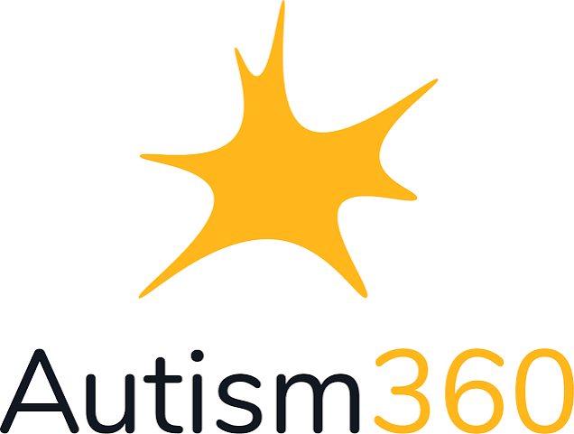
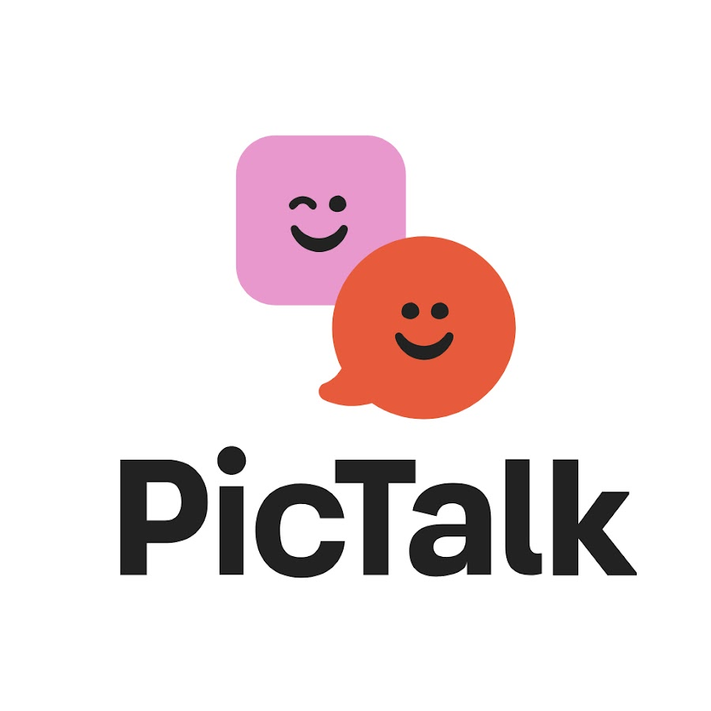

# Capítulo II: Requirements Elicitation & Analysis

## 2.1. Competidores

El mercado de tecnologías de apoyo para personas neurodivergentes y gestión de crisis sensoriales abarca diversas herramientas digitales. Se han identificado tres competidores directos e indirectos clave:

- **Autism 360:** Plataforma integral orientada al seguimiento conductual y apoyo para familias con niños dentro del espectro autista, enfocada principalmente en la gestión de hábitos y progresos a mediano plazo.
- **Tiimo:** Aplicación de planificación visual y estructuración de rutinas diarias diseñada para personas con TDAH y TEA, orientada a la organización de tareas e hitos temporales.
- **Pictalk:** Solución digital de Comunicación Aumentativa y Alternativa (CAA) que ayuda a personas con dificultades para comunicarse verbalmente.

### 2.1.1. Análisis competitivo

A continuación, se presenta la evaluación del **Competitive Analysis Landscape** para contrastar las características de la startup frente a sus principales competidores.

#### Competitive Analysis Landscape

| **¿Por qué llevar a cabo este análisis?** | Escriba en el recuadro la pregunta que busca responder o el objetivo de este análisis.                                                                                         |
|------------------------------------------|--------------------------------------------------------------------------------------------------------------------------------------------------------------------------------|
|                                          | El análisis permite identificar las soluciones existentes ofreciendo herramientas de apoyo para la autorregulcion, comunicación y acompañamiento de personas neurodivergentes. |

---
| **Segmento** | **Categoría** | **NUBI** | **Autism 360** | **Tiimo** | **Pictalk** |
|---|---|---|---|---|---|
|  |  |  |  |  |  |
| **PERFIL** | **Overview** | Solución digital integral para la autorregulación sensorial y guiado de crisis en tiempo real. | Sistema de apoyo y acompañamiento para el desarrollo conductual en el hogar. | Planificador visual y de gestión del tiempo para personas neurodivergentes. | Solución de CAA que utiliza pictogramas para facilitar la comunicación. |
| **PERFIL** | **Ventaja Competitiva / ¿Qué valor ofrece?** | Intervención directa en tiempo real mediante Modo SOS, comunicación CAA e interfaz de autorregulación. | Asesoría y acompañamiento para padres y terapeutas en el desarrollo conductual. | Interfaz accesible para organizar rutinas y gestionar el tiempo de personas neurodivergentes. | Comunicación visual accesible, personalizable y de fácil uso. |
| **MARKETING** | **Mercado Objetivo** | Niños y adolescentes neurodivergentes y sus cuidadores primarios. | Familias con niños autistas en búsqueda de acompañamiento profesional. | Jóvenes y adultos neurodivergentes que buscan estructurar su rutina diaria. | Niños y adultos con dificultades de comunicación, además de cuidadores y profesionales. |
| **MARKETING** | **Estrategias de Marketing** | Alianzas con asociaciones de neurodivergencia, comunidades de padres y modelo Freemium/B2B institucional. | Marketing de contenidos enfocado en terapias, seminarios web y B2C. | Campañas en redes sociales, comunidades de neurodiversidad y App Stores. | Difusión mediante comunidades, organizaciones y profesionales relacionados con la discapacidad. |
| **PRODUCTO** | **Productos y Servicios** | Modo SOS, tablero CAA, interfaz de autorregulación y herramientas personalizables. | App móvil y plataforma web con seguimiento de metas y asesorías. | Aplicación móvil para planificación visual y gestión del tiempo. | Comunicación con pictogramas, síntesis de voz, agendas visuales y rutinas personalizadas. |
| **PRODUCTO** | **Precios y Costos** | Modelo Freemium para familias y suscripción B2B para instituciones educativas. | Suscripción para servicios de acompañamiento y asesoría. | Modelo de suscripción mensual/anual. | Modelo gratuito y basado en donaciones. |
| **PRODUCTO** | **Canales de Distribución** | Sitio web responsive y Web Application. | Plataforma web y tiendas de aplicaciones móviles. | iOS App Store y Google Play Store. | Aplicaciones móviles para Android e iOS y acceso web. |
| **Análisis SWOT** | **Fortalezas** | Guía paso a paso para el cuidador y herramientas de baja carga cognitiva. | Sólido respaldo terapéutico y registro histórico. | Diseño accesible e intuitivo para organizar rutinas. | Herramientas de CAA con pictogramas, interfaz accesible y personalización. |
| **Análisis SWOT** | **Debilidades** | Startup en etapa inicial y requiere posicionamiento de marca en el mercado local. | Curva de aprendizaje elevada y costo accesible limitado. | No ofrece soporte directo en momentos de crisis agudas. | Se enfoca principalmente en comunicación y organización, no específicamente en la gestión de crisis. |
| **Análisis SWOT** | **Oportunidades** | Alta demanda de herramientas de contención sensorial en Perú y LATAM y convenios B2B con colegios. | Expansión a mercados internacionales. | Integración con dispositivos vestibles (*wearables*). | Mayor demanda de herramientas digitales de apoyo para personas neurodivergentes. |
| **Análisis SWOT** | **Amenazas** | Resistencia inicial a la adopción tecnológica en entornos escolares o familiares tradicionales. | Aparición de soluciones digitales gratuitas. | Competencia de apps de productividad convencionales. | Aparición de nuevas aplicaciones de CAA y soluciones digitales similares. |
### 2.1.2. Estrategias y tácticas frente a competidores

Con el propósito de posicionar a **Nubi** frente a la oferta existente y capitalizar las oportunidades del mercado, se establecen las siguientes estrategias y tácticas:

#### Estrategias de Diferenciación y Posicionamiento

**1. Estrategia Enfocada en el Tiempo Real ("Durante la Crisis")**

Mientras competidores como Tiimo o Autism 360 se enfocan en la planificación previa o el análisis posterior, Nubi posicionará su propuesta de valor en la **contención e intervención inmediata** durante el episodio de desregulación sensorial o emocional.

**2. Estrategia de Doble Usuario (Cuidadores y Usuarios Neurodivergentes)**

A diferencia de aplicaciones de función única como Emergency CHAT, Nubi integra un flujo dinámico que ofrece respuestas simultáneas:

- Estímulos de autorregulación de baja carga cognitiva para la persona en crisis.
- **"Modo SOS"** con guías de actuación estandarizadas para el acompañante.

#### Tácticas Competitivas

**1. Aprovechamiento de la Brecha de Mercado**

**Táctica:** Desarrollar e iterar continuamente la interfaz del **Modo SOS**, asegurando que los pasos de contención para cuidadores se presenten con alta claridad visual y auditiva, reduciendo la incertidumbre y el estrés del acompañante en momentos de alta presión.

**2. Modelo de Precios Inclusivo y Gradual**

**Táctica:** Implementar un esquema **Freemium** accesible para las familias peruanas, garantizando el acceso a las funciones básicas de autorregulación y comunicación CAA, superando las barreras económicas de soluciones de alto costo como Autism 360.

**3. Penetración en el Segmento B2B / Instituciones Educativas**

**Táctica:** Ofrecer licencias institucionales a colegios y centros de terapia que incluyan paneles de personalización y perfiles múltiples, diferenciándose de las aplicaciones puramente B2C y asegurando la recurrencia comercial.

**4. Adopción Orgánica en Comunidades de Apoyo**

**Táctica:** Establecer alianzas estratégicas con asociaciones de familias neurodivergentes y profesionales de la salud/educación en Lima y regiones, realizando demostraciones del producto para generar recomendaciones orgánicas y reducir el costo de adquisición de clientes (**CAC**).

## 2.2. Entrevistas

### 2.2.1. Diseño de entrevistas

Con el objetivo de recopilar información cualitativa relevante sobre las necesidades, dolores y comportamientos de nuestro público objetivo, se elaboraron dos guías de entrevistas estructuradas adaptadas para cada segmento.

#### A. Preguntas Generales de Filtrado y Demografía

Estas preguntas se aplican a todos los participantes antes de iniciar la sección específica según su rol.

* ¿Cuál es su nombre completo?
* ¿Qué edad tiene?
* ¿En qué distrito o zona geográfica reside?

---

#### B. Guía de Entrevista — Segmento 1: Padres, Madres y Cuidadores Primarios

1. ¿Cuál es tu ocupación actual?
2. ¿Cuál es tu relación o parentesco con el niño o adolescente que acompañas?
3. ¿Qué edad tiene el niño o adolescente a tu cargo?
4. ¿Qué condición o características de neurodivergencia presenta (TEA, TDAH, TDA, TOC, entre otros)?
5. Cuéntame sobre la última vez que el niño tuvo una crisis o momento de desregulación. ¿Qué sucedió?
6. ¿Qué suele ocurrir o qué factores desencadenan una crisis antes de que comience?
7. ¿Cómo te das cuenta o cuáles son las primeras señales de que está empezando un episodio?
8. ¿Qué acciones ejecutas normalmente para ayudarlo a autorregularse en ese momento?
9. ¿Qué es lo más difícil o frustrante para ti cuando intentas brindarle asistencia en pleno episodio?
10. ¿Qué estrategias o recursos has probado previamente para afrontar estas situaciones? ¿Cuáles te funcionaron y cuáles no?
11. Inmediatamente después de que finaliza la crisis, ¿qué suele ocurrir con el niño y cuál es tu estado emocional?
12. ¿Qué dispositivo tecnológico utilizas habitualmente cuando necesitas buscar ayuda o soluciones rápidas?
13. Cuando buscas información sobre cómo abordar el acompañamiento de tu hijo/a, ¿a qué fuentes recurres (foros, grupos de apoyo, redes sociales, profesionales de la salud, otros)?
14. ¿Has utilizado alguna aplicación móvil, sitio web o herramienta digital específica para intervenir durante una crisis? ¿Cómo fue tu experiencia?
15. Si contaras con una herramienta digital diseñada para asistirte durante una crisis, ¿qué sería lo primero que debería permitirte hacer?
16. ¿Qué datos o instrucciones necesitarías visualizar en pantalla de forma inmediata para saber cómo actuar?
17. ¿Qué características o respaldos debería tener la aplicación para que confíes plenamente en usarla durante un momento de alta tensión?
18. Si pudieras resolver una sola dificultad crítica en el acompañamiento durante una crisis, ¿cuál elegirías?

---

#### C. Guía de Entrevista — Segmento 2: Niños y Adolescentes Neurodivergentes

1. ¿En qué grado escolar estás?
2. ¿Qué actividades te gusta hacer en tu tiempo libre?
3. ¿Qué condición o características especiales sabes que tienes?
4. ¿Qué cosas del entorno (ruidos, luces, personas) te molestan o te hacen sentir incómodo/a?
5. Cuando te sientes muy molesto/a, preocupado/a o abrumado/a, ¿qué sueles hacer?
6. ¿Qué cosas o actividades te ayudan a sentirte tranquilo/a de nuevo?
7. Cuando te cuesta hablar o explicar cómo te sientes, ¿cómo haces para pedirle ayuda a alguien o decirle lo que necesitas?
8. ¿Qué dispositivo usas más seguido: celular, tablet o computadora?
9. ¿Cuáles son tus aplicaciones, juegos o videos favoritos?
10. Si tuvieras una aplicación en el celular o tablet para ayudarte cuando te sientes mal o abrumado/a, ¿qué te gustaría que tuviera o cómo te gustaría que fuera?

### 2.2.2. Registro de entrevistas

### 2.2.3. Análisis de entrevistas

## 2.3. Needfinding

### 2.3.1. User Personas

### 2.3.2. User Task Matrix

A partir del análisis de las entrevistas y de los User Personas definidos previamente, se identificaron las principales tareas que realizan los usuarios frente a una situación de desregulación emocional o sensorial. Estas tareas representan las actividades que los usuarios necesitan realizar independientemente de la existencia de NUBI.

**Para este análisis se consideran dos segmentos principales:** el cuidador, representado por padres, madres y cuidadores primarios, y el usuario neurodivergente, representado por niños y adolescentes de entre 6 y 17 años que pueden experimentar episodios de sobrecarga emocional o sensorial.

La matriz permite comparar la frecuencia y la importancia de cada tarea para determinar cuáles representan las necesidades más críticas que la solución debe atender.

<table border="1" cellpadding="8" cellspacing="0" style="width: 100%; border-collapse: collapse;">
  <tr>
    <th rowspan="2" style="text-align: left;">Tarea</th>
    <th colspan="2">Cuidador Primario</th>
    <th colspan="2">Persona Neurodivergente</th>
  </tr>
  <tr>
    <th>Frecuencia</th>
    <th>Importancia</th>
    <th>Frecuencia</th>
    <th>Importancia</th>
  </tr>
  <tr><td>Identificar señales tempranas de desregulación</td><td>High</td><td>High</td><td>High</td><td>High</td></tr>
  <tr><td>Identificar estímulos o situaciones que generan malestar</td><td>High</td><td>High</td><td>High</td><td>High</td></tr>
  <tr><td>Aplicar estrategias de autorregulación</td><td>High</td><td>High</td><td>High</td><td>High</td></tr>
  <tr><td>Comunicar necesidades o malestar durante una situación de desregulación</td><td>Medium</td><td>High</td><td>High</td><td>High</td></tr>
  <tr><td>Solicitar o brindar apoyo durante una situación de crisis</td><td>Medium</td><td>High</td><td>Medium</td><td>High</td></tr>
  <tr><td>Adaptar el entorno para reducir estímulos que generan sobrecarga</td><td>Medium</td><td>High</td><td>High</td><td>High</td></tr>
  <tr><td>Seguir una secuencia de acciones para manejar una situación de desregulación</td><td>Medium</td><td>High</td><td>Medium</td><td>High</td></tr>
  <tr><td>Revisar posteriormente qué desencadenó la situación y qué estrategia funcionó</td><td>Medium</td><td>High</td><td>Low</td><td>Medium</td></tr>
</table>

**Análisis del Task Matrix**

A partir del User Task Matrix, se identifican las tareas que presentan mayor relevancia para ambos segmentos y aquellas que representan diferencias importantes entre el cuidador y el usuario neurodivergente.

**Tareas con mayor frecuencia e importancia para ambos segmentos:**

La aplicación de estrategias para recuperar la calma, la comunicación de necesidades y la reducción de estímulos representan tareas de alta frecuencia e importancia para ambos perfiles. Esto demuestra que la solución debe priorizar herramientas que puedan utilizarse de manera sencilla durante una situación de desregulación, evitando procesos complejos que aumenten la carga cognitiva del usuario.

Asimismo, comunicar la necesidad de ayuda constituye una tarea crítica. Durante un episodio de desregulación, el usuario puede presentar dificultades para expresar verbalmente lo que necesita, mientras que el cuidador necesita interpretar rápidamente la situación para brindar el apoyo correspondiente.

**Principales diferencias entre los segmentos:**

El cuidador concentra tareas relacionadas con la observación, interpretación y toma de decisiones. Entre sus principales responsabilidades se encuentran identificar señales tempranas, determinar posibles factores desencadenantes, seleccionar estrategias de apoyo y evaluar si la situación está mejorando.

Por otro lado, el usuario neurodivergente concentra sus tareas en la autorregulación y comunicación de necesidades. Durante una situación de sobrecarga, puede necesitar reducir estímulos, utilizar una estrategia que le ayude a recuperar la calma o comunicar que necesita ayuda sin depender completamente de la comunicación verbal.

**Tareas críticas para NUBI:**

**Las tareas con mayor importancia permiten definir las funcionalidades que deben considerarse prioritarias dentro de la solución. Entre ellas destacan:**

1. Identificar señales de desregulación.
2. Comunicar necesidades básicas y solicitar ayuda.
3. Aplicar estrategias de autorregulación.
4. Reducir estímulos durante situaciones de sobrecarga.
5. Orientar al cuidador sobre cómo actuar durante la crisis.
6. Personalizar las estrategias de apoyo según las características del usuario.

Estas tareas se relacionan directamente con las funcionalidades planteadas en el Lean UX Canvas, especialmente el Modo SOS, la interfaz de autorregulación y el tablero de Comunicación Aumentativa y Alternativa (CAA).

### 2.3.3. User Journey Mapping

### 2.3.4. Empathy Mapping

## 2.4. Big Picture Event Storming

## 2.5. Ubiquitous Language

