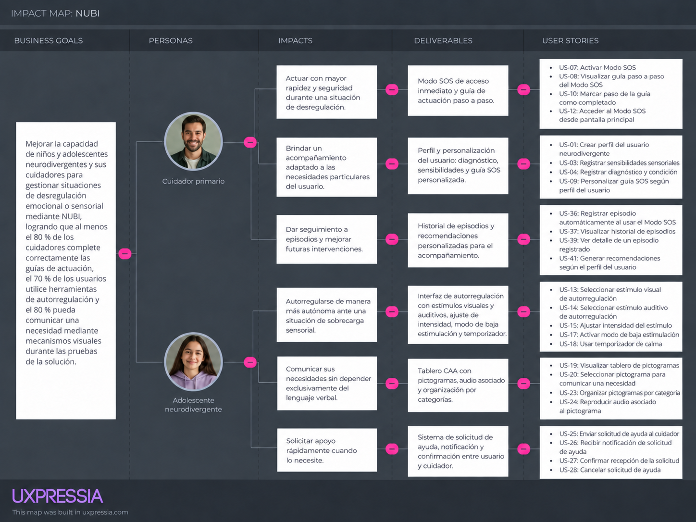

# Capítulo III: Requirements Specification

## 3.1. User Stories

En esta sección se especifican las épicas y las User Stories que definen el alcance funcional de Nubi. El alcance se ha delimitado a los 5 Bounded Contexts identificados en el Big Picture Event Storming (Capítulo II, sección 2.4), por lo que se define una única Épica por cada Bounded Context. A partir de esas 5 épicas se elabora un cuadro para el conjunto de User Stories funcionales, un cuadro de Technical Stories orientadas al RESTful API (redactadas desde el rol Developer) y un cuadro de Landing Page Stories orientadas al sitio web estático (redactadas desde el rol Visitante), tal como lo solicita la rúbrica del proyecto.

Los criterios de aceptación se redactan en tiempo presente, en tercera persona, sin hacer referencia a detalles de interfaz de usuario, y siguen la estructura Gherkin (Dado - Cuando - Entonces / Given - When - Then).

### Épicas por Bounded Context

### Épicas por Bounded Context

| Epic ID | Bounded Context | Descripción |
|---|---|---|
| EPIC-01 | Perfil y Personalización | Como cuidador quiero crear y gestionar el perfil del niño o adolescente neurodivergente para personalizar las herramientas de apoyo según sus necesidades. |
| EPIC-02 | Gestión de Crisis (Modo SOS) | Como cuidador quiero contar con un Modo SOS con guías paso a paso para actuar con seguridad durante un episodio de desregulación. |
| EPIC-03 | Autorregulación | Como usuario neurodivergente quiero contar con una interfaz de autorregulación con estímulos personalizables para recuperar la calma durante una sobrecarga sensorial. |
| EPIC-04 | Comunicación Asistida (CAA) | Como usuario neurodivergente quiero contar con un tablero de comunicación con pictogramas para expresar mis necesidades básicas sin depender del habla. |
| EPIC-05 | Red de Apoyo y Seguimiento | Como cuidador quiero solicitar ayuda, dar seguimiento a los episodios de crisis y recibir recomendaciones personalizadas para acompañar de forma más efectiva al usuario a mi cargo. |

### 3.1.1. User Stories

Historias funcionales, una línea por User Story, redactadas desde el rol del cuidador o del usuario neurodivergente según corresponda.

| Epic / Story ID | Título | Descripción | Criterios de Aceptación | Relacionado con (Epic ID) |
|---|---|---|---|---|
| US-01 | Crear perfil del usuario neurodivergente | Como cuidador, quiero crear el perfil del niño o adolescente neurodivergente a mi cargo, para comenzar a personalizar las herramientas de apoyo de Nubi según sus necesidades. | **Scenario 1: Creación exitosa del perfil** Dado que el cuidador registra el nombre, la edad y la condición del usuario neurodivergente, cuando la información ingresada es válida, entonces el sistema crea el perfil y lo incorpora a la lista de perfiles del cuidador.  **Scenario 2: Datos obligatorios incompletos** Dado que el cuidador intenta registrar el perfil sin completar un dato obligatorio, cuando el sistema valida la información, entonces rechaza la creación del perfil e indica cuál dato falta completar. | EPIC-01 |
| US-02 | Editar perfil del usuario neurodivergente | Como cuidador, quiero editar el perfil del usuario a mi cargo, para mantener su información actualizada. | **Scenario 1: Edición exitosa** Dado que el cuidador modifica un dato del perfil del usuario, cuando la información ingresada es válida, entonces el sistema actualiza el perfil y conserva el histórico de cambios relevante.  **Scenario 2: Edición sin modificaciones** Dado que el cuidador confirma la edición sin modificar ningún dato, cuando el sistema procesa la solicitud, entonces mantiene el perfil sin cambios. | EPIC-01 |
| US-03 | Registrar sensibilidades sensoriales | Como cuidador, quiero registrar las sensibilidades sensoriales del usuario, para que Nubi personalice los estímulos ofrecidos en autorregulación y en el Modo SOS. | **Scenario 1: Registro exitoso** Dado que el cuidador indica el nivel de sensibilidad del usuario a estímulos auditivos y visuales, cuando el sistema valida la información, entonces almacena las sensibilidades y las asocia al perfil del usuario.  **Scenario 2: Perfil sin sensibilidades registradas** Dado que el cuidador no registra ninguna sensibilidad, cuando el sistema guarda el perfil, entonces asigna valores por defecto y notifica que pueden completarse posteriormente. | EPIC-01 |
| US-04 | Registrar diagnóstico y condición | Como cuidador, quiero registrar el diagnóstico y la condición del usuario, para que las recomendaciones y guías se ajusten a su perfil. | **Scenario 1: Registro exitoso** Dado que el cuidador selecciona una condición de la lista disponible, cuando el sistema valida la selección, entonces asocia la condición al perfil y ajusta las recomendaciones por defecto.  **Scenario 2: Condición no listada** Dado que la condición del usuario no está disponible en la lista, cuando el cuidador registra la condición como "Otra" con una descripción, entonces el sistema almacena la condición personalizada en el perfil. | EPIC-01 |
| US-05 | Subir foto de perfil del usuario | Como cuidador, quiero asociar una fotografía al perfil del usuario, para identificarlo fácilmente al alternar entre perfiles. | **Scenario 1: Carga exitosa** Dado que el cuidador adjunta una imagen válida dentro del formato y el tamaño permitido, cuando el sistema valida el archivo, entonces actualiza la fotografía del perfil.  **Scenario 2: Archivo inválido** Dado que el cuidador adjunta un archivo que excede el tamaño permitido o no corresponde a un formato de imagen soportado, cuando el sistema valida el archivo, entonces rechaza la carga e indica el motivo. | EPIC-01 |
| US-06 | Asociar múltiples cuidadores a un perfil | Como cuidador principal, quiero invitar a otros cuidadores al perfil del usuario, para compartir el acompañamiento con la familia o red cercana. | **Scenario 1: Invitación exitosa** Dado que el cuidador principal envía una invitación a otro cuidador mediante su correo registrado, cuando el cuidador invitado la acepta, entonces obtiene acceso al perfil del usuario.  **Scenario 2: Límite de cuidadores alcanzado** Dado que el número de cuidadores asociados al perfil alcanza el límite permitido por el plan, cuando el cuidador principal intenta agregar un cuidador adicional, entonces el sistema rechaza la invitación e indica que se alcanzó el límite del plan. | EPIC-01 |
| US-07 | Activar Modo SOS | Como cuidador, quiero activar el Modo SOS al inicio de una crisis, para recibir orientación inmediata sobre cómo actuar. | **Scenario 1: Activación exitosa** Dado que el cuidador cuenta con un perfil de usuario seleccionado, cuando activa el Modo SOS, entonces el sistema presenta la guía de actuación paso a paso correspondiente a ese perfil.  **Scenario 2: Activación sin perfil seleccionado** Dado que el cuidador no tiene un perfil de usuario seleccionado, cuando intenta activar el Modo SOS, entonces el sistema solicita seleccionar un perfil antes de mostrar la guía. | EPIC-02 |
| US-08 | Visualizar guía paso a paso del Modo SOS | Como cuidador, quiero visualizar los pasos de actuación de manera secuencial, para no sentirme abrumado durante la crisis. | **Scenario 1: Visualización correcta** Dado que el Modo SOS está activo, cuando el cuidador avanza entre los pasos de la guía, entonces el sistema presenta cada paso con una descripción breve y contenido de apoyo audiovisual opcional.  **Scenario 2: Último paso alcanzado** Dado que el cuidador se encuentra en el último paso de la guía, cuando solicita avanzar, entonces el sistema presenta el cierre del episodio en lugar de un paso adicional. | EPIC-02 |
| US-09 | Personalizar guía SOS según perfil del usuario | Como cuidador, quiero que la guía del Modo SOS se adapte a las sensibilidades registradas del usuario, para que la orientación recibida sea más efectiva. | **Scenario 1: Personalización aplicada** Dado que el perfil del usuario tiene sensibilidades sensoriales registradas, cuando el cuidador activa el Modo SOS, entonces el sistema prioriza los pasos relacionados con esas sensibilidades.  **Scenario 2: Perfil sin datos de personalización** Dado que el perfil del usuario no tiene sensibilidades registradas, cuando el cuidador activa el Modo SOS, entonces el sistema presenta la guía genérica y sugiere completar el perfil. | EPIC-02 |
| US-10 | Marcar paso de la guía como completado | Como cuidador, quiero marcar cada paso de la guía como completado, para llevar control de las acciones ya realizadas durante la crisis. | **Scenario 1: Marcado exitoso** Dado que el cuidador confirma la finalización de un paso, cuando el sistema procesa la confirmación, entonces registra el paso como completado y avanza al siguiente.  **Scenario 2: Paso obligatorio no revisado** Dado que un paso está definido como obligatorio y el cuidador intenta marcarlo como completado sin haberlo revisado, cuando el sistema detecta la omisión, entonces solicita una confirmación explícita antes de continuar. | EPIC-02 |
| US-11 | Finalizar episodio desde el Modo SOS | Como cuidador, quiero finalizar el episodio al terminar la crisis, para que quede registrado automáticamente en el historial. | **Scenario 1: Finalización exitosa** Dado que el cuidador completó la guía del Modo SOS, cuando confirma la finalización del episodio, entonces el sistema calcula la duración total, genera el registro con fecha y pasos completados, y lo guarda en el historial de episodios.  **Scenario 2: Finalización anticipada** Dado que el cuidador finaliza el episodio antes de completar todos los pasos de la guía, cuando confirma la finalización, entonces el sistema registra el episodio con el estado "finalizado anticipadamente". | EPIC-02 |
| US-12 | Acceder al Modo SOS desde pantalla principal | Como cuidador, quiero acceder al Modo SOS de forma inmediata desde cualquier parte de la aplicación, para reaccionar rápidamente ante una crisis. | **Scenario 1: Acceso rápido exitoso** Dado que el cuidador se encuentra en cualquier sección de la aplicación, cuando solicita acceder al Modo SOS, entonces el sistema lo redirige directamente a la guía sin pasos intermedios de navegación.  **Scenario 2: Acceso alternativo configurado** Dado que el cuidador desactivó el acceso directo al Modo SOS en sus preferencias, cuando busca activarlo, entonces el sistema ofrece un acceso alternativo desde el menú principal. | EPIC-02 |
| US-13 | Seleccionar estímulo visual de autorregulación | Como usuario neurodivergente, quiero elegir un estímulo visual, para ayudarme a recuperar la calma durante una sobrecarga sensorial. | **Scenario 1: Selección exitosa** Dado que el usuario elige un estímulo visual disponible en la galería, cuando el sistema procesa la selección, entonces reproduce el estímulo a pantalla completa con la opción de pausarlo.  **Scenario 2: Estímulo no disponible sin conexión** Dado que el estímulo seleccionado requiere descarga y no hay conexión a internet, cuando el sistema intenta cargarlo, entonces informa la limitación y ofrece estímulos previamente descargados. | EPIC-03 |
| US-14 | Seleccionar estímulo auditivo de autorregulación | Como usuario neurodivergente, quiero elegir un sonido relajante, para ayudarme a regular mis emociones. | **Scenario 1: Reproducción exitosa** Dado que el usuario elige un estímulo auditivo disponible, cuando el sistema procesa la selección, entonces reproduce el audio en bucle con control de volumen disponible.  **Scenario 2: Dispositivo en silencio** Dado que el dispositivo del usuario está configurado en modo silencio, cuando selecciona un estímulo auditivo, entonces el sistema sugiere activar el volumen o cambiar a un estímulo visual. | EPIC-03 |
| US-15 | Ajustar intensidad del estímulo | Como usuario neurodivergente, quiero ajustar la intensidad de los estímulos, para adaptarlos a lo que necesito en cada momento. | **Scenario 1: Ajuste exitoso** Dado que un estímulo se encuentra activo, cuando el usuario modifica el nivel de intensidad, entonces el sistema aplica el cambio en tiempo real.  **Scenario 2: Intensidad fuera de rango** Dado que el usuario intenta establecer una intensidad superior al máximo permitido, cuando el sistema valida el valor, entonces mantiene la intensidad en el límite máximo configurado. | EPIC-03 |
| US-16 | Guardar estímulos favoritos | Como usuario neurodivergente, quiero guardar mis estímulos favoritos, para acceder a ellos más rápido en futuras sesiones. | **Scenario 1: Guardado exitoso** Dado que el usuario marca un estímulo como favorito, cuando el sistema procesa la acción, entonces lo agrega a la sección de favoritos.  **Scenario 2: Eliminación de favorito** Dado que el usuario desmarca un estímulo previamente marcado como favorito, cuando el sistema procesa la acción, entonces lo retira de la sección de favoritos. | EPIC-03 |
| US-17 | Activar modo de baja estimulación | Como usuario neurodivergente, quiero activar un modo con menos elementos visuales y sonoros, para reducir la sobrecarga sensorial cuando lo necesito. | **Scenario 1: Activación exitosa** Dado que el usuario activa el modo de baja estimulación, cuando el sistema procesa la acción, entonces reduce colores, animaciones y sonidos en toda la interfaz.  **Scenario 2: Desactivación del modo** Dado que el modo de baja estimulación está activo, cuando el usuario lo desactiva, entonces el sistema restaura la interfaz visual y sonora estándar. | EPIC-03 |
| US-18 | Usar temporizador de calma | Como usuario neurodivergente, quiero usar un temporizador mientras me autorregulo, para tener noción del tiempo que llevo en la actividad sin generarme estrés. | **Scenario 1: Temporizador iniciado** Dado que el usuario inicia el temporizador de calma, cuando el sistema procesa la acción, entonces presenta una cuenta regresiva visual sin elementos numéricos que puedan resultar estresantes.  **Scenario 2: Temporizador finalizado** Dado que el temporizador llega a cero mientras el usuario permanece en la actividad, cuando el sistema detecta el fin del tiempo, entonces pregunta si desea continuar o finalizar la sesión. | EPIC-03 |
| US-19 | Visualizar tablero de pictogramas | Como usuario neurodivergente, quiero visualizar un tablero de pictogramas, para comunicar lo que necesito sin depender del habla. | **Scenario 1: Visualización correcta** Dado que el usuario ingresa a la sección de comunicación, cuando el sistema carga el tablero, entonces presenta los pictogramas organizados por categorías.  **Scenario 2: Tablero sin configuración previa** Dado que el perfil del usuario no tiene pictogramas configurados, cuando ingresa a la sección de comunicación, entonces el sistema presenta un conjunto de pictogramas básicos por defecto. | EPIC-04 |
| US-20 | Seleccionar pictograma para comunicar una necesidad | Como usuario neurodivergente, quiero seleccionar un pictograma, para comunicar una necesidad a mi cuidador. | **Scenario 1: Selección exitosa** Dado que el usuario selecciona un pictograma del tablero, cuando el sistema procesa la selección, entonces reproduce el audio asociado y notifica al cuidador vinculado disponible.  **Scenario 2: Sin cuidador disponible** Dado que ningún cuidador vinculado se encuentra disponible al momento de la selección, cuando el usuario selecciona un pictograma, entonces el sistema reproduce el audio localmente y guarda el mensaje para notificarlo cuando el cuidador esté disponible. | EPIC-04 |
| US-21 | Personalizar pictogramas favoritos | Como cuidador, quiero marcar los pictogramas más usados como favoritos, para que el usuario los encuentre con mayor facilidad. | **Scenario 1: Marcado exitoso** Dado que el cuidador marca un pictograma como favorito, cuando el sistema procesa la acción, entonces lo incorpora a la sección de favoritos del tablero.  **Scenario 2: Límite de favoritos alcanzado** Dado que la cantidad de pictogramas favoritos alcanza el límite permitido, cuando el cuidador intenta marcar uno adicional, entonces el sistema rechaza la acción e indica que se alcanzó el máximo permitido. | EPIC-04 |
| US-22 | Agregar pictograma personalizado | Como cuidador, quiero agregar un pictograma personalizado con una imagen propia, para representar objetos o situaciones específicas del usuario. | **Scenario 1: Creación exitosa** Dado que el cuidador registra una imagen válida y una etiqueta para el nuevo pictograma, cuando el sistema valida la información, entonces agrega el pictograma personalizado a la categoría seleccionada.  **Scenario 2: Imagen no válida** Dado que el archivo registrado no corresponde a un formato de imagen soportado, cuando el sistema valida el archivo, entonces rechaza la creación del pictograma e indica el motivo. | EPIC-04 |
| US-23 | Organizar pictogramas por categoría | Como cuidador, quiero organizar los pictogramas en categorías, para que el usuario navegue el tablero de forma más intuitiva. | **Scenario 1: Organización exitosa** Dado que el cuidador asigna un pictograma a una categoría existente, cuando el sistema procesa la acción, entonces reubica el pictograma dentro de esa categoría en el tablero.  **Scenario 2: Categoría inexistente** Dado que el cuidador intenta asignar un pictograma a una categoría que no existe, cuando el sistema valida la acción, entonces rechaza la asignación y sugiere crear la categoría primero. | EPIC-04 |
| US-24 | Reproducir audio asociado al pictograma | Como usuario neurodivergente, quiero que se reproduzca un audio al seleccionar un pictograma, para reforzar el mensaje que estoy comunicando. | **Scenario 1: Reproducción exitosa** Dado que el usuario selecciona un pictograma con audio asociado, cuando el sistema procesa la selección, entonces reproduce el audio correspondiente de forma inmediata.  **Scenario 2: Audio no disponible** Dado que el pictograma seleccionado no tiene un audio asociado, cuando el sistema procesa la selección, entonces comunica la necesidad únicamente mediante la notificación visual al cuidador. | EPIC-04 |
| US-25 | Enviar solicitud de ayuda al cuidador | Como usuario neurodivergente, quiero enviar una solicitud de ayuda a mi cuidador, para recibir apoyo durante una situación de crisis. | **Scenario 1: Envío exitoso** Dado que el usuario activa la solicitud de ayuda, cuando el sistema procesa la acción, entonces notifica al cuidador vinculado y registra la solicitud como pendiente.  **Scenario 2: Sin cuidador vinculado** Dado que el usuario no tiene ningún cuidador vinculado a su perfil, cuando intenta enviar la solicitud, entonces el sistema informa que no existe un cuidador disponible para recibirla. | EPIC-05 |
| US-26 | Recibir notificación de solicitud de ayuda | Como cuidador, quiero recibir una notificación cuando el usuario a mi cargo solicita ayuda, para responder de forma oportuna. | **Scenario 1: Notificación recibida** Dado que el usuario envía una solicitud de ayuda, cuando el sistema procesa el envío, entonces notifica al cuidador vinculado de forma inmediata.  **Scenario 2: Cuidador sin conexión** Dado que el cuidador vinculado no tiene conexión al momento de la solicitud, cuando recupera la conexión, entonces el sistema le presenta la notificación pendiente. | EPIC-05 |
| US-27 | Confirmar recepción de la solicitud | Como cuidador, quiero confirmar que recibí la solicitud de ayuda, para que el usuario sepa que voy a asistirlo. | **Scenario 1: Confirmación exitosa** Dado que el cuidador recibe una solicitud de ayuda pendiente, cuando confirma su recepción, entonces el sistema notifica al usuario que su solicitud fue atendida.  **Scenario 2: Solicitud ya confirmada por otro cuidador** Dado que otro cuidador vinculado ya confirmó la misma solicitud, cuando el cuidador intenta confirmarla nuevamente, entonces el sistema indica que la solicitud ya fue atendida. | EPIC-05 |
| US-28 | Cancelar solicitud de ayuda | Como usuario neurodivergente, quiero cancelar una solicitud de ayuda enviada, para evitar una notificación innecesaria si ya no la necesito. | **Scenario 1: Cancelación exitosa** Dado que el usuario tiene una solicitud de ayuda pendiente, cuando decide cancelarla antes de que sea confirmada, entonces el sistema la marca como cancelada y notifica al cuidador.  **Scenario 2: Solicitud ya confirmada** Dado que la solicitud de ayuda ya fue confirmada por el cuidador, cuando el usuario intenta cancelarla, entonces el sistema indica que la solicitud ya no puede cancelarse. | EPIC-05 |
| US-29 | Consultar historial de solicitudes de ayuda | Como cuidador, quiero consultar el historial de solicitudes de ayuda, para dar seguimiento a la frecuencia con la que el usuario requiere apoyo. | **Scenario 1: Consulta exitosa** Dado que el cuidador ingresa a la sección de solicitudes de ayuda, cuando el sistema carga la información, entonces presenta el listado de solicitudes con su fecha y estado.  **Scenario 2: Sin solicitudes registradas** Dado que el usuario no tiene solicitudes de ayuda registradas, cuando el cuidador consulta el historial, entonces el sistema indica que no existen solicitudes para mostrar. | EPIC-05 |
| US-30 | Visualizar resumen de episodios recientes | Como cuidador, quiero visualizar un resumen de los episodios recientes del usuario, para conocer su situación sin revisar el historial completo. | **Scenario 1: Visualización correcta** Dado que el cuidador ingresa al panel de inicio, cuando el sistema carga la información, entonces presenta un resumen de los episodios registrados en los últimos días.  **Scenario 2: Sin episodios recientes** Dado que el usuario no registra episodios en el periodo reciente, cuando el cuidador consulta el resumen, entonces el sistema indica que no se registraron episodios recientes. | EPIC-05 |
| US-31 | Visualizar estado actual del usuario | Como cuidador, quiero visualizar el estado actual del usuario a mi cargo, para tomar decisiones oportunas sobre su acompañamiento. | **Scenario 1: Visualización correcta** Dado que el cuidador ingresa al panel de inicio, cuando el sistema carga la información, entonces presenta el estado actual registrado del usuario.  **Scenario 2: Estado sin actualizar** Dado que el estado del usuario no ha sido actualizado en el periodo esperado, cuando el cuidador consulta el panel, entonces el sistema indica que la información podría no estar actualizada. | EPIC-05 |
| US-32 | Acceder a módulos mediante accesos directos | Como cuidador, quiero acceder a los módulos principales de la aplicación desde el panel de inicio, para navegar de forma más eficiente. | **Scenario 1: Acceso exitoso** Dado que el cuidador selecciona un módulo desde el panel de inicio, cuando el sistema procesa la selección, entonces lo redirige al módulo correspondiente.  **Scenario 2: Módulo no disponible para el plan actual** Dado que el módulo seleccionado no está disponible en el plan actual del cuidador, cuando intenta acceder, entonces el sistema informa la restricción y sugiere actualizar el plan. | EPIC-05 |
| US-33 | Visualizar alertas recientes en el home | Como cuidador, quiero visualizar las alertas recientes relacionadas con el usuario, para estar al tanto de eventos que requieren mi atención. | **Scenario 1: Visualización correcta** Dado que existen alertas generadas para el usuario, cuando el cuidador ingresa al panel de inicio, entonces el sistema las presenta ordenadas por fecha.  **Scenario 2: Sin alertas pendientes** Dado que no existen alertas generadas para el usuario, cuando el cuidador ingresa al panel de inicio, entonces el sistema indica que no hay alertas pendientes. | EPIC-05 |
| US-34 | Visualizar recomendaciones personalizadas en el home | Como cuidador, quiero visualizar recomendaciones personalizadas en el panel de inicio, para conocer sugerencias relevantes sin buscar en otras secciones. | **Scenario 1: Visualización correcta** Dado que existen recomendaciones generadas para el perfil del usuario, cuando el cuidador ingresa al panel de inicio, entonces el sistema presenta las recomendaciones más relevantes.  **Scenario 2: Sin recomendaciones disponibles** Dado que no existen recomendaciones generadas aún para el perfil del usuario, cuando el cuidador ingresa al panel de inicio, entonces el sistema indica que no hay recomendaciones disponibles. | EPIC-05 |
| US-35 | Cambiar entre perfiles de usuarios a cargo | Como cuidador, quiero cambiar entre los perfiles de los usuarios a mi cargo, para gestionar a más de un usuario neurodivergente desde la misma cuenta. | **Scenario 1: Cambio exitoso** Dado que el cuidador tiene más de un perfil asociado a su cuenta, cuando selecciona un perfil distinto al activo, entonces el sistema actualiza el contexto de la aplicación a ese perfil.  **Scenario 2: Un solo perfil asociado** Dado que el cuidador tiene un único perfil asociado, cuando intenta cambiar de perfil, entonces el sistema indica que no existen otros perfiles disponibles para seleccionar. | EPIC-05 |
| US-37 | Visualizar historial de episodios | Como cuidador, quiero visualizar el historial de episodios del usuario, para identificar patrones y mejorar el acompañamiento. | **Scenario 1: Visualización correcta** Dado que el cuidador ingresa a la sección de historial, cuando el sistema carga la información, entonces presenta el listado de episodios registrados ordenados por fecha.  **Scenario 2: Sin episodios registrados** Dado que el usuario no tiene episodios registrados, cuando el cuidador ingresa al historial, entonces el sistema indica que no existen episodios para mostrar. | EPIC-05 |
| US-38 | Filtrar historial de episodios por fecha | Como cuidador, quiero filtrar el historial de episodios por un rango de fechas, para consultar un periodo específico. | **Scenario 1: Filtrado exitoso** Dado que el cuidador define un rango de fechas válido, cuando el sistema aplica el filtro, entonces presenta únicamente los episodios registrados dentro de ese rango.  **Scenario 2: Rango sin resultados** Dado que no existen episodios registrados dentro del rango de fechas definido, cuando el sistema aplica el filtro, entonces indica que no se encontraron episodios para ese periodo. | EPIC-05 |
| US-39 | Ver detalle de un episodio registrado | Como cuidador, quiero ver el detalle de un episodio registrado, para revisar la información completa de lo ocurrido. | **Scenario 1: Visualización correcta** Dado que el cuidador selecciona un episodio del historial, cuando el sistema carga la información, entonces presenta la fecha, duración, pasos completados y notas asociadas al episodio.  **Scenario 2: Episodio eliminado** Dado que el episodio seleccionado fue eliminado previamente, cuando el cuidador intenta consultarlo, entonces el sistema indica que el episodio ya no está disponible. | EPIC-05 |
| US-40 | Agregar notas manuales a un episodio | Como cuidador, quiero agregar notas manuales a un episodio registrado, para complementar la información con observaciones propias. | **Scenario 1: Registro exitoso** Dado que el cuidador redacta una nota sobre un episodio, cuando confirma el guardado, entonces el sistema asocia la nota al episodio correspondiente.  **Scenario 2: Nota vacía** Dado que el cuidador intenta guardar una nota sin contenido, cuando el sistema valida la información, entonces rechaza el guardado e indica que la nota no puede estar vacía. | EPIC-05 |
| US-41 | Generar recomendaciones según el perfil del usuario | Como cuidador, quiero recibir recomendaciones generadas según el perfil del usuario, para brindar un acompañamiento más adecuado. | **Scenario 1: Generación exitosa** Dado que el perfil del usuario cuenta con diagnóstico y sensibilidades registradas, cuando el sistema procesa esta información, entonces genera un conjunto de recomendaciones asociadas al perfil.  **Scenario 2: Perfil con información insuficiente** Dado que el perfil del usuario no cuenta con suficiente información registrada, cuando el sistema intenta generar recomendaciones, entonces indica que se requiere completar el perfil para generarlas. | EPIC-05 |
| US-42 | Visualizar guía de actuación recomendada | Como cuidador, quiero visualizar el detalle de una guía de actuación recomendada, para conocer las acciones sugeridas. | **Scenario 1: Visualización correcta** Dado que el cuidador selecciona una recomendación del listado, cuando el sistema carga la información, entonces presenta la guía de actuación completa asociada a esa recomendación.  **Scenario 2: Recomendación desactualizada** Dado que la recomendación seleccionada fue reemplazada por una versión más reciente, cuando el cuidador la consulta, entonces el sistema indica que existe una versión actualizada disponible. | EPIC-05 |
| US-43 | Calificar la utilidad de una recomendación | Como cuidador, quiero calificar la utilidad de una recomendación recibida, para ayudar a mejorar las futuras sugerencias. | **Scenario 1: Calificación exitosa** Dado que el cuidador revisó una recomendación, cuando registra una calificación de utilidad, entonces el sistema almacena la calificación asociada a esa recomendación.  **Scenario 2: Recomendación ya calificada** Dado que el cuidador ya calificó previamente la misma recomendación, cuando intenta calificarla nuevamente, entonces el sistema actualiza la calificación existente en lugar de crear una nueva. | EPIC-05 |
| US-44 | Guardar recomendación como favorita | Como cuidador, quiero guardar una recomendación como favorita, para consultarla rápidamente en el futuro. | **Scenario 1: Guardado exitoso** Dado que el cuidador marca una recomendación como favorita, cuando el sistema procesa la acción, entonces la agrega a la sección de recomendaciones favoritas.  **Scenario 2: Recomendación ya marcada** Dado que la recomendación ya se encuentra marcada como favorita, cuando el cuidador la desmarca, entonces el sistema la retira de la sección de favoritas. | EPIC-05 |
| US-45 | Actualizar recomendaciones tras nuevos episodios | Como cuidador, quiero que las recomendaciones se actualicen tras el registro de nuevos episodios, para que reflejen la situación más reciente del usuario. | **Scenario 1: Actualización exitosa** Dado que se registra un nuevo episodio para el usuario, cuando el sistema procesa el registro, entonces recalcula y actualiza el conjunto de recomendaciones asociadas al perfil.  **Scenario 2: Episodio sin información relevante** Dado que el nuevo episodio registrado no aporta información adicional relevante, cuando el sistema evalúa el registro, entonces mantiene sin cambios las recomendaciones actuales. | EPIC-05 |

### 3.1.2. Technical Stories

Historias técnicas del RESTful API, una por Bounded Context, redactadas desde el rol Developer. Los criterios de aceptación describen escenarios de interacción request/response en formato Gherkin.

| Epic / Story ID | Título | Descripción | Criterios de Aceptación | Relacionado con (Epic ID) |
|---|---|---|---|---|
| TS-01 | Exponer API RESTful de gestión de perfiles | Como Developer, quiero exponer un servicio RESTful para gestionar perfiles de usuarios neurodivergentes, para que las aplicaciones cliente puedan crear, consultar, actualizar y eliminar perfiles de forma segura. | **Scenario 1: Creación de perfil vía API** Dado que el cliente envía una petición POST al recurso de perfiles con un cuerpo válido, cuando el servidor recibe la petición, entonces persiste el perfil y responde con el código de estado 201 y el recurso creado.  **Scenario 2: Petición con datos inválidos** Dado que el cliente envía una petición POST al recurso de perfiles con un campo obligatorio faltante, cuando el servidor valida el cuerpo de la petición, entonces responde con el código de estado 400 y un detalle del campo inválido. | EPIC-01 |
| TS-02 | Exponer API RESTful del Modo SOS y episodios | Como Developer, quiero exponer un servicio RESTful para gestionar la activación del Modo SOS y el ciclo de vida de los episodios, para que las aplicaciones cliente puedan iniciar, actualizar y finalizar episodios de crisis. | **Scenario 1: Inicio de episodio vía API** Dado que el cliente envía una petición POST al recurso de episodios con el identificador del perfil activo, cuando el servidor recibe la petición, entonces crea el episodio en estado "en curso" y responde con el código de estado 201.  **Scenario 2: Finalización de episodio inexistente** Dado que el cliente envía una petición PATCH para finalizar un episodio con un identificador que no existe, cuando el servidor procesa la petición, entonces responde con el código de estado 404. | EPIC-02 |
| TS-03 | Exponer API RESTful de estímulos de autorregulación | Como Developer, quiero exponer un servicio RESTful para consultar y gestionar los estímulos de autorregulación, para que las aplicaciones cliente puedan listar, seleccionar y marcar estímulos como favoritos. | **Scenario 1: Consulta de estímulos vía API** Dado que el cliente envía una petición GET al recurso de estímulos con el identificador del perfil, cuando el servidor recibe la petición, entonces responde con el código de estado 200 y el listado de estímulos disponibles para ese perfil.  **Scenario 2: Marcado de favorito con perfil inexistente** Dado que el cliente envía una petición POST para marcar un estímulo como favorito con un identificador de perfil que no existe, cuando el servidor procesa la petición, entonces responde con el código de estado 404. | EPIC-03 |
| TS-04 | Exponer API RESTful del tablero CAA | Como Developer, quiero exponer un servicio RESTful para gestionar el tablero de Comunicación Aumentativa y Alternativa, para que las aplicaciones cliente puedan listar, crear y seleccionar pictogramas. | **Scenario 1: Consulta del tablero vía API** Dado que el cliente envía una petición GET al recurso de pictogramas con el identificador del perfil, cuando el servidor recibe la petición, entonces responde con el código de estado 200 y el tablero de pictogramas correspondiente.  **Scenario 2: Creación de pictograma con datos inválidos** Dado que el cliente envía una petición POST para crear un pictograma sin una etiqueta asociada, cuando el servidor valida el cuerpo de la petición, entonces responde con el código de estado 400. | EPIC-04 |
| TS-05 | Exponer API RESTful de solicitudes de ayuda y recomendaciones | Como Developer, quiero exponer un servicio RESTful para gestionar solicitudes de ayuda y recomendaciones personalizadas, para que las aplicaciones cliente puedan enviar solicitudes, consultar su estado y obtener recomendaciones. | **Scenario 1: Envío de solicitud de ayuda vía API** Dado que el cliente envía una petición POST al recurso de solicitudes de ayuda con el identificador del perfil, cuando el servidor recibe la petición, entonces crea la solicitud en estado "pendiente" y responde con el código de estado 201.  **Scenario 2: Consulta de recomendaciones sin autenticación** Dado que el cliente envía una petición GET al recurso de recomendaciones sin un token de autenticación válido, cuando el servidor procesa la petición, entonces responde con el código de estado 401. | EPIC-05 |

### 3.1.3. Landing Page Stories

Historias del sitio web estático, una por Bounded Context, redactadas desde el rol Visitante.

| Epic / Story ID | Título | Descripción | Criterios de Aceptación | Relacionado con (Epic ID) |
|---|---|---|---|---|
| LS-01 | Conocer la personalización de perfiles en la landing page | Como visitante, quiero conocer cómo Nubi permite personalizar el perfil del niño o adolescente neurodivergente, para evaluar si la plataforma se ajusta a sus necesidades antes de registrarme. | **Scenario 1: Visualización de la sección** Dado que el visitante navega a la sección de personalización de la landing page, cuando la página carga, entonces presenta una descripción de la funcionalidad de perfiles y sus beneficios.  **Scenario 2: Acceso desde dispositivo móvil** Dado que el visitante accede a la landing page desde un dispositivo móvil, cuando visualiza la sección de personalización, entonces el contenido se adapta correctamente al tamaño de pantalla. | EPIC-01 |
| LS-02 | Conocer el Modo SOS en la landing page | Como visitante, quiero conocer cómo funciona el Modo SOS de Nubi, para entender el soporte que recibiré durante un episodio de crisis. | **Scenario 1: Visualización de la sección** Dado que el visitante navega a la sección del Modo SOS en la landing page, cuando la página carga, entonces presenta una explicación del funcionamiento de las guías paso a paso.  **Scenario 2: Redirección al registro** Dado que el visitante activa el llamado a la acción asociado a esta sección, cuando el sistema procesa la solicitud, entonces lo redirige a la vista de registro de la aplicación web. | EPIC-02 |
| LS-03 | Conocer las herramientas de autorregulación en la landing page | Como visitante, quiero conocer las herramientas de autorregulación que ofrece Nubi, para evaluar si ayudarán al usuario neurodivergente a recuperar la calma. | **Scenario 1: Visualización de la sección** Dado que el visitante navega a la sección de autorregulación en la landing page, cuando la página carga, entonces presenta ejemplos de los estímulos visuales y auditivos disponibles.  **Scenario 2: Reproducción de contenido de ejemplo** Dado que el visitante interactúa con un estímulo de muestra en la sección, cuando el sistema procesa la interacción, entonces reproduce una vista previa del estímulo sin requerir autenticación. | EPIC-03 |
| LS-04 | Conocer el tablero CAA en la landing page | Como visitante, quiero conocer el tablero de Comunicación Aumentativa y Alternativa de Nubi, para entender cómo facilita la comunicación del usuario neurodivergente. | **Scenario 1: Visualización de la sección** Dado que el visitante navega a la sección de comunicación aumentativa en la landing page, cuando la página carga, entonces presenta ejemplos de pictogramas y su funcionamiento.  **Scenario 2: Consulta de preguntas frecuentes** Dado que el visitante navega a la sección de preguntas frecuentes relacionada con el tablero CAA, cuando selecciona una pregunta, entonces el sistema despliega la respuesta correspondiente. | EPIC-04 |
| LS-05 | Conocer la red de apoyo y seguimiento en la landing page | Como visitante, quiero conocer cómo Nubi acompaña y da seguimiento a los episodios de crisis, para valorar el respaldo que tendré como cuidador. | **Scenario 1: Visualización de la sección** Dado que el visitante navega a la sección de seguimiento y recomendaciones en la landing page, cuando la página carga, entonces presenta una descripción del historial de episodios y las recomendaciones personalizadas.  **Scenario 2: Redirección a planes disponibles** Dado que el visitante activa el llamado a la acción asociado a esta sección, cuando el sistema procesa la solicitud, entonces lo redirige a la sección de planes de la landing page. | EPIC-05 |

---

## 3.2. Impact Mapping

En el Impact Mapping de NUBI, el equipo elaboró el mapa en UXPressia a partir de un Business Goal orientado a mejorar la gestión de situaciones de desregulación emocional o sensorial por parte de niños y adolescentes neurodivergentes y sus cuidadores. Como Actors/Personas se consideraron los dos segmentos principales del proyecto: el cuidador primario y el niño o adolescente neurodivergente. Para el cuidador, los impactos se enfocan en actuar con mayor rapidez, brindar apoyo personalizado y dar seguimiento a los episodios; mientras que para el usuario neurodivergente se busca fomentar la autorregulación, facilitar la comunicación de necesidades y permitir una solicitud rápida de ayuda.

  

Nota. Impact Map de la solución NUBI, estructurando la trazabilidad entre el objetivo general del proyecto, las metas por segmento de usuario y el conjunto de historias de usuario (US) requeridas para la implementación.

## 3.3. Product Backlog

A continuación se presenta el Product Backlog de Nubi. Para su elaboración y gestión se utilizó **Trello**, organizando las User Stories, Technical Stories y Landing Page Stories definidas en la sección 3.1 en una única lista priorizada llamada "Product Backlog", en la que cada tarjeta corresponde a una historia con su identificador, título y los Story Points asignados como etiqueta. El orden de las tarjetas dentro del tablero refleja la prioridad de desarrollo definida por el equipo.

Para estimar el esfuerzo de cada historia se utilizó la técnica de Planning Poker con la escala de Fibonacci (1, 2, 3, 5, 8), expresada en Story Points. La interpretación de la escala es la siguiente:

- **1:** Historias triviales, sin lógica de negocio relevante ni dependencias con otros módulos.
- **2:** Historias simples, que implican una única operación CRUD o de visualización de información.
- **3:** Historias de complejidad media, que combinan validaciones, manejo de estados o integración con otro módulo.
- **5:** Historias complejas, que requieren lógica de personalización, notificaciones entre roles (cuidador y usuario neurodivergente) o múltiples validaciones encadenadas.
- **8:** Historias de alta complejidad, que involucran el procesamiento de datos históricos para generar resultados dinámicos, como la generación de recomendaciones.

La priorización se definió considerando el alcance del MVP planteado en el Lean UX Canvas (Capítulo I): primero el perfil básico del usuario, seguido del Modo SOS y la interfaz de autorregulación, luego el tablero de Comunicación Aumentativa y Alternativa (CAA) y, finalmente, la red de apoyo y seguimiento. Las Technical Stories del API RESTful se ubican al final del backlog, dado que brindan soporte transversal a las funcionalidades priorizadas previamente, mientras que las Landing Page Stories encabezan la lista al ser el primer punto de contacto del visitante con la propuesta de valor de Nubi.

<table>
  <thead>
    <tr>
      <th># Orden</th>
      <th>User Story Id</th>
      <th>Título</th>
      <th>Descripción</th>
      <th>Story Points</th>
    </tr>
  </thead>
  <tbody>
    <!-- BLOQUE 1: LANDING PAGE -->
    <tr><td>1</td><td>LS-01</td><td>Conocer la personalización de perfiles en la landing page</td><td>Como visitante, quiero conocer cómo Nubi permite personalizar el perfil del niño o adolescente neurodivergente, para evaluar si la plataforma se ajusta a sus necesidades antes de registrarme.</td><td>2</td></tr>
    <tr><td>2</td><td>LS-02</td><td>Conocer el Modo SOS en la landing page</td><td>Como visitante, quiero conocer cómo funciona el Modo SOS de Nubi, para entender el soporte que recibiré durante un episodio de crisis.</td><td>2</td></tr>
    <tr><td>3</td><td>LS-03</td><td>Conocer las herramientas de autorregulación en la landing page</td><td>Como visitante, quiero conocer las herramientas de autorregulación que ofrece Nubi, para evaluar si ayudarán al usuario neurodivergente a recuperar la calma.</td><td>2</td></tr>
    <tr><td>4</td><td>LS-04</td><td>Conocer el tablero CAA en la landing page</td><td>Como visitante, quiero conocer el tablero de Comunicación Aumentativa y Alternativa de Nubi, para entender cómo facilita la comunicación del usuario neurodivergente.</td><td>2</td></tr>
    <tr><td>5</td><td>LS-05</td><td>Conocer la red de apoyo y seguimiento en la landing page</td><td>Como visitante, quiero conocer cómo Nubi acompaña y da seguimiento a los episodios de crisis, para valorar el respaldo que tendré como cuidador.</td><td>2</td></tr>
    <!-- BLOQUE 2: EPIC-01 PERFIL Y PERSONALIZACIÓN -->
    <tr><td>6</td><td>US-01</td><td>Crear perfil del usuario neurodivergente</td><td>Como cuidador, quiero crear el perfil del niño o adolescente neurodivergente a mi cargo, para comenzar a personalizar las herramientas de apoyo de Nubi según sus necesidades.</td><td>3</td></tr>
    <tr><td>7</td><td>US-02</td><td>Editar perfil del usuario neurodivergente</td><td>Como cuidador, quiero editar el perfil del usuario a mi cargo, para mantener su información actualizada.</td><td>2</td></tr>
    <tr><td>8</td><td>US-03</td><td>Registrar sensibilidades sensoriales</td><td>Como cuidador, quiero registrar las sensibilidades sensoriales del usuario, para que Nubi personalice los estímulos ofrecidos en autorregulación y en el Modo SOS.</td><td>2</td></tr>
    <tr><td>9</td><td>US-04</td><td>Registrar diagnóstico y condición</td><td>Como cuidador, quiero registrar el diagnóstico y la condición del usuario, para que las recomendaciones y guías se ajusten a su perfil.</td><td>2</td></tr>
    <tr><td>10</td><td>US-05</td><td>Subir foto de perfil del usuario</td><td>Como cuidador, quiero asociar una fotografía al perfil del usuario, para identificarlo fácilmente al alternar entre perfiles.</td><td>3</td></tr>
    <tr><td>11</td><td>US-06</td><td>Asociar múltiples cuidadores a un perfil</td><td>Como cuidador principal, quiero invitar a otros cuidadores al perfil del usuario, para compartir el acompañamiento con la familia o red cercana.</td><td>3</td></tr>
    <!-- BLOQUE 3: EPIC-02 GESTIÓN DE CRISIS (MODO SOS) -->
    <tr><td>12</td><td>US-07</td><td>Activar Modo SOS</td><td>Como cuidador, quiero activar el Modo SOS al inicio de una crisis, para recibir orientación inmediata sobre cómo actuar.</td><td>2</td></tr>
    <tr><td>13</td><td>US-08</td><td>Visualizar guía paso a paso del Modo SOS</td><td>Como cuidador, quiero visualizar los pasos de actuación de manera secuencial, para no sentirme abrumado durante la crisis.</td><td>3</td></tr>
    <tr><td>14</td><td>US-09</td><td>Personalizar guía SOS según perfil del usuario</td><td>Como cuidador, quiero que la guía del Modo SOS se adapte a las sensibilidades registradas del usuario, para que la orientación recibida sea más efectiva.</td><td>5</td></tr>
    <tr><td>15</td><td>US-10</td><td>Marcar paso de la guía como completado</td><td>Como cuidador, quiero marcar cada paso de la guía como completado, para llevar control de las acciones ya realizadas durante la crisis.</td><td>2</td></tr>
    <tr><td>16</td><td>US-11</td><td>Finalizar episodio desde el Modo SOS</td><td>Como cuidador, quiero finalizar el episodio al terminar la crisis, para que quede registrado correctamente en el historial.</td><td>3</td></tr>
    <tr><td>17</td><td>US-12</td><td>Acceder al Modo SOS desde pantalla principal</td><td>Como cuidador, quiero acceder al Modo SOS de forma inmediata desde cualquier parte de la aplicación, para reaccionar rápidamente ante una crisis.</td><td>2</td></tr>
    <!-- BLOQUE 4: EPIC-03 AUTORREGULACIÓN -->
    <tr><td>18</td><td>US-13</td><td>Seleccionar estímulo visual de autorregulación</td><td>Como usuario neurodivergente, quiero elegir un estímulo visual, para ayudarme a recuperar la calma durante una sobrecarga sensorial.</td><td>3</td></tr>
    <tr><td>19</td><td>US-14</td><td>Seleccionar estímulo auditivo de autorregulación</td><td>Como usuario neurodivergente, quiero elegir un sonido relajante, para ayudarme a regular mis emociones.</td><td>3</td></tr>
    <tr><td>20</td><td>US-15</td><td>Ajustar intensidad del estímulo</td><td>Como usuario neurodivergente, quiero ajustar la intensidad de los estímulos, para adaptarlos a lo que necesito en cada momento.</td><td>2</td></tr>
    <tr><td>21</td><td>US-16</td><td>Guardar estímulos favoritos</td><td>Como usuario neurodivergente, quiero guardar mis estímulos favoritos, para acceder a ellos más rápido en futuras sesiones.</td><td>2</td></tr>
    <tr><td>22</td><td>US-17</td><td>Activar modo de baja estimulación</td><td>Como usuario neurodivergente, quiero activar un modo con menos elementos visuales y sonoros, para reducir la sobrecarga sensorial cuando lo necesito.</td><td>3</td></tr>
    <tr><td>23</td><td>US-18</td><td>Usar temporizador de calma</td><td>Como usuario neurodivergente, quiero usar un temporizador mientras me autorregulo, para tener noción del tiempo que llevo en la actividad sin generarme estrés.</td><td>3</td></tr>
    <!-- BLOQUE 5: EPIC-04 COMUNICACIÓN ASISTIDA (CAA) -->
    <tr><td>24</td><td>US-19</td><td>Visualizar tablero de pictogramas</td><td>Como usuario neurodivergente, quiero visualizar un tablero de pictogramas, para comunicar lo que necesito sin depender del habla.</td><td>3</td></tr>
    <tr><td>25</td><td>US-20</td><td>Seleccionar pictograma para comunicar una necesidad</td><td>Como usuario neurodivergente, quiero seleccionar un pictograma, para comunicar una necesidad a mi cuidador.</td><td>5</td></tr>
    <tr><td>26</td><td>US-21</td><td>Personalizar pictogramas favoritos</td><td>Como cuidador, quiero marcar los pictogramas más usados como favoritos, para que el usuario los encuentre con mayor facilidad.</td><td>2</td></tr>
    <tr><td>27</td><td>US-22</td><td>Agregar pictograma personalizado</td><td>Como cuidador, quiero agregar un pictograma personalizado con una imagen propia, para representar objetos o situaciones específicas del usuario.</td><td>3</td></tr>
    <tr><td>28</td><td>US-23</td><td>Organizar pictogramas por categoría</td><td>Como cuidador, quiero organizar los pictogramas en categorías, para que el usuario navegue el tablero de forma más intuitiva.</td><td>2</td></tr>
    <tr><td>29</td><td>US-24</td><td>Reproducir audio asociado al pictograma</td><td>Como usuario neurodivergente, quiero que se reproduzca un audio al seleccionar un pictograma, para reforzar el mensaje que estoy comunicando.</td><td>2</td></tr>
    <!-- BLOQUE 6: EPIC-05 RED DE APOYO Y SEGUIMIENTO -->
    <tr><td>30</td><td>US-25</td><td>Enviar solicitud de ayuda al cuidador</td><td>Como usuario neurodivergente, quiero enviar una solicitud de ayuda a mi cuidador, para recibir apoyo durante una situación de crisis.</td><td>3</td></tr>
    <tr><td>31</td><td>US-26</td><td>Recibir notificación de solicitud de ayuda</td><td>Como cuidador, quiero recibir una notificación cuando el usuario a mi cargo solicita ayuda, para responder de forma oportuna.</td><td>3</td></tr>
    <tr><td>32</td><td>US-27</td><td>Confirmar recepción de la solicitud</td><td>Como cuidador, quiero confirmar que recibí la solicitud de ayuda, para que el usuario sepa que voy a asistirlo.</td><td>2</td></tr>
    <tr><td>33</td><td>US-28</td><td>Cancelar solicitud de ayuda</td><td>Como usuario neurodivergente, quiero cancelar una solicitud de ayuda enviada, para evitar una notificación innecesaria si ya no la necesito.</td><td>2</td></tr>
    <tr><td>34</td><td>US-29</td><td>Consultar historial de solicitudes de ayuda</td><td>Como cuidador, quiero consultar el historial de solicitudes de ayuda, para dar seguimiento a la frecuencia con la que el usuario requiere apoyo.</td><td>2</td></tr>
    <tr><td>35</td><td>US-30</td><td>Visualizar resumen de episodios recientes</td><td>Como cuidador, quiero visualizar un resumen de los episodios recientes del usuario, para conocer su situación sin revisar el historial completo.</td><td>3</td></tr>
    <tr><td>36</td><td>US-31</td><td>Visualizar estado actual del usuario</td><td>Como cuidador, quiero visualizar el estado actual del usuario a mi cargo, para tomar decisiones oportunas sobre su acompañamiento.</td><td>2</td></tr>
    <tr><td>37</td><td>US-32</td><td>Acceder a módulos mediante accesos directos</td><td>Como cuidador, quiero acceder a los módulos principales de la aplicación desde el panel de inicio, para navegar de forma más eficiente.</td><td>1</td></tr>
    <tr><td>38</td><td>US-33</td><td>Visualizar alertas recientes en el home</td><td>Como cuidador, quiero visualizar las alertas recientes relacionadas con el usuario, para estar al tanto de eventos que requieren mi atención.</td><td>2</td></tr>
    <tr><td>39</td><td>US-34</td><td>Visualizar recomendaciones personalizadas en el home</td><td>Como cuidador, quiero visualizar recomendaciones personalizadas en el panel de inicio, para conocer sugerencias relevantes sin buscar en otras secciones.</td><td>2</td></tr>
    <tr><td>40</td><td>US-35</td><td>Cambiar entre perfiles de usuarios a cargo</td><td>Como cuidador, quiero cambiar entre los perfiles de los usuarios a mi cargo, para gestionar a más de un usuario neurodivergente desde la misma cuenta.</td><td>2</td></tr>
    <tr><td>41</td><td>US-36</td><td>Registrar episodio automáticamente al usar el Modo SOS</td><td>Como cuidador, quiero que el sistema registre automáticamente un episodio al finalizar el Modo SOS, para no tener que documentarlo manualmente.</td><td>3</td></tr>
    <tr><td>42</td><td>US-37</td><td>Visualizar historial de episodios</td><td>Como cuidador, quiero visualizar el historial de episodios del usuario, para identificar patrones y mejorar el acompañamiento.</td><td>2</td></tr>
    <tr><td>43</td><td>US-38</td><td>Filtrar historial de episodios por fecha</td><td>Como cuidador, quiero filtrar el historial de episodios por un rango de fechas, para consultar un periodo específico.</td><td>3</td></tr>
    <tr><td>44</td><td>US-39</td><td>Ver detalle de un episodio registrado</td><td>Como cuidador, quiero ver el detalle de un episodio registrado, para revisar la información completa de lo ocurrido.</td><td>2</td></tr>
    <tr><td>45</td><td>US-40</td><td>Agregar notas manuales a un episodio</td><td>Como cuidador, quiero agregar notas manuales a un episodio registrado, para complementar la información con observaciones propias.</td><td>2</td></tr>
    <tr><td>46</td><td>US-41</td><td>Generar recomendaciones según el perfil del usuario</td><td>Como cuidador, quiero recibir recomendaciones generadas según el perfil del usuario, para brindar un acompañamiento más adecuado.</td><td>8</td></tr>
    <tr><td>47</td><td>US-42</td><td>Visualizar guía de actuación recomendada</td><td>Como cuidador, quiero visualizar el detalle de una guía de actuación recomendada, para conocer las acciones sugeridas.</td><td>2</td></tr>
    <tr><td>48</td><td>US-43</td><td>Calificar la utilidad de una recomendación</td><td>Como cuidador, quiero calificar la utilidad de una recomendación recibida, para ayudar a mejorar las futuras sugerencias.</td><td>2</td></tr>
    <tr><td>49</td><td>US-44</td><td>Guardar recomendación como favorita</td><td>Como cuidador, quiero guardar una recomendación como favorita, para consultarla rápidamente en el futuro.</td><td>1</td></tr>
    <tr><td>50</td><td>US-45</td><td>Actualizar recomendaciones tras nuevos episodios</td><td>Como cuidador, quiero que las recomendaciones se actualicen tras el registro de nuevos episodios, para que reflejen la situación más reciente del usuario.</td><td>5</td></tr>
    <!-- BLOQUE 7: TECHNICAL STORIES (API RESTFUL) -->
    <tr><td>51</td><td>TS-01</td><td>Exponer API RESTful de gestión de perfiles</td><td>Como Developer, quiero exponer un servicio RESTful para gestionar perfiles de usuarios neurodivergentes, para que las aplicaciones cliente puedan crear, consultar, actualizar y eliminar perfiles de forma segura.</td><td>5</td></tr>
    <tr><td>52</td><td>TS-02</td><td>Exponer API RESTful del Modo SOS y episodios</td><td>Como Developer, quiero exponer un servicio RESTful para gestionar la activación del Modo SOS y el ciclo de vida de los episodios, para que las aplicaciones cliente puedan iniciar, actualizar y finalizar episodios de crisis.</td><td>5</td></tr>
    <tr><td>53</td><td>TS-03</td><td>Exponer API RESTful de estímulos de autorregulación</td><td>Como Developer, quiero exponer un servicio RESTful para consultar y gestionar los estímulos de autorregulación, para que las aplicaciones cliente puedan listar, seleccionar y marcar estímulos como favoritos.</td><td>5</td></tr>
    <tr><td>54</td><td>TS-04</td><td>Exponer API RESTful del tablero CAA</td><td>Como Developer, quiero exponer un servicio RESTful para gestionar el tablero de Comunicación Aumentativa y Alternativa, para que las aplicaciones cliente puedan listar, crear y seleccionar pictogramas.</td><td>5</td></tr>
    <tr><td>55</td><td>TS-05</td><td>Exponer API RESTful de solicitudes de ayuda y recomendaciones</td><td>Como Developer, quiero exponer un servicio RESTful para gestionar solicitudes de ayuda y recomendaciones personalizadas, para que las aplicaciones cliente puedan enviar solicitudes, consultar su estado y obtener recomendaciones.</td><td>5</td></tr>
  </tbody>
</table>
