# Capítulo IV: Product Design

## 4.1. Style Guidelines

En esta sección, el equipo sienta las bases para contar con un repositorio centralizado, unificado y organizado de uso común para todo el equipo, que incluye *assets*, tipografías, componentes UI, reglas de espaciado e iconografía, con el fin de mantener una presentación visual consistente, intuitiva y enfocada. Para **Nubi**, el sistema de diseño tomó como referencia directa el template de la comunidad de Figma *"Solus – Mental Health & Wellness Website Template"*: se extrajeron sus valores reales de color (verde-azulado oscuro, crema, melocotón y los tres acentos cálidos) y su tipografía, reemplazando la propuesta cromática desaturada de una versión anterior del sistema. El tono de comunicación de Nubi se define en cuatro dimensiones: **cercano** (más que formal), **sereno** (más que eufórico), **claro** (más que técnico) y **respetuoso** (más que irreverente), de modo que tanto el niño o adolescente neurodivergente como su cuidador perciban una marca cálida y confiable, sin caer en un tono infantil ni en una estética clínica y fría.

### 4.1.1. General Style Guidelines

En esta sección se explican las decisiones y referencias visuales sobre Branding, Typography, Colors y Spacing que sostienen la identidad de Nubi.

**Paleta de Colores**

- **Colores Primarios**

<table>
  <thead>
    <tr>
      <th><strong>Código HEX</strong></th>
      <th><strong>Color</strong></th>
      <th><strong>Descripción</strong></th>
    </tr>
  </thead>
  <tbody>
    <tr>
      <td><strong>#00373E</strong></td>
      <td>

</td>
      <td><strong>Deep Teal:</strong> verde-azulado muy oscuro que funciona como color principal de marca: tipografía de encabezados, navegación activa y botones de llamada a la acción (CTA), incluyendo el acceso directo al Modo SOS. Al ser un tono oscuro, admite texto blanco con contraste alto sin necesitar variantes adicionales.</td>
    </tr>
    <tr>
      <td><strong>#EFC01D</strong></td>
      <td>

</td>
      <td><strong>Golden Yellow:</strong> tono dorado cálido usado en acentos secundarios, badges de plan destacado e íconos de autorregulación y perfil, aportando energía sin competir con el Deep Teal.</td>
    </tr>
    <tr>
      <td><strong>#F7F6F4</strong></td>
      <td>

</td>
      <td><strong>Cream:</strong> blanco cálido que actúa como lienzo base de toda la aplicación, reduciendo el deslumbramiento de un blanco puro y aportando una sensación acogedora y ordenada.</td>
    </tr>
    <tr>
      <td><strong>#F9E6D0</strong></td>
      <td>

</td>
      <td><strong>Peach:</strong> melocotón suave de referencia para fondos de sección alternos (hero, tarjetas destacadas), disponible en la paleta para futuras variaciones del layout.</td>
    </tr>
  </tbody>
</table>

- **Colores Secundarios**

<table>
  <thead>
    <tr>
      <th><strong>Código HEX</strong></th>
      <th><strong>Color</strong></th>
      <th><strong>Descripción</strong></th>
    </tr>
  </thead>
  <tbody>
    <tr>
      <td><strong>#4CCBBB</strong></td>
      <td>

</td>
      <td><strong>Mint Teal:</strong> tono fresco asociado a la Comunicación Asistida (CAA) y a los enlaces informativos. Transmite claridad y apertura al diálogo.</td>
    </tr>
    <tr>
      <td><strong>#F39CAC</strong></td>
      <td>

</td>
      <td><strong>Blossom Pink:</strong> acento afectivo reservado para la Red de Apoyo y Seguimiento: recomendaciones, notas del cuidador y mensajes de acompañamiento.</td>
    </tr>
    <tr>
      <td><strong>#E4E1DB</strong></td>
      <td>

</td>
      <td><strong>Warm Grey:</strong> gris cálido destinado a bordes, divisores y tarjetas en reposo, estructurando la interfaz sin distraer al usuario.</td>
    </tr>
    <tr>
      <td><strong>#8A8A8A</strong></td>
      <td>

</td>
      <td><strong>Taupe:</strong> gris medio usado en texto secundario, metadatos y marcas de tiempo del historial de episodios.</td>
    </tr>
    <tr>
      <td><strong>#E0605B</strong></td>
      <td>

</td>
      <td><strong>Coral Red (Error / Alerta):</strong> color de alta intensidad reservado exclusivamente para mensajes de error, campos inválidos o situaciones que requieren atención inmediata durante una crisis.</td>
    </tr>
    <tr>
      <td><strong>#4FAE7B</strong></td>
      <td>

</td>
      <td><strong>Leaf Green (Éxito):</strong> tono orgánico usado en confirmaciones de guardado, episodios cerrados correctamente y logros de autorregulación.</td>
    </tr>
    <tr>
      <td><strong>#EFC01D</strong></td>
      <td>

</td>
      <td><strong>Golden Yellow (Aviso):</strong> el mismo dorado de acento se reutiliza como color de aviso en recordatorios no urgentes, como perfiles incompletos o sugerencias pendientes de revisar.</td>
    </tr>
  </tbody>
</table>

Todas las combinaciones de texto sobre fondo respetan un contraste mínimo de 4.5:1 (Nivel AA de WCAG). Al ser Deep Teal un tono muy oscuro, admite texto blanco directamente en botones y bloques sólidos sin necesitar una variante adicional; en cambio, un texto blanco sobre Golden Yellow, Mint Teal o Blossom Pink no alcanza ese mínimo, por lo que los botones y etiquetas construidos sobre estos tres acentos usan texto en **Deep Teal** en lugar de blanco.

---

**Fonts**

Toda la interfaz de Nubi usa una única familia tipográfica: **Bricolage Grotesque**, tomada del template de referencia. Al usar una sola fuente para titulares, texto de cuerpo y etiquetas, la marca conserva un carácter expresivo y contemporáneo, y la interfaz mantiene una apariencia uniforme y ordenada para niños, adolescentes neurodivergentes y sus cuidadores.

- **Bricolage Grotesque (única familia tipográfica):** tipografía grotesca de proporciones amplias y formas geométricas que se usa en encabezados (Display a H3), botones, párrafos, etiquetas de campos, mensajes del sistema y entradas de datos. Su carácter contemporáneo y seguro refuerza la identidad de marca heredada del template Solus, sin resultar infantil ni clínico.
- **Jerarquía con una sola familia:** la jerarquía se construye con el tamaño y el peso (Bold y SemiBold en titulares y botones; Regular y Medium en el cuerpo, las etiquetas y los metadatos) y no con cambios de familia tipográfica.
- **Escala tipográfica:** Display (42px), H1 (32px), H2 (24px), H3 (18px), Body Grande (16px), Body (14px) y Caption (12px), manteniendo una jerarquía ordenada entre mensajes de contención, títulos de módulo y metadatos.
- **Reglas de legibilidad:** interlineado mínimo de 1.4× en textos continuos, ancho de renglón máximo de 70 caracteres y prohibición de mayúsculas sostenidas en etiquetas. Ningún estado de la interfaz se comunica únicamente por color o tipografía.

---

**Espaciado y márgenes**

**Ritmo 8-pt recomendado:** el sistema completo se apoya en múltiplos de **8px** (con sub-múltiplos de 4px para ajustes micro), desde **4XS** (4px) hasta **4XL** (96px), manteniendo un orden matemático y predecible en todo el layout.

**Márgenes generales y contenedores:** las tarjetas mantienen un *padding* interno constante de **24px** en sus cuatro lados, clave para no saturar visualmente pantallas como el tablero CAA o el historial de episodios.

**Márgenes alrededor de elementos interactivos:** se mantiene un mínimo de **16px** entre botones, campos de formulario y tarjetas seleccionables adyacentes, para evitar pulsaciones accidentales durante un episodio de crisis.

**Interlineado en textos:** se aplica un valor de **1.4× a 1.5×** el tamaño de fuente para garantizar una lectura cómoda de las guías del Modo SOS y las recomendaciones del cuidador.

**Separación ícono–texto:** se define un espaciado fijo de **8px** entre el ícono y su etiqueta correspondiente en botones, pictogramas y ítems de menú.

---

**Branding y logo**

La identidad visual de **Nubi** se construyó para transmitir calma y acompañamiento cercano, evitando cualquier lectura clínica o corporativa fría:

  

*Ilustración — Logo de Nubi*

- **Símbolo de acompañamiento (Isotipo):** cuatro manos dispuestas en círculo, que se entrelazan y forman una esfera. Representa el **acompañamiento, la contención y el apoyo compartido** entre el usuario neurodivergente, su cuidador y su red de apoyo. Como las manos giran alrededor del centro, ninguna domina sobre las otras. La silueta circular refuerza el mismo principio de suavidad aplicado en la iconografía y los botones *pill-shape*.
- **Logotipo:** el nombre **NUBI** va en mayúsculas y en negrita, con la tipografía **Bricolage Grotesque**, debajo del isotipo y sobre una línea ligeramente curva que sigue la forma del círculo. Es la misma familia tipográfica que se usa en toda la interfaz, lo que mantiene el carácter contemporáneo de la marca en cualquier punto de contacto.
- **Identidad cromática:** el logo se presenta en un solo color, **Deep Teal (#00373E)**, el color principal de la marca. En la interfaz, este color se combina con **Golden Yellow (#EFC01D)** como acento sobre fondos en **Cream (#F7F6F4)**. Esta combinación, heredada del template Solus, busca transmitir calidez humana y serenidad, en contraste con la frialdad típica de una app clínica.
- **Naming:** el nombre **"Nubi"** evoca la imagen de una nube pequeña y cercana, fácil de pronunciar y recordar tanto para el cuidador como para el niño o adolescente.

### 4.1.2. Web Style Guidelines

Esta sección explica e ilustra las decisiones sobre los estándares visuales y de interacción de Nubi para interfaces web responsivas (Landing Page y Web Application), partiendo del sistema de diseño definido en las General Style Guidelines.

**Estructura de la página**

La interfaz web de Nubi se organiza en tres zonas funcionales: un encabezado fijo (Header), un área de contenido central (Body) y un pie de página informativo (Footer), garantizando orientación permanente y coherencia entre el Landing Page y la Web Application.

<table>
  <thead>
    <tr>
      <th><strong>Ubicación</strong></th>
      <th><strong>Contenido</strong></th>
    </tr>
  </thead>
  <tbody>
    <tr>
      <td><strong>Parte superior fija (sticky)</strong></td>
      <td>
        <strong>Logotipo Nubi:</strong> posicionado a la izquierda; enlace directo al inicio. 
        <strong>Navegación por anclas:</strong> enlaces a Perfil, Modo SOS, Autocuidado, Comunicación, Apoyo, Planes y FAQ. 
        <strong>Acciones de cuenta:</strong> botón de texto "Iniciar sesión" y botón primario "Comenzar gratis".
      </td>
    </tr>
    <tr>
      <td><strong>Zona central de contenido</strong></td>
      <td>
        <strong>Landing Page:</strong> Hero, resultados esperados, bloques de valor (LS-01 a LS-05), cómo funciona, beneficios, planes, FAQ y formulario de contacto. 
        <strong>Web Application:</strong> panel de inicio con estado del usuario, alertas, accesos directos y contenido propio de cada Bounded Context. 
        <strong>Espaciado entre bloques:</strong> separación de 32–64px entre secciones para evitar saturación visual.
      </td>
    </tr>
    <tr>
      <td><strong>Pie de página</strong></td>
      <td>
        <strong>Accesos de marca:</strong> logo, descripción breve y redes de contacto. 
        <strong>Enlaces agrupados:</strong> Producto, Compañía y Legal. 
        <strong>Cierre:</strong> año, titularidad y frase de marca.
      </td>
    </tr>
  </tbody>
</table>

---

**Tipografía**

En la interfaz web de escritorio, la jerarquía tipográfica de Nubi se aplica con valores responsivos mediante `clamp()`, manteniendo la legibilidad tanto en pantallas grandes como en resoluciones intermedias.

<table>
  <thead>
    <tr>
      <th><strong>Uso</strong></th>
      <th><strong>Fuente</strong></th>
      <th><strong>Tamaño / Peso</strong></th>
      <th><strong>Responsive (clamp)</strong></th>
    </tr>
  </thead>
  <tbody>
    <tr>
      <td><strong>Display</strong></td>
      <td>Bricolage Grotesque</td>
      <td>42 px / Bold</td>
      <td>clamp(30px, 3vw + 14px, 42px)</td>
    </tr>
    <tr>
      <td><strong>Título H1</strong></td>
      <td>Bricolage Grotesque</td>
      <td>32 px / Bold</td>
      <td>clamp(24px, 2.2vw + 12px, 32px)</td>
    </tr>
    <tr>
      <td><strong>Título H2</strong></td>
      <td>Bricolage Grotesque</td>
      <td>24 px / SemiBold</td>
      <td>clamp(20px, 1.6vw + 10px, 24px)</td>
    </tr>
    <tr>
      <td><strong>Título H3 / Botón</strong></td>
      <td>Bricolage Grotesque</td>
      <td>18 px / SemiBold</td>
      <td>clamp(16px, 1vw + 9px, 18px)</td>
    </tr>
    <tr>
      <td><strong>Cuerpo de texto (Body Grande)</strong></td>
      <td>Bricolage Grotesque</td>
      <td>16 px / Regular · lh 1.5</td>
      <td>clamp(15px, 0.5vw + 13px, 16px)</td>
    </tr>
    <tr>
      <td><strong>Texto de apoyo (Body)</strong></td>
      <td>Bricolage Grotesque</td>
      <td>14 px / Regular · lh 1.5</td>
      <td>clamp(13px, 0.4vw + 12px, 14px)</td>
    </tr>
    <tr>
      <td><strong>Microcopy / Caption</strong></td>
      <td>Bricolage Grotesque</td>
      <td>12 px / Medium · uppercase opcional</td>
      <td>Fijo — no escala</td>
    </tr>
  </tbody>
</table>

---

**Colores (paleta y contraste)**

La aplicación cromática en la interfaz web de Nubi sigue una distribución semántica estricta: **Deep Teal (#00373E)** concentra la energía de la acción y la tipografía principal, y **Cream (#F7F6F4)** actúa como lienzo base.

<table>
  <thead>
    <tr>
      <th><strong>Uso en interfaz web</strong></th>
      <th><strong>Color / HEX</strong></th>
      <th><strong>Descripción</strong></th>
    </tr>
  </thead>
  <tbody>
    <tr>
      <td><strong>Botón CTA principal, acceso al Modo SOS, tipografía, navegación activa</strong></td>
      <td>

<code>#00373E</code></td>
      <td><strong>Deep Teal:</strong> concentra la llamada a la acción en botones "Comenzar gratis", "Crear cuenta y activarlo" y el acceso directo al Modo SOS, además de servir como color de texto principal. Al ser oscuro, admite texto blanco directo con contraste ≥ 4.5:1.</td>
    </tr>
    <tr>
      <td><strong>Fondo de tarjeta seleccionada, hover suave, chip activo</strong></td>
      <td>

<code>#D9E4E3</code></td>
      <td><strong>Deep Teal 200:</strong> estado de selección activa en tarjetas de estímulo y pictogramas favoritos, sin la intensidad del color principal.</td>
    </tr>
    <tr>
      <td><strong>Acento secundario, badge de plan destacado</strong></td>
      <td>

<code>#EFC01D</code></td>
      <td><strong>Golden Yellow:</strong> resalta el plan "Más elegido" y acentúa íconos de Perfil y Autorregulación. Texto en Deep Teal para garantizar contraste ≥ 4.5:1.</td>
    </tr>
    <tr>
      <td><strong>Fondo general de la aplicación, superficies base</strong></td>
      <td>

<code>#F7F6F4</code></td>
      <td><strong>Cream:</strong> lienzo principal de la interfaz. Evita el deslumbramiento de un blanco puro y aporta una sensación acogedora al Landing Page y la Web Application.</td>
    </tr>
    <tr>
      <td><strong>Comunicación CAA, enlaces informativos</strong></td>
      <td>

<code>#4CCBBB</code></td>
      <td><strong>Mint Teal:</strong> tablero de pictogramas, enlaces y estados "Información". Aporta frescura sin competir con el Deep Teal principal.</td>
    </tr>
    <tr>
      <td><strong>Red de Apoyo, recomendaciones, mensajes afectivos</strong></td>
      <td>

<code>#F39CAC</code></td>
      <td><strong>Blossom Pink:</strong> acentos en el módulo de seguimiento y recomendaciones personalizadas para el cuidador.</td>
    </tr>
    <tr>
      <td><strong>Bordes, divisores, tarjetas en reposo</strong></td>
      <td>

<code>#E4E1DB</code></td>
      <td><strong>Warm Grey:</strong> delimita tarjetas, campos de formulario y secciones sin introducir ruido visual.</td>
    </tr>
    <tr>
      <td><strong>Error, campos inválidos, Modo SOS en curso</strong></td>
      <td>

<code>#E0605B</code></td>
      <td><strong>Coral Red:</strong> exclusivo para mensajes de error, validaciones fallidas y el estado "episodio en curso" del Modo SOS.</td>
    </tr>
    <tr>
      <td><strong>Éxito, episodio cerrado, mensaje enviado</strong></td>
      <td>

<code>#4FAE7B</code></td>
      <td><strong>Leaf Green:</strong> confirmaciones de guardado, episodios finalizados y envío exitoso del formulario de contacto.</td>
    </tr>
    <tr>
      <td><strong>Aviso, recordatorio no urgente</strong></td>
      <td>

<code>#EFC01D</code></td>
      <td><strong>Golden Yellow:</strong> perfiles incompletos, sensibilidades no registradas o sugerencias pendientes de revisión.</td>
    </tr>
  </tbody>
</table>

---

**Iconografía**

La iconografía de Nubi mantiene un estilo lineal (*outline*) coherente con el carácter contemporáneo de Bricolage Grotesque, actuando como canal de comunicación alternativo para usuarios con dificultades en el procesamiento del lenguaje escrito.

<table>
  <thead>
    <tr>
      <th><strong>Aspecto</strong></th>
      <th><strong>Especificación</strong></th>
    </tr>
  </thead>
  <tbody>
    <tr>
      <td><strong>Estilo</strong></td>
      <td>Trazo lineal (*outline*), extremos y esquinas redondeadas, grosor de trazo constante de 2px. Se evitan bordes afilados o ángulos agudos que transmitan tensión visual.</td>
    </tr>
    <tr>
      <td><strong>Tamaños</strong></td>
      <td>16px para íconos integrados en línea de texto (*inline*); 24px como estándar en botones y barras de herramientas; 32px en accesos de navegación principal y estados destacados.</td>
    </tr>
    <tr>
      <td><strong>Color según estado</strong></td>
      <td>#00373E en acciones primarias activas y navegación general; #8A8A8A en estados inactivos; #E0605B en alerta; #4FAE7B en confirmación; #EFC01D en aviso.</td>
    </tr>
    <tr>
      <td><strong>Catálogo principal</strong></td>
      <td>Inicio, Comunicación (tableros CAA), Autocuidado (autorregulación), Alerta / Crisis (Modo SOS), Ajustes, Perfil, Notificación y Nubi / Calma (símbolo identitario).</td>
    </tr>
    <tr>
      <td><strong>Accesibilidad</strong></td>
      <td>Todo ícono interactivo incluye `aria-label` descriptivo o texto visible acompañante. Ningún estado depende exclusivamente del ícono sin etiqueta.</td>
    </tr>
    <tr>
      <td><strong>Espaciado ícono–texto</strong></td>
      <td>Separación fija de 8px entre el ícono y su etiqueta, conforme al ritmo 8-pt del sistema general.</td>
    </tr>
  </tbody>
</table>

---

**Componentes clave (web)**

Los siguientes componentes conforman el vocabulario visual interactivo de la interfaz web de Nubi, usando **Deep Teal** y **Golden Yellow** como ejes cromáticos principales.

<table>
  <thead>
    <tr>
      <th><strong>Componente</strong></th>
      <th><strong>Estilo base</strong></th>
      <th><strong>Variantes / Estados</strong></th>
    </tr>
  </thead>
  <tbody>
    <tr>
      <td colspan="3" style="background-color:#00373E;color:#F7F6F4;font-weight:bold;text-align:center;padding:8px 12px;letter-spacing:0.05em;">BOTONES</td>
    </tr>
    <tr>
      <td><strong>Botón primario (CTA)</strong></td>
      <td>Fondo #00373E · texto #FFFFFF · Bricolage Grotesque 18px Bold · <em>pill-shape</em> (radio 100%) · padding 12px 24px.</td>
      <td><strong>Hover:</strong> fondo oscurecido a #002930. <strong>Focus:</strong> anillo 2.5px #4CCBBB. <strong>Disabled:</strong> fondo #E4E1DB · texto #8A8A8A.</td>
    </tr>
    <tr>
      <td><strong>Botón secundario</strong></td>
      <td>Borde 1.5px #00373E · fondo transparente · texto #00373E · Bricolage Grotesque 16px SemiBold · <em>pill-shape</em>.</td>
      <td><strong>Hover:</strong> fondo #EAF0EF. <strong>Focus:</strong> anillo 2.5px #4CCBBB. <strong>Disabled:</strong> borde y texto #E4E1DB.</td>
    </tr>
    <tr>
      <td><strong>Botón de texto / terciario</strong></td>
      <td>Sin fondo ni borde · texto #00373E · Bricolage Grotesque 14px Medium.</td>
      <td><strong>Hover:</strong> subrayado. Reservado para acciones de bajo impacto ("Omitir", "Iniciar sesión").</td>
    </tr>
    <tr>
      <td colspan="3" style="background-color:#00373E;color:#F7F6F4;font-weight:bold;text-align:center;padding:8px 12px;letter-spacing:0.05em;">FORMULARIOS E INPUTS</td>
    </tr>
    <tr>
      <td><strong>Campo de texto (Input)</strong></td>
      <td>Borde 1.5px #E4E1DB · fondo #F7F6F4 · Bricolage Grotesque 16px Regular · radio 12px · padding 12px 16px.</td>
      <td><strong>Focus:</strong> borde #4CCBBB + anillo suave. <strong>Error:</strong> borde #E0605B + ícono y mensaje orientador. <strong>Completado:</strong> borde #4FAE7B.</td>
    </tr>
    <tr>
      <td><strong>Selector de Intensidad Emocional</strong></td>
      <td>Riel #D9E4E3 · relleno de progreso #4CCBBB · control circular blanco con borde #4CCBBB.</td>
      <td>Cuatro niveles: Calma, Inquieto, Alterado, Crisis. El nivel activo se refuerza con texto, nunca solo con color.</td>
    </tr>
    <tr>
      <td colspan="3" style="background-color:#00373E;color:#F7F6F4;font-weight:bold;text-align:center;padding:8px 12px;letter-spacing:0.05em;">TARJETAS</td>
    </tr>
    <tr>
      <td><strong>Tarjeta de estímulo / pictograma</strong></td>
      <td>Fondo #F7F6F4 · borde 1px #E4E1DB · radio 20px · padding 24px.</td>
      <td><strong>Hover / seleccionada:</strong> fondo #EAF0EF + borde #00373E. Badge de categoría en esquina superior (Mint Teal, Blossom Pink o Golden Yellow según el módulo).</td>
    </tr>
    <tr>
      <td><strong>Tarjeta de episodio (historial)</strong></td>
      <td>Fondo #F7F6F4 · fecha en Bricolage Grotesque 12px #8A8A8A · estado en Bricolage Grotesque 14px Bold.</td>
      <td><strong>Finalizado:</strong> borde izquierdo #4FAE7B. <strong>Anticipado:</strong> borde izquierdo #EFC01D. <strong>En curso:</strong> borde izquierdo #E0605B.</td>
    </tr>
    <tr>
      <td colspan="3" style="background-color:#00373E;color:#F7F6F4;font-weight:bold;text-align:center;padding:8px 12px;letter-spacing:0.05em;">NAVEGACIÓN</td>
    </tr>
    <tr>
      <td><strong>Barra de navegación superior</strong></td>
      <td>Fondo #F7F6F4 (sticky) · ítems Bricolage Grotesque 14px Medium #00373E · separación 24px entre ítems.</td>
      <td><strong>Activo:</strong> texto #00373E + subrayado. <strong>Hover:</strong> fondo #EAF0EF. <strong>Deshabilitado:</strong> opacidad 40%.</td>
    </tr>
    <tr>
      <td><strong>Migas de pan (Breadcrumbs)</strong></td>
      <td>Bricolage Grotesque 14px Regular #8A8A8A · último ítem #00373E Bold.</td>
      <td>Máximo 4 niveles visibles. El nivel activo no es enlace. Separación 8px entre ítems.</td>
    </tr>
    <tr>
      <td colspan="3" style="background-color:#00373E;color:#F7F6F4;font-weight:bold;text-align:center;padding:8px 12px;letter-spacing:0.05em;">NOTIFICACIONES Y ALERTAS</td>
    </tr>
    <tr>
      <td><strong>Toast / confirmación</strong></td>
      <td>Fondo según estado: #4FAE7B (éxito), #E0605B (error), #EFC01D (aviso) · texto #00373E · radio 12px · padding 12px 20px.</td>
      <td><strong>Posición:</strong> esquina inferior. <strong>Duración:</strong> 3–5s con cierre manual. Ícono de 20px a la izquierda del texto.</td>
    </tr>
    <tr>
      <td><strong>Banner de alerta inline (Modo SOS)</strong></td>
      <td>Fondo #FBEAEA · borde izquierdo 4px #E0605B · texto Bricolage Grotesque 14px #00373E · radio 8px · padding 12px 16px.</td>
      <td>Usado para episodios en curso o pasos obligatorios sin revisar. Ícono de alerta 20px #E0605B a la izquierda.</td>
    </tr>
  </tbody>
</table>

---

**Diseño responsivo**

Nubi adopta un enfoque de diseño responsivo que garantiza una experiencia óptima en escritorio, tableta y móvil, priorizando que toda funcionalidad disponible en escritorio sea igualmente accesible y operable en pantallas pequeñas durante un momento de crisis.

<table>
  <thead>
    <tr>
      <th><strong>Dispositivo</strong></th>
      <th><strong>Ancho</strong></th>
      <th><strong>Columnas</strong></th>
      <th><strong>Gutter</strong></th>
      <th><strong>Especificaciones</strong></th>
    </tr>
  </thead>
  <tbody>
    <tr>
      <td><strong>Mobile</strong></td>
      <td>≤ 768 px</td>
      <td>4</td>
      <td>16 px</td>
      <td>Header compacto con menú hamburguesa. Bloques de valor en una sola columna. Acceso al Modo SOS siempre visible. Márgenes laterales de 20px.</td>
    </tr>
    <tr>
      <td><strong>Tablet</strong></td>
      <td>769–1024 px</td>
      <td>8</td>
      <td>20 px</td>
      <td>Navegación superior completa. Tarjetas de estímulo y pictogramas en 2 columnas. Secciones de valor en distribución apilada.</td>
    </tr>
    <tr>
      <td><strong>Desktop</strong></td>
      <td>≥ 1025 px</td>
      <td>12</td>
      <td>24 px</td>
      <td>Max-width de contenedor: 1200px, centrado. Bloques de valor en dos columnas (texto + visual). Planes y FAQ en formato de grilla.</td>
    </tr>
  </tbody>
</table>

<table>
  <thead>
    <tr>
      <th><strong>Requisito</strong></th>
      <th><strong>Valor recomendado / Especificación</strong></th>
    </tr>
  </thead>
  <tbody>
    <tr>
      <td><strong>Objetivos táctiles mínimos</strong></td>
      <td>48 × 48 px en todos los breakpoints, para tolerar temblores o baja precisión motriz durante el estrés.</td>
    </tr>
    <tr>
      <td><strong>Separación entre controles</strong></td>
      <td>Mínimo 16px entre botones, campos y elementos interactivos adyacentes.</td>
    </tr>
    <tr>
      <td><strong>Indicador de foco visible</strong></td>
      <td>Anillo de 2.5px en #4CCBBB para todo elemento interactivo, nunca eliminado por estética.</td>
    </tr>
  </tbody>
</table>

Los estándares aquí establecidos constituyen la referencia normativa para la implementación del Landing Page y la Web Application de Nubi. Cualquier componente nuevo que se incorpore al sistema deberá respetar las especificaciones de color, tipografía, espaciado e interacción definidas en esta sección.

## 4.2. Information Architecture.

En esta sección el equipo plantea las decisiones y el sustento que dirigen la manera cómo se organiza el contenido en las experiencias del Landing Page y de la Web Application de Nubi. Estas decisiones buscan que los visitantes (cuidadores, educadores y terapeutas que aún no se han registrado) y los usuarios ya registrados (cuidadores y usuarios neurodivergentes) se adapten con facilidad a cada producto y encuentren lo que necesitan sin esfuerzo, incluso en momentos de estrés o sobrecarga sensorial. Las decisiones se estructuran alrededor de los 5 Bounded Contexts definidos en el Capítulo III (Perfil y Personalización, Gestión de Crisis / Modo SOS, Autorregulación, Comunicación Asistida CAA, y Red de Apoyo y Seguimiento).

### 4.2.1. Organization Systems.

Nubi combina distintos sistemas de organización visual según el objetivo de cada grupo de contenido, y distintos esquemas de categorización según la naturaleza de la información que agrupan.

**Sistemas de organización visual aplicados:**

* **Organización jerárquica (visual hierarchy):** se aplica en el Panel de inicio del cuidador (Home) y en el Perfil del usuario neurodivergente. El estado actual del usuario, las alertas y el acceso al Modo SOS reciben la mayor jerarquía visual (tamaño, contraste y posición superior), mientras que las recomendaciones y accesos secundarios se ubican en niveles de menor peso visual, siguiendo la escala tipográfica y cromática definida en la sección 4.1.
* **Organización secuencial (step-by-step to accomplish):** se aplica en la guía del Modo SOS y en el flujo de autorregulación con temporizador de calma, donde el contenido se presenta un paso a la vez para evitar la sobrecarga cognitiva durante una crisis, permitiendo solo avanzar o retroceder de forma lineal.
* **Organización matricial:** se aplica en el Tablero de Comunicación Aumentativa y Alternativa (CAA) y en la galería de estímulos de autorregulación, donde los pictogramas y estímulos se despliegan en una cuadrícula que combina dos dimensiones de clasificación (categoría y frecuencia de uso/favoritos), permitiendo el reconocimiento visual rápido por sobre la lectura secuencial.

**Esquemas de categorización de contenido aplicados:**

* **Por tópicos:** utilizado en el Tablero CAA (categorías como necesidades básicas, emociones, actividades) y en las recomendaciones personalizadas (agrupadas por tipo de situación: sensorial, comunicacional, conductual).
* **Cronológico:** utilizado en el Historial de episodios y en el historial de solicitudes de ayuda, donde los registros se listan del más reciente al más antiguo y pueden filtrarse por rango de fechas.
* **Según audiencia (grupos de usuarios):** utilizado tanto en el Landing Page como en la Web Application, diferenciando el contenido dirigido al cuidador (gestión de perfiles, historial, recomendaciones) del contenido dirigido al usuario neurodivergente (autorregulación, comunicación, solicitud de ayuda).
* **Alfabético:** utilizado de forma puntual en listados extensos que no cuentan con un criterio temporal o de frecuencia propio, como el listado de condiciones/diagnósticos disponibles al registrar el perfil del usuario.

### 4.2.2. Labeling Systems.

Las etiquetas de Nubi se definen priorizando la menor cantidad de palabras posible y un lenguaje claro y no técnico, de forma que cuidadores, educadores y usuarios neurodivergentes puedan anticipar qué encontrarán detrás de cada etiqueta sin ambigüedad. Cada etiqueta de navegación principal se asocia, en la mente del usuario, con un conjunto de contenido relacionado que no necesariamente está agrupado en un mismo lugar (por ejemplo, la etiqueta `Alerta / Crisis` asocia el acceso inmediato al Modo SOS sin necesidad de explicarlo cada vez).

| Etiqueta | Bounded Context asociado | Contenido que representa |
|---|---|---|
| `Inicio` | Red de Apoyo y Seguimiento | Panel general del cuidador: estado del usuario, alertas y accesos directos. |
| `Perfil` | Perfil y Personalización | Datos del usuario neurodivergente, sensibilidades, diagnóstico y cuidadores asociados. |
| `Modo SOS` / `Alerta` | Gestión de Crisis (Modo SOS) | Activación de la guía de actuación paso a paso durante una crisis. |
| `Autocuidado` | Autorregulación | Estímulos visuales/auditivos, temporizador de calma y modo de baja estimulación. |
| `Comunicación` | Comunicación Asistida (CAA) | Tablero de pictogramas para expresar necesidades. |
| `Ayuda` | Red de Apoyo y Seguimiento | Solicitud de ayuda al cuidador y su seguimiento. |
| `Historial` | Red de Apoyo y Seguimiento | Episodios registrados y notas asociadas. |
| `Recomendaciones` | Red de Apoyo y Seguimiento | Guías de actuación sugeridas según el perfil del usuario. |
| `Notificación` | Red de Apoyo y Seguimiento | Avisos push de alertas, solicitudes de ayuda y recordatorios. |
| `Ajustes` | Perfil y Personalización | Preferencias de cuenta, idioma, tema y notificaciones. |

Se evita el uso de sinónimos distintos para un mismo concepto entre el Landing Page y la Web Application (por ejemplo, siempre `Modo SOS`, nunca alternado con `Emergencia` o `Auxilio`), de forma que la etiqueta aprendida durante la exploración del sitio estático se mantenga vigente al ingresar a la aplicación.

### 4.2.3. SEO Tags and Meta Tags

Se definen los SEO Tags y Meta Tags mínimos (Title, Description, Keywords y Author) para las páginas principales del Landing Page y de la Web Application, alineados a las 5 secciones definidas como Landing Page Stories en el Capítulo III (LS-01 a LS-05).

**Landing Page:**

| Página / Sección | Title | Meta Description | Keywords | Author |
|---|---|---|---|---|
| Inicio (Hero) | Nubi \| Acompañamiento para niños y adolescentes neurodivergentes | Nubi ayuda a cuidadores y familias a acompañar a niños y adolescentes con TEA, TDAH o TOC durante crisis sensoriales, con guías paso a paso y herramientas de autorregulación. | nubi, neurodivergencia, TEA, TDAH, cuidadores, modo SOS | Equipo Nubi |
| Perfil y Personalización (LS-01) | Nubi \| Perfiles personalizados para cada usuario | Descubre cómo Nubi personaliza sensibilidades, diagnóstico y estímulos según el perfil de cada niño o adolescente neurodivergente. | perfil neurodivergente, personalización, sensibilidades sensoriales | Equipo Nubi |
| Modo SOS (LS-02) | Nubi \| Modo SOS: guías paso a paso ante una crisis | Conoce cómo el Modo SOS de Nubi guía al cuidador con pasos claros durante un episodio de desregulación. | modo SOS, crisis, guía paso a paso, desregulación emocional | Equipo Nubi |
| Autorregulación (LS-03) | Nubi \| Herramientas de autorregulación sensorial | Estímulos visuales, auditivos y temporizador de calma para ayudar a recuperar la calma tras una sobrecarga sensorial. | autorregulación, sobrecarga sensorial, estímulos, calma | Equipo Nubi |
| Comunicación CAA (LS-04) | Nubi \| Tablero de Comunicación Aumentativa y Alternativa | Un tablero de pictogramas que permite comunicar necesidades básicas sin depender del habla. | CAA, pictogramas, comunicación aumentativa, comunicación alternativa | Equipo Nubi |
| Red de Apoyo (LS-05) | Nubi \| Seguimiento y recomendaciones para cuidadores | Historial de episodios y recomendaciones personalizadas para acompañar de forma más efectiva. | seguimiento, recomendaciones, historial de episodios, cuidadores | Equipo Nubi |

**Web Application:**

| Vista | Title | Meta Description | Keywords | Author |
|---|---|---|---|---|
| Inicio de sesión | Iniciar sesión \| Nubi | Accede a tu cuenta de Nubi para gestionar el perfil y el acompañamiento del usuario a tu cargo. | iniciar sesión, nubi, acceso cuidadores | Equipo Nubi |
| Panel de inicio (Home) | Panel de inicio \| Nubi | Consulta el estado actual, alertas recientes y accesos directos a las herramientas de Nubi. | panel de inicio, estado del usuario, alertas | Equipo Nubi |
| Modo SOS | Modo SOS \| Nubi | Guía paso a paso para actuar con seguridad durante un episodio de desregulación. | modo sos, guía de crisis, pasos de actuación | Equipo Nubi |
| Autorregulación | Autorregulación \| Nubi | Selecciona estímulos visuales o auditivos y usa el temporizador de calma. | autorregulación, estímulos, temporizador de calma | Equipo Nubi |
| Tablero CAA | Comunicación \| Nubi | Selecciona pictogramas para comunicar una necesidad. | tablero caa, pictogramas, comunicación | Equipo Nubi |

Nota: al tratarse de una Web Application que requiere autenticación para acceder a la mayoría de sus vistas, las páginas internas priorizan Meta Tags orientados a accesibilidad y consistencia de marca antes que a posicionamiento orgánico (SEO), mientras que el Landing Page concentra el esfuerzo de SEO al ser la puerta de entrada pública e indexable del producto.

### 4.2.4. Searching Systems.

Nubi ofrece mecanismos de búsqueda acotados y simples, priorizando filtros predefinidos sobre la búsqueda libre por texto, con el fin de reducir la carga cognitiva del usuario y evitar que se sienta perdido entre el volumen de información:

* **Historial de episodios:** el cuidador cuenta con un filtro por rango de fechas (US-38) que reduce el listado cronológico a un periodo específico. Los resultados se presentan como una lista de tarjetas ordenadas de la más reciente a la más antigua, cada una con fecha, duración y estado del episodio.
* **Tablero CAA:** el usuario y el cuidador cuentan con un filtro por categoría de pictogramas (necesidades básicas, emociones, actividades) y con una sección de favoritos que actúa como acceso directo a los pictogramas más utilizados. Los resultados se presentan como una cuadrícula de íconos con su etiqueta.
* **Galería de estímulos de autorregulación:** cuenta con un filtro por tipo de estímulo (visual/auditivo) y con una sección de favoritos. Los resultados se presentan como una cuadrícula de tarjetas con vista previa del estímulo.
* **Recomendaciones:** cuentan con un filtro por tópico (sensorial, comunicacional, conductual) y con una sección de recomendaciones favoritas. Los resultados se presentan como una lista ordenada por relevancia, mostrando primero las recomendaciones generadas más recientemente.

Dado el alcance definido para los 5 Bounded Contexts, Nubi no incorpora un buscador de texto libre global: al tratarse de un volumen de contenido acotado y ya categorizado (perfiles, pictogramas, estímulos, episodios y recomendaciones asociados a un número reducido de usuarios por cuenta), los filtros predefinidos son suficientes para que el cuidador o el usuario neurodivergente encuentren lo que buscan sin la carga adicional de formular una consulta de texto.

### 4.2.5. Navigation Systems.

La navegación de Nubi combina accesos globales persistentes con recorridos guiados y lineales, priorizando siempre que el usuario neurodivergente o el cuidador puedan llegar a la ayuda inmediata en el menor número de pasos posible:

* **Navegación global (Web Application):** una barra de navegación superior (ver sección 4.1.2, Componentes clave — Navegación) mantiene visibles en todo momento los módulos principales (`Inicio`, `Perfil`, `Autocuidado`, `Comunicación`, `Ajustes`), permitiendo saltar entre Bounded Contexts sin perder el contexto de la sesión activa.
* **Acceso directo persistente al Modo SOS:** el acceso a la guía de crisis (US-12) se mantiene visible desde cualquier pantalla de la aplicación mediante un elemento de navegación de alta prioridad visual, de forma que el cuidador nunca necesite más de una acción para llegar a él, incluso si se desactivó el acceso directo (en cuyo caso queda disponible desde el menú principal).

Adicionalmente, cada Bounded Context aplica una técnica de navegación distinta según el tipo de tarea que soporta:

| Contexto | Técnica de navegación |
|---|---|
| Modo SOS | Navegación lineal guiada (Siguiente / Atrás) entre los pasos de la guía, sin acceso a otras secciones hasta finalizar o cerrar el episodio. |
| Autorregulación | Navegación por selección directa dentro de una cuadrícula (sin jerarquía de pasos), regresando siempre a la galería principal. |
| Tablero CAA | Navegación por categorías con cambio de contexto inmediato al seleccionar un pictograma (reproducción de audio y notificación), sin salir del tablero. |
| Red de Apoyo y Seguimiento | Navegación jerárquica desde el panel de inicio hacia el detalle (episodio, solicitud o recomendación específica), con retorno directo al nivel anterior. |
| Perfil y Personalización | Navegación por pestañas o secciones dentro de un mismo perfil (datos generales, sensibilidades, diagnóstico, cuidadores asociados). |

* **Cambio entre perfiles a cargo:** el cuidador con más de un perfil asociado navega entre ellos mediante un selector persistente (US-35), sin necesidad de cerrar sesión, evitando que la navegación entre usuarios interrumpa el flujo de la aplicación.
* **Navegación en el Landing Page:** se guía al visitante mediante desplazamiento por anclas (*anchor scroll*) entre las 5 secciones de valor (LS-01 a LS-05) accesibles desde la barra de navegación superior, y mediante llamados a la acción (*call-to-action*) al cierre de cada sección que redirigen al registro o inicio de sesión en la Web Application.
* **Migas de pan (Web):** como se describe en la sección 4.1.2 (Componentes clave — Navegación), se utilizan en las vistas de mayor profundidad (por ejemplo, dentro del Historial de episodios) para que el cuidador comprenda su ubicación exacta y pueda regresar a niveles anteriores sin depender del botón "Atrás" del navegador.

## 4.3 Landing Page UI Design

El Landing Page de Nubi es una experiencia de una sola página que traduce las decisiones de arquitectura de información de la sección 4.2. Su objetivo es que un visitante (cuidador, educador o terapeuta) entienda qué resuelve Nubi y pueda registrarse sin fricción. Su estructura sigue tres bloques:

- **Propuesta de valor:** Hero, Problema y Cómo funciona.
- **Funcionalidades:** las cinco Landing Page Stories del Capítulo III (LS-01 a LS-05), en el orden del Product Backlog: Perfil y Personalización, Modo SOS, Autorregulación, Comunicación CAA y Red de Apoyo.
- **Conversión y confianza:** Planes, Testimonios, FAQ, Beneficios por rol, Conoce al equipo, llamado a la acción final y formulario de contacto, cerrando con el footer.

La navegación superior usa anclas (*anchor scroll*) y las mismas etiquetas del Labeling System (4.2.2), para que el visitante reconozca los mismos nombres al ingresar a la Web Application.

El wireframe y el mock-up se construyeron directamente en HTML/CSS, tomando como referencia el template de la comunidad de Figma *"Solus – Mental Health & Wellness Website Template"*. De ese template se extrajeron los valores de color y tipografía desde el modo Dev de Figma y se aplicaron al Design System de la sección 4.1. El resultado se importó a Figma con un plugin de conversión de HTML a Figma, para su documentación y edición visual.

El diseño está disponible en el Figma "NUBI": https://www.figma.com/design/WGr7DojMDH0m122pRirLJw/NUBI?node-id=0-1&t=DMfnxyCv5S7KKeCJ-1

El código fuente se encuentra en [`landing-page/`](../landing-page/index.html) del repositorio.

### 4.3.1 Landing Page Wireframe

Los wireframes representan la distribución base de cada sección antes de aplicar el acabado visual final. Permiten validar la jerarquía de información, el orden de lectura y la ubicación de los llamados a la acción definidos en la Arquitectura de Información (sección 4.2): jerarquía visual en el Hero y en la franja de resultados esperados, organización secuencial (*step-by-step*) en el bloque del Modo SOS, y organización matricial en la cuadrícula de pictogramas del bloque de Comunicación CAA. Se presenta la versión para Desktop Web Browser y Mobile Web Browser de cada sección.

- **Header (Navbar)**

  

    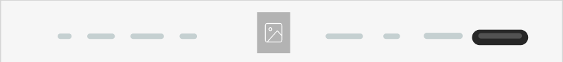
  

- **Hero section**

  

    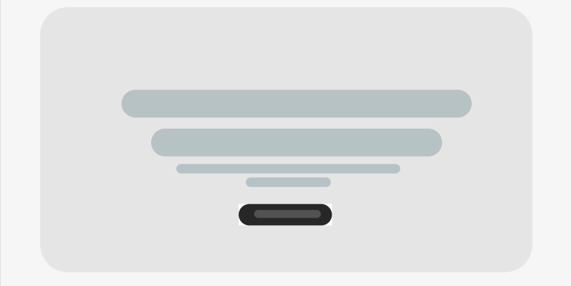
  

- **Problema section**

  

    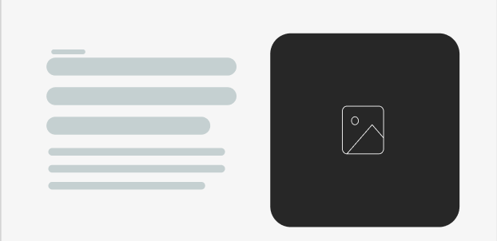
  

- **Cómo funciona section**

  

    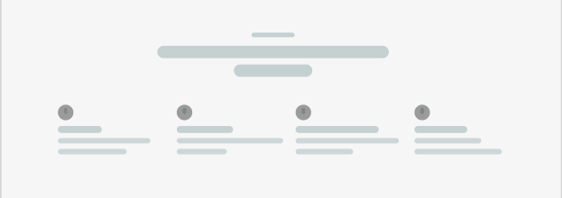
  

- **Perfil y Personalización section**

  

    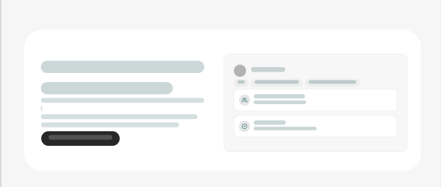
  

- **Modo SOS section**

  

    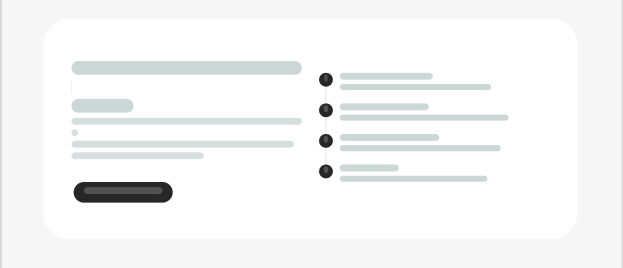
  

- **Autorregulación section**

  

    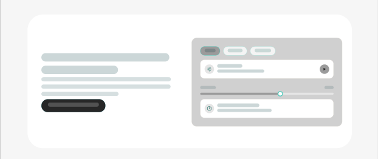
  

- **Comunicación CAA section**

  

    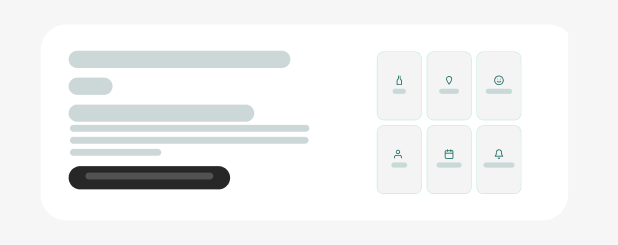
  

- **Red de Apoyo section**

  

    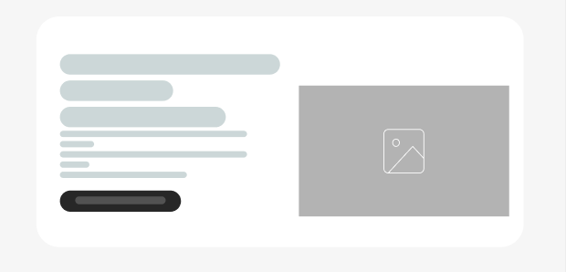
  

- **Planes section**

  

    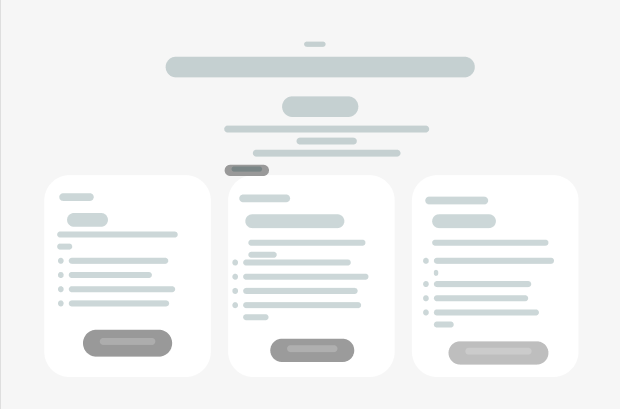
  

- **Testimonios section**

  

    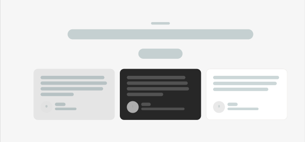
  

- **FAQ section**

  

    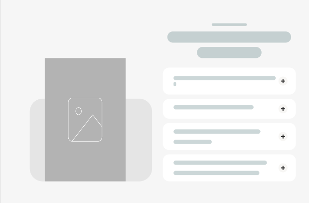
  

- **Beneficios section**

  

    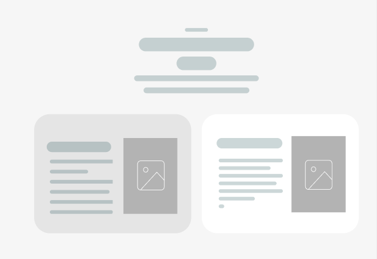
  

- **Conoce al equipo section**

  

    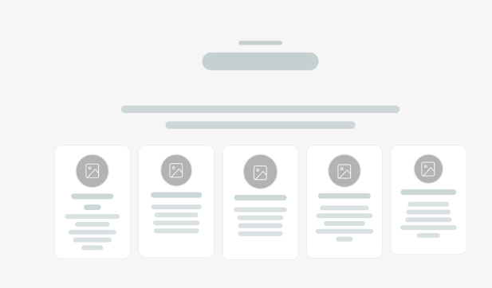
  

- **CTA final section**

  

    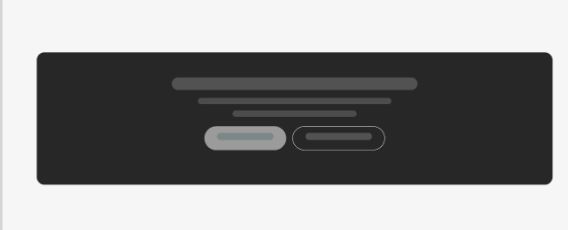
  

- **Formulario de Contacto section**

  

    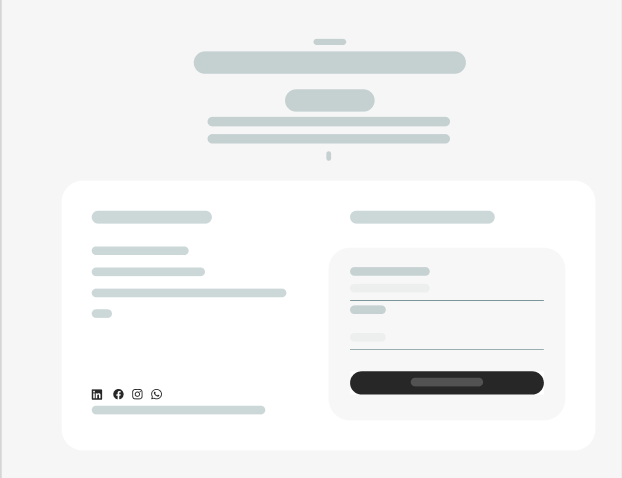
  

- **Footer section**

  

    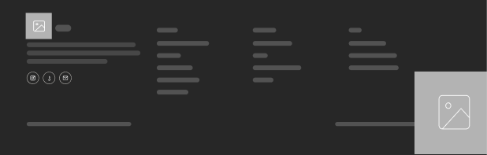
  

### 4.3.2 Landing Page Mock-up

Los mock-ups incorporan el Design System de la sección 4.1 sobre la estructura ya validada en los wireframes: tipografía Bricolage Grotesque en toda la interfaz, la paleta cromática (Deep Teal, Golden Yellow, Mint Teal, Blossom Pink y Cream como fondo base), botones con esquinas 100% redondeadas respetando un único botón primario por pantalla, y el grid de espaciado de 8pt tanto en el padding de las tarjetas como en la separación entre secciones. Sobre esta base se aplican además los criterios de diseño inclusivo definidos para Nubi: contraste mínimo AA (4.5:1) entre texto y fondo —el color principal Deep Teal es lo bastante oscuro para admitir texto blanco directo, mientras que el texto sobre Golden Yellow, Mint Teal o Blossom Pink usa Deep Teal en lugar de blanco— y estados de error o alerta comunicados siempre con ícono y texto, nunca solo con color. Cada bloque de valor (LS-01 a LS-05) reutiliza el mismo componente de tarjeta e iconografía de 24px definidos en la sección 4.1.2 (Iconografía), de modo que el visitante reconozca visualmente el mismo lenguaje al pasar de una sección a otra. El formulario de contacto, ubicado antes del footer, reutiliza el componente de Inputs definido en 4.1.2 (Componentes clave — Formularios e Inputs): campos con estado *Focus* (borde Mint Teal) y estado *Error* que combina borde en Coral Red con un ícono y un mensaje orientador (nunca solo color), además de un estado de confirmación tras el envío que refuerza el patrón de retroalimentación empática del sistema.

- **Header (Navbar)**

  

    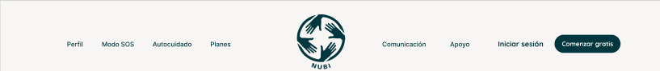
  

- **Hero section**

  

    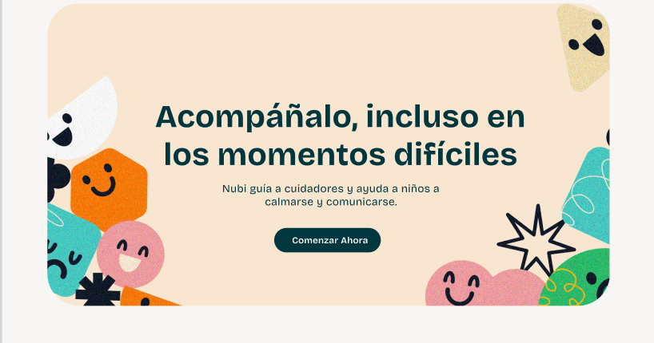
  

- **Problema section**

  

    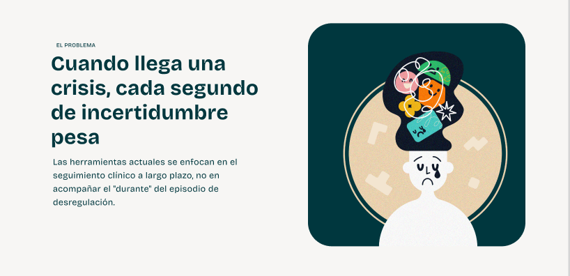
  

- **Cómo funciona section**

  

    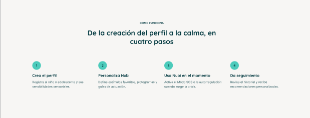
  

- **Perfil y Personalización section**

  

    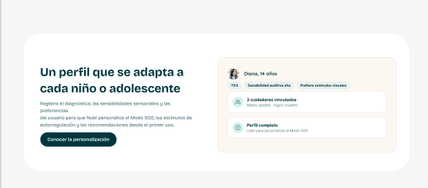
  

- **Modo SOS section**

  

    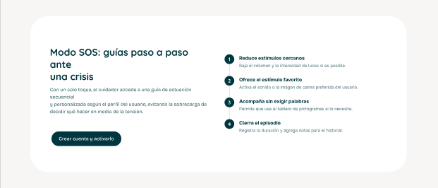
  

- **Autorregulación section**

  

    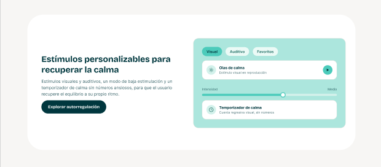
  

- **Comunicación CAA section**

  

    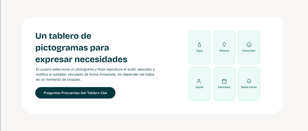
  

- **Red de Apoyo section**

  

    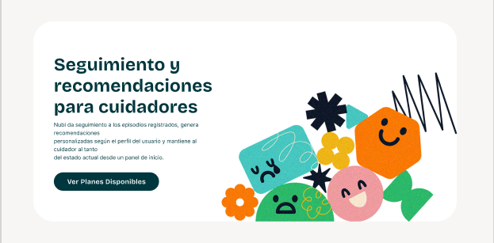
  

- **Planes section**

  

    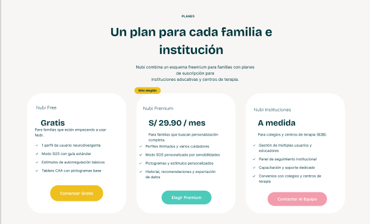
  

- **Testimonios section**

  

    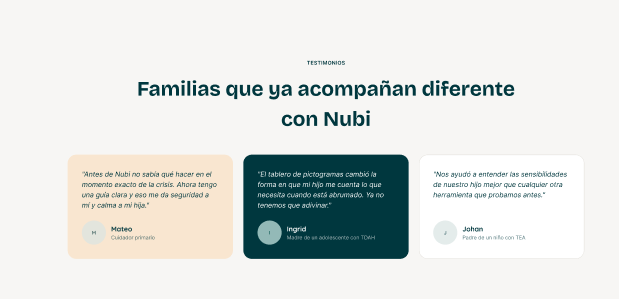
  

- **FAQ section**

  

    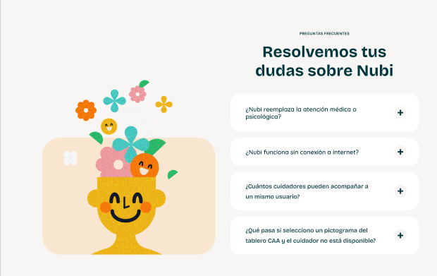
  

- **Beneficios section**

  

    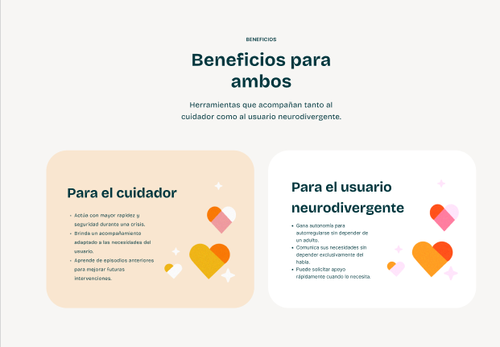
  

- **Conoce al equipo section**

  

    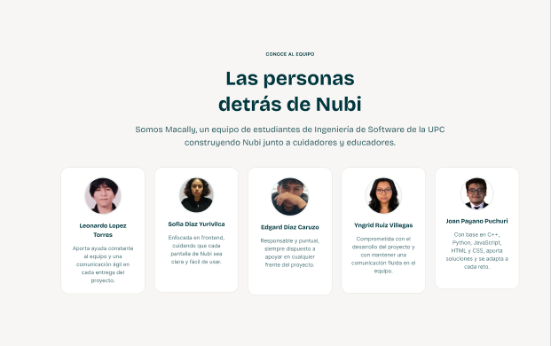
  

- **CTA final section**

  

    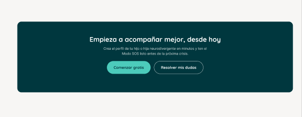
  

- **Formulario de Contacto section**

  

    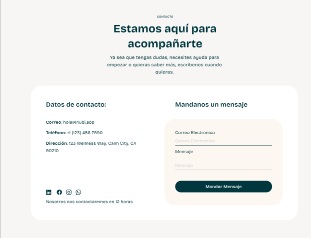
  

- **Footer section**

  

    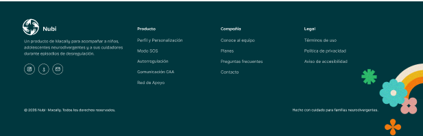
  

## 4.4 Web Applications UX/UI Design

Esta sección presenta la propuesta visual y de interacción de la Web Application de Nubi, que responde a las necesidades identificadas en las entrevistas con los dos segmentos objetivo: cuidadores y usuarios neurodivergentes. El diseño se desarrolló en dos fases: primero los wireframes, en escala de grises y enfocados en la estructura y la jerarquía de la información; luego los mock-ups, donde se aplica el Design System definido en la sección 4.1. Las pantallas recorren los cinco Bounded Contexts: Perfil y Personalización, Gestión de Crisis (Modo SOS), Autorregulación, Comunicación Asistida (CAA) y Red de Apoyo y Seguimiento. Cuando una pantalla tiene dos variantes visuales, se presentan ambas.

### 4.4.1 Web Applications Wireframes

Los wireframes de la Web Application se elaboraron en escala de grises, sin color de marca ni imágenes definitivas, para validar la estructura, el orden de lectura y la ubicación de las acciones antes del acabado visual. Aplican los principios de la sección 4.2: una barra lateral persistente con los módulos principales y acceso permanente al Modo SOS, migas de pan en las vistas de mayor profundidad, organización jerárquica en los paneles, secuencial en la guía del Modo SOS y matricial en los tableros de pictogramas y estímulos. Como criterios de diseño inclusivo, los estados se comunican con ícono y texto (no solo con color) y las pantallas de crisis y de comunicación eliminan la barra lateral para reducir la sobrecarga sensorial. Se incluyen las anotaciones de interacción (por ejemplo «on click: navega a la pantalla…») que sirven de base para los Wireflow Diagrams de la sección 4.4.2.

#### Wireframes: Landing Page 

  

*Ilustración del Wireframe: Landing Page (vista completa)*

Vista integral de la Landing Page, con todas las secciones en una sola imagen. El detalle de cada sección, en versión Desktop y Mobile, se presenta en la sección 4.3.1.

#### Wireframes: Modo SOS: pantalla de activación

  

*Ilustración del Web Application Wireframe: Modo SOS: pantalla de activación*

La pantalla adopta la estructura de tres zonas de la sección 4.1.2: barra lateral persistente con los módulos principales y el acceso «Modo SOS» anclado al pie, migas de pan en la parte superior y un área central de contenido. La mayor jerarquía visual la recibe el botón circular «Activar SOS», acompañado de un mensaje tranquilizador y del aviso de que, ante una emergencia médica, se debe llamar al servicio de emergencias local. Debajo se ubica el selector «¿Para quién es esta guía?», con las tarjetas de Diana Ríos y Mateo Vera y la selección activa indicada con un check, y tres tarjetas numeradas que explican la guía paso a paso, su adaptación al perfil y el registro automático del episodio. La anotación del wireframe especifica que al tocar el círculo se navega a la guía SOS llevando el perfil seleccionado y la hora de inicio del episodio.

#### Wireframes: Configurar tablero CAA: variante con imágenes

  

*Ilustración del Web Application Wireframe: Configurar tablero CAA: variante con imágenes*

Esta vista permite al cuidador organizar los pictogramas que usará Diana. Se compone de un encabezado con el botón «Agregar pictograma personalizado», filtros por categoría (Todos, Necesidades básicas, Emociones, Actividades) y una cuadrícula de tarjetas de 3 × 2 en organización matricial. Cada tarjeta reserva un espacio para la imagen, muestra la etiqueta y la frase en primera persona («Tengo sed»), incluye un asa de arrastre para reordenar y una estrella para marcar favoritos. En la parte inferior, un formulario agrupa la carga de imagen (96 × 96 px recomendado), la etiqueta, la categoría, la opción de agregar a favoritos y el botón «Guardar pictograma».

#### Wireframes: Configurar tablero CAA: variante con íconos

  

*Ilustración – Web Application Wireframe: Configurar tablero CAA: variante con íconos*

Segunda alternativa de la misma pantalla, donde cada tarjeta muestra un ícono lineal con su nombre en mayúsculas y la frase completa como texto principal. Se conserva la estructura de filtros, cuadrícula y formulario de la variante anterior, pero el favorito pasa a representarse con un corazón, el formulario acepta imágenes PNG o JPG de hasta 5 MB y el favorito se activa con un interruptor que indica que el pictograma aparecerá en la pantalla principal. La barra lateral incorpora el nombre y el rol del cuidador en la parte inferior, junto al acceso «Modo SOS».

#### Wireframes: Crear nuevo perfil: datos básicos

  

*Ilustración del Web Application Wireframe: Crear nuevo perfil: datos básicos*

El registro de un perfil se divide en un flujo de tres pasos (Datos básicos, Diagnóstico, Sensibilidades) con un indicador de progreso en la parte superior, de modo que el cuidador complete la información de forma gradual. En este primer paso se presenta, a la izquierda, un área circular para cargar la foto (máximo 5 MB) y, a la derecha, dos tarjetas de formulario: «Datos básicos» (nombre, apellido, edad, género y apodo preferido) y «Diagnóstico y condición» (condición principal y notas del profesional). Los campos obligatorios se marcan con asterisco y el pie del formulario ofrece las acciones «Cancelar» y «Continuar».

#### Wireframes: Cuidadores asociados e invitación

  

*Ilustración del Web Application Wireframe: Cuidadores asociados e invitación*

La vista gestiona el círculo de confianza de Diana Ríos. En la parte superior se resumen los cuidadores activos y las invitaciones pendientes; debajo, una tabla lista a cada cuidador con su avatar, correo, rol (Principal, Cuidador, Terapeuta) y estado. Al invitar a una persona se abre un panel lateral deslizable con los campos de correo electrónico y rol, un mensaje que explica qué podrá ver el invitado una vez que acepte y las acciones «Enviar invitación» y «Cancelar». El listado permanece visible detrás del panel para que el cuidador no pierda el contexto.

#### Wireframes: Galería de estímulos de Autocuidado

  

*Ilustración del Web Application Wireframe: Galería de estímulos de Autocuidado*

La galería presenta los estímulos de autorregulación en una cuadrícula de 3 × 2. Un aviso contextual explica que, por la sensibilidad auditiva alta de Diana, se muestran primero las opciones visuales, y los filtros «Todos», «Visual» y «Auditivo», junto con el acceso a «Favoritos», permiten cambiar esa priorización. Cada tarjeta incluye una vista previa, el nombre del estímulo y una etiqueta de favorito; la primera se destaca como elemento seleccionado.

#### Wireframes: Modo SOS: paso 5 de 6, calma y respiración

  

*Ilustración – Web Application Wireframe: Modo SOS: paso 5 de 6, calma y respiración*

Durante la guía se elimina la barra lateral para reducir la carga cognitiva y se muestra un solo paso a la vez, siguiendo la organización secuencial definida en la sección 4.2.1. El encabezado reúne la acción «Salir», el título «Modo SOS» y un indicador «Paso 5 de 6» con barra de progreso. En el centro se ubican el título del paso, una instrucción breve, el círculo de respiración («Inhala… Exhala») y un aviso que recuerda mantener la voz baja por la sensibilidad auditiva de Diana. Un paginador de puntos y el botón «Siguiente» cierran la pantalla, y la anotación indica que al pulsarlo se navega al resumen del episodio.

#### Wireframes: Panel de inicio del cuidador: variante 1

  

*Ilustración – Web Application Wireframe: Panel de inicio del cuidador: variante 1*

El panel de inicio prioriza lo que el cuidador necesita saber de inmediato, en tres niveles de lectura. En el primero, una tarjeta destacada muestra la solicitud recibida («Diana necesita: “Tengo sed”»), su origen y hora, la acción solicitada y los botones «Confirmar recepción» y «Ver tablero completo». En el segundo, la tarjeta «Estado actual de Diana» indica que no se requiere activar el Modo SOS. En el tercero, dos tarjetas acompañan el seguimiento: «Actividad reciente», con una lista cronológica, y «Análisis de bienestar», con un gráfico de barras del nivel de interacción de la última hora. La navegación se reduce a Inicio, Historial, Tablero CAA y Configuración.

#### Wireframes: Panel de inicio del cuidador: variante 2

  

*Ilustración – Web Application Wireframe: Panel de inicio del cuidador: variante 2*

Alternativa con distribución en dos columnas. En la columna principal, la tarjeta de solicitud incorpora una línea contextual («Diana ha interactuado con la categoría “Necesidades básicas”») con enlace a «Ver historial», y debajo se muestra la confirmación «Asistencia en camino», con la hora en que el cuidador confirmó la recepción. En la columna lateral se ubican el indicador circular del estado actual de Diana y la tarjeta «Red de Apoyo rápida», con contacto directo al neurólogo (llamada) y al padre (mensaje). La barra lateral se amplía con Comunicación, Salud y Red de Apoyo, y el encabezado incorpora el acceso a notificaciones.

#### Wireframes: Perfil de usuario: pestaña Sensibilidades

  

*Ilustración del Web Application Wireframe: Perfil de usuario: pestaña sensibilidades*

La ficha del perfil se organiza con una cabecera que reúne el avatar, el nombre, la edad, la condición, el apodo preferido y tres chips de estado (estado actual, cantidad de cuidadores y perfil activo), junto con las acciones «Guardar cambios» y «Ver historial». Debajo, cuatro pestañas (Datos generales, Sensibilidades, Diagnóstico y Cuidadores) segmentan el contenido. En la columna principal se ubican las sensibilidades sensoriales, con controles deslizantes de cuatro niveles (auditiva, visual y táctil), y las preferencias personales con interruptores (modo de baja estimulación, priorizar visuales y confirmar audio). En la columna lateral se resumen el diagnóstico y los cuidadores asociados, con la acción «Vincular nuevo cuidador».

#### Wireframes: Estímulo en uso: burbujas flotantes

  

*Ilustración del Web Application Wireframe: Estímulo en uso: burbujas flotantes*

La pantalla asigna la mayor parte del espacio al área de visualización del estímulo, con una instrucción breve debajo («Sigue el ritmo del círculo mientras observas las burbujas subir»). Un panel de controles agrupa el control deslizante de intensidad (de «Suave» a «Intenso»), el interruptor del modo de baja estimulación y el botón «Usar temporizador de calma mientras tanto». La acción «Terminar sesión y volver a la galería» se ubica al final, y las migas de pan de cuatro niveles permiten regresar a la galería.

#### Wireframes: Resumen del episodio

  

*Ilustración del Web Application Wireframe: Resumen del episodio*

Pantalla de cierre del Modo SOS, centrada y sin barra lateral. Comienza con un ícono y un mensaje de confirmación, seguidos de cuatro métricas del episodio (duración, intensidad inicial, intensidad final y detonante). A continuación se solicita el estado actual de Diana mediante cuatro opciones que combinan ícono y texto (Calmada, Cansada, Sensible, Irritable), de modo que ningún estado dependa solo del color, y se lista el checklist de pasos completados, donde el paso omitido se distingue de los realizados. La acción «Finalizar y Guardar» se ubica en el encabezado y un aviso confirma que el episodio se guardó en el historial.

#### Wireframes: Tablero CAA del usuario: variante con imágenes

  

*Ilustración – Web Application Wireframe: Tablero CAA del usuario: variante con imágenes*

Vista destinada al usuario neurodivergente, sin barra lateral para reducir estímulos. El encabezado saluda a Diana con la pregunta «¿Qué necesitas decir?» y ofrece el acceso a «Favoritos»; debajo se ubican los filtros por categoría y una cuadrícula de tarjetas grandes, pensadas para una selección táctil precisa, con imagen, etiqueta y frase. Al seleccionar una tarjeta se muestra en la parte inferior una notificación que confirma que se avisó a María.

#### Wireframes: Tablero CAA del usuario: variante con íconos

  

*Ilustración – Web Application Wireframe: Tablero CAA del usuario: variante con íconos*

Segunda alternativa del tablero, con pictogramas de ícono de gran tamaño y la frase como texto principal. La categoría activa se resalta en los filtros, la tarjeta seleccionada muestra el estado «Reproduciendo audio…» y una notificación oscura, con la marca de tiempo y una acción para cerrarla, confirma el aviso enviado al cuidador. En la esquina inferior derecha se mantiene un botón flotante de SOS, de modo que el usuario pueda pedir ayuda sin salir del tablero.

#### Wireframes: Temporizador de calma

  

*Ilustración – Web Application Wireframe: Temporizador de calma*

Pantalla de foco único: un encabezado con el título, el estímulo con el que se continúa y la acción «Salir del temporizador», y en el centro un contador circular (03:47 restantes de 5:00). Debajo se ofrecen tres duraciones rápidas (3, 5 y 10 min) y el botón «Pausar». Un texto de apoyo anticipa que, al terminar, se preguntará cómo se siente Diana, lo que conecta esta vista con el registro del estado en el resumen del episodio.

### 4.4.2 Web Applications Wireflow Diagrams

### 4.4.3 Web Applications Mock-ups

Los mock-ups aplican el Design System de la sección 4.1 sobre la estructura validada en los wireframes: la paleta cromática de Nubi, la tipografía Bricolage Grotesque en toda la interfaz, el ritmo de espaciado de 8 pt, botones de esquinas redondeadas y la iconografía lineal. Los estados se comunican siempre con ícono y texto, con un contraste mínimo de 4.5:1. Para cada pantalla se muestra la versión final y, cuando existen, sus variantes.

#### Mock-up: Landing Page 

  

*Ilustración – Mock-up: Landing Page (vista completa)*

Vista integral del Landing Page con el Design System aplicado. El detalle de cada sección, en versión Desktop y Mobile, se presenta en la sección 4.3.2.

#### Mock-up: Modo SOS: pantalla de activación

  

*Ilustración – Web Application Mock-up: Modo SOS: pantalla de activación*

Modo SOS — pantalla de activación: botón circular «Activar SOS» en Coral Red sobre un fondo degradado cálido, selector de perfil («¿Para quién es esta guía?») con las tarjetas de Diana Ríos y Mateo Vera, y tres tarjetas informativas que explican la guía paso a paso, la personalización según sensibilidades y el registro automático del episodio.

#### Mock-up: Configurar tablero CAA: variante con imágenes

  

*Ilustración – Web Application Mock-up: Configurar tablero CAA: variante con imágenes*

Configurar tablero CAA (variante con fotografías): cuadrícula de pictogramas de Necesidades básicas (Agua, Comida, Baño, Descanso, Dolor, Ayuda) usando imágenes fotográficas reales, cada uno marcable como favorito, junto al formulario inferior para agregar un pictograma personalizado con etiqueta y categoría.

#### Mock-up: Configurar tablero CAA: variante con íconos

  

*Ilustración – Web Application Mock-up: Configurar tablero CAA: variante con íconos*

Configurar tablero CAA (variante iconográfica): la misma cuadrícula de Necesidades básicas reinterpretada con iconografía lineal simple sobre fondo celeste sólido en lugar de fotografías, manteniendo las mismas categorías, favoritos y el formulario de carga de pictogramas personalizados.

#### Mock-up: Crear nuevo perfil: datos básicos

  

*Ilustración – Web Application Mock-up: Crear nuevo perfil: datos básicos*

Crear nuevo perfil — paso 1 «Datos básicos»: formulario con carga de foto, campos de nombre, apellido, edad, género y apodo preferido, seguido de la sección «Diagnóstico y condición» (condición principal y notas del profesional), dentro de un flujo de tres pasos (Datos básicos, Diagnóstico, Sensibilidades).

#### Mock-up: Cuidadores asociados e invitación

  

*Ilustración – Web Application Mock-up: Cuidadores asociados e invitación*

Cuidadores asociados: listado del círculo de confianza de Diana Ríos (María Ríos como Principal, Javier Ríos como Cuidador, Lucía Peña como Terapeuta y Ana Ríos con invitación pendiente) junto a un panel lateral «Invitar cuidador» con campos de correo electrónico y asignación de rol.

#### Mock-up: Galería de estímulos de Autocuidado

  

*Ilustración – Web Application Mock-up: Galería de estímulos de Autocuidado*

Galería de estímulos (Autocuidado): selector de estímulos Visual/Auditivo con aviso contextual que prioriza opciones visuales por la sensibilidad auditiva alta de Diana, mostrando tarjetas como Burbujas flotantes, Olas de color, Cielo estrellado, Lluvia suave, Sonido del mar y Piano relajante, cada una marcable como favorito.

#### Mock-up: Modo SOS: paso 5 de 6, calma y respiración

  

*Ilustración – Web Application Mock-up: Modo SOS: paso 5 de 6, calma y respiración*

Modo SOS — Paso 5 de 6 «Calma y Respiración»: círculo animado con el texto «Inhala... Exhala» para sincronizar la respiración del cuidador con la de Diana, acompañado de un aviso que recuerda mantener la voz baja por su sensibilidad auditiva alta y un indicador de progreso de pasos.

#### Mock-up: Panel de inicio del cuidador: variante 1

  

*Ilustración – Web Application Mock-up: Panel de inicio del cuidador: variante 1*

Panel de inicio del cuidador (variante violeta): saludo «Hola, María» con una notificación destacada de que Diana solicitó «Tengo sed» desde el Tablero de Comunicación, acciones para confirmar la recepción o ver el tablero completo, el estado actual («Calma»), actividad reciente y un gráfico de nivel de interacción.

#### Mock-up: Panel de inicio del cuidador: variante 2

  

*Ilustración – Web Application Mock-up: Panel de inicio del cuidador: variante 2*

Panel de inicio del cuidador (variante azul con navegación lateral ampliada): la misma notificación de «Diana necesita: Tengo sed» con accesos a Comunicación, Salud y Red de Apoyo, un indicador circular de estado «Calma», historial de asistencia confirmada y una tarjeta de «Red de Apoyo rápida» con contacto directo al neurólogo y al padre.

#### Mock-up: Perfil de usuario: pestaña Sensibilidades

  

*Ilustración – Web Application Mock-up: Perfil de usuario: pestaña Sensibilidades*

Perfil de usuario — pestaña «Sensibilidades»: ficha de Diana Ríos (15 años, TEA nivel 1) con controles deslizantes de sensibilidad Auditiva (Alta), Visual (Media) y Táctil (Baja), preferencias personales (modo de baja estimulación, priorizar visuales), datos de diagnóstico y la lista de cuidadores asociados.

#### Mock-up: Estímulo en uso: burbujas flotantes

  

*Ilustración – Web Application Mock-up: Estímulo en uso: burbujas flotantes*

Estímulo «Burbujas flotantes» en uso: animación de burbujas sobre fondo violeta con un círculo central «RESPIRA», control deslizante de intensidad (Suave–Intenso), interruptor de modo de baja estimulación y accesos para usar el temporizador de calma o terminar la sesión y volver a la galería.

#### Mock-up: Resumen del episodio

  

*Ilustración – Web Application Mock-up: Resumen del episodio*

Resumen del episodio (cierre del Modo SOS): mensaje de confirmación «¡Buen trabajo! El episodio ha pasado» con métricas del episodio (duración de 12 min, intensidad inicial Alta, final Baja, detonante Auditivo), selección del estado actual de Diana (Calmada) y el checklist de pasos completados (aislamiento sensorial, validación emocional, respiración guiada, uso de mordedor omitido).

#### Mock-up: Tablero CAA del usuario: variante con imágenes

  

*Ilustración – Web Application Mock-up: Tablero CAA del usuario: variante con imágenes*

Tablero CAA — vista del usuario neurodivergente (variante con fotografías): pantalla «Hola, Diana ¿Qué necesitas decir?» con la tarjeta «Agua / Tengo sed» seleccionada y reproduciendo audio, categorías filtrables (Necesidades básicas, Emociones, Actividades, Favoritos) y una notificación inferior confirmando el aviso enviado a María.

#### Mock-up: Tablero CAA del usuario: variante con íconos

  

*Ilustración – Web Application Mock-up: Tablero CAA del usuario: variante con íconos*

Tablero CAA — vista del usuario neurodivergente (variante iconográfica en azul): misma interacción «Tengo sed» con pictogramas representados en iconos lineales simples, botón flotante de SOS en la esquina y un toast de confirmación indicando que se avisó a María.

#### Mock-up: Temporizador de calma

  

*Ilustración – Web Application Mock-up: Temporizador de calma*

Temporizador de calma: cuenta regresiva circular (03:47 restantes de un total de 5:00) tras continuar con el estímulo «Burbujas flotantes», con opciones rápidas de duración (3, 5 o 10 min), botón de pausa y aviso de que al finalizar se preguntará cómo se siente Diana.

### 4.4.4 Web Applications User Flow Diagrams

## 4.5. Web Applications Prototyping.

|                                                                                                                                                                                                                                                                                                                                |
|--------------------------------------------------------------------------------------------------------------------------------------------------------------------------------------------------------------------------------------------------------------------------------------------------------------------------------|
| link: https://upcedupe-my.sharepoint.com/:v:/g/personal/u20241a649_upc_edu_pe/IQDSl4T7xAKFT52jN0itd5DMAQr-yskvbFkI0PyL_iQqJqM?e=6kqdJ6&nav=eyJyZWZlcnJhbEluZm8iOnsicmVmZXJyYWxBcHAiOiJTdHJlYW1XZWJBcHAiLCJyZWZlcnJhbFZpZXciOiJTaGFyZURpYWxvZy1MaW5rIiwicmVmZXJyYWxBcHBQbGF0Zm9ybSI6IldlYiIsInJlZmVycmFsTW9kZSI6InZpZXcifX0%3D  |

## 4.6. Domain-Driven Software Architecture

En esta sección se profundiza el modelo del dominio construido en el Big Picture Event Storming hasta identificar los Bounded Contexts, Aggregates, Commands, Events y Queries de NUBI. A partir de ese modelo se representa la arquitectura de la solución aplicando C4 Model. Los diagramas de esta sección se elaboraron como Diagram-as-Code en Mermaid.

### 4.6.1. Design-Level Event Storming

El equipo realizó una sesión de Design-Level Event Storming de aproximadamente dos horas, partiendo de los cinco tableros del Big Picture Event Storming. Sobre cada tablero se agregaron los **Commands** que originan cada evento, los **Aggregates** que los procesan, las **Policies** que se disparan automáticamente y los **Read Models** que el usuario consulta para decidir. Además, cada hotspot del Big Picture se discutió y se convirtió en una decisión de diseño o quedó registrado como pregunta abierta.

Como resultado se confirmaron **cinco Bounded Contexts**, que corresponden a las cinco áreas del Big Picture. Las funciones de cuenta, suscripción y soporte técnico, que no tenían un tablero propio, se ubicaron en Perfil y Personalización, ya que todas pertenecen a la cuenta del usuario.

| Bounded Context | Responsabilidad | Épicas |
| :--- | :--- | :--- |
| Perfil y Personalización | Cuenta, perfil del usuario, contactos de confianza, suscripción e institución | EP01, EP02, EP03, EP11, EP12, EP13, EP14 |
| Gestión de Crisis (Modo SOS) | Guía paso a paso para el cuidador durante una crisis | EP04, EP10 |
| Autorregulación | Recursos de calma para el usuario neurodivergente | EP05 |
| Comunicación Asistida (CAA) | Tablero de pictogramas y salida de voz | EP06 |
| Red de Apoyo y Seguimiento | Alertas a contactos de confianza e historial de episodios | EP07, EP08, EP09, EP17 |

En los diagramas se mantiene la convención de colores del Event Storming: **naranja** para los Domain Events, **azul** para los Commands, **amarillo** para los Aggregates, **rosado** para los Actors, **morado** para las Policies, **verde** para los Read Models y **gris** para los sistemas externos.

#### Perfil y Personalización

Gestiona la cuenta del cuidador, docente o institución, y los perfiles de los usuarios neurodivergentes a su cargo: diagnóstico, detonantes, necesidad comunicativa, estrategia de calma, pictogramas y contactos de confianza. También concentra la suscripción, los planes institucionales y los reportes de soporte técnico.

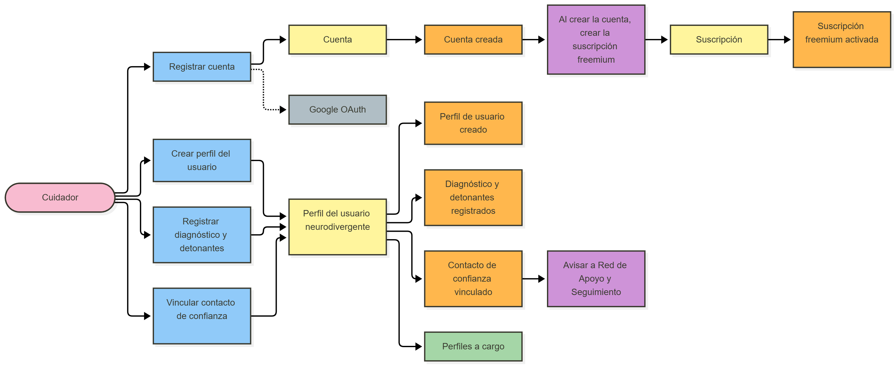

*Ilustración del Design-Level Event Storming: Perfil y Personalización*

**Hotspots resueltos:**

- *¿Lo configura el cuidador o el niño?* 
- El cuidador crea el perfil y registra el diagnóstico, los detonantes y los contactos de confianza. El usuario neurodivergente solo elige sus recursos y pictogramas favoritos.
- *¿Qué pasa si hay dos cuidadores del mismo niño?* 
- Un perfil admite varios cuidadores asociados, cada uno con su propia cuenta (US18).
- *¿Se valida el diagnóstico o se declara?* 
- Se declara. NUBI no valida ni emite diagnósticos, en línea con la restricción definida en la sección 1.2.

#### Gestión de Crisis (Modo SOS)

Conduce al cuidador durante una crisis con una guía de actuación adaptada al perfil del usuario, mostrando un paso de contención a la vez y sugiriendo una técnica alternativa cuando un paso no funciona. Al activarse avisa a Autorregulación y a Red de Apoyo y Seguimiento; al finalizar, solicita el registro del episodio.

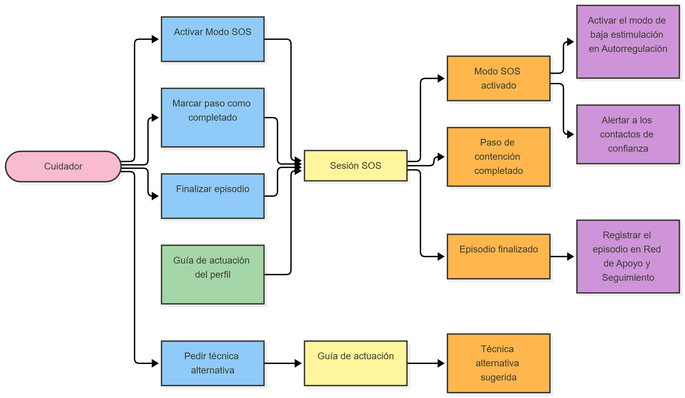

*Ilustración del Design-Level Event Storming: Gestión de Crisis (Modo SOS)*

**Hotspots resueltos:**

- *¿Quién declara que la crisis terminó?* 
- El cuidador, con el comando *Finalizar episodio* (US23).
- *¿Y si el cuidador abandona la guía a mitad?* 
- La sesión SOS se conserva en el último paso completado y puede retomarse. El episodio solo se registra al finalizar.
- *¿Funciona con el celular bloqueado?* 
- Una aplicación web no puede ejecutarse sobre la pantalla de bloqueo. Se resuelve con un acceso directo al Modo SOS desde la pantalla principal (US24) y con la guía disponible sin conexión (US90).

#### Autorregulación

Ofrece al usuario neurodivergente recursos de calma (respiración guiada, sonidos relajantes y lienzo de dibujo libre) filtrados según su perfil sensorial, y activa el modo de baja estimulación. Permite marcar recursos como favoritos y usar un temporizador de calma.

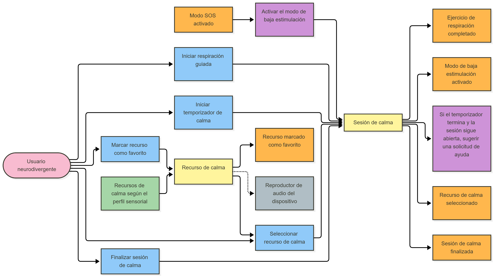

*Ilustración del Design-Level Event Storming: Autorregulación*

**Hotspots resueltos:**

- *¿Cuánto dura una sesión antes de sugerir pedir ayuda?* 
- Lo define el temporizador de calma configurado por el cuidador (US30). Si el tiempo termina y la sesión sigue abierta, se sugiere enviar una solicitud de ayuda.
- *¿Y si el usuario no tolera tocar la pantalla?* 
- Se priorizan recursos que no exigen interacción continua, como el audio y la respiración guiada con temporizador. Queda como pregunta abierta para validar con usuarios.

#### Comunicación Asistida (CAA)

Permite al usuario expresar necesidades con pictogramas, reportar su estado de ánimo y reproducir la frase en voz alta para el acompañante, quien confirma que la entendió. Los pictogramas más usados se agregan al acceso rápido.

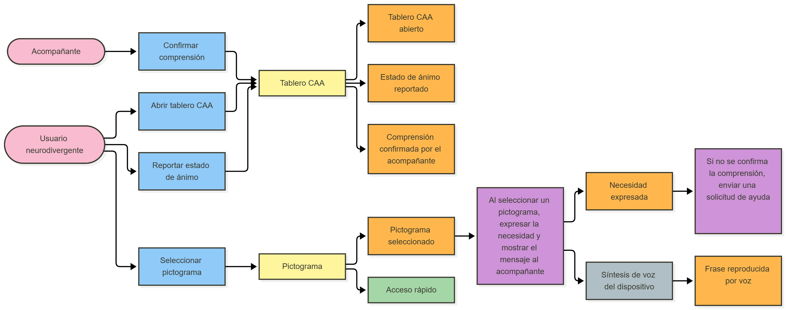

*Ilustración Design-Level Event Storming: Comunicación Asistida (CAA)*

**Hotspots resueltos:**

- *¿Qué pasa si no hay nadie cerca para leer el mensaje?* 
- Si el acompañante no confirma la comprensión, se envía una solicitud de ayuda a Red de Apoyo y Seguimiento.
- *¿Cuántos pictogramas caben sin saturar la pantalla?* 
- El acceso rápido muestra solo los más usados y el resto se organiza por categorías (US35). El número exacto se define en el prototipo.
- *¿Y si el usuario no tolera tocar la pantalla?* 
- El acompañante puede operar el tablero por el usuario. Queda como pregunta abierta.

#### Red de Apoyo y Seguimiento

Envía las alertas a los contactos de confianza y registra la llegada del contacto. También registra cada episodio al finalizar el Modo SOS, permite marcar estrategias efectivas y genera el resumen que el cuidador puede compartir con el profesional de salud.

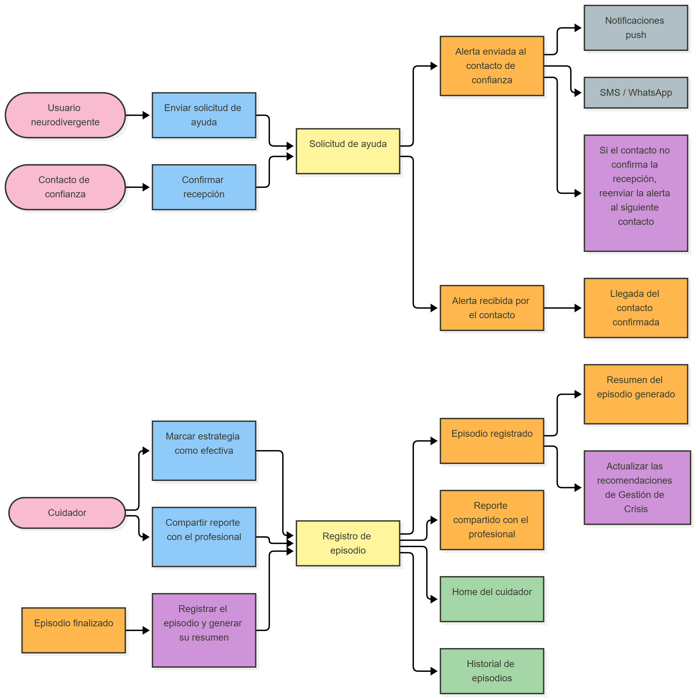

*Ilustración del Design-Level Event Storming: Red de Apoyo y Seguimiento*

**Hotspots resueltos:**

- *¿Qué pasa si el contacto no responde?* 
- Si no confirma la recepción, la alerta se reenvía al siguiente contacto de confianza.
- *Sin internet, ¿cómo se avisa?* 
- Sin datos móviles, la aplicación abre el SMS del teléfono con el mensaje de alerta ya escrito, que se envía con la señal celular.
- *¿Se envía ubicación?* 
- Ninguna historia de usuario lo contempla. Queda como pregunta abierta para una siguiente versión.

#### Integración entre Bounded Contexts

Los contextos se comunican mediante eventos de dominio y consultas al perfil del usuario.

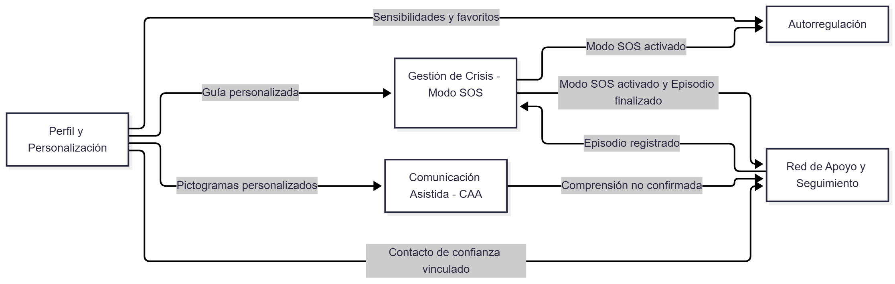

*Ilustración de Integración entre los Bounded Contexts de NUBI*

- **Perfil y Personalización** entrega a los demás contextos la información del perfil: la guía personalizada, las sensibilidades y los pictogramas.
- **Modo SOS activado** dispara el modo de baja estimulación en Autorregulación y la alerta a los contactos en Red de Apoyo y Seguimiento.
- **Episodio finalizado** hace que Red de apoyo y seguimiento registre el episodio, y ese registro actualiza las recomendaciones de Gestión de Crisis.
- **Comprensión no confirmada** en Comunicación Asistida genera una solicitud de ayuda.

---

### 4.6.2. Software Architecture Context Diagram

El diagrama de contexto muestra a NUBI como un solo sistema, rodeado de las personas que lo usan y de los sistemas externos con los que se comunica.

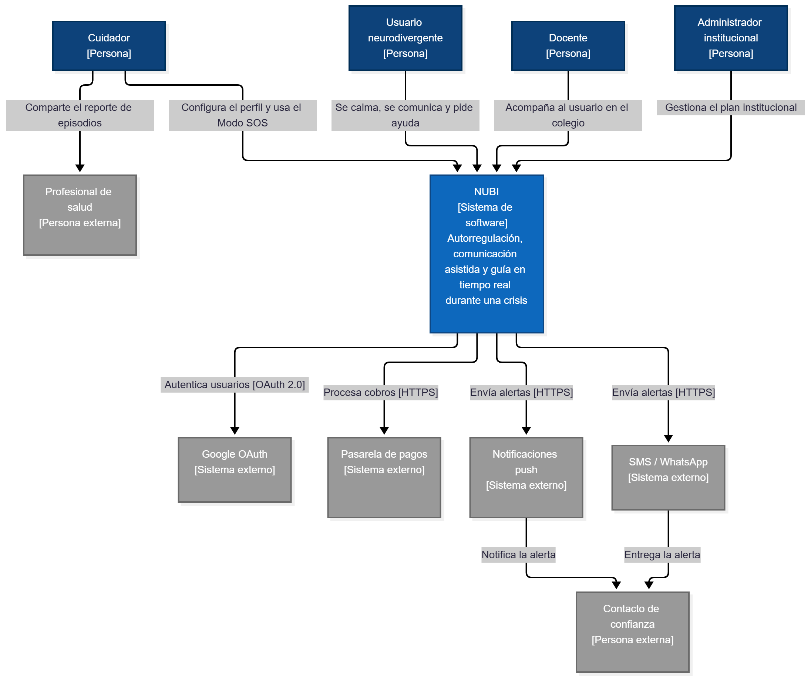

*Ilustración — Software Architecture Context Diagram de NUBI*

El **usuario neurodivergente** usa NUBI para calmarse, comunicarse con pictogramas y pedir ayuda. El **cuidador** y el **docente** configuran el perfil y usan el Modo SOS durante una crisis, y el **administrador institucional** gestiona los perfiles de estudiantes del plan institucional. El **contacto de confianza** y el **profesional de salud** no usan la aplicación directamente: el primero recibe las alertas y el segundo recibe los reportes de episodios que comparte el cuidador.

NUBI se apoya en cuatro sistemas externos: **Google OAuth** para el inicio de sesión (US04), una **pasarela de pagos** para el cobro de suscripciones (US61), un **servicio de notificaciones push** para alertas y recordatorios, y **SMS / WhatsApp** como canal de alerta. Estos dos últimos se identificaron en el Big Picture Event Storming.

### 4.6.3. Software Architecture Container Diagrams

El diagrama de contenedores muestra las piezas que se despliegan por separado, la tecnología de cada una y cómo se comunican.

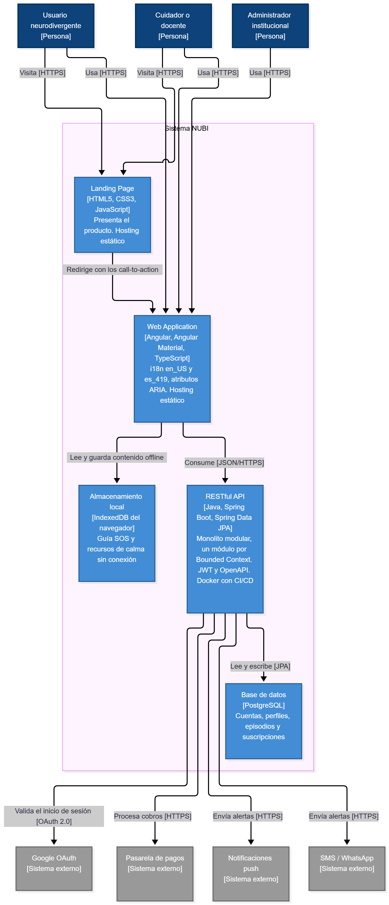

*Ilustración — Software Architecture Container Diagram de NUBI*

NUBI se compone de cinco contenedores. La **Landing Page** (HTML5, CSS3 y JavaScript) presenta el producto y redirige a la Web Application mediante sus call-to-action. La **Web Application** (Angular y Angular Material) concentra la experiencia del usuario neurodivergente y del cuidador, con i18n en en_US y es_419 y atributos ARIA. El **almacenamiento local** del navegador guarda la guía SOS y los recursos de calma para el modo offline básico (US90), un requisito que surgió en las entrevistas. El **RESTful API** (Java, Spring Boot y Spring Data JPA) contiene la lógica de negocio, usa JWT para la autenticación y se documenta con OpenAPI. La **base de datos** es PostgreSQL, administrada con pgAdmin.

El API se diseñó como un **monolito modular**: cada Bounded Context es un módulo con sus propias entidades y repositorios JPA (US98), pero todos se despliegan juntos en un solo contenedor Docker (US99). Así se mantiene la separación que exige Domain-Driven Design sin la complejidad de desplegar cinco servicios por separado. La Landing Page y la Web Application se publican en hosting estático (US100).

### 4.6.4. Software Architecture Components Diagrams

Se presentan los diagramas de componentes de los dos contenedores con lógica propia: el RESTful API y la Web Application. La Landing Page es un sitio estático y la base de datos es un almacén de datos, por lo que no se descomponen.

#### RESTful API

*Ilustración — Component Diagram del RESTful API*

Cada componente corresponde a uno de los cinco Bounded Contexts del Design-Level Event Storming. Todas las peticiones pasan primero por **Seguridad**, que valida el token JWT. **Perfil y Personalización** es el componente que consultan los demás para obtener la guía personalizada, las sensibilidades y los pictogramas del usuario, y es el que se comunica con Google OAuth y con la pasarela de pagos.

**Gestión de Crisis** publica el evento *Modo SOS activado*, que activa el modo de baja estimulación en **Autorregulación** y la alerta en **Red de Apoyo y Seguimiento**. Este último envía las alertas por notificaciones push o SMS / WhatsApp y registra cada episodio, lo que actualiza las recomendaciones de Gestión de Crisis. **Comunicación Asistida** genera una solicitud de ayuda cuando el acompañante no confirma haber entendido el mensaje.

#### Web Application

*Ilustración — Component Diagram de la Web Application*

La Web Application tiene un módulo por Bounded Context, de modo que el frontend refleja la estructura del backend. **Navegación** implementa la barra superior y las migas de pan de las Web Style Guidelines (4.1.2) y muestra el espacio del usuario neurodivergente o del cuidador según su rol. **Modo offline** mantiene la guía SOS y los recursos de calma disponibles sin conexión, y **Cliente HTTP** centraliza las llamadas al API agregando el token JWT. Los módulos de Comunicación Asistida y Autorregulación usan la síntesis de voz y el reproductor de audio del dispositivo, identificados en el Big Picture Event Storming.

## 4.7. Software Object-Oriented Design.

### 4.7.1. Class Diagrams.

#### Perfil y Personalización: perfil del usuario y cuidadores

Este diagrama cubre la gestión del perfil del usuario neurodivergente: sus datos básicos, el perfil sensorial, el diagnóstico declarado, los cuidadores asociados y los contactos de confianza.

  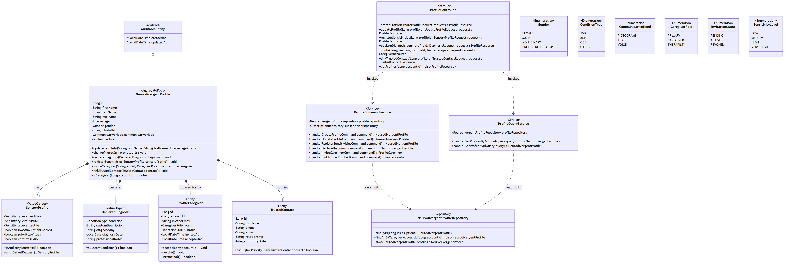

*Ilustración — Class Diagram: Perfil del usuario y cuidadores*

`NeurodivergentProfile` es el Aggregate Root y controla su consistencia: solo él crea el `SensoryProfile`, el `DeclaredDiagnosis`, los `ProfileCaregiver` y los `TrustedContact`. `SensoryProfile` y `DeclaredDiagnosis` son objetos de valor, por lo que se reemplazan completos cuando el cuidador los modifica. Todo perfil tiene al menos un cuidador (`1..*`), que es el cuidador principal que lo creó. La invitación de un cuidador (`ProfileCaregiver`) nace en estado `PENDING` con solo el correo del invitado y pasa a `ACTIVE` cuando este acepta y se le asigna su `accountId`. Antes de invitar, `ProfileCommandService` consulta el plan de la cuenta mediante `SubscriptionRepository` para respetar el límite de cuidadores. El diagnóstico se declara y no se valida, en línea con la restricción definida en la sección 1.2, y la condición `OTHER` exige `customDescription`. `TrustedContact.priorityOrder` define el orden en que se reenvía una alerta cuando un contacto no confirma su recepción.

#### Perfil y Personalización: cuenta, suscripción e institución

Este diagrama cubre el acceso a NUBI: la cuenta del cuidador, docente o administrador institucional, su suscripción y pagos, la institución y los reportes de soporte técnico.

  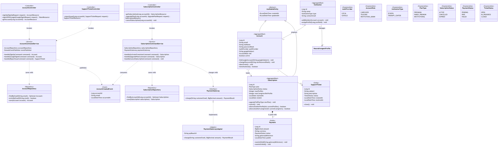

*Ilustración — Class Diagram: Cuenta, suscripción e institución*

`Account` representa el acceso de un cuidador, docente o administrador institucional. Puede autenticarse con contraseña o con Google (`AuthProvider`); en el segundo caso `passwordHash` queda vacío y se guarda el identificador `googleSubject`. Al registrarse una cuenta, `AccountCommandService` publica `AccountCreatedEvent` y `SubscriptionCommandService` lo consume para activar la suscripción `FREEMIUM`, que es la política definida en el Design-Level Event Storming. `Subscription` conoce los límites del plan (`maxProfiles`, `maxCaregiversPerProfile`) y responde si se puede agregar otro perfil o cuidador. Los cobros se realizan a través del puerto `PaymentGateway`, implementado por `PaymentGatewayAdapter` contra la pasarela de pagos externa, y cada intento queda registrado como `Payment`. `Institution` agrupa las cuentas de docentes y administradores y gestiona los perfiles de sus estudiantes; `NeurodivergentProfile` se muestra sin miembros porque se detalla en el diagrama anterior.

#### Gestión de Crisis: Modo SOS y guías de actuación

Este diagrama cubre la sesión SOS que guía al cuidador paso a paso durante una crisis y la guía de actuación que la sustenta.

  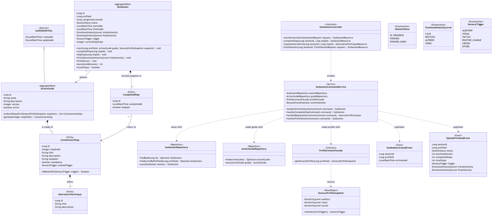

*Ilustración — Class Diagram: Modo SOS y guías de actuación*

`SosSession` es el Aggregate Root de la sesión guiada. Se crea en estado `IN_PROGRESS` con la guía vigente; para personalizarla consulta el perfil sensorial mediante `ProfileContextFacade` (Anti-Corruption Layer), y `ActionGuide.orderedStepsFor` prioriza los pasos relacionados con la sensibilidad más alta del usuario. Cada paso completado u omitido se registra como `CompletedStep`, y un paso obligatorio (`mandatory`) exige confirmación explícita antes de omitirse. Si el cuidador finaliza antes del último paso, la sesión pasa a `FINISHED_EARLY`; en ambos casos se publica `EpisodeFinishedEvent`, que Red de Apoyo y Seguimiento consume para registrar el episodio. Al activarse, la sesión publica `SosModeActivatedEvent`, que dispara el modo de baja estimulación en Autorregulación y la alerta a los contactos de confianza. La clase `ContainmentStep` ofrece `AlternativeTechnique` cuando un paso no funciona.

#### Gestión de Crisis: recomendaciones

Este diagrama cubre las recomendaciones personalizadas, que se generan según el perfil del usuario y se actualizan cada vez que se registra un nuevo episodio.

  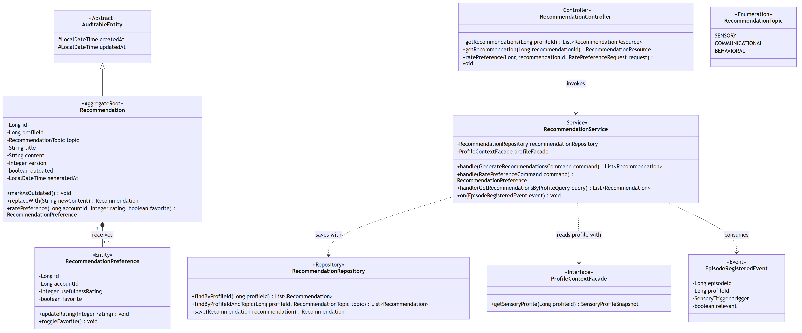

*Ilustración — Class Diagram: Recomendaciones*

`Recommendation` pertenece a un `profileId` y se clasifica por tópico (sensorial, comunicacional o conductual), los mismos filtros definidos en el Searching System de la sección 4.2.4. Cuando Red de Apoyo y Seguimiento registra un episodio publica `EpisodeRegisteredEvent`, y `RecommendationService` lo consume: si el episodio aporta información relevante (`relevant`), marca como desactualizadas las recomendaciones vigentes y genera una nueva versión con `replaceWith`; en caso contrario las mantiene sin cambios. Cada cuidador califica la utilidad de una recomendación o la guarda como favorita mediante `RecommendationPreference`, y volver a calificar la misma recomendación actualiza la calificación existente en lugar de crear una nueva.

#### Autorregulación

Este diagrama cubre las sesiones de calma del usuario neurodivergente, los recursos de calma disponibles, los favoritos y el temporizador.

  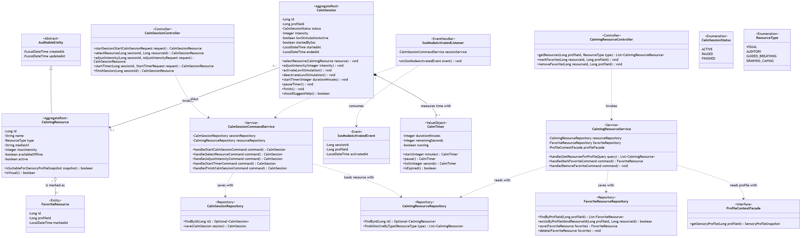

*Ilustración — Class Diagram: Autorregulación*

`CalmSession` es el Aggregate Root de una sesión de calma. Mantiene el recurso reproducido, la intensidad (que nunca supera `maxIntensity` del `CalmingResource`), el estado del modo de baja estimulación y un `CalmTimer` opcional que es un objeto de valor inmutable: cada operación devuelve un nuevo temporizador. Si el temporizador termina y la sesión sigue abierta, `shouldSuggestHelp` devuelve verdadero para que la aplicación sugiera enviar una solicitud de ayuda. `CalmingResourceService` filtra los recursos según el perfil sensorial obtenido mediante `ProfileContextFacade`: `isSuitableFor` excluye, por ejemplo, los estímulos auditivos cuando la sensibilidad auditiva del usuario es alta. La política definida en 4.6.1 se implementa en `SosModeActivatedListener`, que al recibir `SosModeActivatedEvent` abre una sesión con `startedBySos` verdadero y el modo de baja estimulación activado. Los favoritos son `FavoriteResource` asociados al `profileId`.

#### Comunicación Asistida (CAA)

Este diagrama cubre el tablero de pictogramas, las selecciones que el usuario realiza para comunicar una necesidad, la confirmación de comprensión del acompañante y el check-in emocional.

  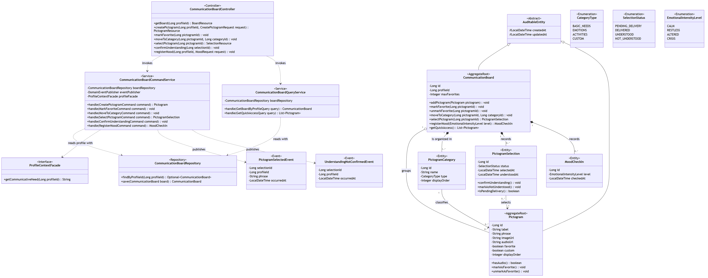

*Ilustración — Class Diagram: Comunicación Asistida (CAA)*

`CommunicationBoard` agrupa los pictogramas del usuario en categorías (`PictogramCategory`): necesidades básicas, emociones, actividades y las creadas por el cuidador. `Pictogram` es un Aggregate Root propio porque tiene existencia independiente del tablero, y la regla `maxFavorites` se valida en el tablero al marcar un favorito. Cuando el usuario selecciona un pictograma, `selectPictogram` crea una `PictogramSelection` en estado `PENDING_DELIVERY` y `CommunicationBoardCommandService` publica `PictogramSelectedEvent`, que Red de Apoyo y Seguimiento usa para avisar al cuidador. Si el acompañante no confirma la comprensión, la selección pasa a `NOT_UNDERSTOOD` y se publica `UnderstandingNotConfirmedEvent`, que genera una solicitud de ayuda. El check-in emocional (`MoodCheckIn`) usa la escala de cuatro niveles del Shared Kernel. Este evento y `PictogramSelectedEvent` refinan el flujo entre contextos de la sección 4.6.1: el primero se agrega para que el aviso "Diana necesita: Tengo sed" del panel del cuidador tenga un origen de dominio explícito.

#### Red de Apoyo y Seguimiento: solicitudes de ayuda

Este diagrama cubre las solicitudes de ayuda y la entrega de alertas a los contactos de confianza por notificación push, SMS o WhatsApp.

  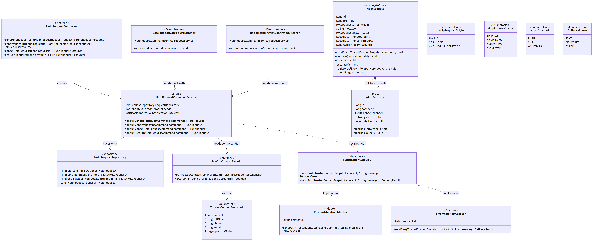

*Ilustración — Class Diagram: Solicitudes de ayuda*

`HelpRequest` puede originarse de tres maneras (`HelpRequestOrigin`): manualmente por el usuario, por la activación del Modo SOS o porque el acompañante no confirmó la comprensión de un pictograma. Los dos últimos casos llegan como eventos que atienden `SosModeActivatedAlertListener` y `UnderstandingNotConfirmedListener`. Al enviarse, la solicitud obtiene los contactos de confianza mediante `ProfileContextFacade` y registra una `AlertDelivery` por contacto y canal, usando el puerto `NotificationGateway`, que implementan `PushNotificationAdapter` y `SmsWhatsAppAdapter` contra los sistemas externos identificados en el diagrama de contexto. Si el contacto no confirma la recepción, `escalate` reenvía la alerta al siguiente contacto según `priorityOrder`, y una solicitud ya confirmada no puede cancelarse. Las solicitudes pendientes de mayor antigüedad se detectan con `findPendingOlderThan`.

#### Red de Apoyo y Seguimiento: episodios, reportes y panel del cuidador

Este diagrama cubre el registro automático de episodios al finalizar el Modo SOS, las notas y estrategias efectivas, los reportes para el profesional de salud y el panel de inicio del cuidador.

  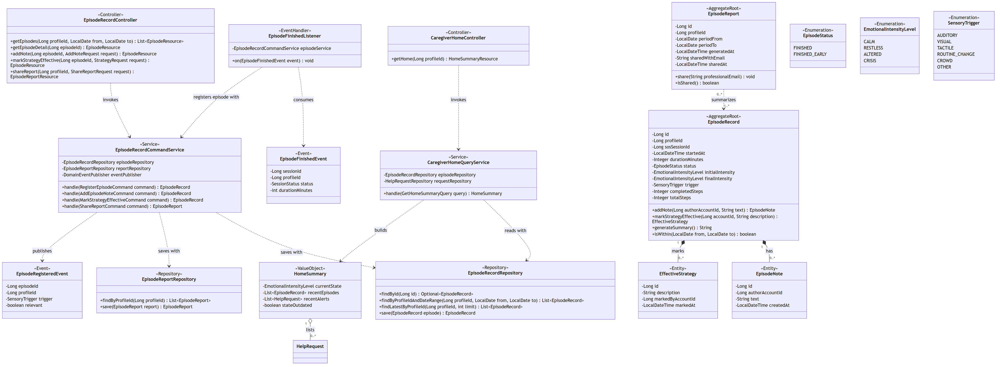

*Ilustración — Class Diagram: Episodios, reportes y panel del cuidador*

`EpisodeFinishedListener` implementa la política "registrar el episodio y generar su resumen": al recibir `EpisodeFinishedEvent` crea un `EpisodeRecord` con la fecha, la duración, la intensidad inicial y final, el detonante y los pasos completados, sin que el cuidador deba documentarlo manualmente. Un episodio que terminó antes de completar la guía queda como `FINISHED_EARLY`. Luego se publica `EpisodeRegisteredEvent`, que actualiza las recomendaciones de Gestión de Crisis. El cuidador puede agregar notas (`EpisodeNote`, que no pueden estar vacías) y marcar estrategias efectivas (`EffectiveStrategy`), y el historial se filtra por rango de fechas con `findByProfileIdAndDateRange`. `EpisodeReport` es el resumen de un periodo que el cuidador comparte con el profesional de salud; solo guarda el periodo y el correo del destinatario, y calcula su contenido a partir de los episodios del rango. `HomeSummary` es el *read model* del panel de inicio: reúne el estado actual, los episodios recientes y las alertas, e indica si el estado no se actualizó en el periodo esperado.

#### Colaboración entre Bounded Contexts

Este diagrama muestra cómo se implementan en código las dos formas de integración entre contextos: las consultas síncronas al perfil mediante `ProfileContextFacade` y los eventos de dominio mediante `DomainEventPublisher`.

  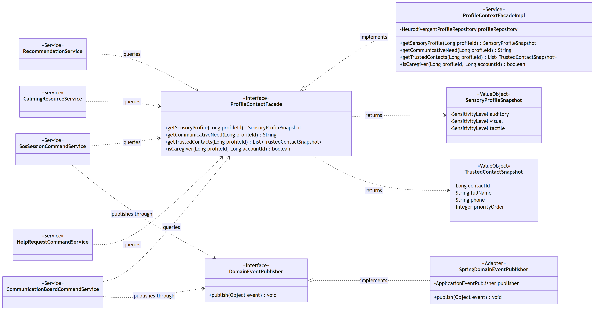

*Ilustración — Class Diagram: Colaboración entre Bounded Contexts*

`ProfileContextFacade` es el único punto por el que los demás contextos leen datos de Perfil y Personalización. Su implementación vive en el paquete `com.nubi.profile`, pero la interfaz y los *snapshots* se publican para los demás módulos, que nunca acceden a `NeurodivergentProfileRepository`. Los eventos se publican mediante `DomainEventPublisher`, implementado con los eventos de aplicación de Spring, y los consumen `@EventListener` dentro del mismo proceso, coherente con el monolito modular definido en 4.6.3. Los eventos que cruzan los contextos son los siguientes:

| Evento | Publicado por | Consumido por | Efecto |
| :--- | :--- | :--- | :--- |
| `AccountCreatedEvent` | Perfil y Personalización | Perfil y Personalización | Activa la suscripción freemium. |
| `SosModeActivatedEvent` | Gestión de Crisis | Autorregulación, Red de Apoyo y Seguimiento | Activa el modo de baja estimulación y alerta a los contactos de confianza. |
| `EpisodeFinishedEvent` | Gestión de Crisis | Red de Apoyo y Seguimiento | Registra el episodio. |
| `EpisodeRegisteredEvent` | Red de Apoyo y Seguimiento | Gestión de Crisis | Actualiza las recomendaciones. |
| `PictogramSelectedEvent` | Comunicación Asistida | Red de Apoyo y Seguimiento | Avisa al cuidador de la necesidad expresada. |
| `UnderstandingNotConfirmedEvent` | Comunicación Asistida | Red de Apoyo y Seguimiento | Envía una solicitud de ayuda. |

## 4.8. Database Design.

En esta sección se presenta el diseño de la base de datos relacional de NUBI, implementada en PostgreSQL y mapeada desde el API mediante Spring Data JPA. Las decisiones principales son las siguientes:

- **Un esquema por Bounded Context:** los esquemas `profile`, `crisis`, `regulation`, `communication` y `support` reflejan la separación del monolito modular y se declaran en cada entidad con `@Table(schema = "...")`.
- **Referencias entre contextos sin clave foránea:** una columna que apunta a otro contexto (por ejemplo, `profile_id` en el esquema `crisis`) es un identificador lógico y no tiene *constraint* de clave foránea, de modo que un contexto pueda evolucionar sin depender del esquema de otro. La integridad se garantiza mediante `ProfileContextFacade` y los eventos de dominio. Estas columnas se identifican con la anotación `logical ref` en los diagramas.
- **Claves primarias:** todas las tablas usan una clave primaria `bigint` generada con `GENERATED BY DEFAULT AS IDENTITY`. La tabla `sensory_profiles` comparte la clave del perfil (`@OneToOne` con `@MapsId`).
- **Enumeraciones:** se almacenan como `varchar` con `@Enumerated(EnumType.STRING)` y un *constraint* `CHECK` que restringe los valores permitidos.
- **Objetos de valor:** `DeclaredDiagnosis` se guarda embebido (`@Embedded`) en las columnas de `neurodivergent_profiles`, y el `CalmTimer` en las columnas `timer_*` de `calm_sessions`.
- **Auditoría:** las tablas cuyas clases heredan de `AuditableEntity` incluyen `created_at` y `updated_at`.
- **Nomenclatura:** tablas en plural y columnas en `snake_case`, ambas en inglés. Las claves foráneas se nombran `fk_<tabla>_<referencia>`, las restricciones de unicidad `uq_<tabla>_<columna>` y los índices `ix_<tabla>_<columnas>`.
- **Eliminación:** las tablas hijas de un Aggregate Root usan `ON DELETE CASCADE`, porque no existen sin él.

### 4.8.1. Database Diagrams.

A continuación se presenta el Database Diagram de NUBI, con las tablas de todos los Bounded Contexts, y luego se explica cómo se gestiona cada tabla dentro de su contexto: qué información guarda, con qué otras tablas se relaciona y qué reglas de integridad (*constraints*) aplica. Las líneas punteadas y las columnas marcadas como `logical ref` referencian a otro contexto sin clave foránea.

#### Esquema profile: Perfil y Personalización

Este esquema guarda las cuentas de acceso, los perfiles de los usuarios neurodivergentes, sus cuidadores y contactos de confianza, y todo lo relacionado con planes, instituciones y soporte técnico. Las tablas se gestionan de la siguiente manera:

- **`accounts`:** guarda el acceso de cada cuidador, docente o administrador institucional. El correo (`email`) es único y funciona como identificador de inicio de sesión. Una cuenta creada con Google no tiene `password_hash` y guarda su identificador de Google en `google_subject`, que también es único; una cuenta creada con contraseña sí debe tener `password_hash`. El rol (`role`) solo admite `CAREGIVER`, `TEACHER` e `INSTITUTION_ADMIN`, y la columna `active` permite desactivar una cuenta sin borrarla. `institution_id` es opcional y solo lo tienen los docentes y administradores de una institución.
- **`institutions`:** registra los colegios y centros de terapia (`institution_type`) que administran los perfiles de sus estudiantes. No depende de ninguna otra tabla; `accounts` y `neurodivergent_profiles` la referencian con una clave foránea opcional.
- **`subscriptions`:** cada cuenta tiene una sola suscripción (`account_id` único), que se crea en el plan `FREEMIUM` al registrarse. Guarda los límites del plan (`max_profiles` y `max_caregivers_per_profile`, siempre mayores que cero), que la aplicación consulta antes de crear un perfil o invitar a un cuidador. `plan_type` solo admite `FREEMIUM`, `FAMILY_PREMIUM` e `INSTITUTIONAL`, y `ends_at` queda vacío mientras la suscripción no tenga fecha de vencimiento.
- **`payments`:** registra cada intento de cobro de una suscripción (`subscription_id`). `amount` no puede ser negativo, `status` pasa de `PENDING` a `PAID` o `FAILED`, y `gateway_reference`, único, guarda la referencia que devuelve la pasarela de pagos. `paid_at` solo se completa cuando el pago se confirma.
- **`support_tickets`:** guarda los reportes de soporte técnico de una cuenta (`account_id`). `status` avanza de `OPEN` a `IN_PROGRESS` y `CLOSED`, y `resolved_at` se completa al cerrar el reporte.
- **`neurodivergent_profiles`:** es la tabla principal del contexto y guarda la ficha del usuario: datos básicos, necesidad comunicativa y diagnóstico declarado. El diagnóstico va embebido en las columnas `condition_type`, `condition_description`, `diagnosed_by`, `diagnosis_date` y `professional_notes`; si la condición es `OTHER`, `condition_description` es obligatoria. La edad debe ser mayor que cero y `active` permite archivar un perfil sin eliminarlo. `institution_id` es opcional, porque las familias no pertenecen a una institución.
- **`sensory_profiles`:** guarda el perfil sensorial en una relación uno a uno con el perfil, con el que comparte la clave primaria (`profile_id`). Contiene los tres niveles de sensibilidad (auditiva, visual y táctil, con valores de `LOW` a `VERY_HIGH`) y las tres preferencias de la aplicación (modo de baja estimulación, priorizar visuales y confirmar audio). Se crea con valores por defecto si el cuidador no registra sensibilidades y se reemplaza completo cuando las modifica.
- **`profile_caregivers`:** resuelve la relación de muchos a muchos entre cuentas y perfiles. Cada fila es un cuidador o una invitación, con su rol (`PRIMARY`, `CAREGIVER` o `THERAPIST`) y su estado (`PENDING`, `ACTIVE` o `REVOKED`). Una invitación nace con solo `invited_email` y `account_id` vacío; al aceptarla se completan `account_id` y `accepted_at`, por eso la unicidad se define sobre `(profile_id, invited_email)`. Un índice sobre `account_id` permite listar los perfiles de una cuenta.
- **`trusted_contacts`:** guarda los contactos que reciben las alertas del usuario. `priority_order`, mayor que cero y único dentro de cada perfil, define el orden en que se reenvía una alerta cuando un contacto no confirma su recepción.

#### Esquema crisis: Gestión de Crisis (Modo SOS)

Este esquema guarda la guía de actuación que sigue el cuidador durante una crisis, las sesiones SOS y las recomendaciones personalizadas. Las guías son datos maestros compartidos por todos los usuarios; las sesiones y las recomendaciones pertenecen a cada perfil, al que referencian con un identificador lógico hacia `profile.neurodivergent_profiles`, sin clave foránea. Las tablas se gestionan de la siguiente manera:

- **`action_guides`:** es el catálogo de guías de actuación. Cada guía tiene una `version` y un indicador `active`; al iniciar una sesión SOS se asigna la guía vigente. Las sesiones SOS solo leen las guías; no las modifican.
- **`containment_steps`:** guarda los pasos de una guía (`guide_id`). `step_order` es mayor que cero y único dentro de la guía, de modo que los pasos se muestran de uno en uno y en orden. `mandatory` indica que el paso exige confirmación explícita antes de omitirse, y `related_trigger` permite priorizar los pasos según la sensibilidad más alta del usuario.
- **`alternative_techniques`:** guarda las técnicas alternativas que se sugieren cuando un paso no funciona (`step_id`). Se eliminan junto con el paso al que pertenecen.
- **`sos_sessions`:** registra cada sesión guiada, en curso o terminada. Referencia al perfil y a la cuenta del cuidador con identificadores lógicos y a la guía con una clave foránea. `status` puede ser `IN_PROGRESS`, `FINISHED` o `FINISHED_EARLY`; `current_step_order` permite retomar la guía si el cuidador la abandona; las intensidades inicial y final usan la escala `CALM`, `RESTLESS`, `ALTERED` y `CRISIS`; y `finished_at` no puede ser anterior a `started_at`. Un índice único parcial sobre `profile_id`, donde `status = 'IN_PROGRESS'`, garantiza una sola sesión activa por perfil.
- **`session_completed_steps`:** registra el avance de una sesión: una fila por cada paso completado u omitido (`skipped`). Es única por `(session_id, step_id)` y se elimina junto con la sesión.
- **`recommendations`:** guarda las recomendaciones de cada perfil, clasificadas por `topic` (`SENSORY`, `COMMUNICATIONAL` o `BEHAVIORAL`). Se versionan: cuando se genera una nueva versión, se inserta con `outdated = false` y la anterior se marca como `outdated = true`, sin borrarla. Un índice sobre `(profile_id, topic)` soporta el filtro por tópico.
- **`recommendation_preferences`:** guarda la calificación de utilidad (de 1 a 5) y el indicador de favorito que cada cuidador asigna a una recomendación. Es única por `(recommendation_id, account_id)`, así que volver a calificar la misma recomendación actualiza la fila existente.

#### Esquema regulation: Autorregulación

Este esquema guarda el catálogo de recursos de calma, las sesiones de calma de cada perfil y los recursos que el usuario marcó como favoritos. Las tablas se gestionan de la siguiente manera:

- **`calming_resources`:** es el catálogo de recursos, compartido por todos los usuarios. `resource_type` solo admite `VISUAL`, `AUDITORY`, `GUIDED_BREATHING` y `DRAWING_CANVAS`, y `max_intensity` es mayor que cero. `available_offline` marca los recursos que funcionan sin conexión y `active` permite retirar un recurso sin borrarlo.
- **`calm_sessions`:** registra cada sesión de calma de un perfil. `resource_id` es una clave foránea opcional, porque la sesión puede abrirse antes de elegir un recurso. Guarda el estado (`ACTIVE`, `PAUSED` o `FINISHED`), la intensidad, si el modo de baja estimulación está activo y si la sesión la inició el Modo SOS (`started_by_sos`). El temporizador va embebido en las columnas `timer_duration_minutes`, `timer_remaining_seconds` y `timer_running`; el tiempo restante nunca es negativo. Que la intensidad no supere `max_intensity` del recurso se valida en el dominio, porque una restricción `CHECK` no puede comparar columnas de dos tablas.
- **`favorite_resources`:** guarda los recursos que un perfil marcó como favoritos. Es única por `(profile_id, resource_id)`, para que un recurso no se marque dos veces; al desmarcarlo se elimina la fila.

#### Esquema communication: Comunicación Asistida (CAA)

Este esquema guarda el tablero de pictogramas de cada perfil, los mensajes que el usuario envía al seleccionar un pictograma y sus registros de estado de ánimo. Todo cuelga del tablero. Las tablas se gestionan de la siguiente manera:

- **`communication_boards`:** guarda un tablero por perfil (`profile_id` único, con referencia lógica). `max_favorites` es mayor que cero y define cuántos pictogramas pueden marcarse como favoritos; esa regla se valida en el dominio, porque depende de contar filas de otra tabla.
- **`pictogram_categories`:** guarda las categorías del tablero (`board_id`): `BASIC_NEEDS`, `EMOTIONS`, `ACTIVITIES` y `CUSTOM` para las que crea el cuidador. El nombre es único dentro del tablero y `display_order` define su posición.
- **`pictograms`:** guarda cada pictograma con su etiqueta (`label`), la frase que se reproduce en voz alta (`phrase`), su imagen y un audio opcional. Pertenece a un tablero y a una categoría; mover un pictograma de categoría solo actualiza `category_id`. `favorite` alimenta el acceso rápido, apoyado en un índice sobre `(board_id, favorite)`, y `custom` distingue los pictogramas creados por el cuidador de los básicos.
- **`pictogram_selections`:** registra cada mensaje que el usuario envía al seleccionar un pictograma. `selection_status` avanza de `PENDING_DELIVERY` a `DELIVERED` y luego a `UNDERSTOOD` o `NOT_UNDERSTOOD`, según la confirmación del acompañante, y `understood_at` no puede ser anterior a `selected_at`.- **`mood_check_ins`:** registra el estado de ánimo del usuario con la escala de cuatro niveles (`CALM`, `RESTLESS`, `ALTERED` y `CRISIS`). Solo se insertan filas nuevas, y un índice sobre `(board_id, checked_at)` permite consultar el historial.

#### Esquema support: Red de Apoyo y Seguimiento

Este esquema guarda las solicitudes de ayuda y su entrega a los contactos de confianza, y el historial de episodios con sus notas, estrategias y reportes. Las tablas se gestionan de la siguiente manera:

- **`help_requests`:** guarda cada solicitud de ayuda. `origin` indica si la envió el usuario (`MANUAL`), la generó el Modo SOS (`SOS_MODE`) o el acompañante no confirmó la comprensión de un pictograma (`AAC_NOT_UNDERSTOOD`). `status` avanza de `PENDING` a `CONFIRMED`, `CANCELLED` o `ESCALATED`, y `confirmed_at` es obligatoria cuando la solicitud está confirmada. Una solicitud confirmada ya no puede cancelarse, regla que se valida en el dominio.
- **`alert_deliveries`:** registra una fila por cada contacto y canal (`PUSH`, `SMS` o `WHATSAPP`) al que se envió la alerta de una solicitud, con su estado de entrega (`SENT`, `DELIVERED` o `FAILED`). `contact_id` referencia de forma lógica a `profile.trusted_contacts`, y las filas se eliminan junto con la solicitud.
- **`episode_records`:** guarda el registro de cada episodio, que se crea automáticamente cuando termina una sesión SOS. `sos_session_id` es único, para que un episodio no se registre dos veces si el evento se procesa de nuevo. `status` es `FINISHED` o `FINISHED_EARLY`, la duración no es negativa y `completed_steps` no supera a `total_steps`. Un índice sobre `(profile_id, started_at)` soporta el filtro del historial por rango de fechas.
- **`episode_notes`:** guarda las notas manuales que el cuidador agrega a un episodio (`episode_id`). El texto no puede estar vacío y las notas se eliminan junto con el episodio.
- **`effective_strategies`:** guarda las estrategias que el cuidador marcó como efectivas después de un episodio, con la cuenta que la marcó y la fecha.
- **`episode_reports`:** guarda los reportes que el cuidador comparte con el profesional de salud. Solo almacena el periodo (`period_from` y `period_to`, donde el final no puede ser anterior al inicio) y el correo del destinatario; el contenido no se copia, sino que se calcula a partir de los episodios de ese rango.
