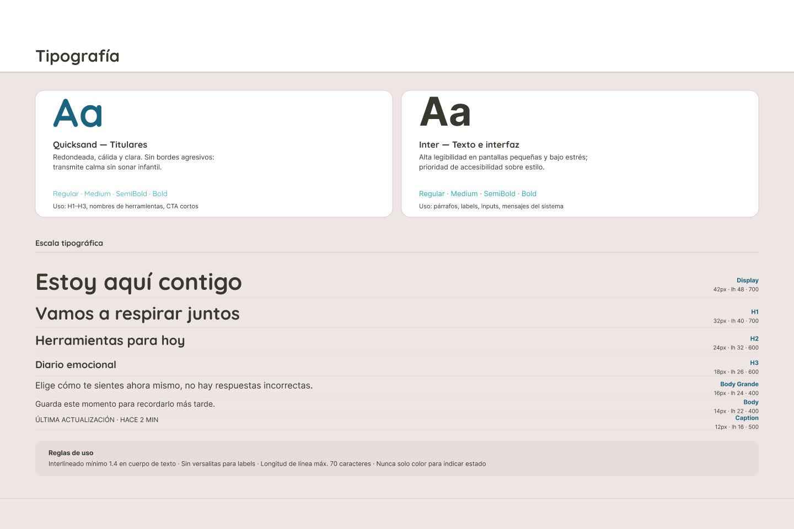
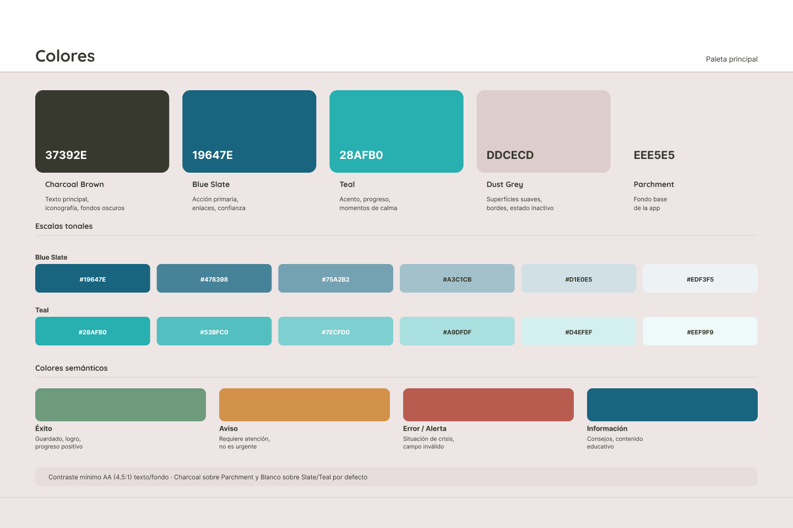
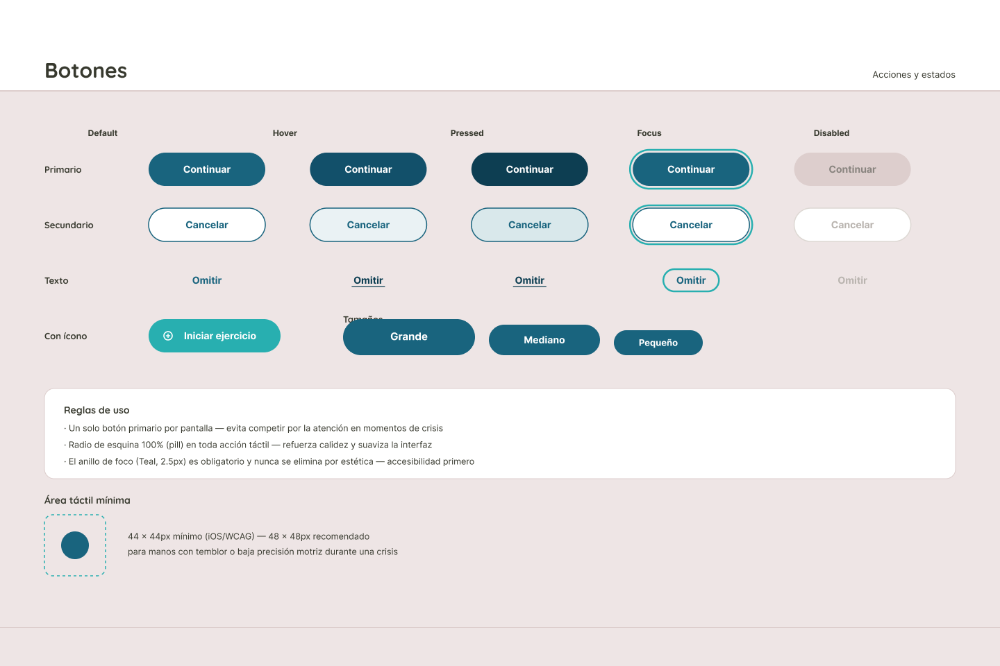
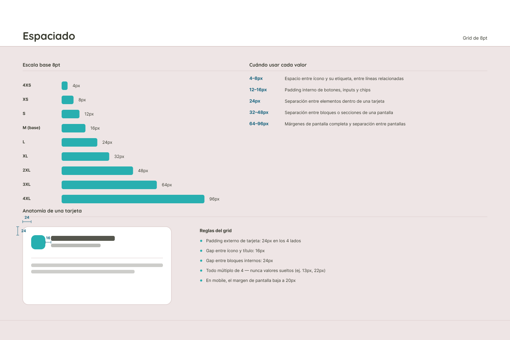
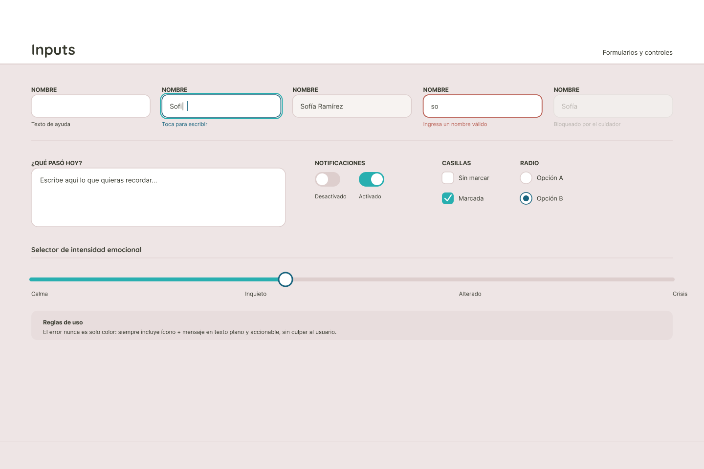
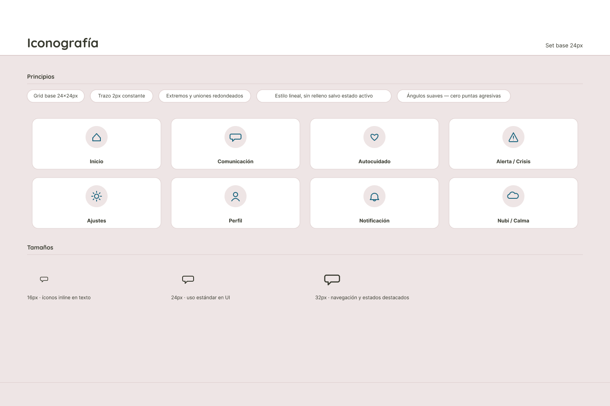

# Capítulo IV: Product Design

## 4.1. Style Guidelines

En esta sección, el equipo de desarrollo sienta las bases para contar con un repositorio centralizado, unificado y organizado de uso común para todos los miembros del proyecto. Este repositorio incluye *assets*, tipografías, componentes UI, reglas de espaciado e iconografía con el objetivo prioritario de mantener una presentación visual consistente, intuitiva y accesible. Para **Nubi**, las decisiones del sistema de diseño responden estrictamente a la necesidad de reducir la carga cognitiva de niños y adolescentes neurodivergentes (TEA, TDAH, TOC) durante estados de sobreestimulación sensorial o crisis emocional, brindando simultáneamente a padres, cuidadores y educadores una herramienta clara, predecible y de respuesta rápida en tiempo real.

### 4.1.1. General Style Guidelines

En esta sección se detallan las decisiones visuales y conceptuales generales de la plataforma Nubi, fundamentadas en el diseño inclusivo, la previsibilidad y la reducción del estrés sensorial.

#### 4.1.1.1. Tipografía

   
  <em>Nota: Selección tipográfica de Quicksand e Inter, escala jerárquica y directrices de legibilidad para la plataforma Nubi.</em>

La selección tipográfica de Nubi responde a la necesidad de ofrecer un entorno visual amable y highly legible, minimizando el esfuerzo de procesamiento visual tanto para los usuarios neurodivergentes como para sus cuidadores:

* **Quicksand (Titulares):** 
  Al ser una tipografía de trazos redondeados y formas suaves, se emplea en los encabezados (H1 a H3), nombres de herramientas y botones de acción principal (CTA). Su carácter cálido transmite serenidad y cercanía sin resultar infantil, eliminando esquinas o trazos agresivos que puedan generar tensión visual en momentos de ansiedad.
* **Inter (Texto de Cuerpo e Interfaz):** 
  Familia Sans-Serif diseñada para ofrecer la máxima legibilidad en interfaces digitales y pantallas de formato pequeño. Se utiliza en párrafos, etiquetas de campos, mensajes del sistema y entradas de datos. Su neutralidad y clara separación de caracteres permiten una lectura rápida en situaciones de sobreestimulación o cansancio cognitivo.
* **Escala Tipográfica y Jerarquía Visual:** 
  Se establece una jerarquía estricta que guía la atención del usuario de manera ordenada. Los tamaños van desde la variante *Display* (42px) para mensajes de contención emocional de alto impacto, pasando por los niveles de titulares *H1* (32px), *H2* (24px) y *H3* (18px) para la estructuración de módulos, hasta las variantes *Body Grande* (16px), *Body* (14px) y *Caption* (12px) para la lectura fluida de contenidos y metadatos.
* **Reglas de Legibilidad y Accesibilidad:**
  Para asegurar la lectura en cualquier condición, se exige un interlineado (*line-height*) mínimo de 1.4× en textos continuos, un ancho de renglón limitado a un máximo de 70 caracteres para evitar el extravío de la vista, y la prohibición de usar texto en mayúsculas sostenidas (*versalitas*) en las etiquetas. Asimismo, ningún estado de la interfaz se comunica exclusivamente a través de la tipografía o el color.

#### 4.1.1.2. Colores

   
  <em>Nota: Paleta cromática desaturada, escalas tonales y definición semántica de color en Nubi.</em>

La paleta de colores de Nubi se ha configurado utilizando tonos desaturados e inspirados en elementos de la naturaleza, evitando tonalidades neón o de alta saturación que puedan desencadenar hiperactividad o saturación sensorial:

* **Paleta Principal y de Superficies:**
  * **Charcoal Brown (`#37392E`):** Tono oscuro de alto contraste para la tipografía principal y la iconografía, garantizando una lectura cómoda sobre fondos claros sin el impacto agresivo del negro puro.
  * **Blue Slate (`#19647E`):** Tono primario que evoca calma y estabilidad; se asigna a acciones principales, enlaces y contenedores estructurados.
  * **Teal (`#28AFB0`):** Color de acento orientado a transmitir progreso, dinamismo controlado e indicadores de ejercicios de autorregulación y respiración.
  * **Dust Grey (`#DDCECD`):** Utilizado en bordes, divisores sutiles, tarjetas en reposo y estados inactivos.
  * **Parchment (`#EEE5E5`):** Actúa como el lienzo o fondo base de toda la aplicación, reemplazando el blanco puro para reducir el deslumbramiento y la fatiga ocular.
* **Escalas Tonales:** 
  Tanto *Blue Slate* como *Teal* disponen de graduaciones de seis niveles para gestionar capas de profundidad, estados al pasar el cursor (*hover*) y selecciones de tarjetas.
* **Colores Semánticos y Retroalimentación:** 
  Se definen cuatro tonos específicos para la retroalimentación del sistema: verde para **Éxito** (confirmaciones de guardado o logros), amarillo cálido para **Aviso** (recordatorios no urgentes), terracota desaturado para **Error / Alerta** (situaciones que requieren atención médica, crisis o correcciones) y azul para **Información** (consejos pedagógicos para cuidadores).
* **Garantía de Contraste WCAG:** 
  Todas las combinaciones del sistema garantizan un contraste mínimo de 4.5:1 (Nivel AA de las pautas WCAG), asegurando que personas con baja visión o daltónicas puedan identificar cada elemento con claridad.

#### 4.1.1.3. Botones (Acciones y estados)

   
  <em>Nota: Tipos de botones, jerarquía de acciones, estados de interacción y especificaciones de accesibilidad motriz.</em>

Los botones constituyen el punto central de interacción táctil y visual dentro de la aplicación, por lo que su diseño prioriza la simplicidad y la prevención de errores por pulsación accidental:

* **Tipos y Jerarquía de Botones:**
  * **Primario:** Destinado a la acción principal que impulsa al usuario a avanzar (ej. `Continuar`). Su relleno sólido exige prioridad visual.
  * **Secundario:** Diseñado para acciones alternativas o de cancelación (ej. `Cancelar`), con un contorno definido para no competir con el botón primario.
  * **Texto / Terciario:** Para acciones opcionales de bajo impacto (ej. `Omitir`).
  * **Con Ícono:** Combina un símbolo descriptivo con texto para reforzar la comprensión rápida en herramientas interactivas (ej. `Iniciar ejercicio`).
* **Estados de Interacción:** 
  Cada variante dispone de cinco estados claramente diferenciables: *Default* (reposo), *Hover* (interacción con cursor), *Pressed* (presionado), *Focus* (foco visual accesible mediante un anillo de 2.5px en tono Teal) y *Disabled* (deshabilitado con opacidad reducida).
* **Tamaños y Adaptabilidad:** 
  Disponibles en escalas *Grande*, *Mediano* y *Pequeño* para adaptarse tanto a pantallas de escritorio como a la interfaz móvil.
* **Reglas de Accesibilidad y Control Motor:**
  Para prevenir la parálisis por análisis durante estados de crisis, se permite un único botón primario por pantalla. Todos los botones emplean esquinas redondeadas al 100% (*pill shape*), eliminando bordes rectos para ofrecer una estética amigable. Además, el área táctil se amplía de un mínimo de 44 × 44px a un tamaño recomendado de **48 × 48px**, facilitando la interacción a usuarios con movilidad fina reducida o temblores causados por el estrés.

#### 4.1.1.4. Espaciado (Grid de 8pt)

   
  <em>Nota: Sistema de retícula basado en 8pt, escala de márgenes y reglas de composición de módulos.</em>

El sistema de espaciado utiliza una retícula rígida basada en múltiplos de **8pt** (con sub-múltiplos de 4pt para ajustes micro), garantizando un diseño estructurado, simétrico y ordenado en todas las pantallas:

* **Escala de Espaciado Estandarizada:**
  Cubre valores desde **4XS** (4px) hasta **4XL** (96px). Esta progresión permite un control preciso del volumen de espacio en blanco, clave para evitar la saturación de elementos en pantalla.
* **Criterios de Aplicación de Valores:**
  Los valores de 4px a 8px separan íconos de sus etiquetas inmediatas; los rangos de 12px a 16px estructuran el relleno interno (*padding*) de botones, formularios y fichas; 24px se utiliza para distanciar elementos dentro de una misma tarjeta; de 32px a 48px se separan secciones dentro de un módulo; y los rangos mayores de 64px a 96px delimitan los márgenes globales de la pantalla.
* **Anatomía de Tarjeta y Reglas de Composición:**
  Las tarjetas contenedoras mantienen un *padding* interno constante de 24px en sus cuatro lados, una separación de 16px entre el ícono decorativo y el título, y un espacio de 24px entre los bloques de texto secundarios. Queda prohibido el uso de valores arbitrarios fuera del sistema de múltiplos. En dispositivos móviles, los márgenes laterales se ajustan automáticamente a 20px para maximizar la superficie útil del panel táctil.

#### 4.1.1.5. Inputs (Formularios y controles)

   
  <em>Nota: Componentes de captura de datos, controles interactivos y diseño del selector emocional.</em>

Los componentes de entrada de datos permiten capturar el estado emocional del usuario y gestionar configuraciones de la plataforma sin generar frustración o ansiedad:

* **Campos de Entrada de Texto:** 
  Presentan cinco estados operativos que guían al usuario durante la interacción: *Default* (con texto guía), *Focus* (borde Teal y cursor visible), *Completado* (datos validados), *Error* (indicación de fallo con mensaje orientador) y *Bloqueado* (campo inhabilitado por el tutor o cuidador).
* **Área de Texto Libre (*Textarea*):** 
  Proporciona un contenedor amplio y sin distracciones para que el usuario escriba sus vivencias o reflexiones en el diario emocional (ej. *"Escribe aquí lo que quieras recordar..."*).
* **Controles de Configuración:** 
  Incluye *switches* con estados Activado/Desactivado para la gestión de notificaciones, así como casillas (*checkboxes*) y botones de opción (*radio buttons*) para seleccionar preferencias puntuales.
* **Selector de Intensidad Emocional:** 
  Un componente deslizante que permite al usuario registrar de forma gráfica su estado emocional a lo largo de un espectro continuo de cuatro niveles: **Calma**, **Inquieto**, **Alterado** y **Crisis**.
* **Gestión de Errores Empática:** 
  Los mensajes de error no se comunican únicamente mediante color rojo ni utilizan términos punitivos. Se acompañan siempre de un ícono ilustrativo y una explicación clara sobre cómo corregir la entrada de datos.

#### 4.1.1.6. Iconografía (Set base 24px)

   
  <em>Nota: Retícula de diseño, principios de trazo suave y catálogo de íconos base del sistema Nubi.</em>

La iconografía de Nubi actúa como un sistema de apoyo visual que facilita la comprensión rápida de las funcionalidades, sirviendo como un canal de comunicación alternativo para usuarios con dificultades en el procesamiento del lenguaje escrito:

* **Principios de Construcción:** 
  Todos los íconos se diseñan sobre una retícula base de 24 × 24px, utilizando un grosor de trazo constante de 2px, extremos y esquinas redondeadas, y un estilo lineal (*outline*). Se evita el uso de bordes afilados o ángulos agudos para no transmitir tensión visual. El relleno sólido se reserva exclusivamente para denotar un estado activo o seleccionado.
* **Catálogo de Íconos Principales:** 
  Símbolos clave que identifican los módulos centrales de la aplicación: **Inicio** (panel general), **Comunicación** (tableros de asistencia CAA), **Autocuidado** (herramientas de autorregulación), **Alerta / Crisis** (botón de auxilio rápido), **Ajustes** (configuración), **Perfil** (datos del usuario), **Notificación** (avisos) y **Nubi / Calma** (símbolo identitario de relajación).
* **Escalas de Tamaño:** 
  Se definen tres variaciones de escala: **16px** para íconos integrados en líneas de texto (*inline*), **24px** como estándar para elementos interactivos y barras de herramientas, y **32px** para accesos de navegación principal y estados destacados.

### 4.1.2. Web Style Guidelines

Las Web Style Guidelines definen los patrones de interacción y la respuesta visual de la plataforma Nubi cuando se accede a ella desde navegadores web en computadoras de escritorio y laptops, entorno utilizado frecuentemente por educadores, terapeutas y padres.

   
  <em>Nota: Estructura de barra de navegación web, indicadores de estado de interacción y sistema de migas de pan.</em>

#### 4.1.2.1. Estados de Navegación (App web)
* **Barra de Navegación Superior:** 
  Organiza las secciones globales de la plataforma de forma horizontal (`Inicio`, `Herramientas`, `Comunidad`, `Recursos`, `Ajustes`), garantizando que las opciones permanezcan visibles en todo momento.
* **Indicación de Sección Activa:** 
  La sección en la que se encuentra el usuario se resalta mediante una combinación de color *Blue Slate*, un subrayado visual continuo y un fondo en tono *Parchment* o *Dust Grey*. Se evita depender únicamente del grosor de la tipografía (negrita) para marcar el estado activo, facilitando su identificación visual inmediata.
* **Clave de Estados de Interacción:**
  * **Default:** Elemento disponible y listo para la interacción.
  * **Hover:** Aparece un fondo suave en tono *Parchment* al desplazar el cursor sobre la opción (comportamiento exclusivo de entornos web con ratón).
  * **Activo / Actual:** Destacado en tono *Blue Slate* con subrayado indicador.
  * **Deshabilitado:** Opacidad reducida al 40% e inhabilitación de la respuesta al cursor.
* **Migas de Pan (*Breadcrumbs*):** 
  Línea de navegación secundaria (ej. `Inicio` / `Herramientas` / `Respiración guiada`) ubicada en la parte superior del contenido principal. Permite al usuario comprender su ubicación exacta dentro de la estructura de la web y regresar a niveles anteriores con un solo clic, reduciendo la desorientación espacial.

## 4.2. Information Architecture.

En esta sección el equipo plantea las decisiones y el sustento que dirigen la manera cómo se organiza el contenido en las experiencias del Landing Page y de la Web Application de Nubi. Estas decisiones buscan que los visitantes (cuidadores, educadores y terapeutas que aún no se han registrado) y los usuarios ya registrados (cuidadores y usuarios neurodivergentes) se adapten con facilidad a cada producto y encuentren lo que necesitan sin esfuerzo, incluso en momentos de estrés o sobrecarga sensorial. Las decisiones se estructuran alrededor de los 5 Bounded Contexts definidos en el Capítulo III (Perfil y Personalización, Gestión de Crisis / Modo SOS, Autorregulación, Comunicación Asistida CAA, y Red de Apoyo y Seguimiento).

### 4.2.1. Organization Systems.

Nubi combina distintos sistemas de organización visual según el objetivo de cada grupo de contenido, y distintos esquemas de categorización según la naturaleza de la información que agrupan.

**Sistemas de organización visual aplicados:**

* **Organización jerárquica (visual hierarchy):** se aplica en el Panel de inicio del cuidador (Home) y en el Perfil del usuario neurodivergente. El estado actual del usuario, las alertas y el acceso al Modo SOS reciben la mayor jerarquía visual (tamaño, contraste y posición superior), mientras que las recomendaciones y accesos secundarios se ubican en niveles de menor peso visual, siguiendo la escala tipográfica y cromática definida en la sección 4.1.
* **Organización secuencial (step-by-step to accomplish):** se aplica en la guía del Modo SOS y en el flujo de autorregulación con temporizador de calma, donde el contenido se presenta un paso a la vez para evitar la sobrecarga cognitiva durante una crisis, permitiendo solo avanzar o retroceder de forma lineal.
* **Organización matricial:** se aplica en el Tablero de Comunicación Aumentativa y Alternativa (CAA) y en la galería de estímulos de autorregulación, donde los pictogramas y estímulos se despliegan en una cuadrícula que combina dos dimensiones de clasificación (categoría y frecuencia de uso/favoritos), permitiendo el reconocimiento visual rápido por sobre la lectura secuencial.

**Esquemas de categorización de contenido aplicados:**

* **Por tópicos:** utilizado en el Tablero CAA (categorías como necesidades básicas, emociones, actividades) y en las recomendaciones personalizadas (agrupadas por tipo de situación: sensorial, comunicacional, conductual).
* **Cronológico:** utilizado en el Historial de episodios y en el historial de solicitudes de ayuda, donde los registros se listan del más reciente al más antiguo y pueden filtrarse por rango de fechas.
* **Según audiencia (grupos de usuarios):** utilizado tanto en el Landing Page como en la Web Application, diferenciando el contenido dirigido al cuidador (gestión de perfiles, historial, recomendaciones) del contenido dirigido al usuario neurodivergente (autorregulación, comunicación, solicitud de ayuda).
* **Alfabético:** utilizado de forma puntual en listados extensos que no cuentan con un criterio temporal o de frecuencia propio, como el listado de condiciones/diagnósticos disponibles al registrar el perfil del usuario.

### 4.2.2. Labeling Systems.

Las etiquetas de Nubi se definen priorizando la menor cantidad de palabras posible y un lenguaje claro y no técnico, de forma que cuidadores, educadores y usuarios neurodivergentes puedan anticipar qué encontrarán detrás de cada etiqueta sin ambigüedad. Cada etiqueta de navegación principal se asocia, en la mente del usuario, con un conjunto de contenido relacionado que no necesariamente está agrupado en un mismo lugar (por ejemplo, la etiqueta `Alerta / Crisis` asocia el acceso inmediato al Modo SOS sin necesidad de explicarlo cada vez).

| Etiqueta | Bounded Context asociado | Contenido que representa |
|---|---|---|
| `Inicio` | Red de Apoyo y Seguimiento | Panel general del cuidador: estado del usuario, alertas y accesos directos. |
| `Perfil` | Perfil y Personalización | Datos del usuario neurodivergente, sensibilidades, diagnóstico y cuidadores asociados. |
| `Modo SOS` / `Alerta` | Gestión de Crisis (Modo SOS) | Activación de la guía de actuación paso a paso durante una crisis. |
| `Autocuidado` | Autorregulación | Estímulos visuales/auditivos, temporizador de calma y modo de baja estimulación. |
| `Comunicación` | Comunicación Asistida (CAA) | Tablero de pictogramas para expresar necesidades. |
| `Ayuda` | Red de Apoyo y Seguimiento | Solicitud de ayuda al cuidador y su seguimiento. |
| `Historial` | Red de Apoyo y Seguimiento | Episodios registrados y notas asociadas. |
| `Recomendaciones` | Red de Apoyo y Seguimiento | Guías de actuación sugeridas según el perfil del usuario. |
| `Notificación` | Red de Apoyo y Seguimiento | Avisos push de alertas, solicitudes de ayuda y recordatorios. |
| `Ajustes` | Perfil y Personalización | Preferencias de cuenta, idioma, tema y notificaciones. |

Se evita el uso de sinónimos distintos para un mismo concepto entre el Landing Page y la Web Application (por ejemplo, siempre `Modo SOS`, nunca alternado con `Emergencia` o `Auxilio`), de forma que la etiqueta aprendida durante la exploración del sitio estático se mantenga vigente al ingresar a la aplicación.

### 4.2.3. SEO Tags and Meta Tags

Se definen los SEO Tags y Meta Tags mínimos (Title, Description, Keywords y Author) para las páginas principales del Landing Page y de la Web Application, alineados a las 5 secciones definidas como Landing Page Stories en el Capítulo III (LS-01 a LS-05).

**Landing Page:**

| Página / Sección | Title | Meta Description | Keywords | Author |
|---|---|---|---|---|
| Inicio (Hero) | Nubi \| Acompañamiento para niños y adolescentes neurodivergentes | Nubi ayuda a cuidadores y familias a acompañar a niños y adolescentes con TEA, TDAH o TOC durante crisis sensoriales, con guías paso a paso y herramientas de autorregulación. | nubi, neurodivergencia, TEA, TDAH, cuidadores, modo SOS | Equipo Nubi |
| Perfil y Personalización (LS-01) | Nubi \| Perfiles personalizados para cada usuario | Descubre cómo Nubi personaliza sensibilidades, diagnóstico y estímulos según el perfil de cada niño o adolescente neurodivergente. | perfil neurodivergente, personalización, sensibilidades sensoriales | Equipo Nubi |
| Modo SOS (LS-02) | Nubi \| Modo SOS: guías paso a paso ante una crisis | Conoce cómo el Modo SOS de Nubi guía al cuidador con pasos claros durante un episodio de desregulación. | modo SOS, crisis, guía paso a paso, desregulación emocional | Equipo Nubi |
| Autorregulación (LS-03) | Nubi \| Herramientas de autorregulación sensorial | Estímulos visuales, auditivos y temporizador de calma para ayudar a recuperar la calma tras una sobrecarga sensorial. | autorregulación, sobrecarga sensorial, estímulos, calma | Equipo Nubi |
| Comunicación CAA (LS-04) | Nubi \| Tablero de Comunicación Aumentativa y Alternativa | Un tablero de pictogramas que permite comunicar necesidades básicas sin depender del habla. | CAA, pictogramas, comunicación aumentativa, comunicación alternativa | Equipo Nubi |
| Red de Apoyo (LS-05) | Nubi \| Seguimiento y recomendaciones para cuidadores | Historial de episodios y recomendaciones personalizadas para acompañar de forma más efectiva. | seguimiento, recomendaciones, historial de episodios, cuidadores | Equipo Nubi |

**Web Application:**

| Vista | Title | Meta Description | Keywords | Author |
|---|---|---|---|---|
| Inicio de sesión | Iniciar sesión \| Nubi | Accede a tu cuenta de Nubi para gestionar el perfil y el acompañamiento del usuario a tu cargo. | iniciar sesión, nubi, acceso cuidadores | Equipo Nubi |
| Panel de inicio (Home) | Panel de inicio \| Nubi | Consulta el estado actual, alertas recientes y accesos directos a las herramientas de Nubi. | panel de inicio, estado del usuario, alertas | Equipo Nubi |
| Modo SOS | Modo SOS \| Nubi | Guía paso a paso para actuar con seguridad durante un episodio de desregulación. | modo sos, guía de crisis, pasos de actuación | Equipo Nubi |
| Autorregulación | Autorregulación \| Nubi | Selecciona estímulos visuales o auditivos y usa el temporizador de calma. | autorregulación, estímulos, temporizador de calma | Equipo Nubi |
| Tablero CAA | Comunicación \| Nubi | Selecciona pictogramas para comunicar una necesidad. | tablero caa, pictogramas, comunicación | Equipo Nubi |

Nota: al tratarse de una Web Application que requiere autenticación para acceder a la mayoría de sus vistas, las páginas internas priorizan Meta Tags orientados a accesibilidad y consistencia de marca antes que a posicionamiento orgánico (SEO), mientras que el Landing Page concentra el esfuerzo de SEO al ser la puerta de entrada pública e indexable del producto.

### 4.2.4. Searching Systems.

Nubi ofrece mecanismos de búsqueda acotados y simples, priorizando filtros predefinidos sobre la búsqueda libre por texto, con el fin de reducir la carga cognitiva del usuario y evitar que se sienta perdido entre el volumen de información:

* **Historial de episodios:** el cuidador cuenta con un filtro por rango de fechas (US-38) que reduce el listado cronológico a un periodo específico. Los resultados se presentan como una lista de tarjetas ordenadas de la más reciente a la más antigua, cada una con fecha, duración y estado del episodio.
* **Tablero CAA:** el usuario y el cuidador cuentan con un filtro por categoría de pictogramas (necesidades básicas, emociones, actividades) y con una sección de favoritos que actúa como acceso directo a los pictogramas más utilizados. Los resultados se presentan como una cuadrícula de íconos con su etiqueta.
* **Galería de estímulos de autorregulación:** cuenta con un filtro por tipo de estímulo (visual/auditivo) y con una sección de favoritos. Los resultados se presentan como una cuadrícula de tarjetas con vista previa del estímulo.
* **Recomendaciones:** cuentan con un filtro por tópico (sensorial, comunicacional, conductual) y con una sección de recomendaciones favoritas. Los resultados se presentan como una lista ordenada por relevancia, mostrando primero las recomendaciones generadas más recientemente.

Dado el alcance definido para los 5 Bounded Contexts, Nubi no incorpora un buscador de texto libre global: al tratarse de un volumen de contenido acotado y ya categorizado (perfiles, pictogramas, estímulos, episodios y recomendaciones asociados a un número reducido de usuarios por cuenta), los filtros predefinidos son suficientes para que el cuidador o el usuario neurodivergente encuentren lo que buscan sin la carga adicional de formular una consulta de texto.

### 4.2.5. Navigation Systems.

La navegación de Nubi combina accesos globales persistentes con recorridos guiados y lineales, priorizando siempre que el usuario neurodivergente o el cuidador puedan llegar a la ayuda inmediata en el menor número de pasos posible:

* **Navegación global (Web Application):** una barra de navegación superior (ver sección 4.1.2.1) mantiene visibles en todo momento los módulos principales (`Inicio`, `Perfil`, `Autocuidado`, `Comunicación`, `Ajustes`), permitiendo saltar entre Bounded Contexts sin perder el contexto de la sesión activa.
* **Acceso directo persistente al Modo SOS:** el acceso a la guía de crisis (US-12) se mantiene visible desde cualquier pantalla de la aplicación mediante un elemento de navegación de alta prioridad visual, de forma que el cuidador nunca necesite más de una acción para llegar a él, incluso si se desactivó el acceso directo (en cuyo caso queda disponible desde el menú principal).

Adicionalmente, cada Bounded Context aplica una técnica de navegación distinta según el tipo de tarea que soporta:

| Contexto | Técnica de navegación |
|---|---|
| Modo SOS | Navegación lineal guiada (Siguiente / Atrás) entre los pasos de la guía, sin acceso a otras secciones hasta finalizar o cerrar el episodio. |
| Autorregulación | Navegación por selección directa dentro de una cuadrícula (sin jerarquía de pasos), regresando siempre a la galería principal. |
| Tablero CAA | Navegación por categorías con cambio de contexto inmediato al seleccionar un pictograma (reproducción de audio y notificación), sin salir del tablero. |
| Red de Apoyo y Seguimiento | Navegación jerárquica desde el panel de inicio hacia el detalle (episodio, solicitud o recomendación específica), con retorno directo al nivel anterior. |
| Perfil y Personalización | Navegación por pestañas o secciones dentro de un mismo perfil (datos generales, sensibilidades, diagnóstico, cuidadores asociados). |

* **Cambio entre perfiles a cargo:** el cuidador con más de un perfil asociado navega entre ellos mediante un selector persistente (US-35), sin necesidad de cerrar sesión, evitando que la navegación entre usuarios interrumpa el flujo de la aplicación.
* **Navegación en el Landing Page:** se guía al visitante mediante desplazamiento por anclas (*anchor scroll*) entre las 5 secciones de valor (LS-01 a LS-05) accesibles desde la barra de navegación superior, y mediante llamados a la acción (*call-to-action*) al cierre de cada sección que redirigen al registro o inicio de sesión en la Web Application.
* **Migas de pan (Web):** como se describe en la sección 4.1.2.1, se utilizan en las vistas de mayor profundidad (por ejemplo, dentro del Historial de episodios) para que el cuidador comprenda su ubicación exacta y pueda regresar a niveles anteriores sin depender del botón "Atrás" del navegador.

## 4.3 Landing Page UI Design

### 4.3.1 Landing Page Wireframe

### 4.3.2 Landing Page Mock-up

## 4.4 Web Applications UX/UI Design

### 4.4.1 Web Applications Wireframes

### 4.4.2 Web Applications Wireflow Diagrams

#### 4.4.2. Web Applications Wireflow Diagrams

**Segmento 1: Residentes en zonas de riesgo medio-alto**

**Segmento 2: Comerciantes en zonas de riesgo medio-alto**