# Capítulo IV: Product Design

## 4.1. Style Guidelines

En esta sección, el equipo sienta las bases para contar con un repositorio centralizado, unificado y organizado de uso común para todo el equipo, que incluye *assets*, tipografías, componentes UI, reglas de espaciado e iconografía, con el fin de mantener una presentación visual consistente, intuitiva y enfocada. Para **Nubi**, el sistema de diseño tomó como referencia directa el template de la comunidad de Figma *"Solus – Mental Health & Wellness Website Template"*: se extrajeron sus valores reales de color (verde-azulado oscuro, crema, melocotón y los tres acentos cálidos) y su tipografía de titulares, reemplazando la propuesta cromática desaturada de una versión anterior del sistema. El tono de comunicación de Nubi se define en cuatro dimensiones: **cercano** (más que formal), **sereno** (más que eufórico), **claro** (más que técnico) y **respetuoso** (más que irreverente), de modo que tanto el niño o adolescente neurodivergente como su cuidador perciban una marca cálida y confiable, sin caer en un tono infantil ni en una estética clínica y fría.

### 4.1.1. General Style Guidelines

En esta sección se explican las decisiones y referencias visuales sobre Branding, Typography, Colors y Spacing que sostienen la identidad de Nubi.

**Paleta de Colores**

- **Colores Primarios**

<table>
  <thead>
    <tr>
      <th><strong>Código HEX</strong></th>
      <th><strong>Color</strong></th>
      <th><strong>Descripción</strong></th>
    </tr>
  </thead>
  <tbody>
    <tr>
      <td><strong>#00373E</strong></td>
      <td>

</td>
      <td><strong>Deep Teal:</strong> verde-azulado muy oscuro que funciona como color principal de marca: tipografía de encabezados, navegación activa y botones de llamada a la acción (CTA), incluyendo el acceso directo al Modo SOS. Al ser un tono oscuro, admite texto blanco con contraste alto sin necesitar variantes adicionales.</td>
    </tr>
    <tr>
      <td><strong>#EFC01D</strong></td>
      <td>

</td>
      <td><strong>Golden Yellow:</strong> tono dorado cálido usado en acentos secundarios, badges de plan destacado e íconos de autorregulación y perfil, aportando energía sin competir con el Deep Teal.</td>
    </tr>
    <tr>
      <td><strong>#F7F6F4</strong></td>
      <td>

</td>
      <td><strong>Cream:</strong> blanco cálido que actúa como lienzo base de toda la aplicación, reduciendo el deslumbramiento de un blanco puro y aportando una sensación acogedora y ordenada.</td>
    </tr>
    <tr>
      <td><strong>#F9E6D0</strong></td>
      <td>

</td>
      <td><strong>Peach:</strong> melocotón suave de referencia para fondos de sección alternos (hero, tarjetas destacadas), disponible en la paleta para futuras variaciones del layout.</td>
    </tr>
  </tbody>
</table>

- **Colores Secundarios**

<table>
  <thead>
    <tr>
      <th><strong>Código HEX</strong></th>
      <th><strong>Color</strong></th>
      <th><strong>Descripción</strong></th>
    </tr>
  </thead>
  <tbody>
    <tr>
      <td><strong>#4CCBBB</strong></td>
      <td>

</td>
      <td><strong>Mint Teal:</strong> tono fresco asociado a la Comunicación Asistida (CAA) y a los enlaces informativos. Transmite claridad y apertura al diálogo.</td>
    </tr>
    <tr>
      <td><strong>#F39CAC</strong></td>
      <td>

</td>
      <td><strong>Blossom Pink:</strong> acento afectivo reservado para la Red de Apoyo y Seguimiento: recomendaciones, notas del cuidador y mensajes de acompañamiento.</td>
    </tr>
    <tr>
      <td><strong>#E4E1DB</strong></td>
      <td>

</td>
      <td><strong>Warm Grey:</strong> gris cálido destinado a bordes, divisores y tarjetas en reposo, estructurando la interfaz sin distraer al usuario.</td>
    </tr>
    <tr>
      <td><strong>#8A8A8A</strong></td>
      <td>

</td>
      <td><strong>Taupe:</strong> gris medio usado en texto secundario, metadatos y marcas de tiempo del historial de episodios.</td>
    </tr>
    <tr>
      <td><strong>#E0605B</strong></td>
      <td>

</td>
      <td><strong>Coral Red (Error / Alerta):</strong> color de alta intensidad reservado exclusivamente para mensajes de error, campos inválidos o situaciones que requieren atención inmediata durante una crisis.</td>
    </tr>
    <tr>
      <td><strong>#4FAE7B</strong></td>
      <td>

</td>
      <td><strong>Leaf Green (Éxito):</strong> tono orgánico usado en confirmaciones de guardado, episodios cerrados correctamente y logros de autorregulación.</td>
    </tr>
    <tr>
      <td><strong>#EFC01D</strong></td>
      <td>

</td>
      <td><strong>Golden Yellow (Aviso):</strong> el mismo dorado de acento se reutiliza como color de aviso en recordatorios no urgentes, como perfiles incompletos o sugerencias pendientes de revisar.</td>
    </tr>
  </tbody>
</table>

Todas las combinaciones de texto sobre fondo respetan un contraste mínimo de 4.5:1 (Nivel AA de WCAG). Al ser Deep Teal un tono muy oscuro, admite texto blanco directamente en botones y bloques sólidos sin necesitar una variante adicional; en cambio, un texto blanco sobre Golden Yellow, Mint Teal o Blossom Pink no alcanza ese mínimo, por lo que los botones y etiquetas construidos sobre estos tres acentos usan texto en **Deep Teal** en lugar de blanco.

---

**Fonts**

Adoptamos la combinación tipográfica del template de referencia: **Bricolage Grotesque** para titulares e **Inter** para texto de cuerpo, equilibrando el carácter expresivo y contemporáneo de la marca con la legibilidad que necesitan niños, adolescentes neurodivergentes y sus cuidadores.

- **Bricolage Grotesque (Titulares):** tipografía grotesca de proporciones amplias y formas geométricas que se usa en encabezados (Display a H3), nombres de herramientas y botones de acción principal. Su carácter contemporáneo y seguro refuerza la identidad de marca heredada del template Solus, sin resultar infantil ni clínico.
- **Inter (Texto de cuerpo e interfaz):** familia Sans-Serif de alta legibilidad usada en párrafos, etiquetas de campos, mensajes del sistema y entradas de datos, garantizando lectura fluida incluso en momentos de sobreestimulación.
- **Escala tipográfica:** Display (42px), H1 (32px), H2 (24px), H3 (18px), Body Grande (16px), Body (14px) y Caption (12px), manteniendo una jerarquía ordenada entre mensajes de contención, títulos de módulo y metadatos.
- **Reglas de legibilidad:** interlineado mínimo de 1.4× en textos continuos, ancho de renglón máximo de 70 caracteres y prohibición de mayúsculas sostenidas en etiquetas. Ningún estado de la interfaz se comunica únicamente por color o tipografía.

---

**Espaciado y márgenes**

**Ritmo 8-pt recomendado:** el sistema completo se apoya en múltiplos de **8px** (con sub-múltiplos de 4px para ajustes micro), desde **4XS** (4px) hasta **4XL** (96px), manteniendo un orden matemático y predecible en todo el layout.

**Márgenes generales y contenedores:** las tarjetas mantienen un *padding* interno constante de **24px** en sus cuatro lados, clave para no saturar visualmente pantallas como el tablero CAA o el historial de episodios.

**Márgenes alrededor de elementos interactivos:** se mantiene un mínimo de **16px** entre botones, campos de formulario y tarjetas seleccionables adyacentes, para evitar pulsaciones accidentales durante un episodio de crisis.

**Interlineado en textos:** se aplica un valor de **1.4× a 1.5×** el tamaño de fuente para garantizar una lectura cómoda de las guías del Modo SOS y las recomendaciones del cuidador.

**Separación ícono–texto:** se define un espaciado fijo de **8px** entre el ícono y su etiqueta correspondiente en botones, pictogramas y ítems de menú.

---

**Branding y logo**

La identidad visual de **Nubi** se construyó para transmitir calma y acompañamiento cercano, evitando cualquier lectura clínica o corporativa fría:

- **Símbolo de acompañamiento (Isotipo):** una forma de gota/nube estilizada con un trazo curvo que sugiere una leve sonrisa, evocando **calma, contención y cercanía**. Su silueta redondeada, sin ángulos agudos, refuerza el mismo principio de suavidad aplicado en la iconografía y los botones *pill-shape*.
- **Identidad cromática:** la marca se apoya principalmente en **Deep Teal (#00373E)** y **Golden Yellow (#EFC01D)** sobre fondos en **Cream (#F7F6F4)**. Esta combinación, heredada del template Solus, busca transmitir calidez humana y serenidad, en contraste con la frialdad típica de una app clínica.
- **Naming y tipografía:** el nombre **"Nubi"** evoca la imagen de una nube pequeña y cercana, fácil de pronunciar y recordar tanto para el cuidador como para el niño o adolescente. Se presenta en Bricolage Grotesque para conservar el carácter contemporáneo de la marca en cualquier punto de contacto.

### 4.1.2. Web Style Guidelines

Esta sección explica e ilustra las decisiones sobre los estándares visuales y de interacción de Nubi para interfaces web responsivas (Landing Page y Web Application), partiendo del sistema de diseño definido en las General Style Guidelines.

**Estructura de la página**

La interfaz web de Nubi se organiza en tres zonas funcionales: un encabezado fijo (Header), un área de contenido central (Body) y un pie de página informativo (Footer), garantizando orientación permanente y coherencia entre el Landing Page y la Web Application.

<table>
  <thead>
    <tr>
      <th><strong>Ubicación</strong></th>
      <th><strong>Contenido</strong></th>
    </tr>
  </thead>
  <tbody>
    <tr>
      <td><strong>Parte superior fija (sticky)</strong></td>
      <td>
        <strong>Logotipo Nubi:</strong> posicionado a la izquierda; enlace directo al inicio. 
        <strong>Navegación por anclas:</strong> enlaces a Perfil, Modo SOS, Autocuidado, Comunicación, Apoyo, Planes y FAQ. 
        <strong>Acciones de cuenta:</strong> botón de texto "Iniciar sesión" y botón primario "Comenzar gratis".
      </td>
    </tr>
    <tr>
      <td><strong>Zona central de contenido</strong></td>
      <td>
        <strong>Landing Page:</strong> Hero, resultados esperados, bloques de valor (LS-01 a LS-05), cómo funciona, beneficios, planes, FAQ y formulario de contacto. 
        <strong>Web Application:</strong> panel de inicio con estado del usuario, alertas, accesos directos y contenido propio de cada Bounded Context. 
        <strong>Espaciado entre bloques:</strong> separación de 32–64px entre secciones para evitar saturación visual.
      </td>
    </tr>
    <tr>
      <td><strong>Pie de página</strong></td>
      <td>
        <strong>Accesos de marca:</strong> logo, descripción breve y redes de contacto. 
        <strong>Enlaces agrupados:</strong> Producto, Compañía y Legal. 
        <strong>Cierre:</strong> año, titularidad y frase de marca.
      </td>
    </tr>
  </tbody>
</table>

---

**Tipografía**

En la interfaz web de escritorio, la jerarquía tipográfica de Nubi se aplica con valores responsivos mediante `clamp()`, manteniendo la legibilidad tanto en pantallas grandes como en resoluciones intermedias.

<table>
  <thead>
    <tr>
      <th><strong>Uso</strong></th>
      <th><strong>Fuente</strong></th>
      <th><strong>Tamaño / Peso</strong></th>
      <th><strong>Responsive (clamp)</strong></th>
    </tr>
  </thead>
  <tbody>
    <tr>
      <td><strong>Display</strong></td>
      <td>Bricolage Grotesque</td>
      <td>42 px / Bold</td>
      <td>clamp(30px, 3vw + 14px, 42px)</td>
    </tr>
    <tr>
      <td><strong>Título H1</strong></td>
      <td>Bricolage Grotesque</td>
      <td>32 px / Bold</td>
      <td>clamp(24px, 2.2vw + 12px, 32px)</td>
    </tr>
    <tr>
      <td><strong>Título H2</strong></td>
      <td>Bricolage Grotesque</td>
      <td>24 px / SemiBold</td>
      <td>clamp(20px, 1.6vw + 10px, 24px)</td>
    </tr>
    <tr>
      <td><strong>Título H3 / Botón</strong></td>
      <td>Bricolage Grotesque</td>
      <td>18 px / SemiBold</td>
      <td>clamp(16px, 1vw + 9px, 18px)</td>
    </tr>
    <tr>
      <td><strong>Cuerpo de texto (Body Grande)</strong></td>
      <td>Inter</td>
      <td>16 px / Regular · lh 1.5</td>
      <td>clamp(15px, 0.5vw + 13px, 16px)</td>
    </tr>
    <tr>
      <td><strong>Texto de apoyo (Body)</strong></td>
      <td>Inter</td>
      <td>14 px / Regular · lh 1.5</td>
      <td>clamp(13px, 0.4vw + 12px, 14px)</td>
    </tr>
    <tr>
      <td><strong>Microcopy / Caption</strong></td>
      <td>Inter</td>
      <td>12 px / Medium · uppercase opcional</td>
      <td>Fijo — no escala</td>
    </tr>
  </tbody>
</table>

---

**Colores (paleta y contraste)**

La aplicación cromática en la interfaz web de Nubi sigue una distribución semántica estricta: **Deep Teal (#00373E)** concentra la energía de la acción y la tipografía principal, y **Cream (#F7F6F4)** actúa como lienzo base.

<table>
  <thead>
    <tr>
      <th><strong>Uso en interfaz web</strong></th>
      <th><strong>Color / HEX</strong></th>
      <th><strong>Descripción</strong></th>
    </tr>
  </thead>
  <tbody>
    <tr>
      <td><strong>Botón CTA principal, acceso al Modo SOS, tipografía, navegación activa</strong></td>
      <td>

<code>#00373E</code></td>
      <td><strong>Deep Teal:</strong> concentra la llamada a la acción en botones "Comenzar gratis", "Crear cuenta y activarlo" y el acceso directo al Modo SOS, además de servir como color de texto principal. Al ser oscuro, admite texto blanco directo con contraste ≥ 4.5:1.</td>
    </tr>
    <tr>
      <td><strong>Fondo de tarjeta seleccionada, hover suave, chip activo</strong></td>
      <td>

<code>#D9E4E3</code></td>
      <td><strong>Deep Teal 200:</strong> estado de selección activa en tarjetas de estímulo y pictogramas favoritos, sin la intensidad del color principal.</td>
    </tr>
    <tr>
      <td><strong>Acento secundario, badge de plan destacado</strong></td>
      <td>

<code>#EFC01D</code></td>
      <td><strong>Golden Yellow:</strong> resalta el plan "Más elegido" y acentúa íconos de Perfil y Autorregulación. Texto en Deep Teal para garantizar contraste ≥ 4.5:1.</td>
    </tr>
    <tr>
      <td><strong>Fondo general de la aplicación, superficies base</strong></td>
      <td>

<code>#F7F6F4</code></td>
      <td><strong>Cream:</strong> lienzo principal de la interfaz. Evita el deslumbramiento de un blanco puro y aporta una sensación acogedora al Landing Page y la Web Application.</td>
    </tr>
    <tr>
      <td><strong>Comunicación CAA, enlaces informativos</strong></td>
      <td>

<code>#4CCBBB</code></td>
      <td><strong>Mint Teal:</strong> tablero de pictogramas, enlaces y estados "Información". Aporta frescura sin competir con el Deep Teal principal.</td>
    </tr>
    <tr>
      <td><strong>Red de Apoyo, recomendaciones, mensajes afectivos</strong></td>
      <td>

<code>#F39CAC</code></td>
      <td><strong>Blossom Pink:</strong> acentos en el módulo de seguimiento y recomendaciones personalizadas para el cuidador.</td>
    </tr>
    <tr>
      <td><strong>Bordes, divisores, tarjetas en reposo</strong></td>
      <td>

<code>#E4E1DB</code></td>
      <td><strong>Warm Grey:</strong> delimita tarjetas, campos de formulario y secciones sin introducir ruido visual.</td>
    </tr>
    <tr>
      <td><strong>Error, campos inválidos, Modo SOS en curso</strong></td>
      <td>

<code>#E0605B</code></td>
      <td><strong>Coral Red:</strong> exclusivo para mensajes de error, validaciones fallidas y el estado "episodio en curso" del Modo SOS.</td>
    </tr>
    <tr>
      <td><strong>Éxito, episodio cerrado, mensaje enviado</strong></td>
      <td>

<code>#4FAE7B</code></td>
      <td><strong>Leaf Green:</strong> confirmaciones de guardado, episodios finalizados y envío exitoso del formulario de contacto.</td>
    </tr>
    <tr>
      <td><strong>Aviso, recordatorio no urgente</strong></td>
      <td>

<code>#EFC01D</code></td>
      <td><strong>Golden Yellow:</strong> perfiles incompletos, sensibilidades no registradas o sugerencias pendientes de revisión.</td>
    </tr>
  </tbody>
</table>

---

**Iconografía**

La iconografía de Nubi mantiene un estilo lineal (*outline*) coherente con el carácter contemporáneo de Bricolage Grotesque, actuando como canal de comunicación alternativo para usuarios con dificultades en el procesamiento del lenguaje escrito.

<table>
  <thead>
    <tr>
      <th><strong>Aspecto</strong></th>
      <th><strong>Especificación</strong></th>
    </tr>
  </thead>
  <tbody>
    <tr>
      <td><strong>Estilo</strong></td>
      <td>Trazo lineal (*outline*), extremos y esquinas redondeadas, grosor de trazo constante de 2px. Se evitan bordes afilados o ángulos agudos que transmitan tensión visual.</td>
    </tr>
    <tr>
      <td><strong>Tamaños</strong></td>
      <td>16px para íconos integrados en línea de texto (*inline*); 24px como estándar en botones y barras de herramientas; 32px en accesos de navegación principal y estados destacados.</td>
    </tr>
    <tr>
      <td><strong>Color según estado</strong></td>
      <td>#00373E en acciones primarias activas y navegación general; #8A8A8A en estados inactivos; #E0605B en alerta; #4FAE7B en confirmación; #EFC01D en aviso.</td>
    </tr>
    <tr>
      <td><strong>Catálogo principal</strong></td>
      <td>Inicio, Comunicación (tableros CAA), Autocuidado (autorregulación), Alerta / Crisis (Modo SOS), Ajustes, Perfil, Notificación y Nubi / Calma (símbolo identitario).</td>
    </tr>
    <tr>
      <td><strong>Accesibilidad</strong></td>
      <td>Todo ícono interactivo incluye `aria-label` descriptivo o texto visible acompañante. Ningún estado depende exclusivamente del ícono sin etiqueta.</td>
    </tr>
    <tr>
      <td><strong>Espaciado ícono–texto</strong></td>
      <td>Separación fija de 8px entre el ícono y su etiqueta, conforme al ritmo 8-pt del sistema general.</td>
    </tr>
  </tbody>
</table>

---

**Componentes clave (web)**

Los siguientes componentes conforman el vocabulario visual interactivo de la interfaz web de Nubi, usando **Deep Teal** y **Golden Yellow** como ejes cromáticos principales.

<table>
  <thead>
    <tr>
      <th><strong>Componente</strong></th>
      <th><strong>Estilo base</strong></th>
      <th><strong>Variantes / Estados</strong></th>
    </tr>
  </thead>
  <tbody>
    <tr>
      <td colspan="3" style="background-color:#00373E;color:#F7F6F4;font-weight:bold;text-align:center;padding:8px 12px;letter-spacing:0.05em;">BOTONES</td>
    </tr>
    <tr>
      <td><strong>Botón primario (CTA)</strong></td>
      <td>Fondo #00373E · texto #FFFFFF · Bricolage Grotesque 18px Bold · <em>pill-shape</em> (radio 100%) · padding 12px 24px.</td>
      <td><strong>Hover:</strong> fondo oscurecido a #002930. <strong>Focus:</strong> anillo 2.5px #4CCBBB. <strong>Disabled:</strong> fondo #E4E1DB · texto #8A8A8A.</td>
    </tr>
    <tr>
      <td><strong>Botón secundario</strong></td>
      <td>Borde 1.5px #00373E · fondo transparente · texto #00373E · Bricolage Grotesque 16px SemiBold · <em>pill-shape</em>.</td>
      <td><strong>Hover:</strong> fondo #EAF0EF. <strong>Focus:</strong> anillo 2.5px #4CCBBB. <strong>Disabled:</strong> borde y texto #E4E1DB.</td>
    </tr>
    <tr>
      <td><strong>Botón de texto / terciario</strong></td>
      <td>Sin fondo ni borde · texto #00373E · Inter 14px Medium.</td>
      <td><strong>Hover:</strong> subrayado. Reservado para acciones de bajo impacto ("Omitir", "Iniciar sesión").</td>
    </tr>
    <tr>
      <td colspan="3" style="background-color:#00373E;color:#F7F6F4;font-weight:bold;text-align:center;padding:8px 12px;letter-spacing:0.05em;">FORMULARIOS E INPUTS</td>
    </tr>
    <tr>
      <td><strong>Campo de texto (Input)</strong></td>
      <td>Borde 1.5px #E4E1DB · fondo #F7F6F4 · Inter 16px Regular · radio 12px · padding 12px 16px.</td>
      <td><strong>Focus:</strong> borde #4CCBBB + anillo suave. <strong>Error:</strong> borde #E0605B + ícono y mensaje orientador. <strong>Completado:</strong> borde #4FAE7B.</td>
    </tr>
    <tr>
      <td><strong>Selector de Intensidad Emocional</strong></td>
      <td>Riel #D9E4E3 · relleno de progreso #4CCBBB · control circular blanco con borde #4CCBBB.</td>
      <td>Cuatro niveles: Calma, Inquieto, Alterado, Crisis. El nivel activo se refuerza con texto, nunca solo con color.</td>
    </tr>
    <tr>
      <td colspan="3" style="background-color:#00373E;color:#F7F6F4;font-weight:bold;text-align:center;padding:8px 12px;letter-spacing:0.05em;">TARJETAS</td>
    </tr>
    <tr>
      <td><strong>Tarjeta de estímulo / pictograma</strong></td>
      <td>Fondo #F7F6F4 · borde 1px #E4E1DB · radio 20px · padding 24px.</td>
      <td><strong>Hover / seleccionada:</strong> fondo #EAF0EF + borde #00373E. Badge de categoría en esquina superior (Mint Teal, Blossom Pink o Golden Yellow según el módulo).</td>
    </tr>
    <tr>
      <td><strong>Tarjeta de episodio (historial)</strong></td>
      <td>Fondo #F7F6F4 · fecha en Inter 12px #8A8A8A · estado en Bricolage Grotesque 14px Bold.</td>
      <td><strong>Finalizado:</strong> borde izquierdo #4FAE7B. <strong>Anticipado:</strong> borde izquierdo #EFC01D. <strong>En curso:</strong> borde izquierdo #E0605B.</td>
    </tr>
    <tr>
      <td colspan="3" style="background-color:#00373E;color:#F7F6F4;font-weight:bold;text-align:center;padding:8px 12px;letter-spacing:0.05em;">NAVEGACIÓN</td>
    </tr>
    <tr>
      <td><strong>Barra de navegación superior</strong></td>
      <td>Fondo #F7F6F4 (sticky) · ítems Inter 14px Medium #00373E · separación 24px entre ítems.</td>
      <td><strong>Activo:</strong> texto #00373E + subrayado. <strong>Hover:</strong> fondo #EAF0EF. <strong>Deshabilitado:</strong> opacidad 40%.</td>
    </tr>
    <tr>
      <td><strong>Migas de pan (Breadcrumbs)</strong></td>
      <td>Inter 14px Regular #8A8A8A · último ítem #00373E Bold.</td>
      <td>Máximo 4 niveles visibles. El nivel activo no es enlace. Separación 8px entre ítems.</td>
    </tr>
    <tr>
      <td colspan="3" style="background-color:#00373E;color:#F7F6F4;font-weight:bold;text-align:center;padding:8px 12px;letter-spacing:0.05em;">NOTIFICACIONES Y ALERTAS</td>
    </tr>
    <tr>
      <td><strong>Toast / confirmación</strong></td>
      <td>Fondo según estado: #4FAE7B (éxito), #E0605B (error), #EFC01D (aviso) · texto #00373E · radio 12px · padding 12px 20px.</td>
      <td><strong>Posición:</strong> esquina inferior. <strong>Duración:</strong> 3–5s con cierre manual. Ícono de 20px a la izquierda del texto.</td>
    </tr>
    <tr>
      <td><strong>Banner de alerta inline (Modo SOS)</strong></td>
      <td>Fondo #FBEAEA · borde izquierdo 4px #E0605B · texto Inter 14px #00373E · radio 8px · padding 12px 16px.</td>
      <td>Usado para episodios en curso o pasos obligatorios sin revisar. Ícono de alerta 20px #E0605B a la izquierda.</td>
    </tr>
  </tbody>
</table>

---

**Diseño responsivo**

Nubi adopta un enfoque de diseño responsivo que garantiza una experiencia óptima en escritorio, tableta y móvil, priorizando que toda funcionalidad disponible en escritorio sea igualmente accesible y operable en pantallas pequeñas durante un momento de crisis.

<table>
  <thead>
    <tr>
      <th><strong>Dispositivo</strong></th>
      <th><strong>Ancho</strong></th>
      <th><strong>Columnas</strong></th>
      <th><strong>Gutter</strong></th>
      <th><strong>Especificaciones</strong></th>
    </tr>
  </thead>
  <tbody>
    <tr>
      <td><strong>Mobile</strong></td>
      <td>≤ 768 px</td>
      <td>4</td>
      <td>16 px</td>
      <td>Header compacto con menú hamburguesa. Bloques de valor en una sola columna. Acceso al Modo SOS siempre visible. Márgenes laterales de 20px.</td>
    </tr>
    <tr>
      <td><strong>Tablet</strong></td>
      <td>769–1024 px</td>
      <td>8</td>
      <td>20 px</td>
      <td>Navegación superior completa. Tarjetas de estímulo y pictogramas en 2 columnas. Secciones de valor en distribución apilada.</td>
    </tr>
    <tr>
      <td><strong>Desktop</strong></td>
      <td>≥ 1025 px</td>
      <td>12</td>
      <td>24 px</td>
      <td>Max-width de contenedor: 1200px, centrado. Bloques de valor en dos columnas (texto + visual). Planes y FAQ en formato de grilla.</td>
    </tr>
  </tbody>
</table>

<table>
  <thead>
    <tr>
      <th><strong>Requisito</strong></th>
      <th><strong>Valor recomendado / Especificación</strong></th>
    </tr>
  </thead>
  <tbody>
    <tr>
      <td><strong>Objetivos táctiles mínimos</strong></td>
      <td>48 × 48 px en todos los breakpoints, para tolerar temblores o baja precisión motriz durante el estrés.</td>
    </tr>
    <tr>
      <td><strong>Separación entre controles</strong></td>
      <td>Mínimo 16px entre botones, campos y elementos interactivos adyacentes.</td>
    </tr>
    <tr>
      <td><strong>Indicador de foco visible</strong></td>
      <td>Anillo de 2.5px en #4CCBBB para todo elemento interactivo, nunca eliminado por estética.</td>
    </tr>
  </tbody>
</table>

Los estándares aquí establecidos constituyen la referencia normativa para la implementación del Landing Page y la Web Application de Nubi. Cualquier componente nuevo que se incorpore al sistema deberá respetar las especificaciones de color, tipografía, espaciado e interacción definidas en esta sección.

## 4.2. Information Architecture.

En esta sección el equipo plantea las decisiones y el sustento que dirigen la manera cómo se organiza el contenido en las experiencias del Landing Page y de la Web Application de Nubi. Estas decisiones buscan que los visitantes (cuidadores, educadores y terapeutas que aún no se han registrado) y los usuarios ya registrados (cuidadores y usuarios neurodivergentes) se adapten con facilidad a cada producto y encuentren lo que necesitan sin esfuerzo, incluso en momentos de estrés o sobrecarga sensorial. Las decisiones se estructuran alrededor de los 5 Bounded Contexts definidos en el Capítulo III (Perfil y Personalización, Gestión de Crisis / Modo SOS, Autorregulación, Comunicación Asistida CAA, y Red de Apoyo y Seguimiento).

### 4.2.1. Organization Systems.

Nubi combina distintos sistemas de organización visual según el objetivo de cada grupo de contenido, y distintos esquemas de categorización según la naturaleza de la información que agrupan.

**Sistemas de organización visual aplicados:**

* **Organización jerárquica (visual hierarchy):** se aplica en el Panel de inicio del cuidador (Home) y en el Perfil del usuario neurodivergente. El estado actual del usuario, las alertas y el acceso al Modo SOS reciben la mayor jerarquía visual (tamaño, contraste y posición superior), mientras que las recomendaciones y accesos secundarios se ubican en niveles de menor peso visual, siguiendo la escala tipográfica y cromática definida en la sección 4.1.
* **Organización secuencial (step-by-step to accomplish):** se aplica en la guía del Modo SOS y en el flujo de autorregulación con temporizador de calma, donde el contenido se presenta un paso a la vez para evitar la sobrecarga cognitiva durante una crisis, permitiendo solo avanzar o retroceder de forma lineal.
* **Organización matricial:** se aplica en el Tablero de Comunicación Aumentativa y Alternativa (CAA) y en la galería de estímulos de autorregulación, donde los pictogramas y estímulos se despliegan en una cuadrícula que combina dos dimensiones de clasificación (categoría y frecuencia de uso/favoritos), permitiendo el reconocimiento visual rápido por sobre la lectura secuencial.

**Esquemas de categorización de contenido aplicados:**

* **Por tópicos:** utilizado en el Tablero CAA (categorías como necesidades básicas, emociones, actividades) y en las recomendaciones personalizadas (agrupadas por tipo de situación: sensorial, comunicacional, conductual).
* **Cronológico:** utilizado en el Historial de episodios y en el historial de solicitudes de ayuda, donde los registros se listan del más reciente al más antiguo y pueden filtrarse por rango de fechas.
* **Según audiencia (grupos de usuarios):** utilizado tanto en el Landing Page como en la Web Application, diferenciando el contenido dirigido al cuidador (gestión de perfiles, historial, recomendaciones) del contenido dirigido al usuario neurodivergente (autorregulación, comunicación, solicitud de ayuda).
* **Alfabético:** utilizado de forma puntual en listados extensos que no cuentan con un criterio temporal o de frecuencia propio, como el listado de condiciones/diagnósticos disponibles al registrar el perfil del usuario.

### 4.2.2. Labeling Systems.

Las etiquetas de Nubi se definen priorizando la menor cantidad de palabras posible y un lenguaje claro y no técnico, de forma que cuidadores, educadores y usuarios neurodivergentes puedan anticipar qué encontrarán detrás de cada etiqueta sin ambigüedad. Cada etiqueta de navegación principal se asocia, en la mente del usuario, con un conjunto de contenido relacionado que no necesariamente está agrupado en un mismo lugar (por ejemplo, la etiqueta `Alerta / Crisis` asocia el acceso inmediato al Modo SOS sin necesidad de explicarlo cada vez).

| Etiqueta | Bounded Context asociado | Contenido que representa |
|---|---|---|
| `Inicio` | Red de Apoyo y Seguimiento | Panel general del cuidador: estado del usuario, alertas y accesos directos. |
| `Perfil` | Perfil y Personalización | Datos del usuario neurodivergente, sensibilidades, diagnóstico y cuidadores asociados. |
| `Modo SOS` / `Alerta` | Gestión de Crisis (Modo SOS) | Activación de la guía de actuación paso a paso durante una crisis. |
| `Autocuidado` | Autorregulación | Estímulos visuales/auditivos, temporizador de calma y modo de baja estimulación. |
| `Comunicación` | Comunicación Asistida (CAA) | Tablero de pictogramas para expresar necesidades. |
| `Ayuda` | Red de Apoyo y Seguimiento | Solicitud de ayuda al cuidador y su seguimiento. |
| `Historial` | Red de Apoyo y Seguimiento | Episodios registrados y notas asociadas. |
| `Recomendaciones` | Red de Apoyo y Seguimiento | Guías de actuación sugeridas según el perfil del usuario. |
| `Notificación` | Red de Apoyo y Seguimiento | Avisos push de alertas, solicitudes de ayuda y recordatorios. |
| `Ajustes` | Perfil y Personalización | Preferencias de cuenta, idioma, tema y notificaciones. |

Se evita el uso de sinónimos distintos para un mismo concepto entre el Landing Page y la Web Application (por ejemplo, siempre `Modo SOS`, nunca alternado con `Emergencia` o `Auxilio`), de forma que la etiqueta aprendida durante la exploración del sitio estático se mantenga vigente al ingresar a la aplicación.

### 4.2.3. SEO Tags and Meta Tags

Se definen los SEO Tags y Meta Tags mínimos (Title, Description, Keywords y Author) para las páginas principales del Landing Page y de la Web Application, alineados a las 5 secciones definidas como Landing Page Stories en el Capítulo III (LS-01 a LS-05).

**Landing Page:**

| Página / Sección | Title | Meta Description | Keywords | Author |
|---|---|---|---|---|
| Inicio (Hero) | Nubi \| Acompañamiento para niños y adolescentes neurodivergentes | Nubi ayuda a cuidadores y familias a acompañar a niños y adolescentes con TEA, TDAH o TOC durante crisis sensoriales, con guías paso a paso y herramientas de autorregulación. | nubi, neurodivergencia, TEA, TDAH, cuidadores, modo SOS | Equipo Nubi |
| Perfil y Personalización (LS-01) | Nubi \| Perfiles personalizados para cada usuario | Descubre cómo Nubi personaliza sensibilidades, diagnóstico y estímulos según el perfil de cada niño o adolescente neurodivergente. | perfil neurodivergente, personalización, sensibilidades sensoriales | Equipo Nubi |
| Modo SOS (LS-02) | Nubi \| Modo SOS: guías paso a paso ante una crisis | Conoce cómo el Modo SOS de Nubi guía al cuidador con pasos claros durante un episodio de desregulación. | modo SOS, crisis, guía paso a paso, desregulación emocional | Equipo Nubi |
| Autorregulación (LS-03) | Nubi \| Herramientas de autorregulación sensorial | Estímulos visuales, auditivos y temporizador de calma para ayudar a recuperar la calma tras una sobrecarga sensorial. | autorregulación, sobrecarga sensorial, estímulos, calma | Equipo Nubi |
| Comunicación CAA (LS-04) | Nubi \| Tablero de Comunicación Aumentativa y Alternativa | Un tablero de pictogramas que permite comunicar necesidades básicas sin depender del habla. | CAA, pictogramas, comunicación aumentativa, comunicación alternativa | Equipo Nubi |
| Red de Apoyo (LS-05) | Nubi \| Seguimiento y recomendaciones para cuidadores | Historial de episodios y recomendaciones personalizadas para acompañar de forma más efectiva. | seguimiento, recomendaciones, historial de episodios, cuidadores | Equipo Nubi |

**Web Application:**

| Vista | Title | Meta Description | Keywords | Author |
|---|---|---|---|---|
| Inicio de sesión | Iniciar sesión \| Nubi | Accede a tu cuenta de Nubi para gestionar el perfil y el acompañamiento del usuario a tu cargo. | iniciar sesión, nubi, acceso cuidadores | Equipo Nubi |
| Panel de inicio (Home) | Panel de inicio \| Nubi | Consulta el estado actual, alertas recientes y accesos directos a las herramientas de Nubi. | panel de inicio, estado del usuario, alertas | Equipo Nubi |
| Modo SOS | Modo SOS \| Nubi | Guía paso a paso para actuar con seguridad durante un episodio de desregulación. | modo sos, guía de crisis, pasos de actuación | Equipo Nubi |
| Autorregulación | Autorregulación \| Nubi | Selecciona estímulos visuales o auditivos y usa el temporizador de calma. | autorregulación, estímulos, temporizador de calma | Equipo Nubi |
| Tablero CAA | Comunicación \| Nubi | Selecciona pictogramas para comunicar una necesidad. | tablero caa, pictogramas, comunicación | Equipo Nubi |

Nota: al tratarse de una Web Application que requiere autenticación para acceder a la mayoría de sus vistas, las páginas internas priorizan Meta Tags orientados a accesibilidad y consistencia de marca antes que a posicionamiento orgánico (SEO), mientras que el Landing Page concentra el esfuerzo de SEO al ser la puerta de entrada pública e indexable del producto.

### 4.2.4. Searching Systems.

Nubi ofrece mecanismos de búsqueda acotados y simples, priorizando filtros predefinidos sobre la búsqueda libre por texto, con el fin de reducir la carga cognitiva del usuario y evitar que se sienta perdido entre el volumen de información:

* **Historial de episodios:** el cuidador cuenta con un filtro por rango de fechas (US-38) que reduce el listado cronológico a un periodo específico. Los resultados se presentan como una lista de tarjetas ordenadas de la más reciente a la más antigua, cada una con fecha, duración y estado del episodio.
* **Tablero CAA:** el usuario y el cuidador cuentan con un filtro por categoría de pictogramas (necesidades básicas, emociones, actividades) y con una sección de favoritos que actúa como acceso directo a los pictogramas más utilizados. Los resultados se presentan como una cuadrícula de íconos con su etiqueta.
* **Galería de estímulos de autorregulación:** cuenta con un filtro por tipo de estímulo (visual/auditivo) y con una sección de favoritos. Los resultados se presentan como una cuadrícula de tarjetas con vista previa del estímulo.
* **Recomendaciones:** cuentan con un filtro por tópico (sensorial, comunicacional, conductual) y con una sección de recomendaciones favoritas. Los resultados se presentan como una lista ordenada por relevancia, mostrando primero las recomendaciones generadas más recientemente.

Dado el alcance definido para los 5 Bounded Contexts, Nubi no incorpora un buscador de texto libre global: al tratarse de un volumen de contenido acotado y ya categorizado (perfiles, pictogramas, estímulos, episodios y recomendaciones asociados a un número reducido de usuarios por cuenta), los filtros predefinidos son suficientes para que el cuidador o el usuario neurodivergente encuentren lo que buscan sin la carga adicional de formular una consulta de texto.

### 4.2.5. Navigation Systems.

La navegación de Nubi combina accesos globales persistentes con recorridos guiados y lineales, priorizando siempre que el usuario neurodivergente o el cuidador puedan llegar a la ayuda inmediata en el menor número de pasos posible:

* **Navegación global (Web Application):** una barra de navegación superior (ver sección 4.1.2, Componentes clave — Navegación) mantiene visibles en todo momento los módulos principales (`Inicio`, `Perfil`, `Autocuidado`, `Comunicación`, `Ajustes`), permitiendo saltar entre Bounded Contexts sin perder el contexto de la sesión activa.
* **Acceso directo persistente al Modo SOS:** el acceso a la guía de crisis (US-12) se mantiene visible desde cualquier pantalla de la aplicación mediante un elemento de navegación de alta prioridad visual, de forma que el cuidador nunca necesite más de una acción para llegar a él, incluso si se desactivó el acceso directo (en cuyo caso queda disponible desde el menú principal).

Adicionalmente, cada Bounded Context aplica una técnica de navegación distinta según el tipo de tarea que soporta:

| Contexto | Técnica de navegación |
|---|---|
| Modo SOS | Navegación lineal guiada (Siguiente / Atrás) entre los pasos de la guía, sin acceso a otras secciones hasta finalizar o cerrar el episodio. |
| Autorregulación | Navegación por selección directa dentro de una cuadrícula (sin jerarquía de pasos), regresando siempre a la galería principal. |
| Tablero CAA | Navegación por categorías con cambio de contexto inmediato al seleccionar un pictograma (reproducción de audio y notificación), sin salir del tablero. |
| Red de Apoyo y Seguimiento | Navegación jerárquica desde el panel de inicio hacia el detalle (episodio, solicitud o recomendación específica), con retorno directo al nivel anterior. |
| Perfil y Personalización | Navegación por pestañas o secciones dentro de un mismo perfil (datos generales, sensibilidades, diagnóstico, cuidadores asociados). |

* **Cambio entre perfiles a cargo:** el cuidador con más de un perfil asociado navega entre ellos mediante un selector persistente (US-35), sin necesidad de cerrar sesión, evitando que la navegación entre usuarios interrumpa el flujo de la aplicación.
* **Navegación en el Landing Page:** se guía al visitante mediante desplazamiento por anclas (*anchor scroll*) entre las 5 secciones de valor (LS-01 a LS-05) accesibles desde la barra de navegación superior, y mediante llamados a la acción (*call-to-action*) al cierre de cada sección que redirigen al registro o inicio de sesión en la Web Application.
* **Migas de pan (Web):** como se describe en la sección 4.1.2 (Componentes clave — Navegación), se utilizan en las vistas de mayor profundidad (por ejemplo, dentro del Historial de episodios) para que el cuidador comprenda su ubicación exacta y pueda regresar a niveles anteriores sin depender del botón "Atrás" del navegador.

## 4.3 Landing Page UI Design

El Landing Page de Nubi traduce las decisiones de arquitectura de información de la sección 4.2 en una experiencia de una sola página, pensada para que un visitante (cuidador, educador o terapeuta que aún no se ha registrado) entienda en segundos qué resuelve Nubi y pueda avanzar hacia el registro sin fricción. La estructura respeta el esquema de categorización "según audiencia" y la organización jerárquica definidos en la sección 4.2.1: primero se comunica la propuesta de valor y los resultados esperados, luego se desarrolla cada una de las 5 Landing Page Stories del Capítulo III (LS-01 a LS-05: Perfil y Personalización, Modo SOS, Autorregulación, Comunicación CAA y Red de Apoyo) en el mismo orden en que fueron priorizadas en el Product Backlog, y finalmente se ubican los bloques de conversión y confianza (cómo funciona, beneficios por rol, testimonios, planes, preguntas frecuentes, llamado a la acción final, la sección "Conoce al equipo" y un formulario de contacto para familias e instituciones), cerrando con el footer. La navegación superior utiliza el sistema de anclas (*anchor scroll*) descrito en la sección 4.2.5, reutilizando exactamente las mismas etiquetas definidas en el Labeling System (4.2.2) para que el visitante reconozca los mismos nombres al ingresar luego a la Web Application.

El wireframe y el mock-up se construyeron directamente en HTML/CSS, tomando como referencia directa el template de la comunidad de Figma *"Solus – Mental Health & Wellness Website Template"*: se extrajeron sus valores reales de color y tipografía a partir del código exportado en modo Dev de Figma, y se aplicaron al Design System de la sección 4.1 (tipografía Bricolage Grotesque/Inter, paleta Deep Teal/Golden Yellow/Cream con sus acentos secundarios, sistema de espaciado de 8pt, botones *pill-shape* y set de iconografía de 24px). El resultado se importó a Figma mediante un plugin de conversión HTML→Figma para su documentación y edición visual. El código fuente se encuentra en [`landing-page/`](../landing-page/index.html) del repositorio.

### 4.3.1 Landing Page Wireframe

Los wireframes representan la distribución base de cada sección antes de aplicar el acabado visual final. Permiten validar la jerarquía de información, el orden de lectura y la ubicación de los llamados a la acción definidos en la Arquitectura de Información (sección 4.2): jerarquía visual en el Hero y en la franja de resultados esperados, organización secuencial (*step-by-step*) en el bloque del Modo SOS, y organización matricial en la cuadrícula de pictogramas del bloque de Comunicación CAA. Se presenta la versión para Desktop Web Browser y Mobile Web Browser de cada sección.

- **Header (Navbar)**

  

    
  

- **Hero section**

  

    
  

- **Resultados (Stats) section**

  

    
  

- **Problema section**

  

    
  

- **Perfil y Personalización section (LS-01)**

  

    
  

- **Modo SOS section (LS-02)**

  

    
  

- **Autorregulación section (LS-03)**

  

    
  

- **Comunicación CAA section (LS-04)**

  

    
  

- **Red de Apoyo section (LS-05)**

  

    
  

- **Cómo funciona section**

  

    
  

- **Beneficios section**

  

    
  

- **Testimonios section**

  

    
  

- **Planes section**

  

    
  

- **FAQ section**

  

    
  

- **CTA final section**

  

    
  

- **Conoce al equipo section**

  

    
  

- **Formulario de Contacto section**

  

    
  

- **Footer section**

  

    
  

### 4.3.2 Landing Page Mock-up

Los mock-ups incorporan el Design System de la sección 4.1 sobre la estructura ya validada en los wireframes: tipografía Bricolage Grotesque para titulares e Inter para texto de cuerpo, la paleta cromática (Deep Teal, Golden Yellow, Mint Teal, Blossom Pink y Cream como fondo base), botones con esquinas 100% redondeadas respetando un único botón primario por pantalla, y el grid de espaciado de 8pt tanto en el padding de las tarjetas como en la separación entre secciones. Sobre esta base se aplican además los criterios de diseño inclusivo definidos para Nubi: contraste mínimo AA (4.5:1) entre texto y fondo —el color principal Deep Teal es lo bastante oscuro para admitir texto blanco directo, mientras que el texto sobre Golden Yellow, Mint Teal o Blossom Pink usa Deep Teal en lugar de blanco— y estados de error o alerta comunicados siempre con ícono y texto, nunca solo con color. Cada bloque de valor (LS-01 a LS-05) reutiliza el mismo componente de tarjeta e iconografía de 24px definidos en la sección 4.1.2 (Iconografía), de modo que el visitante reconozca visualmente el mismo lenguaje al pasar de una sección a otra. El formulario de contacto, ubicado antes del footer, reutiliza el componente de Inputs definido en 4.1.2 (Componentes clave — Formularios e Inputs): campos con estado *Focus* (borde Mint Teal) y estado *Error* que combina borde en Coral Red con un ícono y un mensaje orientador (nunca solo color), además de un estado de confirmación tras el envío que refuerza el patrón de retroalimentación empática del sistema.

- **Header (Navbar)**

  

    
  

- **Hero section**

  

    
  

- **Resultados (Stats) section**

  

    
  

- **Problema section**

  

    
  

- **Perfil y Personalización section (LS-01)**

  

    
  

- **Modo SOS section (LS-02)**

  

    
  

- **Autorregulación section (LS-03)**

  

    
  

- **Comunicación CAA section (LS-04)**

  

    
  

- **Red de Apoyo section (LS-05)**

  

    
  

- **Cómo funciona section**

  

    
  

- **Beneficios section**

  

    
  

- **Testimonios section**

  

    
  

- **Planes section**

  

    
  

- **FAQ section**

  

    
  

- **CTA final section**

  

    
  

- **Conoce al equipo section**

  

    
  

- **Formulario de Contacto section**

  

    
  

- **Footer section**

  

    
  

## 4.4 Web Applications UX/UI Design

### 4.4.1 Web Applications Wireframes

### 4.4.2 Web Applications Wireflow Diagrams

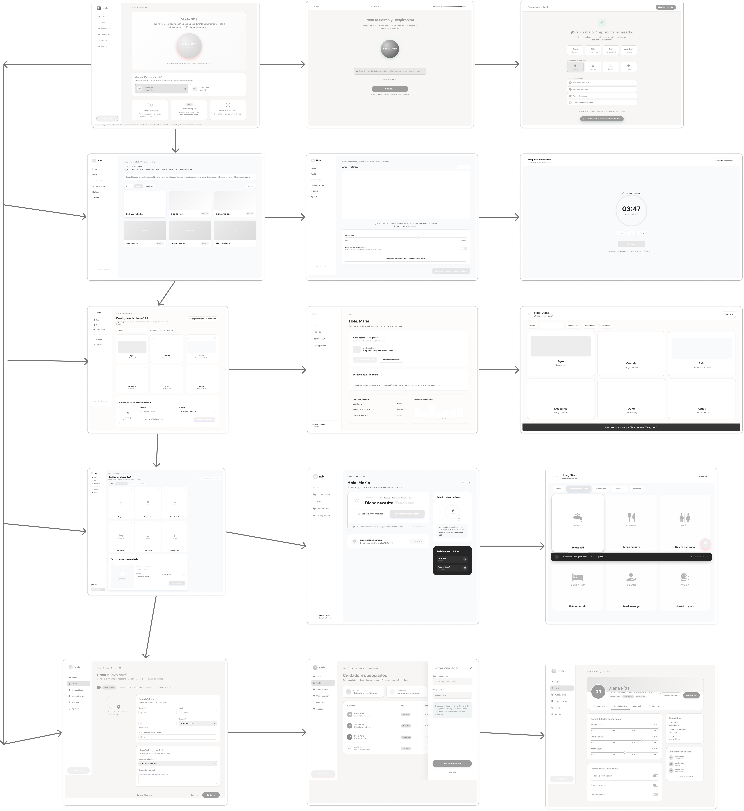

#### 4.4.2. Web Applications Mock-ups.

Modo SOS — pantalla de activación: botón circular "Activar SOS" en Coral Red sobre un fondo degradado cálido, selector de perfil ("¿Para quién es esta guía?") con las tarjetas de Diana Ríos y Mateo Vera, y tres tarjetas informativas que explican la guía paso a paso, la personalización según sensibilidades y el registro automático del episodio.

Configurar tablero CAA (variante con fotografías): cuadrícula de pictogramas de Necesidades básicas (Agua, Comida, Baño, Descanso, Dolor, Ayuda) usando imágenes fotográficas reales, cada uno marcable como favorito, junto al formulario inferior para agregar un pictograma personalizado con etiqueta y categoría.

Configurar tablero CAA (variante iconográfica): la misma cuadrícula de Necesidades básicas reinterpretada con iconografía lineal simple sobre fondo celeste sólido en lugar de fotografías, manteniendo las mismas categorías, favoritos y el formulario de carga de pictogramas personalizados.

Crear nuevo perfil — paso 1 "Datos básicos": formulario con carga de foto, campos de nombre, apellido, edad, género y apodo preferido, seguido de la sección "Diagnóstico y condición" (condición principal y notas del profesional), dentro de un flujo de tres pasos (Datos básicos, Diagnóstico, Sensibilidades).

Cuidadores asociados: listado del círculo de confianza de Diana Ríos (María Ríos como Principal, Javier Ríos como Cuidador, Lucía Peña como Terapeuta y Ana Ríos con invitación pendiente) junto a un panel lateral "Invitar cuidador" con campos de correo electrónico y asignación de rol.

Galería de estímulos (Autocuidado): selector de estímulos Visual/Auditivo con aviso contextual que prioriza opciones visuales por la sensibilidad auditiva alta de Diana, mostrando tarjetas como Burbujas flotantes, Olas de color, Cielo estrellado, Lluvia suave, Sonido del mar y Piano relajante, cada una marcable como favorita.

Modo SOS — Paso 5 de 6 "Calma y Respiración": círculo animado con el texto "Inhala... Exhala" para sincronizar la respiración del cuidador con la de Diana, acompañado de un aviso que recuerda mantener la voz baja por su sensibilidad auditiva alta y un indicador de progreso de pasos.

Panel de inicio del cuidador (variante violeta): saludo "Hola, María" con una notificación destacada de que Diana solicitó "Tengo sed" desde el Tablero de Comunicación, acciones para confirmar la recepción o ver el tablero completo, el estado actual ("Calma"), actividad reciente y un gráfico de nivel de interacción.

Panel de inicio del cuidador (variante azul con navegación lateral ampliada): la misma notificación de "Diana necesita: Tengo sed" con accesos a Comunicación, Salud y Red de Apoyo, un indicador circular de estado "Calma", historial de asistencia confirmada y una tarjeta de "Red de Apoyo rápida" con contacto directo al neurólogo y al padre.

Perfil de usuario — pestaña "Sensibilidades": ficha de Diana Ríos (15 años, TEA nivel 1) con controles deslizantes de sensibilidad Auditiva (Alta), Visual (Media) y Táctil (Baja), preferencias personales (modo de baja estimulación, priorizar visuales), datos de diagnóstico y la lista de cuidadores asociados.

Estímulo "Burbujas flotantes" en uso: animación de burbujas sobre fondo violeta con un círculo central "RESPIRA", control deslizante de intensidad (Suave–Intenso), interruptor de modo de baja estimulación y accesos para usar el temporizador de calma o terminar la sesión y volver a la galería.

Resumen del episodio (cierre del Modo SOS): mensaje de confirmación "¡Buen trabajo! El episodio ha pasado" con métricas del episodio (duración de 12 min, intensidad inicial Alta, final Baja, detonante Auditivo), selección del estado actual de Diana (Calmada) y el checklist de pasos completados (aislamiento sensorial, validación emocional, respiración guiada, uso de mordedor omitido).

Tablero CAA — vista del usuario neurodivergente (variante con fotografías): pantalla "Hola, Diana ¿Qué necesitas decir?" con la tarjeta "Agua / Tengo sed" seleccionada y reproduciendo audio, categorías filtrables (Necesidades básicas, Emociones, Actividades, Favoritos) y una notificación inferior confirmando el aviso enviado a María.

Tablero CAA — vista del usuario neurodivergente (variante iconográfica en azul): misma interacción "Tengo sed" con pictogramas representados en iconos lineales simples, botón flotante de SOS en la esquina y un toast de confirmación indicando que se avisó a María.

Temporizador de calma: cuenta regresiva circular (03:47 restantes de un total de 5:00) tras continuar con el estímulo "Burbujas flotantes", con opciones rápidas de duración (3, 5 o 10 min), botón de pausa y aviso de que al finalizar se preguntará cómo se siente Diana.

#### 4.4.3. Web Applications User Flow Diagrams.

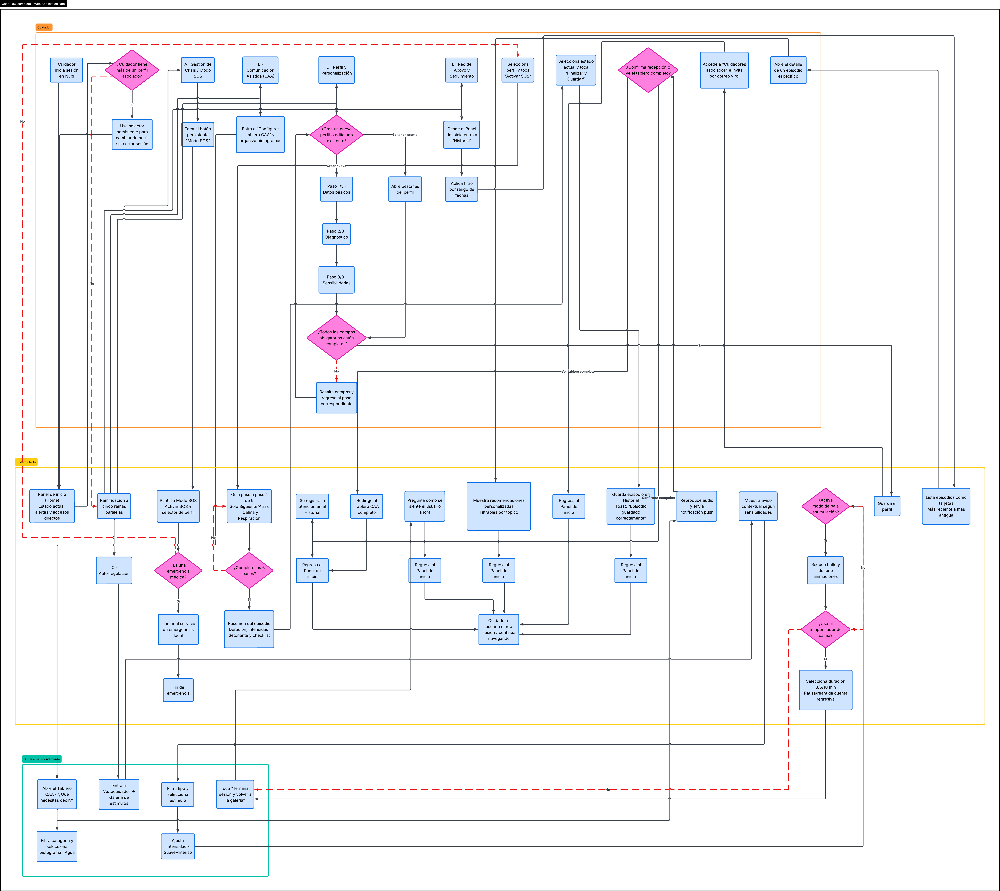

#### 4.5. Web Applications Prototyping.

|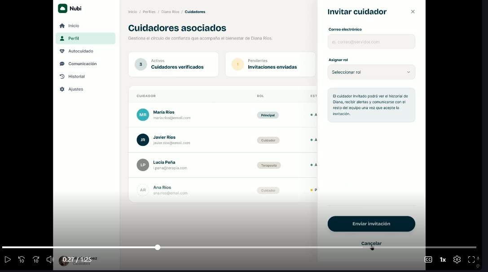                                                                                                                                                                                                                                                                                                                                |
|--------------------------------------------------------------------------------------------------------------------------------------------------------------------------------------------------------------------------------------------------------------------------------------------------------------------------------|
| link: https://upcedupe-my.sharepoint.com/:v:/g/personal/u20241a649_upc_edu_pe/IQDSl4T7xAKFT52jN0itd5DMAQr-yskvbFkI0PyL_iQqJqM?e=6kqdJ6&nav=eyJyZWZlcnJhbEluZm8iOnsicmVmZXJyYWxBcHAiOiJTdHJlYW1XZWJBcHAiLCJyZWZlcnJhbFZpZXciOiJTaGFyZURpYWxvZy1MaW5rIiwicmVmZXJyYWxBcHBQbGF0Zm9ybSI6IldlYiIsInJlZmVycmFsTW9kZSI6InZpZXcifX0%3D  |

## 4.6. Domain-Driven Software Architecture

En esta sección se profundiza el modelo del dominio construido en el Big Picture Event Storming hasta identificar los Bounded Contexts, Aggregates, Commands, Events y Queries de NUBI. A partir de ese modelo se representa la arquitectura de la solución aplicando C4 Model. Los diagramas de esta sección se elaboraron como Diagram-as-Code en Mermaid.

### 4.6.1. Design-Level Event Storming

El equipo realizó una sesión de Design-Level Event Storming de aproximadamente dos horas, partiendo de los cinco tableros del Big Picture Event Storming. Sobre cada tablero se agregaron los **Commands** que originan cada evento, los **Aggregates** que los procesan, las **Policies** que se disparan automáticamente y los **Read Models** que el usuario consulta para decidir. Además, cada hotspot del Big Picture se discutió y se convirtió en una decisión de diseño o quedó registrado como pregunta abierta.

Como resultado se confirmaron **cinco Bounded Contexts**, que corresponden a las cinco áreas del Big Picture. Las funciones de cuenta, suscripción y soporte técnico, que no tenían un tablero propio, se ubicaron en Perfil y Personalización, ya que todas pertenecen a la cuenta del usuario.

| Bounded Context | Responsabilidad | Épicas |
| :--- | :--- | :--- |
| Perfil y Personalización | Cuenta, perfil del usuario, contactos de confianza, suscripción e institución | EP01, EP02, EP03, EP11, EP12, EP13, EP14 |
| Gestión de Crisis (Modo SOS) | Guía paso a paso para el cuidador durante una crisis | EP04, EP10 |
| Autorregulación | Recursos de calma para el usuario neurodivergente | EP05 |
| Comunicación Asistida (CAA) | Tablero de pictogramas y salida de voz | EP06 |
| Red de Apoyo y Seguimiento | Alertas a contactos de confianza e historial de episodios | EP07, EP08, EP09, EP17 |

En los diagramas se mantiene la convención de colores del Event Storming: **naranja** para los Domain Events, **azul** para los Commands, **amarillo** para los Aggregates, **rosado** para los Actors, **morado** para las Policies, **verde** para los Read Models y **gris** para los sistemas externos.

#### Perfil y Personalización

Gestiona la cuenta del cuidador, docente o institución, y los perfiles de los usuarios neurodivergentes a su cargo: diagnóstico, detonantes, necesidad comunicativa, estrategia de calma, pictogramas y contactos de confianza. También concentra la suscripción, los planes institucionales y los reportes de soporte técnico.

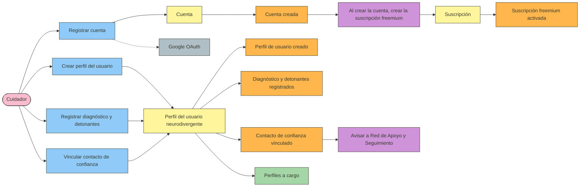

*Ilustración — Design-Level Event Storming: Perfil y Personalización*

**Hotspots resueltos:**

- *¿Lo configura el cuidador o el niño?* → El cuidador crea el perfil y registra el diagnóstico, los detonantes y los contactos de confianza. El usuario neurodivergente solo elige sus recursos y pictogramas favoritos.
- *¿Qué pasa si hay dos cuidadores del mismo niño?* → Un perfil admite varios cuidadores asociados, cada uno con su propia cuenta (US18).
- *¿Se valida el diagnóstico o se declara?* → Se declara. NUBI no valida ni emite diagnósticos, en línea con la restricción definida en la sección 1.2.

#### Gestión de Crisis (Modo SOS)

Conduce al cuidador durante una crisis con una guía de actuación adaptada al perfil del usuario, mostrando un paso de contención a la vez y sugiriendo una técnica alternativa cuando un paso no funciona. Al activarse avisa a Autorregulación y a Red de Apoyo y Seguimiento; al finalizar, solicita el registro del episodio.

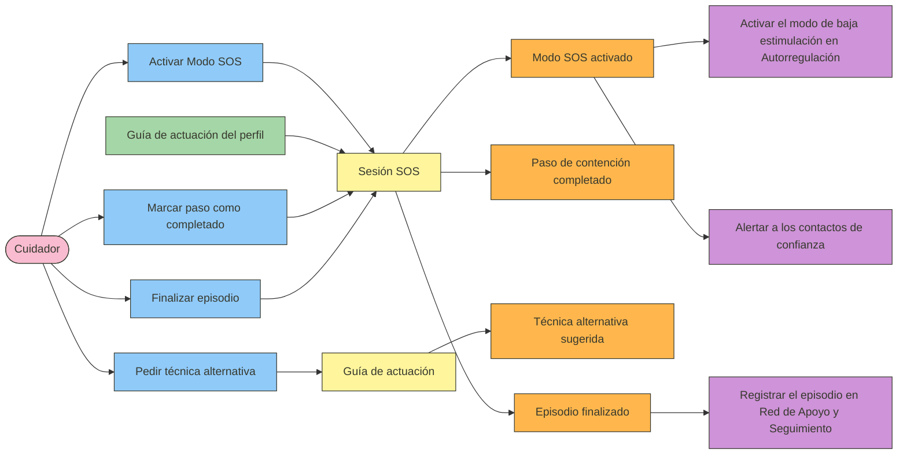

*Ilustración — Design-Level Event Storming: Gestión de Crisis (Modo SOS)*

**Hotspots resueltos:**

- *¿Quién declara que la crisis terminó?* → El cuidador, con el comando *Finalizar episodio* (US23).
- *¿Y si el cuidador abandona la guía a mitad?* → La sesión SOS se conserva en el último paso completado y puede retomarse. El episodio solo se registra al finalizar.
- *¿Funciona con el celular bloqueado?* → Una aplicación web no puede ejecutarse sobre la pantalla de bloqueo. Se resuelve con un acceso directo al Modo SOS desde la pantalla principal (US24) y con la guía disponible sin conexión (US90).

#### Autorregulación

Ofrece al usuario neurodivergente recursos de calma —respiración guiada, sonidos relajantes y lienzo de dibujo libre— filtrados según su perfil sensorial, y activa el modo de baja estimulación. Permite marcar recursos como favoritos y usar un temporizador de calma.

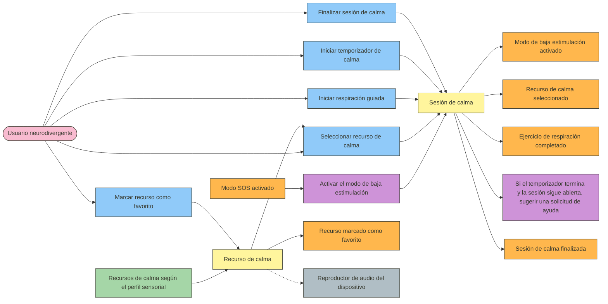

*Ilustración — Design-Level Event Storming: Autorregulación*

**Hotspots resueltos:**

- *¿Cuánto dura una sesión antes de sugerir pedir ayuda?* → Lo define el temporizador de calma configurado por el cuidador (US30). Si el tiempo termina y la sesión sigue abierta, se sugiere enviar una solicitud de ayuda.
- *¿Y si el usuario no tolera tocar la pantalla?* → Se priorizan recursos que no exigen interacción continua, como el audio y la respiración guiada con temporizador. Queda como pregunta abierta para validar con usuarios.

#### Comunicación Asistida (CAA)

Permite al usuario expresar necesidades con pictogramas, reportar su estado de ánimo y reproducir la frase en voz alta para el acompañante, quien confirma que la entendió. Los pictogramas más usados se agregan al acceso rápido.

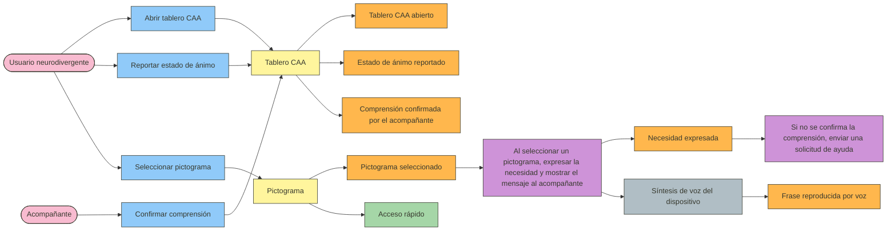

*Ilustración — Design-Level Event Storming: Comunicación Asistida (CAA)*

**Hotspots resueltos:**

- *¿Qué pasa si no hay nadie cerca para leer el mensaje?* → Si el acompañante no confirma la comprensión, se envía una solicitud de ayuda a Red de Apoyo y Seguimiento.
- *¿Cuántos pictogramas caben sin saturar la pantalla?* → El acceso rápido muestra solo los más usados y el resto se organiza por categorías (US35). El número exacto se define en el prototipo.
- *¿Y si el usuario no tolera tocar la pantalla?* → El acompañante puede operar el tablero por el usuario. Queda como pregunta abierta.

#### Red de Apoyo y Seguimiento

Envía las alertas a los contactos de confianza y registra la llegada del contacto. También registra cada episodio al finalizar el Modo SOS, permite marcar estrategias efectivas y genera el resumen que el cuidador puede compartir con el profesional de salud.

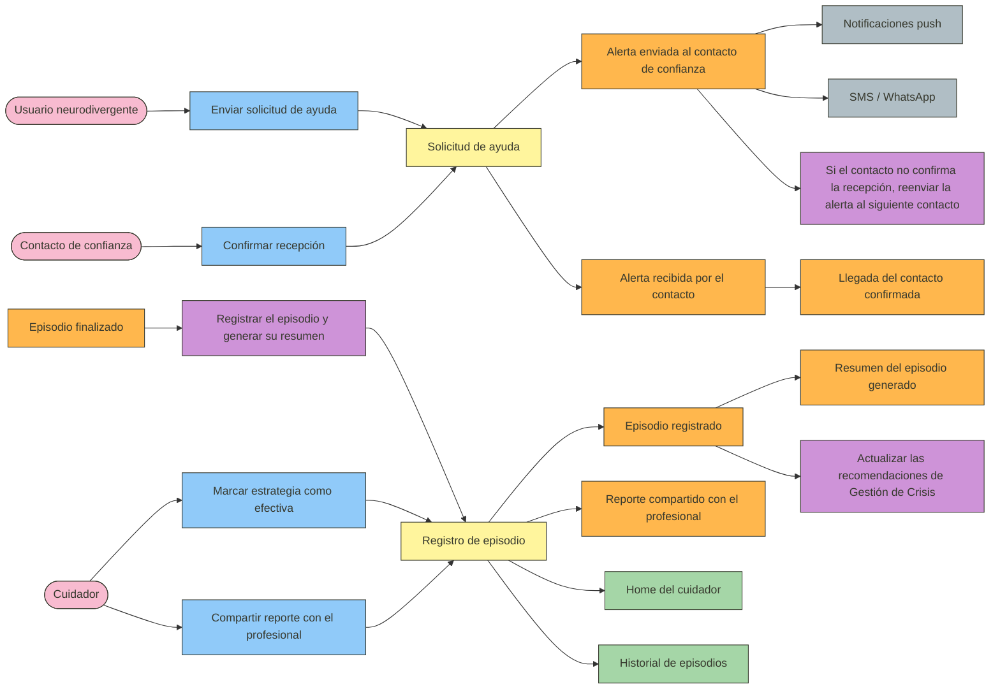

*Ilustración — Design-Level Event Storming: Red de Apoyo y Seguimiento*

**Hotspots resueltos:**

- *¿Qué pasa si el contacto no responde?* → Si no confirma la recepción, la alerta se reenvía al siguiente contacto de confianza.
- *Sin internet, ¿cómo se avisa?* → Sin datos móviles, la aplicación abre el SMS del teléfono con el mensaje de alerta ya escrito, que se envía con la señal celular.
- *¿Se envía ubicación?* → Ninguna historia de usuario lo contempla. Queda como pregunta abierta para una siguiente versión.

#### Integración entre Bounded Contexts

Los contextos se comunican mediante eventos de dominio y consultas al perfil del usuario.

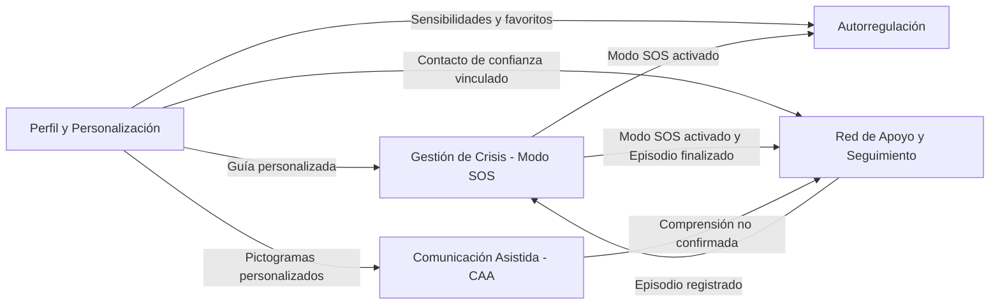

*Ilustración — Integración entre los Bounded Contexts de NUBI*

- **Perfil y Personalización** entrega a los demás contextos la información del perfil: la guía personalizada, las sensibilidades y los pictogramas.
- **Modo SOS activado** dispara el modo de baja estimulación en Autorregulación y la alerta a los contactos en Red de Apoyo y Seguimiento.
- **Episodio finalizado** hace que Red de Apoyo y Seguimiento registre el episodio, y ese registro actualiza las recomendaciones de Gestión de Crisis.
- **Comprensión no confirmada** en Comunicación Asistida genera una solicitud de ayuda.

---

### 4.6.2. Software Architecture Context Diagram

El diagrama de contexto muestra a NUBI como un solo sistema, rodeado de las personas que lo usan y de los sistemas externos con los que se comunica.

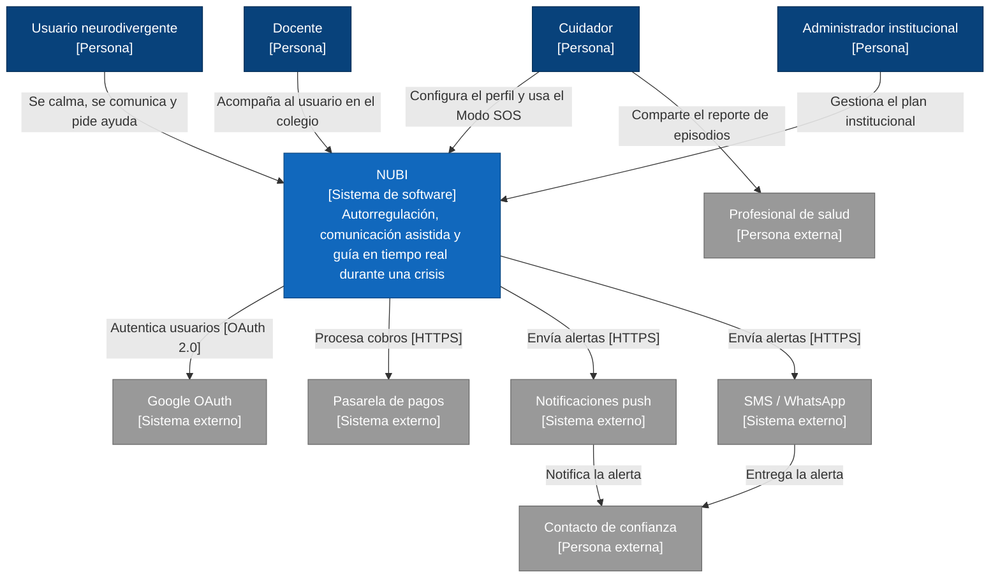

*Ilustración — Software Architecture Context Diagram de NUBI*

El **usuario neurodivergente** usa NUBI para calmarse, comunicarse con pictogramas y pedir ayuda. El **cuidador** y el **docente** configuran el perfil y usan el Modo SOS durante una crisis, y el **administrador institucional** gestiona los perfiles de estudiantes del plan institucional. El **contacto de confianza** y el **profesional de salud** no usan la aplicación directamente: el primero recibe las alertas y el segundo recibe los reportes de episodios que comparte el cuidador.

NUBI se apoya en cuatro sistemas externos: **Google OAuth** para el inicio de sesión (US04), una **pasarela de pagos** para el cobro de suscripciones (US61), un **servicio de notificaciones push** para alertas y recordatorios, y **SMS / WhatsApp** como canal de alerta. Estos dos últimos se identificaron en el Big Picture Event Storming.

### 4.6.3. Software Architecture Container Diagrams

El diagrama de contenedores muestra las piezas que se despliegan por separado, la tecnología de cada una y cómo se comunican.

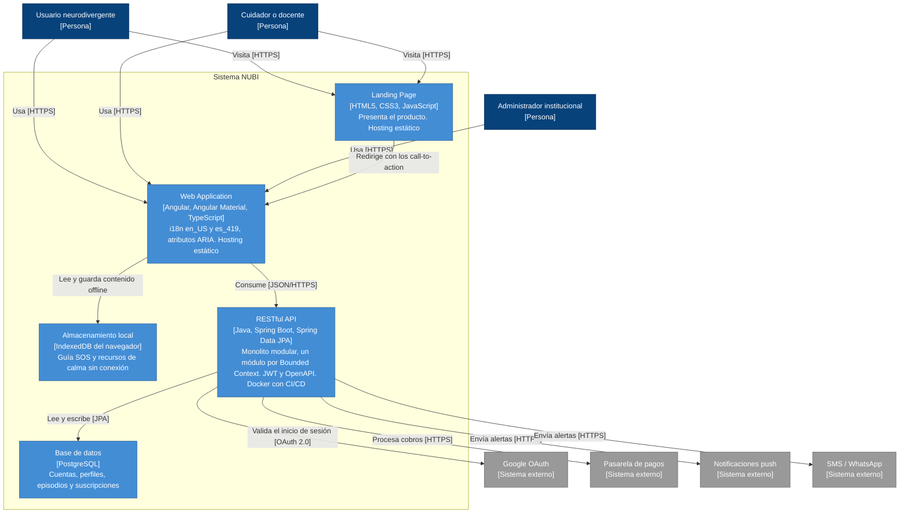

*Ilustración — Software Architecture Container Diagram de NUBI*

NUBI se compone de cinco contenedores. La **Landing Page** (HTML5, CSS3 y JavaScript) presenta el producto y redirige a la Web Application mediante sus call-to-action. La **Web Application** (Angular y Angular Material) concentra la experiencia del usuario neurodivergente y del cuidador, con i18n en en_US y es_419 y atributos ARIA. El **almacenamiento local** del navegador guarda la guía SOS y los recursos de calma para el modo offline básico (US90), un requisito que surgió en las entrevistas. El **RESTful API** (Java, Spring Boot y Spring Data JPA) contiene la lógica de negocio, usa JWT para la autenticación y se documenta con OpenAPI. La **base de datos** es PostgreSQL, administrada con pgAdmin.

El API se diseñó como un **monolito modular**: cada Bounded Context es un módulo con sus propias entidades y repositorios JPA (US98), pero todos se despliegan juntos en un solo contenedor Docker (US99). Así se mantiene la separación que exige Domain-Driven Design sin la complejidad de desplegar cinco servicios por separado. La Landing Page y la Web Application se publican en hosting estático (US100).

### 4.6.4. Software Architecture Components Diagrams

Se presentan los diagramas de componentes de los dos contenedores con lógica propia: el RESTful API y la Web Application. La Landing Page es un sitio estático y la base de datos es un almacén de datos, por lo que no se descomponen.

#### RESTful API

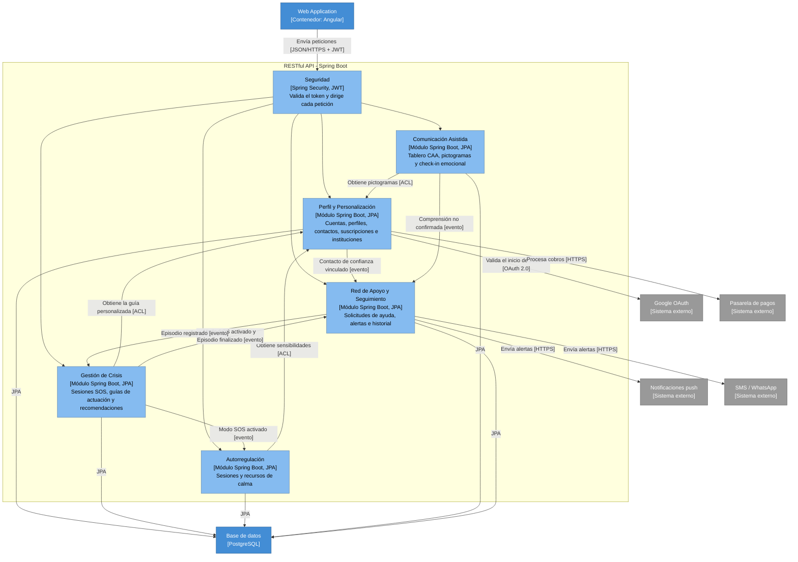

*Ilustración — Component Diagram del RESTful API*

Cada componente corresponde a uno de los cinco Bounded Contexts del Design-Level Event Storming. Todas las peticiones pasan primero por **Seguridad**, que valida el token JWT. **Perfil y Personalización** es el componente que consultan los demás para obtener la guía personalizada, las sensibilidades y los pictogramas del usuario, y es el que se comunica con Google OAuth y con la pasarela de pagos.

**Gestión de Crisis** publica el evento *Modo SOS activado*, que activa el modo de baja estimulación en **Autorregulación** y la alerta en **Red de Apoyo y Seguimiento**. Este último envía las alertas por notificaciones push o SMS / WhatsApp y registra cada episodio, lo que actualiza las recomendaciones de Gestión de Crisis. **Comunicación Asistida** genera una solicitud de ayuda cuando el acompañante no confirma haber entendido el mensaje.

#### Web Application

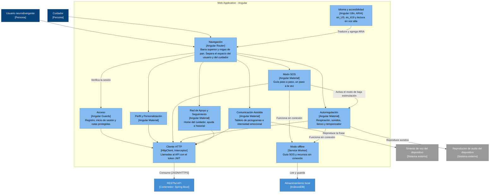

*Ilustración — Component Diagram de la Web Application*

La Web Application tiene un módulo por Bounded Context, de modo que el frontend refleja la estructura del backend. **Navegación** implementa la barra superior y las migas de pan de las Web Style Guidelines (4.1.2) y muestra el espacio del usuario neurodivergente o del cuidador según su rol. **Modo offline** mantiene la guía SOS y los recursos de calma disponibles sin conexión, y **Cliente HTTP** centraliza las llamadas al API agregando el token JWT. Los módulos de Comunicación Asistida y Autorregulación usan la síntesis de voz y el reproductor de audio del dispositivo, identificados en el Big Picture Event Storming.

#### 4.7. Software Object-Oriented Design.
#### 4.7.1. Class Diagrams.
#### 4.8. Database Design.
#### 4.8.1. Database Diagrams.