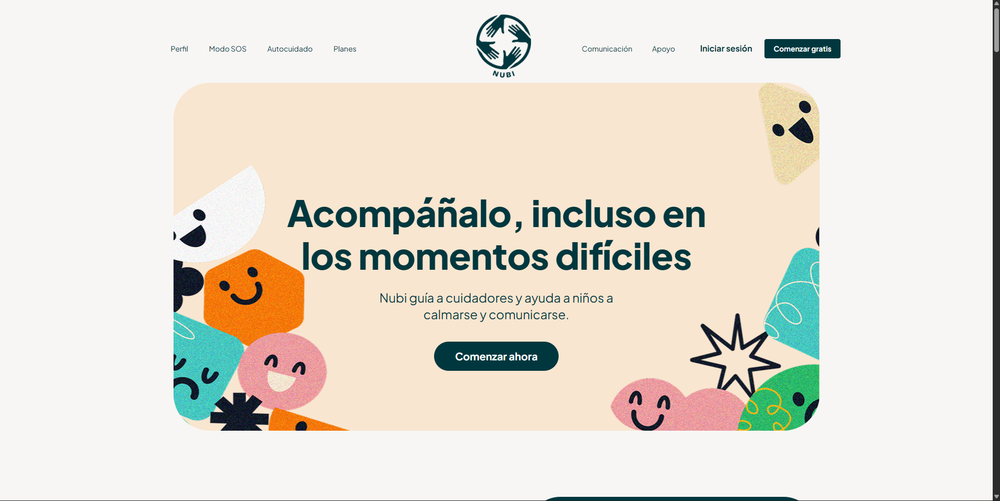
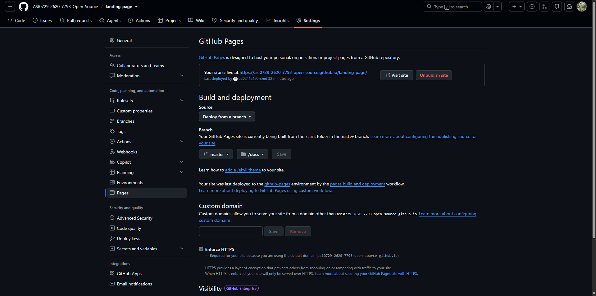
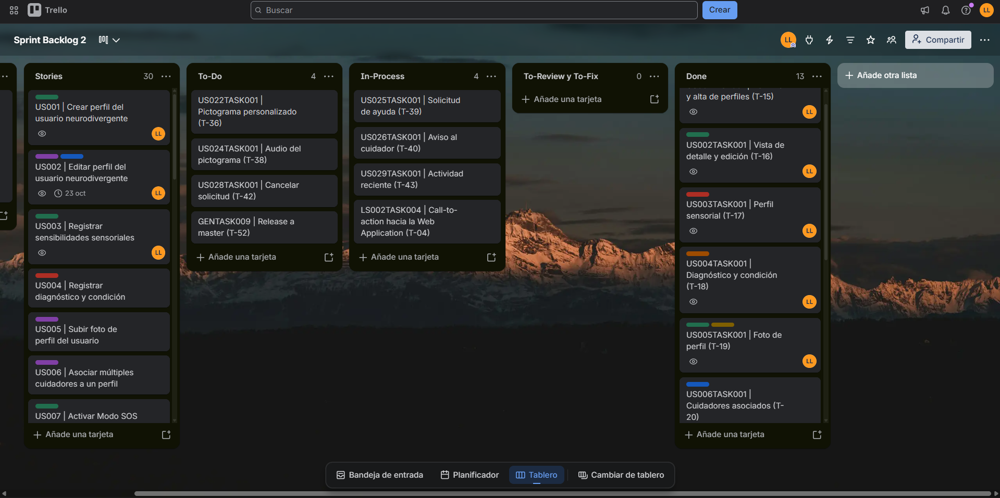
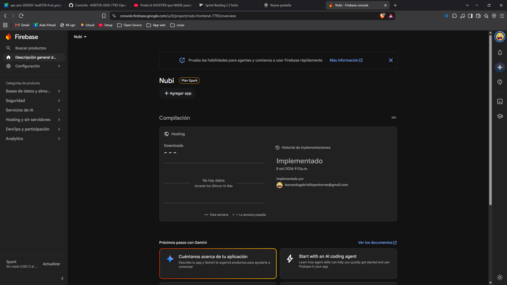
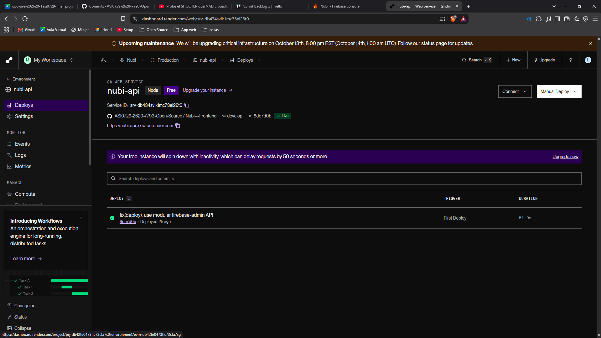
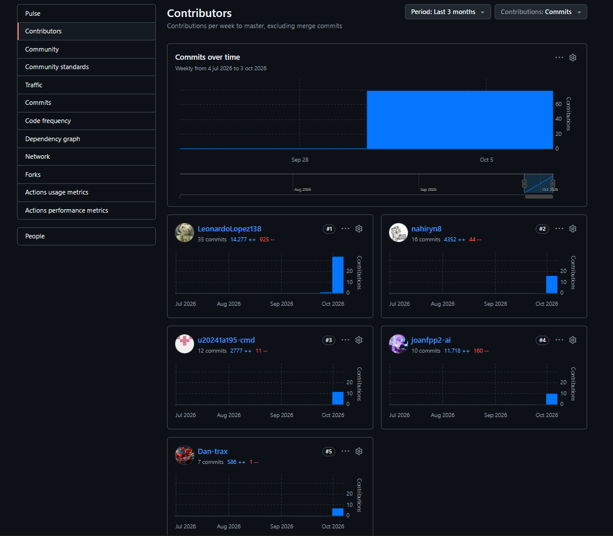
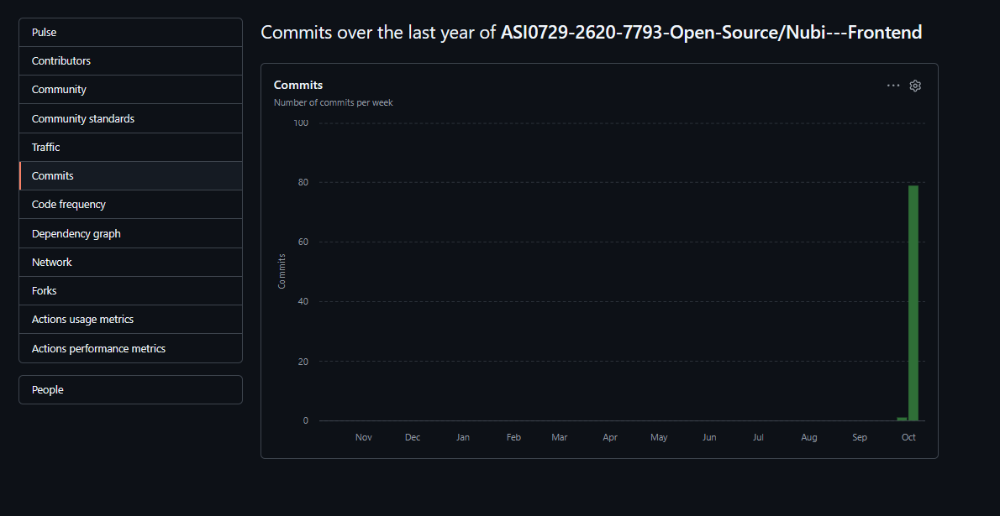
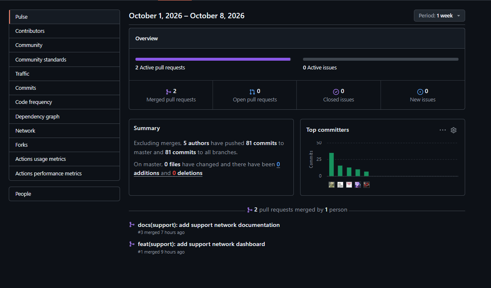

# Capítulo V: Product Implementation, Validation & Deployment

## 5.1. Software Configuration Management

En esta sección se establecen las decisiones, herramientas y convenciones utilizadas por el equipo de NUBI para gestionar de manera consistente los diferentes productos de software que conforman la solución durante su ciclo de vida.

La gestión de configuración comprende la definición del entorno de desarrollo, la administración y control de versiones del código fuente, las convenciones de programación adoptadas por el equipo y la configuración necesaria para el despliegue de los productos digitales.

Para el desarrollo colaborativo de NUBI se emplean herramientas de gestión de proyectos, diseño UX/UI, desarrollo de software, documentación y control de versiones. Asimismo, se utiliza Git y GitHub para mantener la trazabilidad de los cambios realizados por los integrantes del equipo y facilitar la integración progresiva del Landing Page, la Frontend Web Application y los RESTful Web Services.

### 5.1.1. Software Development Environment Configuration

Para el desarrollo de NUBI se utiliza un conjunto de herramientas que permiten cubrir las diferentes actividades del ciclo de vida del producto de software, incluyendo la gestión del proyecto, gestión de requisitos, diseño UX/UI, desarrollo del Landing Page, Frontend Web Application, RESTful Web Services, documentación y control de versiones.

Las herramientas seleccionadas permiten que los integrantes del equipo trabajen de manera colaborativa y mantengan consistencia entre los diferentes productos que conforman la solución.

| Área | Producto / Herramienta | Propósito de uso en NUBI                                                                                                                          | Referencia |
|---|------------------------|---------------------------------------------------------------------------------------------------------------------------------------------------|---|
| Project Management | Trello                 | Gestionar y priorizar el Product Backlog, organizar las User Stories y dar seguimiento a las actividades del equipo.                              | https://tinyurl.com/67v8umj |
| Requirements Management | GitHub                 | Mantener de forma colaborativa la documentación del proyecto, User Stories, Product Backlog y demás artefactos desarrollados en formato Markdown. | https://tinyurl.com/2cu3vhdy |
| UX Research | UXPressia              | Elaborar y documentar artefactos UX como User Personas, User Journey Maps, Empathy Maps e Impact Mapping.                                         | https://tinyurl.com/msh5wht |
| UX/UI Design | Figma                  | Diseñar Wireframes, Mock-ups y Prototypes correspondientes al Landing Page y la Web Application de NUBI.                                          | https://tinyurl.com/gmabjuv |
| Software Development | Webstorm|  Editar y desarrollar el código fuente correspondiente a los diferentes productos de software de NUBI.                                            | https://tinyurl.com/2ld4q5re |
| Landing Page Development | HTML5                  | Definir la estructura semántica del Landing Page.                                                                                                 | https://tinyurl.com/m8qyg6l |
| Landing Page Development | CSS3                   | Implementar los estilos visuales y el Responsive Web Design del Landing Page.                                                                     | https://tinyurl.com/kja33aj |
| Landing Page Development | JavaScript             | Implementar las interacciones y comportamiento dinámico del Landing Page.                                                                         | https://tinyurl.com/m9lqjhu |
| Frontend Web Application | Angular                | Framework utilizado para desarrollar la Frontend Web Application de NUBI.                                                                         | https://tinyurl.com/2ytawroy |
| Frontend Web Application | TypeScript             | Lenguaje de programación utilizado para desarrollar la lógica de la aplicación Angular.                                                           | https://tinyurl.com/j6laat4 |
| Frontend Web Application | Angular Material       | Biblioteca de componentes UI basada en Material Design utilizada para mantener consistencia visual en la Web Application.                         | https://tinyurl.com/2yn53adk |
| RESTful Web Services | Java                   | Lenguaje de programación utilizado para desarrollar la lógica del lado servidor.                                                                  | https://tinyurl.com/mqdmvce |
| RESTful Web Services | Spring Boot            | Framework utilizado para desarrollar los RESTful Web Services de NUBI.                                                                            | https://tinyurl.com/y5b5fo8d |
| Data Persistence | Spring Data JPA        | Facilitar el acceso y persistencia de información desde los RESTful Web Services.                                                                 | https://tinyurl.com/224lz3hm |
| API Documentation | OpenAPI / Swagger      | Documentar y visualizar los endpoints expuestos por el RESTful API.                                                                               | https://tinyurl.com/yah8y7dn |
| Source Code Management | Git                    | Gestionar el historial de cambios realizado sobre el código fuente de los diferentes productos.                                                   | https://tinyurl.com/pgkw6f7 |
| Source Code Management | GitHub                 | Alojar los repositorios del Landing Page, Frontend Web Application y RESTful Web Services, facilitando la colaboración del equipo.                | https://tinyurl.com/4dyt6b |
| Software Architecture | Mermaid                | Elaborar como código los diagramas de Event Storming y de arquitectura de software (C4 Model).                                                    | https://tinyurl.com/2yz5mw6k |
| Software Deployment | GitHub Pages           | Publicar el Landing Page como sitio web estático a partir del repositorio.                                                                        | https://tinyurl.com/ktgj8xw |
| Communication & Video | Microsoft Stream       | Publicar los videos de entrevistas, prototipos y exposiciones del proyecto.                                                                       | https://tinyurl.com/29w46hsb |

La selección de estas herramientas responde a los lineamientos tecnológicos establecidos para el proyecto y permite mantener un entorno de trabajo común entre los integrantes del equipo. Git y GitHub permiten gestionar los cambios realizados durante el desarrollo, mientras que Trello facilita la organización del Product Backlog. UXPressia y Figma son utilizados para la elaboración de los artefactos UX/UI, y WebStorm constituye el entorno principal para la edición del código fuente.

En cuanto a la implementación, el Landing Page se desarrolla utilizando HTML5, CSS3 y JavaScript; la Frontend Web Application utiliza Angular, TypeScript y Angular Material; mientras que los RESTful Web Services se implementan con Java, Spring Boot y Spring Data JPA. Finalmente, la documentación de los servicios se realiza mediante OpenAPI y Swagger.

### 5.1.2. Source Code Management

Para la gestión del código fuente de NUBI se utiliza **Git** como sistema de control de versiones distribuido y **GitHub** como plataforma para alojar los repositorios del proyecto y facilitar el trabajo colaborativo entre los integrantes del equipo. Mediante estas herramientas se mantiene la trazabilidad de los cambios realizados durante el desarrollo del Landing Page, la Frontend Web Application y los RESTful Web Services.

Los repositorios correspondientes a los productos de software de NUBI son los siguientes:

| Producto                 | Repositorio                |
|--------------------------|----------------------------|
| Landing Page             | https://tinyurl.com/28o2kj4u |
| Frontend Web Application | `no aplica`     |
| RESTful Web Services     | `no aplica`     |
| Project Report (documentación) | https://tinyurl.com/2cu3vhdy |

En el caso de los RESTful Web Services, el repositorio contendrá tanto el código fuente de los servicios como los archivos correspondientes a las pruebas unitarias y de integración.

#### GitFlow Workflow

El equipo adopta **GitFlow** como flujo de trabajo para organizar las diferentes etapas de desarrollo del proyecto. Esta estrategia permite separar las versiones estables de las funcionalidades que se encuentran en desarrollo y facilita la integración progresiva de los cambios realizados por los integrantes del equipo.

La estructura de ramas utilizada es la siguiente:

| Rama | Propósito |
|---|---|
| `main` | Contiene las versiones estables del producto preparadas para producción. |
| `develop` | Rama principal de integración de las funcionalidades desarrolladas por el equipo. |
| `feature/*` | Ramas utilizadas para desarrollar nuevas funcionalidades o cambios específicos. |
| `release/*` | Ramas utilizadas para preparar una nueva versión antes de integrarla a `main`. |
| `hotfix/*` | Ramas utilizadas para corregir errores críticos encontrados en una versión publicada. |

Las ramas de tipo `feature` se crean a partir de `develop`. Sus nombres deben ser descriptivos, estar escritos en inglés y utilizar la convención `kebab-case`.

Algunos ejemplos de ramas aplicadas a NUBI son: `feature/user-profile`, `feature/sos-mode`, `feature/self-regulation`, `feature/caa-board`, `feature/support-network` y `feature/landing-page`.

Para la elaboración y actualización de la documentación del proyecto también se utilizan ramas específicas como `feature/chapter-3`, `feature/chapter-4` y `feature/chapter-5`.

Una vez finalizado el trabajo realizado en una rama `feature/*`, los cambios son revisados antes de integrarse nuevamente a la rama `develop`.

Para preparar una nueva versión estable del producto se utilizan ramas `release/*`. La convención utilizada es `release/v<MAJOR>.<MINOR>.<PATCH>`. Por ejemplo: `release/v1.0.0` o `release/v1.1.0`.

Cuando se identifica un error crítico en una versión ya publicada se utiliza una rama `hotfix/*`. Por ejemplo: `hotfix/v1.0.1`.

Una vez realizada la corrección, los cambios de la rama `hotfix/*` son integrados tanto en `main` como en `develop`, con el objetivo de mantener consistencia entre las versiones del proyecto.

#### Semantic Versioning

Para identificar las diferentes versiones de los productos de NUBI se utiliza **Semantic Versioning**, siguiendo la estructura `MAJOR.MINOR.PATCH`.

Cada componente representa lo siguiente:

- **MAJOR:** se incrementa cuando se introducen cambios que no son compatibles con versiones anteriores.
- **MINOR:** se incrementa cuando se incorporan nuevas funcionalidades compatibles con la versión existente.
- **PATCH:** se incrementa cuando se realizan correcciones de errores compatibles con la versión actual.

Algunos ejemplos de versiones son `v1.0.0`, `v1.1.0` y `v1.1.1`.

De esta manera, la numeración de versiones permite identificar con mayor facilidad el alcance de los cambios realizados en cada publicación del producto.

#### Conventional Commits

Para mantener un historial de modificaciones claro, consistente y fácil de comprender, el equipo utiliza la especificación **Conventional Commits** para la redacción de los mensajes de commit.

La estructura utilizada es `<type>(<scope>): <description>`.

Los principales tipos de commit utilizados en el proyecto son:

| Tipo | Propósito |
|---|---|
| `feat` | Incorporación de una nueva funcionalidad. |
| `fix` | Corrección de un error. |
| `docs` | Cambios realizados en la documentación. |
| `style` | Cambios relacionados con formato o presentación que no modifican la lógica del sistema. |
| `refactor` | Reorganización del código sin modificar su comportamiento. |
| `test` | Incorporación o modificación de pruebas. |
| `chore` | Tareas relacionadas con configuración o mantenimiento del proyecto. |

Algunos ejemplos de mensajes de commit aplicados a NUBI son:

- `feat(profile): add user profile creation`
- `feat(sos): add SOS mode activation`
- `feat(regulation): add self-regulation stimuli`
- `feat(caa): add pictogram board`
- `feat(support): add support request`
- `style(landing): improve responsive layout`
- `fix(caa): correct pictogram selection`
- `docs(chapter5): add source code management`

El uso conjunto de Git, GitHub, GitFlow, Semantic Versioning y Conventional Commits permite mantener una organización consistente del código fuente, facilitar la colaboración entre los integrantes del equipo y conservar la trazabilidad de la evolución de los diferentes productos de software que conforman NUBI.

### 5.1.3. Source Code Style Guide & Conventions

Con el objetivo de mantener un código consistente, legible y fácil de mantener, el equipo de NUBI establece un conjunto de convenciones para los lenguajes y tecnologías utilizados durante el desarrollo del Landing Page, la Frontend Web Application y los RESTful Web Services.

Todos los nombres utilizados dentro del código fuente, incluyendo variables, funciones, métodos, clases, componentes, servicios, interfaces, archivos y carpetas, se escriben en **inglés**. De esta manera se mantiene una nomenclatura uniforme entre todos los integrantes del equipo.

Las convenciones adoptadas toman como referencia estándares reconocidos como Google HTML/CSS Style Guide, Angular Coding Style Guide, Google TypeScript Style Guide y Google Java Style Guide.

#### HTML5 Conventions

Para el desarrollo del Landing Page y de los templates de la Frontend Web Application se utilizan las siguientes convenciones:

- Se utilizan elementos semánticos de HTML5 como `header`, `nav`, `main`, `section`, `article` y `footer`.
- Las etiquetas y atributos se escriben en minúsculas.
- Los valores de los atributos utilizan comillas dobles.
- Se mantiene una indentación consistente de dos espacios.
- Las imágenes incluyen un atributo `alt` descriptivo.
- Los elementos interactivos deben incluir etiquetas descriptivas y atributos ARIA cuando corresponda.
- Se evita utilizar elementos HTML únicamente con fines de presentación cuando existe una alternativa semántica.

Ejemplos de nombres utilizados:

- `sos-mode`
- `user-profile`
- `communication-board`
- `self-regulation`
- `support-network`

#### CSS3 Conventions

Para los estilos del Landing Page y de la Frontend Web Application se utilizan las siguientes convenciones:

- Los nombres de clases CSS se escriben en inglés.
- Se utiliza `kebab-case` para los nombres de las clases.
- Se utilizan nombres que describan la función del componente y no únicamente su apariencia visual.
- Se mantiene una indentación consistente.
- Se evita duplicar estilos cuando estos pueden reutilizarse.
- Los colores, tipografías y espaciados deben mantener consistencia con el Design System definido para NUBI.

Ejemplos correctos:

- `.sos-section`
- `.profile-card`
- `.primary-button`
- `.communication-board`
- `.regulation-card`

Se evitan nombres poco descriptivos como `.box1`, `.red-button` o `.section2`.

#### JavaScript Conventions

Para el código JavaScript utilizado en el Landing Page se establecen las siguientes convenciones:

- Las variables y funciones utilizan `camelCase`.
- Las constantes utilizan `UPPER_SNAKE_CASE`.
- Los nombres deben indicar claramente su propósito.
- Se utiliza `const` por defecto cuando el valor no será reasignado.
- Se utiliza `let` cuando el valor de la variable pueda cambiar.
- Se evita el uso de `var`.
- Las funciones deben realizar una responsabilidad claramente definida.

Ejemplos:

- `selectedProfile`
- `activateSosMode()`
- `loadUserPreferences()`
- `DEFAULT_LANGUAGE`
- `MAX_RETRY_ATTEMPTS`

#### Gherkin Conventions

Para la especificación de escenarios y criterios de aceptación se utiliza la estructura Gherkin, manteniendo escenarios claros, comprobables y orientados al comportamiento esperado del sistema.

La estructura utilizada considera:

- `Given`: estado o condición inicial.
- `When`: acción realizada.
- `Then`: resultado esperado.

Los escenarios deben describir comportamiento y no detalles específicos de implementación.

#### Internationalization(i18n) and Accessibility Conventions

NUBI considera criterios de internacionalización y accesibilidad durante el desarrollo de sus productos digitales.

Para internacionalización se consideran los siguientes locales:

- `en.json`: English.
- `es.json`: Latin American Spanish.

El idioma predeterminado de la interfaz, mensajes y documentación técnica será inglés.

En cuanto a accesibilidad, el Landing Page y la Frontend Web Application deben considerar:

- Uso adecuado de HTML semántico.
- Atributos `alt` para imágenes.
- Atributos ARIA en elementos interactivos cuando corresponda.
- Etiquetas descriptivas en botones y controles.
- Navegación mediante teclado.
- Contraste adecuado entre texto y fondo.
- Retroalimentación visual comprensible para los diferentes estados del sistema.

La aplicación de estas convenciones permite que el código fuente de NUBI mantenga una estructura uniforme entre los integrantes del equipo, facilite el mantenimiento de los productos y reduzca inconsistencias durante el desarrollo colaborativo.

### 5.1.4. Software Deployment Configuration

La configuración de despliegue de NUBI tiene como objetivo establecer el proceso mediante el cual los diferentes productos de software desarrollados por el equipo pasan desde sus respectivos repositorios de código fuente hasta un entorno accesible para los usuarios.

La solución está conformada por tres productos principales: el **Landing Page**, la **Frontend Web Application** y los **RESTful Web Services**. Cada producto mantiene un proceso de despliegue independiente debido a las diferentes tecnologías y requisitos de ejecución que posee.

| Producto | Tecnologías principales | Rama de despliegue | Plataforma       |
|---|---|---|------------------|
| Landing Page | HTML5, CSS3 y JavaScript | `main` | GitHub Pages |
| Frontend Web Application | Angular y TypeScript | `main` | `No aplica`      |
| RESTful Web Services | Java, Spring Boot y Spring Data JPA | `main` |`No aplica`|

#### Landing Page Deployment

El Landing Page de NUBI está desarrollado utilizando HTML5, CSS3 y JavaScript. Debido a que se trata de un sitio web estático, su proceso de despliegue parte desde el repositorio correspondiente en GitHub.

El proceso considerado es el siguiente:

1. Los cambios son desarrollados y probados inicialmente en una rama `feature/*`.
2. Una vez revisados, los cambios son integrados en la rama `develop`.
3. Después de validar la versión correspondiente, los cambios son integrados en `main`.
4. La plataforma de despliegue obtiene la versión disponible en la rama `main`.
5. Los archivos HTML, CSS, JavaScript e imágenes son publicados en el servicio de hosting.
6. Finalmente, el Landing Page queda disponible mediante una URL pública.

La configuración debe garantizar que los recursos utilizados por el Landing Page se carguen correctamente y que la interfaz conserve el Responsive Web Design definido para NUBI tanto en Desktop como en Mobile Web Browser.

El Landing Page se publica con **GitHub Pages**, configurado para servir la carpeta `/docs` de la rama de despliegue del repositorio. Cada cambio integrado en esa rama actualiza el sitio publicado sin pasos adicionales de compilación.

La URL correspondiente al Landing Page desplegado es:

**Landing Page URL:** https://tinyurl.com/27e6ugke

#### Frontend Web Application Deployment

La Frontend Web Application de NUBI se desarrolla mediante Angular y TypeScript. Su despliegue se realiza a partir del código almacenado en el repositorio correspondiente de GitHub.

El proceso considerado es el siguiente:

1. Las nuevas funcionalidades son desarrolladas mediante ramas `feature/*`.
2. Después de su revisión, los cambios son integrados en la rama `develop`.
3. La versión estable es integrada posteriormente en `main`.
4. Se instalan las dependencias necesarias del proyecto.
5. Se genera la versión de producción de la aplicación Angular.
6. Los archivos generados son publicados en la plataforma seleccionada para el Frontend Web Application.
7. Se verifica que la aplicación pueda comunicarse correctamente con los RESTful Web Services desplegados.

La dirección de los RESTful Web Services debe mantenerse como una configuración dependiente del entorno, evitando almacenar directamente direcciones específicas de desarrollo o producción dentro de los componentes de la aplicación.

La URL correspondiente a la Frontend Web Application será:

**Frontend Web Application URL:** `pendiente: se definirá al desplegar la Web Application (Sprint 2)`

#### RESTful Web Services Deployment

Los RESTful Web Services de NUBI se desarrollan utilizando Java, Spring Boot y Spring Data JPA. Estos servicios proporcionan los endpoints necesarios para que la Frontend Web Application pueda acceder a las funcionalidades correspondientes a los diferentes Bounded Contexts definidos para NUBI.

El proceso de despliegue considerado es el siguiente:

1. El código fuente de los servicios es administrado mediante Git y GitHub.
2. Las funcionalidades son desarrolladas en ramas `feature/*` e integradas posteriormente en `develop`.
3. Antes de integrar una versión en `main`, se verifican las pruebas correspondientes.
4. Se genera la versión ejecutable del proyecto Spring Boot.
5. La aplicación es publicada en la plataforma seleccionada para los Web Services.
6. Se configuran las variables y parámetros necesarios para el entorno de producción.
7. Se establece la conexión con el mecanismo de persistencia utilizado por la solución.
8. Se verifica el correcto funcionamiento de los endpoints desplegados.
9. La documentación del RESTful API se mantiene disponible mediante OpenAPI y Swagger.

Los Web Services desplegados deben proporcionar soporte a los principales dominios funcionales de NUBI:

- Perfil y Personalización.
- Gestión de Crisis (Modo SOS).
- Autorregulación.
- Comunicación Asistida (CAA).
- Red de Apoyo y Seguimiento.

La URL base correspondiente a los RESTful Web Services será:

**RESTful Web Services URL:** `pendiente: se definirá al desplegar los Web Services`

#### Deployment Environments

Para mantener separados los cambios en desarrollo de las versiones utilizadas por los usuarios, NUBI considera diferentes entornos durante el ciclo de desarrollo.

| Entorno | Propósito |
|---|---|
| Development | Entorno utilizado por los integrantes del equipo para desarrollar y probar nuevas funcionalidades. |
| Production | Entorno que contiene las versiones estables de los productos y que se encuentra disponible para los usuarios finales. |

Las configuraciones que puedan variar entre estos entornos, como la URL de los RESTful Web Services, credenciales y parámetros de conexión, deben mantenerse separadas del código fuente y gestionarse mediante la configuración correspondiente de cada entorno.

#### Deployment Workflow

De manera general, el flujo de despliegue utilizado por NUBI sigue la siguiente secuencia:

**Desarrollo en `feature/*` → Integración en `develop` → Validación → Integración en `main` → Construcción de la versión de producción → Despliegue → Verificación del producto publicado.**

Esta configuración permite mantener separados los procesos de desarrollo y producción, conservar la trazabilidad de las versiones desplegadas y asegurar que el Landing Page, la Frontend Web Application y los RESTful Web Services puedan evolucionar de manera controlada durante el ciclo de vida de NUBI.

## 5.2. Landing Page, Services & Applications Implementation

En esta sección se documenta, Sprint a Sprint, la implementación del Landing Page, de los RESTful Web Services y de la Frontend Web Application de NUBI. Se documentan el **Sprint 1**, cuyo producto es la primera versión desplegada del Landing Page, y el **Sprint 2**, cuyo producto es la primera versión de la Frontend Web Application. Los RESTful Web Services se implementarán en los siguientes Sprints, según el orden del Product Backlog (sección 3.3); mientras tanto, la Frontend Web Application usa una API simulada.

### 5.2.1. Sprint 1

#### 5.2.1.1. Sprint Planning 1

El Sprint Planning 1 definió el alcance de la primera versión del Landing Page a partir de las Landing Page Stories LS-01 a LS-05 del Product Backlog, que encabezan la lista por ser el primer punto de contacto del visitante con la propuesta de valor de Nubi.

| Campo | Detalle |
|---|---|
| Sprint # | Sprint 1 |
| **Sprint Planning Background** | |
| Date | 2026-09-12 |
| Time | 10:00 AM |
| Location | Virtual (Google Meet) |
| Prepared By | Lopez Torres, Leonardo Gabriel |
| Attendees (to planning meeting) | Lopez Torres, Leonardo Gabriel / Diaz Yurivilca, Sofia / Payano Puchuri, Joan Fabricio / Ruiz Villegas, Yngrid Nahir / Diaz Caruzo, Edgard Daniel |
| Sprint 0 Review Summary | No aplica: es el primer Sprint del proyecto. |
| Sprint 0 Retrospective Summary | No aplica: es el primer Sprint del proyecto. |
| **Sprint Goal & User Stories** | |
| Sprint 1 Goal | *Our focus is on presenting the value proposition of Nubi through a first responsive version of the Landing Page. We believe it delivers a clear understanding of SOS Mode, self-regulation, the AAC board and the support network to caregivers, educators and therapists who visit the site. This will be confirmed when a visitor can reach each of the five feature sections (LS-01 to LS-05) and the plans section from the navigation, in Desktop and Mobile web browsers, in English or Spanish.* |
| Sprint 1 Velocity | 10 Story Points (igual a la suma de las Landing Page Stories del Sprint 1) |
| Sum of Story Points | 10 (LS-01: 2, LS-02: 2, LS-03: 2, LS-04: 2, LS-05: 2) |

#### 5.2.1.2. Aspect Leaders and Collaborators

Los aspectos considerados en el Sprint 1 corresponden a las secciones del Landing Page y a los aspectos transversales de la implementación. La Leadership-and-Collaboration Matrix indica quién lidera (L) y quién colabora (C) en cada aspecto; esta organización se refleja en la asignación de tareas del Sprint Backlog 1.

| Team Member (Last Name, First Name) | GitHub Username | Header, Hero & Navigation | Feature sections (LS-01 a LS-05) | Plans, FAQ & Testimonials | Team & Contact | i18n, Accessibility & Legal | Deployment |
|---|---|---|---|---|---|---|---|
| Lopez Torres, Leonardo Gabriel | [Deiko-138](https://tinyurl.com/2dnjhzhw) | L | L | L | L | L | L |
| Diaz Yurivilca, Sofia | [u20241a195-cmd](https://tinyurl.com/299rz9v4) | C | C | C | C | C | C |
| Payano Puchuri, Joan Fabricio | [joanfpp2-ai](https://tinyurl.com/2ykyhlc3) | C | C | C | C | C | C |
| Ruiz Villegas, Yngrid Nahir | [nahiryn8](https://tinyurl.com/28m8gfas) | C | C | C | C | C | C |
| Diaz Caruzo, Edgard Daniel | [Dan-trax](https://tinyurl.com/24dl9dkr) | C | C | C | C | C | C |

#### 5.2.1.3. Sprint Backlog 1

El objetivo del Sprint 1 es entregar y desplegar la primera versión del Landing Page, con las cinco secciones de valor (LS-01 a LS-05), los planes, las preguntas frecuentes, la presentación del equipo, el formulario de contacto y los enlaces legales, en versión responsive y en dos idiomas.

**URL del Sprint Backlog 1 en Trello:** https://tinyurl.com/25y7b883

| Sprint # | Sprint 1 | | | | | | |
|---|---|---|---|---|---|---|---|
| **Story Id** | **Story Title** | **Task Id** | **Task Title** | **Task Description** | **Estimation (Hours)** | **Assigned To** | **Status** |
| LS-01 | Conocer la personalización de perfiles en la landing page | T-01 | Sección Perfil y Personalización | Implementar la sección con la tarjeta de ejemplo de perfil (diagnóstico, sensibilidades y cuidadores vinculados). | 4 | Lopez Torres, Leonardo Gabriel | Done |
| LS-01 | Conocer la personalización de perfiles en la landing page | T-02 | Adaptación a móvil de la sección | Ajustar la sección a pantallas pequeñas mediante Responsive Web Design. | 3 | Lopez Torres, Leonardo Gabriel | Done |
| LS-02 | Conocer el Modo SOS en la landing page | T-03 | Sección Modo SOS | Implementar la sección con la guía de cuatro pasos del Modo SOS. | 4 | Lopez Torres, Leonardo Gabriel | Done |
| LS-02 | Conocer el Modo SOS en la landing page | T-04 | Call-to-action hacia la Web Application | Preparar el botón «Crear cuenta y activarlo» para redirigir a la vista de registro de la Web Application cuando esta se despliegue. | 2 | Lopez Torres, Leonardo Gabriel | In-Process |
| LS-03 | Conocer las herramientas de autorregulación en la landing page | T-05 | Sección Autorregulación | Implementar el panel de ejemplo con estímulos visuales y auditivos, intensidad y temporizador de calma. | 5 | Lopez Torres, Leonardo Gabriel | Done |
| LS-04 | Conocer el tablero CAA en la landing page | T-06 | Sección Comunicación CAA | Implementar la cuadrícula de pictogramas de ejemplo. | 3 | Lopez Torres, Leonardo Gabriel | Done |
| LS-04 | Conocer el tablero CAA en la landing page | T-07 | Preguntas frecuentes | Implementar las preguntas frecuentes como acordeón accesible con respuestas. | 3 | Lopez Torres, Leonardo Gabriel | Done |
| LS-05 | Conocer la red de apoyo y seguimiento en la landing page | T-08 | Sección Seguimiento y recomendaciones | Implementar la sección y su llamado a la acción hacia los planes. | 3 | Lopez Torres, Leonardo Gabriel | Done |
| — | Tarea general | T-09 | Header, Hero y Cómo funciona | Implementar la navegación, el menú móvil, el Hero, el problema y los cuatro pasos de uso. | 6 | Lopez Torres, Leonardo Gabriel | Done |
| — | Tarea general | T-10 | Planes, testimonios, beneficios, equipo y contacto | Implementar las secciones de conversión y confianza, y el footer. | 8 | Lopez Torres, Leonardo Gabriel | Done |
| — | Tarea general | T-11 | Internacionalización | Implementar los idiomas English (en_US, predeterminado) y Latin American Spanish (es_419) con selector de idioma. | 6 | Lopez Torres, Leonardo Gabriel | Done |
| — | Tarea general | T-12 | Accesibilidad | Agregar atributos ARIA, enlace para saltar al contenido, foco visible, navegación por teclado y respeto a `prefers-reduced-motion`. | 4 | Lopez Torres, Leonardo Gabriel | Done |
| — | Tarea general | T-13 | Términos de uso | Redactar y publicar los términos de uso, la política de privacidad y el aviso de accesibilidad, enlazados desde el footer. | 3 | Lopez Torres, Leonardo Gabriel | Done |
| — | Tarea general | T-14 | Despliegue | Configurar GitHub Pages para publicar el Landing Page desde el repositorio. | 2 | Lopez Torres, Leonardo Gabriel | Done |

#### 5.2.1.4. Development Evidence for Sprint Review

En el Sprint 1 se implementó la primera versión del Landing Page como sitio estático con HTML5, CSS3 y JavaScript, aplicando el Design System de la sección 4.1 (paleta de colores y tipografía Bricolage Grotesque) y las decisiones de Arquitectura de Información de la sección 4.2. La tabla registra los commits del repositorio, incluida la internacionalización (i18n) del Landing Page en inglés y español, desarrollada en la rama `feature/I18n`, integrada en `develop` con GitFlow y publicada en `master`.

| Repository | Branch        | Commit Id | Commit Message | Commit Message Body | Committed on (Date) |
|---|---------------|---|---|---|---|
| ASI0729-2620-7793-Open-Source/landing-page | `master` | [8da4692](https://tinyurl.com/23sl3mff) | chore: initial commit | — | 19/09/2026 |
| ASI0729-2620-7793-Open-Source/landing-page | `master` | [e2de4c4](https://tinyurl.com/2yqyjzdt) | docs: add readme | — | 19/09/2026 |
| ASI0729-2620-7793-Open-Source/landing-page | `master` | [c9a4df7](https://tinyurl.com/26zqml4a) | docs: add docs to all the codes. | — | 19/09/2026 |
| ASI0729-2620-7793-Open-Source/landing-page | `feature/I18n` | [2b47acf](https://tinyurl.com/26fcgrhe) | feat: add i18n lenguage spanish and inglish | — | 19/09/2026 |
| ASI0729-2620-7793-Open-Source/landing-page | `develop` | [4dfbb36](https://tinyurl.com/25xcyz34) | Merge branch 'feature/I18n' into develop | — | 19/09/2026 |
| ASI0729-2620-7793-Open-Source/landing-page | `master` | [5119b9e](https://tinyurl.com/2yeyfoaa) | feat: add intercionalizacion lenguague | — | 19/09/2026 |

#### 5.2.1.5. Execution Evidence for Sprint Review

El Landing Page desplegado presenta, en una sola página, la propuesta de valor de Nubi (Hero, problema y cómo funciona), las cinco secciones de valor asociadas a los Bounded Contexts (Perfil y Personalización, Modo SOS, Autorregulación, Comunicación CAA y Red de Apoyo y Seguimiento), los planes Free, Premium e Instituciones, las preguntas frecuentes, la presentación del equipo, el formulario de contacto y el footer con los enlaces legales. La navegación superior usa las mismas etiquetas del Labeling System (sección 4.2.2) y, en pantallas pequeñas, se reemplaza por un menú desplegable. El sitio está disponible en English (predeterminado) y Latin American Spanish.

**Landing Page URL:** https://tinyurl.com/27e6ugke

**Video de navegación del Sprint 1:** https://tinyurl.com/2dfst868

#### 5.2.1.6. Services Documentation Evidence for Sprint Review

En el Sprint 1 no se implementan RESTful Web Services: el alcance se limita al Landing Page. La documentación de endpoints con OpenAPI (Swagger) se presentará a partir del Sprint en que se implementen los servicios, según las Technical Stories TS-01 a TS-05 del Product Backlog.

#### 5.2.1.7. Software Deployment Evidence for Sprint Review

En el Sprint 1 se desplegó el Landing Page. Los pasos realizados fueron: (1) crear el repositorio `landing-page` en la organización de GitHub del equipo; (2) subir el código del sitio en la carpeta `/docs`; (3) activar GitHub Pages sobre esa carpeta; y (4) verificar que el sitio sea accesible mediante la URL pública y que sus imágenes y estilos se carguen correctamente.

#### 5.2.1.8. Team Collaboration Insights during Sprint

La colaboración del equipo en el Sprint 1 se evidencia con los analíticos de GitHub Insights de los dos repositorios del proyecto: el del informe, donde el equipo documenta el proceso de ingeniería, y el del Landing Page, donde se implementa el producto.

##### Repositorio del informe (Macally)

La colaboración del equipo durante el Sprint 1 se evidencia con los analíticos de GitHub Insights del repositorio del informe [ASI0729-2620-7793-Open-Source/Macally](https://tinyurl.com/2cu3vhdy), donde el equipo documenta el proceso de ingeniería (capítulos I a V) siguiendo GitFlow y Conventional Commits. Los cinco integrantes registran commits en la rama `main`, cada uno con su cuenta de GitHub: Dan-trax (Diaz Caruzo, Edgard Daniel), nahiryn8 (Ruiz Villegas, Yngrid Nahir), u20241a195-cmd (Diaz Yurivilca, Sofia), Deiko-138 (Lopez Torres, Leonardo Gabriel) y joanfpp2-ai (Payano Puchuri, Joan Fabricio).

*Figura 1. Code frequency del repositorio del informe.* Muestra las líneas agregadas (verde) y eliminadas (rojo) por semana desde fines de agosto de 2026. La actividad se concentra en las semanas del 31 de agosto y del 14 de septiembre: la primera con unas 3,5 mil líneas agregadas y la segunda con cerca de 4 mil agregadas y 4,6 mil eliminadas, lo que refleja la redacción de los capítulos y su posterior revisión y corrección.

*Figura 2. Commits por semana del repositorio del informe.* Muestra el número de commits semanales durante el último año. El repositorio no tiene actividad hasta fines de agosto de 2026 y, a partir de entonces, crece semana a semana: aproximadamente 4, 20, 21 y 51 commits en las últimas cuatro semanas, con el pico en la semana previa a la entrega AV1.

*Figura 3. Pulse del 12 al 19 de septiembre de 2026.* Resume la última semana antes de la entrega: 5 autores enviaron 52 commits a `main` y a todas las ramas, se modificaron 148 archivos en `main` con 2978 líneas agregadas y 440 eliminadas, y el gráfico Top committers muestra que los cinco integrantes aportaron en la semana. No hay pull requests ni issues abiertos o cerrados en el período, porque el equipo integra el trabajo de las ramas `feature/*` mediante merges a `develop` y `main`.

*Figura 4. Contributors (últimos 3 meses, commits a `main` sin contar merges).* Muestra la evolución semanal del repositorio y una gráfica por contribuidor:

| Puesto | Cuenta de GitHub | Integrante | Commits | Líneas      |
|---|---|---|---------|-------------|
| #1 | Dan-trax | Diaz Caruzo, Edgard Daniel | 0       | 0           |
| #2 | nahiryn8 | Ruiz Villegas, Yngrid Nahir | 0       | 0           |
| #3 | u20241a195-cmd | Diaz Yurivilca, Sofia | 19      | +407 / −404 |
| #4 | Deiko-138 | Lopez Torres, Leonardo Gabriel | 17      | +984 / -0   |
| #5 | joanfpp2-ai | Payano Puchuri, Joan Fabricio | 0       | 0           |

Los cinco integrantes tienen commits en `main`, con distinto volumen y en distintas semanas según los capítulos y aspectos que lideró cada uno.

##### Repositorio del Landing Page (landing-page)

El repositorio [ASI0729-2620-7793-Open-Source/landing-page](https://tinyurl.com/28o2kj4u) se creó el 19 de septiembre de 2026 y contiene la primera versión del Landing Page. Sus analíticos de GitHub Insights se muestran a continuación.

*Figura 5. Contributors del repositorio del Landing Page (últimos 3 meses, commits a `master` sin contar merges).* Muestra que el repositorio registra 3 commits, todos en la semana del 14 de septiembre de 2026: Deiko-138 con 2 commits (+984 líneas, sin eliminaciones) y u20241a195-cmd con 1 commit (+407 / −404 líneas).

*Figura 6. Commits por semana del repositorio del Landing Page.* Muestra que los 3 commits del repositorio se concentran en la última semana, que corresponde al Sprint 1, sin actividad previa.

| Commit | Cuenta de GitHub | Integrante | Mensaje |
|---|---|---|---|
| [8da4692](https://tinyurl.com/23sl3mff) | Deiko-138 | Lopez Torres, Leonardo Gabriel | chore: initial commit |
| [e2de4c4](https://tinyurl.com/2yqyjzdt) | Deiko-138 | Lopez Torres, Leonardo Gabriel | docs: add readme |
| [c9a4df7](https://tinyurl.com/26zqml4a) | u20241a195-cmd | Diaz Yurivilca, Sofia | docs: add docs to all the codes. |
| [2b47acf](https://tinyurl.com/26fcgrhe) | Deiko-138 | Lopez Torres, Leonardo Gabriel | feat: add i18n lenguage spanish and inglish |
| [4dfbb36](https://tinyurl.com/25xcyz34) | Deiko-138 | Lopez Torres, Leonardo Gabriel | Merge branch 'feature/I18n' into develop |
| [5119b9e](https://tinyurl.com/2yeyfoaa) | Deiko-138 | Lopez Torres, Leonardo Gabriel | feat: add intercionalizacion lenguague |

En este Sprint, Leonardo Gabriel Lopez Torres creó el repositorio y su README y desarrolló la internacionalización (i18n) del Landing Page en inglés y español (rama `feature/I18n`, integrada en `develop` y publicada en `master`), y Sofia Diaz Yurivilca documentó el código de la landing. Las Figuras 5 y 6 se capturaron antes de subir la internacionalización; la tabla incluye todos los commits del Sprint. Los cinco integrantes registran aportes en el repositorio del informe (Figuras 1 a 4), donde se documentaron el diseño y el contenido que se implementan en el Landing Page, ademas en esta ultima se agrego la intercionalizacion i18n.

### 5.2.2. Sprint 2

#### 5.2.2.1. Sprint Planning 2

El Sprint Planning 2 definió el alcance de la primera versión de la Frontend Web Application a partir de las User Stories US-01 a US-29 del Product Backlog, que corresponden a las épicas EPIC-01 a EPIC-05: Perfil y Personalización, Gestión de Crisis (Modo SOS), Autorregulación, Comunicación Asistida (CAA) y Red de Apoyo y Seguimiento. Cada Bounded Context se desarrolla en su propia rama `feature/*` del repositorio [Nubi---Frontend](https://tinyurl.com/2cxsdvov) y se integra en `develop` siguiendo GitFlow (sección 5.1.2). En este Sprint la aplicación consume una API simulada con json-server, porque los RESTful Web Services se implementarán en un Sprint posterior.

| Campo | Detalle |
|---|---|
| Sprint # | Sprint 2 |
| **Sprint Planning Background** | |
| Date | 2026-10-03 |
| Time | 01:04 PM |
| Location | Virtual (Google Meet y WhatsApp) |
| Prepared By | Diaz Yurivilca, Sofia |
| Attendees (to planning meeting) | Lopez Torres, Leonardo Gabriel / Diaz Yurivilca, Sofia / Payano Puchuri, Joan Fabricio / Ruiz Villegas, Yngrid Nahir / Diaz Caruzo, Edgard Daniel |
| Sprint 1 Review Summary | El Landing Page se desplegó en GitHub Pages con las historias LS-01 a LS-05 completas (10 de 10 Story Points), además de los planes, las preguntas frecuentes, la presentación del equipo y el formulario de contacto, en English y Latin American Spanish y con criterios de accesibilidad. De las 14 tareas del Sprint Backlog 1, 13 quedaron en Done y la tarea T-04 (botón «Crear cuenta y activarlo» hacia la Web Application) quedó en In-Process, porque la aplicación todavía no estaba desplegada; se completa en este Sprint. |
| Sprint 1 Retrospective Summary | A partir de la evidencia del Sprint 1 se identifican como aciertos la entrega completa del alcance planificado del Landing Page, la incorporación temprana de internacionalización y accesibilidad, y el uso de GitFlow y Conventional Commits. Como oportunidades de mejora se identifican que las 14 tareas se asignaron a un solo integrante y que los 3 commits del repositorio del Landing Page se concentraron en la última semana (Figura 6). Para el Sprint 2 el trabajo se reparte por Bounded Context, cada uno en su propia rama `feature/*`, con commits pequeños y frecuentes. |
| **Sprint Goal & User Stories** | |
| Sprint 2 Goal | *Our focus is on delivering a first deployed version of the Nubi Frontend Web Application with the main flows of its five Bounded Contexts. We believe it delivers to caregivers a way to personalize the profile of the child or teenager, activate SOS Mode with a step-by-step guide, choose calming stimuli, communicate with the AAC board and request help from the support network, instead of only reading about these features in the Landing Page. This will be confirmed when a caregiver can complete each of these flows (US-01 to US-29) from the deployed application, in Desktop and Mobile web browsers, in English or Spanish.* |
| Sprint 2 Velocity | 77 Story Points|
| Sum of Story Points | 77 |

La distribución del alcance por épica es la siguiente:

| Épica | User Stories | Story Points |
|---|---|---|
| EPIC-01 Perfil y Personalización | US-01 a US-06 | 15 |
| EPIC-02 Gestión de Crisis (Modo SOS) | US-07 a US-12 | 17 |
| EPIC-03 Autorregulación | US-13 a US-18 | 16 |
| EPIC-04 Comunicación Asistida (CAA) | US-19 a US-24 | 17 |
| EPIC-05 Red de Apoyo y Seguimiento | US-25 a US-29 | 12 |
| **Total** | **29 User Stories** | **77** |

No forman parte del compromiso del Sprint 2 las historias de seguimiento y recomendaciones de Red de Apoyo y Seguimiento (US-30 a US-45), la cuenta y la suscripción (US-46 a US-48) ni las Technical Stories TS-01 a TS-05, que permanecen en el Product Backlog.

#### 5.2.2.2. Aspect Leaders and Collaborators

Los aspectos considerados en el Sprint 2 corresponden a los cinco Bounded Contexts de la Frontend Web Application y a los aspectos transversales que todos comparten. A diferencia del Sprint 1, cada Bounded Context tiene un líder distinto, que lo desarrolla en su propia rama `feature/*` del repositorio Nubi---Frontend; el resto del equipo colabora revisando e integrando ese trabajo en `develop`. La Leadership-and-Collaboration Matrix indica quién lidera (L) y quién colabora (C) en cada aspecto; esta organización se refleja en la asignación de tareas del Sprint Backlog 2.

| Team Member (Last Name, First Name) | GitHub Username | Perfil y Personalización | Gestión de Crisis (Modo SOS) | Autorregulación | Comunicación Asistida (CAA) | Red de Apoyo y Seguimiento | Shared (layout, navegación, i18n y API simulada) | Integración en `develop` | Deployment |
|---|---|---|---|---|---|---|---|---|---|
| Lopez Torres, Leonardo Gabriel | [LeonardoLopez138](https://tinyurl.com/2a8ze8hx) | C | C | C | L | C | C | C | C |
| Diaz Yurivilca, Sofia | [u20241a195-cmd](https://tinyurl.com/299rz9v4) | C | L | C | C | C | C | L | C |
| Payano Puchuri, Joan Fabricio | [joanfpp2-ai](https://tinyurl.com/2ykyhlc3) | C | C | L | C | C | L | C | C |
| Ruiz Villegas, Yngrid Nahir | [nahiryn8](https://tinyurl.com/28m8gfas) | L | C | C | C | C | C | C | C |
| Diaz Caruzo, Edgard Daniel | [Dan-trax](https://tinyurl.com/24dl9dkr) | C | C | C | C | L | C | C | L |

Cada aspecto agrupa el siguiente trabajo:

- **Perfil y Personalización:** perfiles del niño o adolescente, perfil sensorial, cuidadores asociados y cuenta (rama `feature/profile-personalization`).
- **Gestión de Crisis (Modo SOS):** activación del Modo SOS, guía paso a paso y resumen del episodio (rama `feature/crisis-management`).
- **Autorregulación:** galería de estímulos visuales y auditivos, estímulo en uso con intensidad y modo de baja estimulación, y temporizador de calma (rama `feature/self-regulation`).
- **Comunicación Asistida (CAA):** tablero de pictogramas y necesidades básicas (rama `feature/assistive-comunication`).
- **Red de Apoyo y Seguimiento:** panel del cuidador con solicitudes de ayuda y seguimiento (rama `feature/support-network`).
- **Shared:** layout responsive con barra lateral y barra superior, navegación entre módulos, internacionalización en English y Latin American Spanish, y la API simulada con json-server que usan todos los Bounded Contexts.
- **Integración en `develop`:** unión de las ramas `feature/*` en `develop` siguiendo GitFlow (sección 5.1.2).
- **Deployment:** publicación de la Frontend Web Application para la revisión del Sprint (sección 5.2.2.7).

#### 5.2.2.3. Sprint Backlog 2

El objetivo del Sprint 2 es entregar y desplegar la primera versión de la Frontend Web Application de Nubi, con los flujos principales de sus cinco Bounded Contexts (Perfil y Personalización, Gestión de Crisis, Autorregulación, Comunicación Asistida y Red de Apoyo y Seguimiento), en versión responsive, en English y Latin American Spanish, y consumiendo una API simulada con json-server. El Sprint Backlog 2 descompone las User Stories US-01 a US-29 en tareas asignadas según la Leadership-and-Collaboration Matrix de la sección 5.2.2.2, y agrega las tareas generales que no dependen de una User Story en particular.

**URL del Sprint Backlog 2 en Trello:** https://tinyurl.com/2afdpsnp

*Sprint Backlog 2 en Trello.* Tablero del Sprint 2 con las listas Stories, To-Do, In-Process, To-Review y To-Fix, y Done. La lista Stories reúne las User Stories comprometidas (US-01 en adelante) y las demás listas muestran sus tareas según su estado: en To-Do están las de pictograma personalizado (US-22), audio del pictograma (US-24), cancelar solicitud (US-28) y el release a `master`; en In-Process, las de solicitud de ayuda (US-25), aviso al cuidador (US-26), actividad reciente (US-29) y el call-to-action del Landing Page hacia la Web Application; y en Done, las tareas ya terminadas, como las de Perfil y Personalización (US-01 a US-06).
## Sprint 2

| Story Id | Story Title | Task Id | Task Title | Task Description | Estimation (Hours) | Assigned To | Status |
|---|---|---|---|---|---|---|---|
| US-01 | Crear perfil del usuario neurodivergente | T-15 | Dominio y alta de perfiles | Implementar el modelo de dominio del perfil, su endpoint en la API simulada y el formulario de creación en la lista de perfiles. | 5 | Ruiz Villegas, Yngrid Nahir | Done |
| US-02 | Editar perfil del usuario neurodivergente | T-16 | Vista de detalle y edición | Implementar la vista de detalle del perfil con edición de sus datos. | 3 | Ruiz Villegas, Yngrid Nahir | Done |
| US-03 | Registrar sensibilidades sensoriales | T-17 | Perfil sensorial | Registrar las sensibilidades sensoriales del perfil y su nivel, para que las usen Autorregulación y el Modo SOS. | 3 | Ruiz Villegas, Yngrid Nahir | Done |
| US-04 | Registrar diagnóstico y condición | T-18 | Diagnóstico y condición | Agregar al perfil los campos de diagnóstico y condición con sus validaciones. | 2 | Ruiz Villegas, Yngrid Nahir | Done |
| US-05 | Subir foto de perfil del usuario | T-19 | Foto de perfil | Permitir asociar una fotografía al perfil y mostrarla en la lista y en el detalle. | 3 | Ruiz Villegas, Yngrid Nahir | Done |
| US-06 | Asociar múltiples cuidadores a un perfil | T-20 | Cuidadores asociados | Implementar la vista del cuidador y la asociación de cuidadores a un perfil, respetando los límites del plan. | 4 | Ruiz Villegas, Yngrid Nahir | Done |
| US-07 | Activar Modo SOS | T-21 | Vista de activación del Modo SOS | Implementar la vista de activación y el `SosModeStore` que inicia la sesión SOS del perfil a cargo. | 4 | Diaz Yurivilca, Sofia | Done |
| US-08 | Visualizar guía paso a paso del Modo SOS | T-22 | Guía paso a paso | Implementar la vista de foco único que muestra los pasos de actuación de forma secuencial. | 5 | Diaz Yurivilca, Sofia | Done |
| US-09 | Personalizar guía SOS según perfil del usuario | T-23 | Guía según sensibilidades | Adaptar los pasos de la guía a las sensibilidades registradas en el perfil, mediante una fachada hacia Perfil y Personalización. | 5 | Diaz Yurivilca, Sofia | Done |
| US-10 | Marcar paso de la guía como completado | T-24 | Completar pasos | Permitir marcar cada paso como completado y avanzar al siguiente. | 2 | Diaz Yurivilca, Sofia | Done |
| US-11 | Finalizar episodio desde el Modo SOS | T-25 | Resumen del episodio | Finalizar la sesión SOS y mostrar la vista de resumen del episodio. | 4 | Diaz Yurivilca, Sofia | Done |
| US-12 | Acceder al Modo SOS desde pantalla principal | T-26 | Acceso global al Modo SOS | Registrar las rutas de Gestión de Crisis y el botón SOS de la barra superior, visible en toda la aplicación. | 2 | Diaz Yurivilca, Sofia | Done |
| US-13 | Seleccionar estímulo visual de autorregulación | T-27 | Galería de estímulos | Implementar la galería de estímulos y las escenas visuales del estímulo en uso. | 5 | Payano Puchuri, Joan Fabricio | Done |
| US-14 | Seleccionar estímulo auditivo de autorregulación | T-28 | Sonidos relajantes | Agregar los estímulos auditivos y su reproducción durante la sesión. | 4 | Payano Puchuri, Joan Fabricio | Done |
| US-15 | Ajustar intensidad del estímulo | T-29 | Control de intensidad | Permitir ajustar la intensidad del estímulo en uso. | 2 | Payano Puchuri, Joan Fabricio | Done |
| US-16 | Guardar estímulos favoritos | T-30 | Estímulos favoritos | Guardar y filtrar los estímulos favoritos del perfil en la galería. | 3 | Payano Puchuri, Joan Fabricio | Done |
| US-17 | Activar modo de baja estimulación | T-31 | Modo de baja estimulación | Reducir los elementos visuales y sonoros de la sesión cuando el modo está activo. | 3 | Payano Puchuri, Joan Fabricio | Done |
| US-18 | Usar temporizador de calma | T-32 | Temporizador de calma | Implementar la vista de foco único del temporizador de calma. | 4 | Payano Puchuri, Joan Fabricio | Done |
| US-19 | Visualizar tablero de pictogramas | T-33 | Tablero de pictogramas | Implementar el dominio de pictogramas y la vista del tablero CAA. | 5 | Lopez Torres, Leonardo Gabriel | Done |
| US-20 | Seleccionar pictograma para comunicar una necesidad | T-34 | Comunicar necesidad | Registrar la necesidad comunicada en la API simulada, confirmar el envío con un snackbar y mostrarla al cuidador en Inicio. | 6 | Lopez Torres, Leonardo Gabriel | Done |
| US-21 | Personalizar pictogramas favoritos | T-35 | Pictogramas favoritos | Permitir marcar pictogramas como favoritos y destacarlos en el tablero. | 2 | Lopez Torres, Leonardo Gabriel | Done |
| US-22 | Agregar pictograma personalizado | T-36 | Pictograma personalizado | Agregar al tablero un pictograma con una imagen propia. | 4 | Lopez Torres, Leonardo Gabriel | To-do |
| US-23 | Organizar pictogramas por categoría | T-37 | Categorías del tablero | Filtrar el tablero por categoría y permitir reordenar los pictogramas. | 3 | Lopez Torres, Leonardo Gabriel | Done |
| US-24 | Reproducir audio asociado al pictograma | T-38 | Audio del pictograma | Reproducir un audio al seleccionar un pictograma. | 3 | Lopez Torres, Leonardo Gabriel | To-do |
| US-25 | Enviar solicitud de ayuda al cuidador | T-39 | Solicitud de ayuda | Enviar la solicitud de ayuda desde el panel de Red de Apoyo; en este Sprint el panel usa datos de muestra. | 4 | Diaz Caruzo, Edgard Daniel | In-Process |
| US-26 | Recibir notificación de solicitud de ayuda | T-40 | Aviso al cuidador | Mostrar al cuidador el estado del usuario y su última comunicación en el panel de Red de Apoyo. | 4 | Diaz Caruzo, Edgard Daniel | In-Process |
| US-27 | Confirmar recepción de la solicitud | T-41 | Confirmar recepción | Permitir al cuidador confirmar que recibió la última necesidad comunicada. | 2 | Lopez Torres, Leonardo Gabriel | Done |
| US-28 | Cancelar solicitud de ayuda | T-42 | Cancelar solicitud | Permitir cancelar una solicitud de ayuda enviada. | 2 | Diaz Caruzo, Edgard Daniel | To-do |
| US-29 | Consultar historial de solicitudes de ayuda | T-43 | Actividad reciente | Mostrar la actividad reciente y el gráfico de bienestar de los últimos siete días; falta conectarlos con la API simulada. | 3 | Diaz Caruzo, Edgard Daniel | In-Process |
| — | Tarea general | T-44 | Proyecto base, i18n y API simulada | Crear el proyecto Angular y configurar ngx-translate (English y Latin American Spanish) y json-server con sus datos iniciales. | 4 | Payano Puchuri, Joan Fabricio | Done |
| — | Tarea general | T-45 | Layout responsive | Implementar el layout con barra lateral, barra superior, selector de idioma y navegación entre módulos. | 5 | Payano Puchuri, Joan Fabricio | Done |
| — | Tarea general | T-46 | Clases base compartidas | Implementar en `shared` las clases base de entidad, respuesta, assembler y endpoint, y el manejo de errores. | 4 | Lopez Torres, Leonardo Gabriel | Done |
| — | Tarea general | T-47 | Pruebas unitarias del dominio SOS | Escribir las pruebas unitarias de `SosSession` y `ActionGuide`. | 2 | Diaz Yurivilca, Sofia | Done |
| — | Tarea general | T-48 | Integración en `develop` | Unir las ramas `feature/*` en `develop` y resolver los conflictos de rutas, entornos y traducciones. | 3 | Diaz Yurivilca, Sofia | Done |
| — | Tarea general | T-49 | Documentación de Red de Apoyo y licencia | Documentar la arquitectura del Bounded Context Red de Apoyo y Seguimiento y agregar la licencia MIT al repositorio. | 2 | Diaz Caruzo, Edgard Daniel | Done |
| — | Tarea general | T-50 | Despliegue de la Web Application | Configurar Firebase Hosting y publicar la versión de producción de la aplicación Angular. | 3 | Lopez Torres, Leonardo Gabriel | Done |
| — | Tarea general | T-51 | Despliegue de la API simulada | Publicar json-server en Render y guardar sus datos en Firestore para que no se pierdan al reiniciar el servicio. | 4 | Lopez Torres, Leonardo Gabriel | Done |
| — | Tarea general | T-52 | Release a `master` | Integrar `develop` en `master` mediante una rama `release/v1.0.0`, según GitFlow. | 1 | Diaz Caruzo, Edgard Daniel | To-do |
| LS-02 | Conocer el Modo SOS en la landing page | T-04 | Call-to-action hacia la Web Application | Tarea pendiente del Sprint 1: enlazar el botón «Crear cuenta y activarlo» del Landing Page con la vista de registro de la Web Application desplegada. | 2 | Lopez Torres, Leonardo Gabriel | In-Process |
De las 39 tareas del Sprint Backlog 2, 31 están en Done, 4 en In-Process y 4 en To-do. Las tareas que no llegaron a Done regresan al Product Backlog para el Sprint 3.

#### 5.2.2.4. Development Evidence for Sprint Review

En el Sprint 2 se implementó la primera versión de la Frontend Web Application con Angular, TypeScript, Angular Material y PrimeNG en el repositorio [Nubi---Frontend](https://tinyurl.com/2cxsdvov). Cada Bounded Context sigue la misma estructura de cuatro capas (`domain`, `application`, `infrastructure` y `presentation`) definida en el capítulo IV, y se desarrolló en su propia rama `feature/*`, integrada después en `develop` con GitFlow. Los principales avances son:

- **Shared:** proyecto base, layout responsive con barra lateral y barra superior, internacionalización con ngx-translate, clases base de las capas y API simulada con json-server.
- **Perfil y Personalización:** lista, detalle y edición de perfiles, perfil sensorial, foto y cuidadores asociados. Como adelanto, fuera del compromiso del Sprint, se agregaron las vistas de inicio de sesión, registro y cuenta (US-46 y US-47).
- **Gestión de Crisis (Modo SOS):** activación del Modo SOS, guía paso a paso adaptada al perfil y resumen del episodio, con pruebas unitarias del dominio.
- **Autorregulación:** galería de estímulos, estímulo en uso con escenas, sonidos, intensidad y modo de baja estimulación, y temporizador de calma.
- **Comunicación Asistida (CAA):** tablero de pictogramas con categorías y favoritos, comunicación de necesidades y resumen para el cuidador en Inicio.
- **Red de Apoyo y Seguimiento:** panel del cuidador con el estado del usuario, su última comunicación, la actividad reciente y el gráfico de bienestar, con datos de muestra.
- **Deployment:** configuración de Firebase Hosting para la aplicación y de Render y Firestore para la API simulada.

La tabla registra, en orden cronológico, los 87 commits de la rama `develop` del repositorio al cierre del Sprint. Los commits no tienen cuerpo de mensaje, por lo que esa columna se indica con «—».

| Repository | Branch | Commit Id | Commit Message | Commit Message Body | Committed on (Date) |
|---|---|---|---|---|---|
| ASI0729-2620-7793-Open-Source/Nubi---Frontend | `master` | [f2e4267](https://tinyurl.com/26p7td8j) | chore: initial commit | — | 03/10/2026 |
| ASI0729-2620-7793-Open-Source/Nubi---Frontend | `feature/self-regulation` | [eb5e2c2](https://tinyurl.com/26w38xfb) | feat: add Support Network bounded context | — | 04/10/2026 |
| ASI0729-2620-7793-Open-Source/Nubi---Frontend | `feature/self-regulation` | [8768524](https://tinyurl.com/2bs9gtpl) | chore: add i18n and fake API setup | — | 07/10/2026 |
| ASI0729-2620-7793-Open-Source/Nubi---Frontend | `feature/self-regulation` | [4301669](https://tinyurl.com/27tvr8t8) | feat(shared): add caregiver and profile in care | — | 07/10/2026 |
| ASI0729-2620-7793-Open-Source/Nubi---Frontend | `feature/self-regulation` | [ab01d80](https://tinyurl.com/228yobys) | feat(shared): add responsive layout with sidenav and toolbar | — | 07/10/2026 |
| ASI0729-2620-7793-Open-Source/Nubi---Frontend | `feature/self-regulation` | [73234b9](https://tinyurl.com/293dbhqs) | feat(self-regulation): add domain model | — | 07/10/2026 |
| ASI0729-2620-7793-Open-Source/Nubi---Frontend | `feature/profile-personalization` | [ffe2f15](https://tinyurl.com/2xmk38xm) | chore(deps): add primeng, primeuix themes and angular animations | — | 08/10/2026 |
| ASI0729-2620-7793-Open-Source/Nubi---Frontend | `feature/profile-personalization` | [a18e388](https://tinyurl.com/23jlxqt9) | chore(config): disable angular cli analytics | — | 08/10/2026 |
| ASI0729-2620-7793-Open-Source/Nubi---Frontend | `feature/profile-personalization` | [dd90e75](https://tinyurl.com/2dpo8qud) | chore(env): add accounts, institutions, payments and tickets endpoints with seed data | — | 08/10/2026 |
| ASI0729-2620-7793-Open-Source/Nubi---Frontend | `feature/profile-personalization` | [b6c7abc](https://tinyurl.com/22eyq83l) | feat(shared): add auditable entity base class | — | 08/10/2026 |
| ASI0729-2620-7793-Open-Source/Nubi---Frontend | `feature/profile-personalization` | [c072e38](https://tinyurl.com/2bwzwdhg) | feat(profile): add profile domain model, value objects and enums | — | 08/10/2026 |
| ASI0729-2620-7793-Open-Source/Nubi---Frontend | `feature/profile-personalization` | [0552471](https://tinyurl.com/2arsyhtr) | feat(profile): add profile api endpoint, assembler and plan limits service | — | 08/10/2026 |
| ASI0729-2620-7793-Open-Source/Nubi---Frontend | `feature/profile-personalization` | [05f3823](https://tinyurl.com/23pl2nv2) | feat(account): add account, subscription, payment, institution and support ticket domain | — | 08/10/2026 |
| ASI0729-2620-7793-Open-Source/Nubi---Frontend | `feature/profile-personalization` | [67c556d](https://tinyurl.com/289r7q4q) | feat(account): add account api endpoints, assembler, payment gateway mock and role guard | — | 08/10/2026 |
| ASI0729-2620-7793-Open-Source/Nubi---Frontend | `feature/profile-personalization` | [db226ac](https://tinyurl.com/2bh4mpry) | feat(account): add account api endpoints, assembler, payment gateway mock and role guard | — | 08/10/2026 |
| ASI0729-2620-7793-Open-Source/Nubi---Frontend | `feature/profile-personalization` | [b1e7ac9](https://tinyurl.com/2yop5x6e) | feat(account): add auth and account stores | — | 08/10/2026 |
| ASI0729-2620-7793-Open-Source/Nubi---Frontend | `feature/profile-personalization` | [a7852bc](https://tinyurl.com/28x5ulet) | feat(profile): add profile store with tolerant 404 handling | — | 08/10/2026 |
| ASI0729-2620-7793-Open-Source/Nubi---Frontend | `feature/profile-personalization` | [149ee98](https://tinyurl.com/2yzzxm3d) | feat(account): add sign-in and sign-up views | — | 08/10/2026 |
| ASI0729-2620-7793-Open-Source/Nubi---Frontend | `feature/profile-personalization` | [169702c](https://tinyurl.com/26eo9zdn) | feat(account): add role based account views and routes | — | 08/10/2026 |
| ASI0729-2620-7793-Open-Source/Nubi---Frontend | `feature/profile-personalization` | [09a8f99](https://tinyurl.com/22gdjuha) | feat(profile): add profile list, detail and caregiver views | — | 08/10/2026 |
| ASI0729-2620-7793-Open-Source/Nubi---Frontend | `feature/profile-personalization` | [1181d4b](https://tinyurl.com/2ydd8f6j) | feat(shared): add role based sidenav and wire profile and account routes | — | 08/10/2026 |
| ASI0729-2620-7793-Open-Source/Nubi---Frontend | `feature/profile-personalization` | [c655367](https://tinyurl.com/2xpr6kja) | feat(i18n): add profile, account and photo translations in es and en | — | 08/10/2026 |
| ASI0729-2620-7793-Open-Source/Nubi---Frontend | `feature/assistive-comunication` | [7c7d366](https://tinyurl.com/29gtwb64) | feat: add domain basic needs entity | — | 08/10/2026 |
| ASI0729-2620-7793-Open-Source/Nubi---Frontend | `feature/assistive-comunication` | [45477da](https://tinyurl.com/262o5oa4) | feat: add shared error handling | — | 08/10/2026 |
| ASI0729-2620-7793-Open-Source/Nubi---Frontend | `feature/assistive-comunication` | [7096690](https://tinyurl.com/25yedm9b) | feat: add base-response in the shared | — | 08/10/2026 |
| ASI0729-2620-7793-Open-Source/Nubi---Frontend | `feature/assistive-comunication` | [6ab80c5](https://tinyurl.com/28yy7bjs) | feat: add basic-needs.response.ts in bound of context | — | 08/10/2026 |
| ASI0729-2620-7793-Open-Source/Nubi---Frontend | `feature/assistive-comunication` | [652076b](https://tinyurl.com/26pt3mca) | feat: add basic-needs response | — | 08/10/2026 |
| ASI0729-2620-7793-Open-Source/Nubi---Frontend | `feature/assistive-comunication` | [c20b205](https://tinyurl.com/265ayrpy) | feat: basic needs (model) change name to basic-needs.entity.ts | — | 08/10/2026 |
| ASI0729-2620-7793-Open-Source/Nubi---Frontend | `feature/assistive-comunication` | [3bdd4ed](https://tinyurl.com/24qnpbuk) | feat: add base-endpoint in shared | — | 08/10/2026 |
| ASI0729-2620-7793-Open-Source/Nubi---Frontend | `feature/assistive-comunication` | [51ef610](https://tinyurl.com/2dhqz2he) | feat: add base-assembler in shared | — | 08/10/2026 |
| ASI0729-2620-7793-Open-Source/Nubi---Frontend | `feature/assistive-comunication` | [fbeb466](https://tinyurl.com/29jfsely) | feat: add base-entity in shared | — | 08/10/2026 |
| ASI0729-2620-7793-Open-Source/Nubi---Frontend | `feature/assistive-comunication` | [7e4e652](https://tinyurl.com/24px5vkm) | feat: add base-api in shared | — | 08/10/2026 |
| ASI0729-2620-7793-Open-Source/Nubi---Frontend | `feature/assistive-comunication` | [4e06260](https://tinyurl.com/27f5ou9h) | feat: add base-assembler in shared again | — | 08/10/2026 |
| ASI0729-2620-7793-Open-Source/Nubi---Frontend | `feature/assistive-comunication` | [90e705f](https://tinyurl.com/22t9xeps) | feat: add basinc-needs.response | — | 08/10/2026 |
| ASI0729-2620-7793-Open-Source/Nubi---Frontend | `develop` | [b133868](https://tinyurl.com/2865wzgm) | Merge remote-tracking branch 'origin/develop' into develop | — | 08/10/2026 |
| ASI0729-2620-7793-Open-Source/Nubi---Frontend | `develop` | [0ab8bc4](https://tinyurl.com/247s9uk9) | Merge branch 'feature/assistive-comunication' into develop | — | 08/10/2026 |
| ASI0729-2620-7793-Open-Source/Nubi---Frontend | `feature/self-regulation` | [92c0d34](https://tinyurl.com/2yarcbom) | feat(self-regulation): add infrastructure layer | — | 08/10/2026 |
| ASI0729-2620-7793-Open-Source/Nubi---Frontend | `feature/crisis-management` | [a006293](https://tinyurl.com/2765mynb) | feat(crisis-management): add SOS session and action guide domain model | — | 08/10/2026 |
| ASI0729-2620-7793-Open-Source/Nubi---Frontend | `feature/crisis-management` | [8a153c6](https://tinyurl.com/2dx7h6ez) | test(crisis-management): add unit tests for SosSession and ActionGuide | — | 08/10/2026 |
| ASI0729-2620-7793-Open-Source/Nubi---Frontend | `feature/crisis-management` | [6f96572](https://tinyurl.com/2xohp2bs) | chore(environment): add action guides and SOS sessions endpoints | — | 08/10/2026 |
| ASI0729-2620-7793-Open-Source/Nubi---Frontend | `feature/crisis-management` | [7bb99b7](https://tinyurl.com/2ywmsojd) | feat(crisis-management): add API, assemblers and profile facade for SOS mode | — | 08/10/2026 |
| ASI0729-2620-7793-Open-Source/Nubi---Frontend | `feature/crisis-management` | [189c6ce](https://tinyurl.com/284y8a48) | feat(crisis-management): add SosModeStore | — | 08/10/2026 |
| ASI0729-2620-7793-Open-Source/Nubi---Frontend | `feature/crisis-management` | [f76fcf8](https://tinyurl.com/27gf6fgw) | feat(crisis-management): add SOS activation view | — | 08/10/2026 |
| ASI0729-2620-7793-Open-Source/Nubi---Frontend | `feature/crisis-management` | [06198b7](https://tinyurl.com/272og83f) | feat(crisis-management): add step-by-step SOS guide view | — | 08/10/2026 |
| ASI0729-2620-7793-Open-Source/Nubi---Frontend | `feature/crisis-management` | [f995df8](https://tinyurl.com/2awbjfmu) | feat(crisis-management): add crisis summary view | — | 08/10/2026 |
| ASI0729-2620-7793-Open-Source/Nubi---Frontend | `feature/crisis-management` | [8aa00bc](https://tinyurl.com/239zzr3t) | feat(routing): register crisis management routes | — | 08/10/2026 |
| ASI0729-2620-7793-Open-Source/Nubi---Frontend | `feature/crisis-management` | [dee8554](https://tinyurl.com/22bmwzmw) | feat(i18n): add SOS mode translations in es and en | — | 08/10/2026 |
| ASI0729-2620-7793-Open-Source/Nubi---Frontend | `feature/crisis-management` | [96cadc1](https://tinyurl.com/2635ajck) | feat(db): add action guides and SOS sessions to the fake API | — | 08/10/2026 |
| ASI0729-2620-7793-Open-Source/Nubi---Frontend | `feature/crisis-management` | [56c5fca](https://tinyurl.com/297yjpew) | fix(crisis-management): center SOS guide header title and step content | — | 08/10/2026 |
| ASI0729-2620-7793-Open-Source/Nubi---Frontend | `feature/self-regulation` | [f803d29](https://tinyurl.com/2c42hbaj) | feat(self-regulation): add application stores | — | 08/10/2026 |
| ASI0729-2620-7793-Open-Source/Nubi---Frontend | `feature/support-network` | [72b769e](https://tinyurl.com/2yqmqrhk) | feat(support): add support network dashboard | — | 08/10/2026 |
| ASI0729-2620-7793-Open-Source/Nubi---Frontend | `feature/support-network` | [ccae106](https://tinyurl.com/2bj2bk57) | Merge branch 'develop' into feature/support-network | — | 08/10/2026 |
| ASI0729-2620-7793-Open-Source/Nubi---Frontend | `develop` | [4aa30f6](https://tinyurl.com/22armszx) | Merge pull request #1 from ASI0729-2620-7793-Open-Source/feature/support-network | — | 08/10/2026 |
| ASI0729-2620-7793-Open-Source/Nubi---Frontend | `feature/assistive-comunication` | [dc2e3e3](https://tinyurl.com/262axt7l) | feat: add my rout in envirionment | — | 08/10/2026 |
| ASI0729-2620-7793-Open-Source/Nubi---Frontend | `feature/assistive-comunication` | [1f01a7c](https://tinyurl.com/2cull2wl) | feat: add my rout in routes | — | 08/10/2026 |
| ASI0729-2620-7793-Open-Source/Nubi---Frontend | `feature/assistive-comunication` | [e18b496](https://tinyurl.com/22mrqmlj) | fix: delete assembler and response basic needs | — | 08/10/2026 |
| ASI0729-2620-7793-Open-Source/Nubi---Frontend | `feature/assistive-comunication` | [e7a8697](https://tinyurl.com/2d9lou37) | feat: update db json yo assistive comunication | — | 08/10/2026 |
| ASI0729-2620-7793-Open-Source/Nubi---Frontend | `feature/assistive-comunication` | [2504222](https://tinyurl.com/259j6rnz) | feat: add i18n to assistive comunication | — | 08/10/2026 |
| ASI0729-2620-7793-Open-Source/Nubi---Frontend | `feature/assistive-comunication` | [ebccbda](https://tinyurl.com/25gjsh6g) | feat: add assistive comunication domain model entitty | — | 08/10/2026 |
| ASI0729-2620-7793-Open-Source/Nubi---Frontend | `feature/assistive-comunication` | [936b13a](https://tinyurl.com/27qyo8er) | feat: add infrastructure to infrastructure | — | 08/10/2026 |
| ASI0729-2620-7793-Open-Source/Nubi---Frontend | `feature/assistive-comunication` | [13b623f](https://tinyurl.com/2xr8v82v) | feat: add application to basic needs | — | 08/10/2026 |
| ASI0729-2620-7793-Open-Source/Nubi---Frontend | `feature/assistive-comunication` | [dea2e0d](https://tinyurl.com/2bcca27l) | feat: add application to comunication board | — | 08/10/2026 |
| ASI0729-2620-7793-Open-Source/Nubi---Frontend | `feature/assistive-comunication` | [f699eeb](https://tinyurl.com/2y69226h) | feat: add component to comunication snackbar | — | 08/10/2026 |
| ASI0729-2620-7793-Open-Source/Nubi---Frontend | `feature/assistive-comunication` | [2d79135](https://tinyurl.com/27ob4s4t) | feat: add component to comunication home-overview | — | 08/10/2026 |
| ASI0729-2620-7793-Open-Source/Nubi---Frontend | `feature/assistive-comunication` | [7373585](https://tinyurl.com/2b8v48kp) | feat: update package | — | 08/10/2026 |
| ASI0729-2620-7793-Open-Source/Nubi---Frontend | `feature/self-regulation` | [18a4f0f](https://tinyurl.com/2de3hg48) | feat(self-regulation): add stimulus gallery | — | 08/10/2026 |
| ASI0729-2620-7793-Open-Source/Nubi---Frontend | `feature/self-regulation` | [79eec01](https://tinyurl.com/28vkvr7f) | feat(self-regulation): add stimulus session with scenes and sounds | — | 08/10/2026 |
| ASI0729-2620-7793-Open-Source/Nubi---Frontend | `feature/self-regulation` | [38d905a](https://tinyurl.com/2dambmhc) | feat(self-regulation): add calm timer | — | 08/10/2026 |
| ASI0729-2620-7793-Open-Source/Nubi---Frontend | `develop` | [e85862c](https://tinyurl.com/2clcnek5) | Merge branch 'feature/assistive-comunication' into develop | — | 08/10/2026 |
| ASI0729-2620-7793-Open-Source/Nubi---Frontend | `develop` | [6b7943f](https://tinyurl.com/23nej3qj) | Merge branch 'feature/self-regulation' into develop | — | 08/10/2026 |
| ASI0729-2620-7793-Open-Source/Nubi---Frontend | `develop` | [85a45fe](https://tinyurl.com/2dj89ny2) | Merge branch 'feature/crisis-management' into develop | — | 08/10/2026 |
| ASI0729-2620-7793-Open-Source/Nubi---Frontend | `develop` | [1bd1425](https://tinyurl.com/275tr8uy) | Merge branch 'feature/profile-personalization' into develop | — | 08/10/2026 |
| ASI0729-2620-7793-Open-Source/Nubi---Frontend | `feature/crisis-management` | [8051e2c](https://tinyurl.com/28eyuv4j) | Merge remote-tracking branch 'origin/develop' into develop | — | 08/10/2026 |
| ASI0729-2620-7793-Open-Source/Nubi---Frontend | `docs/support-network-clean` | [b297bfb](https://tinyurl.com/264k26t8) | docs(support): add support network README | — | 08/10/2026 |
| ASI0729-2620-7793-Open-Source/Nubi---Frontend | `docs/support-network-clean` | [55ade0c](https://tinyurl.com/29buh6zg) | docs(support): document support network architecture | — | 08/10/2026 |
| ASI0729-2620-7793-Open-Source/Nubi---Frontend | `docs/support-network-clean` | [caf3a1f](https://tinyurl.com/24wt4b8j) | docs(support): add implementation notes | — | 08/10/2026 |
| ASI0729-2620-7793-Open-Source/Nubi---Frontend | `docs/support-network-clean` | [b6967ac](https://tinyurl.com/26d6x7cv) | docs: add MIT license | — | 08/10/2026 |
| ASI0729-2620-7793-Open-Source/Nubi---Frontend | `docs/support-network-clean` | [98df998](https://tinyurl.com/2crqu6oe) | docs(support): add dashboard code comments | — | 08/10/2026 |
| ASI0729-2620-7793-Open-Source/Nubi---Frontend | `docs/support-network-clean` | [4611ce1](https://tinyurl.com/2a82hymf) | docs(support): add dashboard section comments | — | 08/10/2026 |
| ASI0729-2620-7793-Open-Source/Nubi---Frontend | `develop` | [894d38c](https://tinyurl.com/28q2yp85) | Merge pull request #3 from ASI0729-2620-7793-Open-Source/docs/support-network-clean | — | 08/10/2026 |
| ASI0729-2620-7793-Open-Source/Nubi---Frontend | `feature/fixroutes` | [0f993cc](https://tinyurl.com/27kfr6fh) | fix: fix routes | — | 08/10/2026 |
| ASI0729-2620-7793-Open-Source/Nubi---Frontend | `develop` | [44705b1](https://tinyurl.com/24ua87qm) | fix: fix envirionments | — | 08/10/2026 |
| ASI0729-2620-7793-Open-Source/Nubi---Frontend | `develop` | [84acb56](https://tinyurl.com/28w23m9v) | feat: add firebase archives | — | 08/10/2026 |
| ASI0729-2620-7793-Open-Source/Nubi---Frontend | `develop` | [e86cfb8](https://tinyurl.com/28bgyrmm) | feat(deploy): persist fake API data in Firestore | — | 08/10/2026 |
| ASI0729-2620-7793-Open-Source/Nubi---Frontend | `develop` | [9773c22](https://tinyurl.com/278fncbv) | chore: ignore Firebase deploy cache | — | 08/10/2026 |
| ASI0729-2620-7793-Open-Source/Nubi---Frontend | `develop` | [8de7d0b](https://tinyurl.com/26rpx4ve) | fix(deploy): use modular firebase-admin API | — | 08/10/2026 |
| ASI0729-2620-7793-Open-Source/Nubi---Frontend | `develop` | [6f0976b](https://tinyurl.com/2cy7qf2c) | fix(deploy): point to live API and fix profile data and deletes | — | 08/10/2026 |

En el repositorio del Landing Page no se registraron commits nuevos durante el Sprint 2; su último commit es [5119b9e](https://tinyurl.com/2yeyfoaa), del Sprint 1.

#### 5.2.2.5. Execution Evidence for Sprint Review

Al cierre del Sprint 2, la Frontend Web Application está desplegada y permite a un cuidador recorrer los cinco Bounded Contexts desde la barra lateral: revisar en Inicio la última necesidad comunicada, crear y editar el perfil del niño o adolescente con su perfil sensorial, activar el Modo SOS y seguir la guía paso a paso hasta el resumen del episodio, elegir un estímulo de autorregulación y usar el temporizador de calma, comunicar una necesidad con el tablero de pictogramas y consultar el panel de Red de Apoyo y Seguimiento. La aplicación está disponible en English y Latin American Spanish y se adapta a Desktop y Mobile web browsers.

De las 29 User Stories comprometidas, 23 quedaron completas (62 de 77 Story Points). Quedan en proceso US-25, US-26 y US-29, porque el panel de Red de Apoyo y Seguimiento todavía muestra datos de muestra, y pendientes US-22, US-24 y US-28.

**Frontend Web Application URL:** https://tinyurl.com/2xu8w6kb

*Figura 7. Modo SOS (Gestión de Crisis), en English.* Pantalla `/modo-sos` con el botón central Activate SOS, que inicia la guía paso a paso con un solo toque, y la selección del perfil para el que se personaliza la guía (Diana Ríos, 15 años, TEA nivel 1). Debajo se resumen las características del modo: guía paso a paso, pasos adaptados al perfil y registro automático del episodio. La barra lateral muestra los cinco módulos, el selector de idioma ES/EN y el acceso directo SOS MODE.

*Figura 8. Panel de Red de Apoyo y Seguimiento.* Pantalla `/support-network` que muestra al cuidador la última comunicación del tablero ("Tengo sed") con las acciones Confirmar recepción y Ver tablero completo, el estado actual de Diana (Calma), la actividad reciente y el análisis de bienestar de los últimos días. En este Sprint el panel todavía usa datos de muestra, por lo que US-25, US-26 y US-29 quedan en proceso.

*Figura 9. Configurar tablero CAA (Comunicación Asistida).* Pantalla `/comunicacion` con los pictogramas del tablero (Agua, Comida, Baño, entre otros) y la frase que comunica cada uno, los filtros por categoría (Todos, Necesidades básicas, Emociones y Actividades), el marcado de favoritos y el control para reordenar. El botón Agregar pictograma personalizado aparece deshabilitado porque US-22 queda pendiente.

*Figura 10. Galería de estímulos (Autorregulación).* Pantalla `/autocuidado` con los estímulos visuales Burbujas flotantes, Olas de color y Cielo estrellado, los filtros Todos, Visual y Auditivo, y el acceso a Favoritos. El aviso superior indica que, como Diana tiene sensibilidad auditiva alta y prefiere estímulos visuales, la galería muestra primero las opciones visuales, lo que evidencia el uso del perfil sensorial registrado en Perfil y Personalización.

*Figura 11. Lista de perfiles (Perfil y Personalización).* Pantalla `/perfil` con los perfiles registrados por el cuidador, cada uno con su nombre, edad, estado (Perfil activo) y el botón Abrir para ver su detalle. También incluye el enlace Ver mi perfil cuidador y el botón Crear perfil para registrar a otro niño o adolescente.

*Figura 12. Inicio (Vista General).* Pantalla `/inicio` que recibe al cuidador con la última necesidad comunicada desde el tablero CAA ("Estoy triste"), las acciones Ver tablero completo y Confirmar recepción, el estado actual de Diana (Calma) y la Red de Apoyo rápida con sus contactos. La barra lateral permite navegar a Perfil, Autocuidado, Comunicación y Red de apoyo, y mantiene visible el botón MODO SOS.

**Video de navegación del Sprint 2:** https://tinyurl.com/25gquv7o 

#### 5.2.2.6. Services Documentation Evidence for Sprint Review

En el Sprint 2 no se implementan RESTful Web Services, por lo que todavía no hay endpoints documentados con OpenAPI (Swagger) ni repositorio de Web Services. Esa documentación se presentará a partir del Sprint en que se implementen los servicios con Java y Spring Boot, según las Technical Stories TS-01 a TS-05 del Product Backlog.

Como referencia para ese trabajo, la tabla lista los recursos de la API simulada con json-server que consume la Frontend Web Application en este Sprint. La API se publica bajo `https://nubi-api-x7sz.onrender.com/api` y, para cada recurso, json-server admite las acciones `GET`, `POST`, `PUT`, `PATCH` y `DELETE` con la sintaxis `/api/<recurso>` y `/api/<recurso>/{id}`. Sus datos iniciales están en el archivo `Nubi/server/db.json` del repositorio Nubi---Frontend.

| Bounded Context | Recurso | URL |
|---|---|---|
| Perfil y Personalización | `profiles` | https://tinyurl.com/25nm9zeg |
| Perfil y Personalización | `caregivers` | https://tinyurl.com/25k83ork |
| Gestión de Crisis (Modo SOS) | `actionGuides` | https://tinyurl.com/22gbrzp8 |
| Gestión de Crisis (Modo SOS) | `sosSessions` | https://tinyurl.com/2xzu2lkg |
| Autorregulación | `calmingResources` | https://tinyurl.com/2df5tkaf |
| Autorregulación | `favoriteResources` | https://tinyurl.com/2ab9ke83 |
| Autorregulación | `calmSessions` | https://tinyurl.com/2a7sekl7 |
| Comunicación Asistida (CAA) | `communicationRequests` | https://tinyurl.com/276zyzxp |
| Cuenta y suscripción | `accounts`, `institutions`, `subscriptions`, `payments`, `tickets` | https://tinyurl.com/253vhdw6 |

#### 5.2.2.7. Software Deployment Evidence for Sprint Review

En el Sprint 2 se desplegó la primera versión de la Frontend Web Application. Como la aplicación es estática y la API simulada necesita un proceso de Node.js, cada una se publica en un servicio distinto:

| Producto | Plataforma | URL |
|---|---|---|
| Landing Page | GitHub Pages | https://tinyurl.com/27e6ugke |
| Frontend Web Application | Firebase Hosting | https://tinyurl.com/2xu8w6kb |
| API simulada (json-server) | Render, con datos en Cloud Firestore | https://tinyurl.com/27r43cly |

Los pasos realizados para la Frontend Web Application fueron:

1. Crear el proyecto `nubi-frontend-7793` en Firebase y activar Firebase Hosting.
2. Agregar al repositorio los archivos `firebase.json` y `.firebaserc`, que publican la carpeta `dist/Nubi/browser` y redirigen todas las rutas a `index.html` para que funcione el enrutamiento de Angular.
3. Definir en `environment.ts` la URL de la API desplegada, de modo que la versión de producción no dependa del proxy de desarrollo.
4. Generar la versión de producción con `ng build` y publicarla con `firebase deploy`.
5. Verificar que la aplicación cargue en la URL pública y que cada módulo obtenga sus datos de la API.

Los pasos realizados para la API simulada fueron:

1. Agregar al repositorio el archivo `render.yaml`, que describe el servicio web `nubi-api`: carpeta `Nubi`, instalación con `npm ci --omit=dev` e inicio con `npm run api`.
2. Crear el servicio en Render a partir del repositorio de GitHub.
3. Activar Cloud Firestore en el proyecto de Firebase y registrar en Render la variable de entorno `FIREBASE_SERVICE_ACCOUNT`, que no se guarda en el repositorio.
4. Guardar el estado de json-server en un documento de Firestore, porque el disco del servicio gratuito de Render se borra en cada reinicio.
5. Verificar la respuesta de la API en `/api/caregivers`, que Render usa también como comprobación de estado del servicio.

Estos cambios corresponden a los commits [84acb56](https://tinyurl.com/28w23m9v), [e86cfb8](https://tinyurl.com/28bgyrmm), [8de7d0b](https://tinyurl.com/26rpx4ve) y [6f0976b](https://tinyurl.com/2cy7qf2c) de la tabla de la sección 5.2.2.4.

*Figura 13. Firebase Hosting.* Panel del proyecto `nubi-frontend-7793` con el dominio publicado y el historial de versiones desplegadas.

*Figura 14. Render.* Servicio web `nubi-api` con su último despliegue y la variable de entorno configurada.

*Figura 15. Landing Page en GitHub Pages.* Hero del Landing Page publicado, con la navegación a las secciones de valor (Profile, SOS Mode, Self-care, Plans, Communication y Support), el selector de idioma EN/ES y los botones Log in, Get started free y Get started now, que sirven de call-to-action hacia la Frontend Web Application.

#### 5.2.2.8. Team Collaboration Insights during Sprint

En el Sprint 2 la implementación se repartió por Bounded Context, como se acordó en la retrospectiva del Sprint 1: cada integrante lideró un contexto en su propia rama `feature/*` del repositorio [Nubi---Frontend](https://tinyurl.com/2cxsdvov) y lo integró en `develop`, mediante merges directos o pull requests ([#1](https://tinyurl.com/29q9en2o) y [#3](https://tinyurl.com/2462v5z9), de Red de Apoyo y Seguimiento). Los cinco integrantes registran commits en la Frontend Web Application, a diferencia del Sprint 1, en el que solo dos lo hicieron en el Landing Page.

La tabla resume los commits de cada integrante en la rama `develop` entre el 3 y el 8 de octubre de 2026. Las líneas no cuentan los merges ni el archivo `package-lock.json`.

| Cuenta de GitHub | Integrante | Aspecto liderado | Commits | Merges | Líneas |
|---|---|---|---|---|---|
| LeonardoLopez138 | Lopez Torres, Leonardo Gabriel | Comunicación Asistida (CAA) | 32 | 2 | +2719 / −163 |
| u20241a195-cmd | Diaz Yurivilca, Sofia | Gestión de Crisis (Modo SOS) e integración en `develop` | 13 | 4 | +2777 / −11 |
| joanfpp2-ai | Payano Puchuri, Joan Fabricio | Autorregulación y Shared | 10 | 0 | +8528 / −114 |
| nahiryn8 | Ruiz Villegas, Yngrid Nahir | Perfil y Personalización | 16 | 0 | +4228 / −44 |
| Dan-trax | Diaz Caruzo, Edgard Daniel | Red de Apoyo y Seguimiento | 7 | 3 | +586 / −1 |
| **Total** | | | **78** | **9** | |

*Figura 16. Contributors del repositorio Nubi---Frontend (últimos 3 meses, sin contar merges).* Muestra que toda la actividad del repositorio se concentra en la semana del 5 de octubre de 2026 y que los cinco integrantes registran commits: LeonardoLopez138 (35), nahiryn8 (16), u20241a195-cmd (12), joanfpp2-ai (10) y Dan-trax (7).

*Figura 17. Commits por semana del repositorio Nubi---Frontend.* Muestra el número de commits semanales durante el último año. El repositorio no tiene actividad hasta fines de septiembre de 2026 y registra cerca de 80 commits en la primera semana de octubre, que corresponde al Sprint 2.

*Figura 18. Pulse del 1 al 8 de octubre de 2026.* Resume la semana del Sprint 2: 5 autores enviaron 81 commits sin contar merges, se integraron 2 pull requests (#1, `feat(support): add support network dashboard`, y #3, `docs(support): add support network documentation`), no hay pull requests abiertos ni issues, y el gráfico Top committers muestra el aporte de los cinco integrantes.

Como oportunidad de mejora, 81 de los 87 commits de `develop` se registraron el 8 de octubre de 2026, el último día del Sprint, por lo que la integración de las ramas se hizo con poco margen para revisar. Para el Sprint 3 el equipo integrará cada rama `feature/*` en `develop` conforme se complete cada User Story.

# Bibliografía

Brandolini, A. (2021). *Introducing EventStorming*. Leanpub. https://tinyurl.com/282nyd4o

Brown, S. (s. f.). *The C4 model for visualising software architecture*. https://tinyurl.com/ydyj2qm8

Congreso de la República del Perú. (2014). *Ley N.° 30150: Ley de protección de las personas con trastorno del espectro autista (TEA)*. https://tinyurl.com/2x6lqly4

Evans, E. (2003). *Domain-driven design: Tackling complexity in the heart of software*. Addison-Wesley.

Google. (s. f.). *Angular coding style guide*. https://tinyurl.com/2xn6z5cb

Google. (s. f.). *Angular Material*. https://tinyurl.com/2yn53adk

Iadarola, S., Levato, L., Harrison, B., Smith, T., Lecavalier, L., Johnson, C., Swiezy, N., Bearss, K., y Scahill, L. (2018). Teaching parents behavioral strategies for autism spectrum disorder (ASD): Effects on stress, strain, and competence. *Journal of Autism and Developmental Disorders, 48*(4), 1031–1040. https://doi.org/gc9d6s

Infobae. (2024, 2 de abril). *Más de 77.000 casos de autismo atendidos en Perú en el 2023 por el Ministerio de Salud*. https://tinyurl.com/2avawn8p

Instituto Nacional de Estadística e Informática. (2025). *Estadísticas de las tecnologías de información y comunicación en los hogares: Abril-mayo-junio 2025* [Informe técnico]. https://tinyurl.com/2bzuyhty

Organización Mundial de la Salud. (2025). *Autismo* [Ficha descriptiva]. https://tinyurl.com/ygnpqhad

Panamericana Televisión. (2025, 13 de julio). *Más de 25 mil casos de TDAH fueron atendidos por el Minsa de enero a junio del 2025*. https://tinyurl.com/22hhodfj

Salari, N., Ghasemi, H., Abdoli, N., Rahmani, A., Shiri, M. H., Hashemian, A. H., Akbari, H., y Mohammadi, M. (2023). The global prevalence of ADHD in children and adolescents: A systematic review and meta-analysis. *Italian Journal of Pediatrics, 49*, Artículo 48. https://doi.org/gsd3zz

Shaw, K. A., Williams, S., Patrick, M. E., Valencia-Prado, M., Durkin, M. S., Howerton, E. M., Ladd-Acosta, C. M., Pas, E. T., Bakian, A. V., Bartholomew, P., Nieves-Muñoz, N., Sidwell, K., Alford, A., Bilder, D. A., DiRienzo, M., Fitzgerald, R. T., Furnier, S. M., Hudson, A. E., Pokoski, O. M., . . . Maenner, M. J. (2025). Prevalence and early identification of autism spectrum disorder among children aged 4 and 8 years — Autism and Developmental Disabilities Monitoring Network, 16 sites, United States, 2022. *MMWR Surveillance Summaries, 74*(2), 1–22. https://doi.org/pkzz

TVPerú. (2024, 2 de abril). *Día Mundial de Concienciación del Autismo: Conoce la cifra de personas con TEA en el Perú*. https://tinyurl.com/2bt97gap

Wang, T., Ma, Y., Du, X., Li, C., Peng, Z., Wang, Y., y Zhou, H. (2024). Digital interventions for autism spectrum disorders: A systematic review and meta-analysis. *Pediatric Investigation, 8*(3), 224–236. https://doi.org/hcmxpf

Xu, F., Gage, N., Zeng, S., Zhang, M., Iun, A., O'Riordan, M., y Kim, E. (2026). The use of digital interventions for children and adolescents with autism spectrum disorder—A meta-analysis. *Journal of Autism and Developmental Disorders, 56*(2), 499–515. https://doi.org/qj7w

